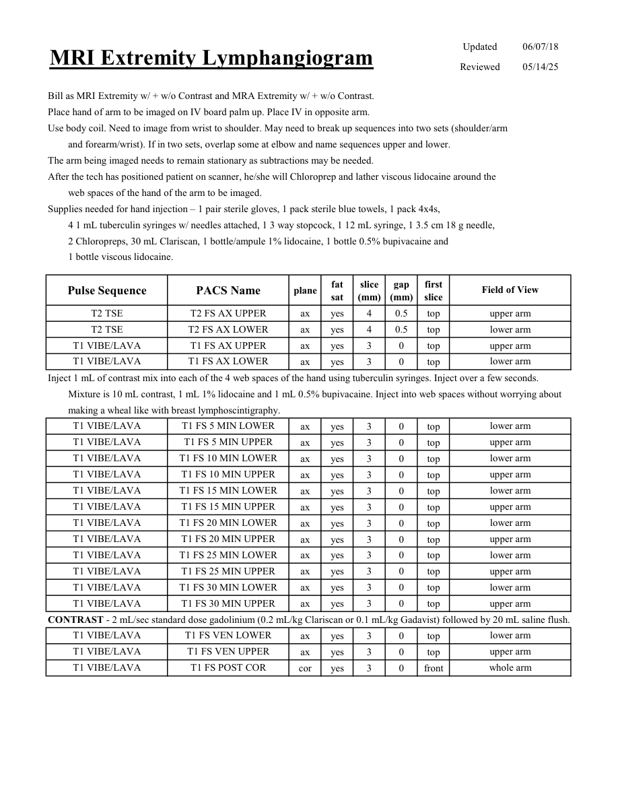

# IRM – Limfangiografie IRM a extremităților (MCB)

[Catalog MCB](../mcb/index.md) · [Descarcă PDF-ul complet](../../assets/mcb-mri/irm-limfangiografie-irm-a-extremitatilor-mcb/protocol.pdf) · [Sursa MCB](https://ref.mcbradiology.com/Protocols,%20Policies,%20Worksheets%20&%20Forms/MRI/Protocols/Vascular%20&%20IR/6%20Lymphangiogram.pdf)

Documentul MCB este disponibil integral mai jos, inclusiv notele, condițiile de utilizare a contrastului și imaginile de planificare. Textul clinic al sursei este în **engleză**; titlul și etichetele parametrilor sunt în română.

## Protocolul original

### Pagina 1

{ loading=lazy }

??? abstract "Textul paginii (engleză)"

    
Updated
    06/07/18
    MRI Extremity Lymphangiogram
    Reviewed
    05/14/25
    Bill as MRI Extremity w/ + w/o Contrast and MRA Extremity w/ + w/o Contrast.
    Place hand of arm to be imaged on IV board palm up. Place IV in opposite arm.
    Use body coil. Need to image from wrist to shoulder. May need to break up sequences into two sets (shoulder/arm 
    and forearm/wrist). If in two sets, overlap some at elbow and name sequences upper and lower.
    The arm being imaged needs to remain stationary as subtractions may be needed.
    After the tech has positioned patient on scanner, he/she will Chloroprep and lather viscous lidocaine around the 
    web spaces of the hand of the arm to be imaged. 
    Supplies needed for hand injection – 1 pair sterile gloves, 1 pack sterile blue towels, 1 pack 4x4s, 
    4 1 mL tuberculin syringes w/ needles attached, 1 3 way stopcock, 1 12 mL syringe, 1 3.5 cm 18 g needle, 
    2 Chloropreps, 30 mL Clariscan, 1 bottle/ampule 1% lidocaine, 1 bottle 0.5% bupivacaine and
    1 bottle viscous lidocaine.
    slice                    
    gap                    
    Field of View
    Pulse Sequence
    PACS Name
    plane
    fat                   
    sat
    (mm)
    (mm)
    first                               
    slice
    T2 TSE
    T2 FS AX UPPER
    upper arm
    ax
    yes
    4
    0.5
    top
    T2 TSE
    T2 FS AX LOWER
    lower arm
    ax
    yes
    4
    0.5
    top
    T1 VIBE/LAVA
    T1 FS AX UPPER
    upper arm
    ax
    yes
    3
    0
    top
    T1 VIBE/LAVA
    T1 FS AX LOWER
    lower arm
    ax
    yes
    3
    0
    top
    Inject 1 mL of contrast mix into each of the 4 web spaces of the hand using tuberculin syringes. Inject over a few seconds. 
    Mixture is 10 mL contrast, 1 mL 1% lidocaine and 1 mL 0.5% bupivacaine. Inject into web spaces without worrying about 
    making a wheal like with breast lymphoscintigraphy.
    T1 VIBE/LAVA
    T1 FS 5 MIN LOWER
    lower arm
    ax
    yes
    3
    0
    top
    T1 VIBE/LAVA
    T1 FS 5 MIN UPPER
    upper arm
    ax
    yes
    3
    0
    top
    T1 VIBE/LAVA
    T1 FS 10 MIN LOWER
    lower arm
    ax
    yes
    3
    0
    top
    T1 VIBE/LAVA
    T1 FS 10 MIN UPPER
    upper arm
    ax
    yes
    3
    0
    top
    T1 VIBE/LAVA
    T1 FS 15 MIN LOWER
    lower arm
    ax
    yes
    3
    0
    top
    T1 VIBE/LAVA
    T1 FS 15 MIN UPPER
    upper arm
    ax
    yes
    3
    0
    top
    T1 VIBE/LAVA
    T1 FS 20 MIN LOWER
    lower arm
    ax
    yes
    3
    0
    top
    T1 VIBE/LAVA
    T1 FS 20 MIN UPPER
    upper arm
    ax
    yes
    3
    0
    top
    T1 VIBE/LAVA
    T1 FS 25 MIN LOWER
    lower arm
    ax
    yes
    3
    0
    top
    T1 VIBE/LAVA
    T1 FS 25 MIN UPPER
    upper arm
    ax
    yes
    3
    0
    top
    T1 VIBE/LAVA
    T1 FS 30 MIN LOWER
    lower arm
    ax
    yes
    3
    0
    top
    T1 VIBE/LAVA
    T1 FS 30 MIN UPPER
    upper arm
    ax
    yes
    3
    0
    top
    CONTRAST - 2 mL/sec standard dose gadolinium (0.2 mL/kg Clariscan or 0.1 mL/kg Gadavist) followed by 20 mL saline flush.
    T1 VIBE/LAVA
    T1 FS VEN LOWER
    lower arm
    ax
    yes
    3
    0
    top
    T1 VIBE/LAVA
    T1 FS VEN UPPER
    upper arm
    ax
    yes
    3
    0
    top
    T1 VIBE/LAVA
    T1 FS POST COR
    whole arm
    cor
    yes
    3
    0
    front
    

## Parametrii secvențelor

Tabele extrase din PDF. Variantele, secvențele condiționate și momentele administrării contrastului se citesc împreună cu notele de pe pagina originală indicată.

### Tabelul 1 — pagina 1

| Secvență | Denumire PACS | Plan | Supresie grăsime | Grosime (mm) | Interval (mm) | Prima secțiune | FOV |
|---|---|---|---|---|---|---|---|
| T2 TSE | T2 FS AX UPPER | Axial | Da | 4 | 0.5 | Superior | upper arm |
| T2 TSE | T2 FS AX LOWER | Axial | Da | 4 | 0.5 | Superior | lower arm |
| T1 VIBE/LAVA | T1 FS AX UPPER | Axial | Da | 3 | 0 | Superior | upper arm |
| T1 VIBE/LAVA | T1 FS AX LOWER | Axial | Da | 3 | 0 | Superior | lower arm |
| T1 VIBE/LAVA | T1 FS 5 MIN LOWER | Axial | Da | 3 | 0 | Superior | lower arm |
| T1 VIBE/LAVA | T1 FS 5 MIN UPPER | Axial | Da | 3 | 0 | Superior | upper arm |
| T1 VIBE/LAVA | T1 FS 10 MIN LOWER | Axial | Da | 3 | 0 | Superior | lower arm |
| T1 VIBE/LAVA | T1 FS 10 MIN UPPER | Axial | Da | 3 | 0 | Superior | upper arm |
| T1 VIBE/LAVA | T1 FS 15 MIN LOWER | Axial | Da | 3 | 0 | Superior | lower arm |
| T1 VIBE/LAVA | T1 FS 15 MIN UPPER | Axial | Da | 3 | 0 | Superior | upper arm |
| T1 VIBE/LAVA | T1 FS 20 MIN LOWER | Axial | Da | 3 | 0 | Superior | lower arm |
| T1 VIBE/LAVA | T1 FS 20 MIN UPPER | Axial | Da | 3 | 0 | Superior | upper arm |
| T1 VIBE/LAVA | T1 FS 25 MIN LOWER | Axial | Da | 3 | 0 | Superior | lower arm |
| T1 VIBE/LAVA | T1 FS 25 MIN UPPER | Axial | Da | 3 | 0 | Superior | upper arm |
| T1 VIBE/LAVA | T1 FS 30 MIN LOWER | Axial | Da | 3 | 0 | Superior | lower arm |
| T1 VIBE/LAVA | T1 FS 30 MIN UPPER | Axial | Da | 3 | 0 | Superior | upper arm |
| T1 VIBE/LAVA | T1 FS VEN LOWER | Axial | Da | 3 | 0 | Superior | lower arm |
| T1 VIBE/LAVA | T1 FS VEN UPPER | Axial | Da | 3 | 0 | Superior | upper arm |
| T1 VIBE/LAVA | T1 FS POST COR | Coronal | Da | 3 | 0 | Anterior | whole arm |

