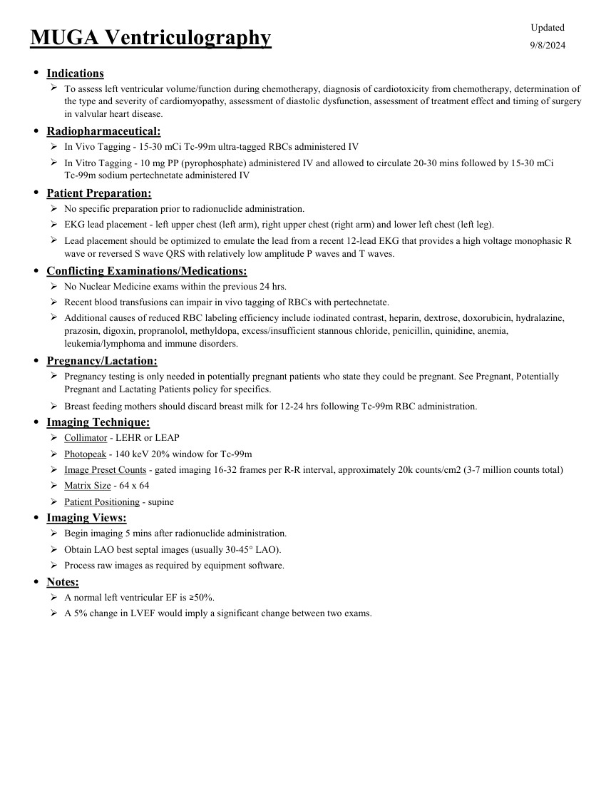

# ☢️ Ventriculografie Radionulcidică Sincronizată ECG (MUGA Scan)

<!-- mcb-modalities:start -->
## Documentul original MCB — Ventriculografie MUGA

**Protocol · 1 pagini · consultat la 2026-09-27.**

[Descarcă PDF-ul integral](../../assets/mcb-modalities/mn-ventriculografie-muga-mcb/document.pdf) · [Sursa MCB](https://ref.mcbradiology.com/Nucs/Protocols/MUGA%20Ventriculography.pdf) · [Catalogul MCB pentru această modalitate](../mcb/index.md)

Instrucțiunile, valorile și ilustrațiile din documentul original sunt păstrate în **engleză**. Titlul și navigarea sunt în română.

### Pagina 1

{ loading=lazy }

## Textul documentului original

??? abstract "Pagina 1 — text în engleză"

    
Updated
    MUGA Ventriculography
    9/8/2024
    ●Indications
    
    To assess left ventricular volume/function during chemotherapy, diagnosis of cardiotoxicity from chemotherapy, determination of 
    the type and severity of cardiomyopathy, assessment of diastolic dysfunction, assessment of treatment effect and timing of surgery 
    in valvular heart disease.
    ●Radiopharmaceutical:
    In Vivo Tagging - 15-30 mCi Tc-99m ultra-tagged RBCs administered IV
    
    In Vitro Tagging - 10 mg PP (pyrophosphate) administered IV and allowed to circulate 20-30 mins followed by 15-30 mCi                   
    Tc-99m sodium pertechnetate administered IV
    ●Patient Preparation:
    No specific preparation prior to radionuclide administration.
    EKG lead placement - left upper chest (left arm), right upper chest (right arm) and lower left chest (left leg).
    
    Lead placement should be optimized to emulate the lead from a recent 12-lead EKG that provides a high voltage monophasic R 
    wave or reversed S wave QRS with relatively low amplitude P waves and T waves.
    ●Conflicting Examinations/Medications:
    No Nuclear Medicine exams within the previous 24 hrs.
    Recent blood transfusions can impair in vivo tagging of RBCs with pertechnetate. 
    
    Additional causes of reduced RBC labeling efficiency include iodinated contrast, heparin, dextrose, doxorubicin, hydralazine, 
    prazosin, digoxin, propranolol, methyldopa, excess/insufficient stannous chloride, penicillin, quinidine, anemia, 
    leukemia/lymphoma and immune disorders.
    ●Pregnancy/Lactation:
    
    Pregnancy testing is only needed in potentially pregnant patients who state they could be pregnant. See Pregnant, Potentially 
    Pregnant and Lactating Patients policy for specifics.
    Breast feeding mothers should discard breast milk for 12-24 hrs following Tc-99m RBC administration.
    ●Imaging Technique:
    Collimator - LEHR or LEAP
    Photopeak - 140 keV 20% window for Tc-99m
    Image Preset Counts - gated imaging 16-32 frames per R-R interval, approximately 20k counts/cm2 (3-7 million counts total)
    Matrix Size - 64 x 64
    Patient Positioning - supine
    ●Imaging Views:
    Begin imaging 5 mins after radionuclide administration.
    Obtain LAO best septal images (usually 30-45° LAO).
    Process raw images as required by equipment software.
    ●Notes:
    A normal left ventricular EF is ≥50%.
    A 5% change in LVEF would imply a significant change between two exams.
    

<!-- mcb-modalities:end -->

## Sinteza existentă în aplicație

Protocol oficial de **Medicină Nucleară & Radiologie Nucleară** integrat conform standardelor de calitate și radiofarmacie clinică ale **MCB Radiology** și ghidurilor internaționale **SNMMI / EANM**.

  

    ☢️ MEDICINĂ NUCLEARĂ &bull; Clasa 2 (4 - 6 mSv)
  

  

    Procedură diagnostică funcțională și moleculară. Evaluarea fiziologică in vivo a metabolismului tisular utilizând radiotrasori specifici de emisie gama sau pozitroni (PET/SPECT).
  

  

    <a href="https://ref.mcbradiology.com/Nucs/Protocols/MUGA%20Ventriculography.pdf" target="_blank" rel="noopener" style="font-weight: 600; color: #a78bfa; text-decoration: none;">
      [:material-file-pdf-box: Protocol Tehnic MCB (PDF)] ➔
    </a>
    <a href="https://ref.mcbradiology.com/Nucs/Practice%20Guidelines/MUGA%20Ventriculography.pdf" target="_blank" rel="noopener" style="font-weight: 600; color: #c4b5fd; text-decoration: none;">
      [:material-file-pdf-box: Ghid de Practică Clinică (PDF)] ➔
    </a>
  

---

## 1. Indicații Clinice Majore
- Evaluarea exactă și reproductibilă a fracției de ejecție a ventriculului stâng (FEVS) înainte și în timpul chimioterapiei cardiotoxice (antracicline: Doxorubicină, Epirubicină; anticorpi monoclonali: Trastuzumab/Herceptin)
- Evaluarea cineticii parietale regionale și globale în insuficiența cardiacă și cardiomiopatii
- Calculul volumelor ventriculare telesistolice și telediastolice (VTS, VTD)

---

## 2. Radiofarmaceutic, Doză & Radioprotecție
- **Trasor administrat:** `Tc-99m Hematii Marcate Autologe (UltraTag RBC kit, 740-925 MBq / 20-25 mCi i.v.)`
- **Clasă de iradiere IRIS:** **Clasa 2 (4 - 6 mSv)**
- **Cale de administrare:** Intravenoasă, inhalatorie sau orală conform protocolului specific.
- **Măsuri de radioprotecție:** Hidratare abundentă post-procedură pentru favorizarea eliminării urinare a radiofarmaceuticului nefixat. Evitarea contactului prelungit cu femei gravide și copii mici timp de 24 ore.

---

## 3. Pregătirea Pacientului
Fără restricții alimentare. Evitarea consumului masiv de cafea/tutun înainte de test. Montare electrozi ECG cu semnal stabil (ritm sinusal regulat; aritmiile severe pot invalida gating-ul).

---

## 4. Protocol Tehnic de Achiziție Imagistică
Marcare hematii in vitro (UltraTag RBC). Pacient în decubit dorsal, gating ECG cu împărțirea ciclului cardiac R-R în 16 sau 32 de cadre temporale. Incidențe statice sincronizate: Oblică Anterioară Stângă (OAS 45° cu înclinare caudală de 10-15° pentru izolarea optimă a septului interventricular), Incidență Anterioară și Profil Stâng. Minim 5-6 milioane de impulsuri/achiziție.

---

## 5. Criterii de Interpretare Diagnostică
Calculul FEVS prin trasarea zonelor de interes (ROI) telediastolică și telesistolică cu scăderea fondului (background). FEVS normală: 50 - 70%. O scădere a FEVS > 10% față de valoarea inițială sau sub pragul de 50% impune reevaluarea oncologică și oprirea temporară a chimioterapiei.

---

## 6. Documente și Ghiduri Asociate
- [:material-file-pdf-box: Protocol Original MCB Radiology](https://ref.mcbradiology.com/Nucs/Protocols/MUGA%20Ventriculography.pdf){ target="_blank" rel="noopener" }
- [:material-file-pdf-box: Ghid de Practică Medicală SNMMI / EANM](https://ref.mcbradiology.com/Nucs/Practice%20Guidelines/MUGA%20Ventriculography.pdf){ target="_blank" rel="noopener" }
- [:material-arrow-left: Înapoi la Indexul de Medicină Nucleară](../index.md)
