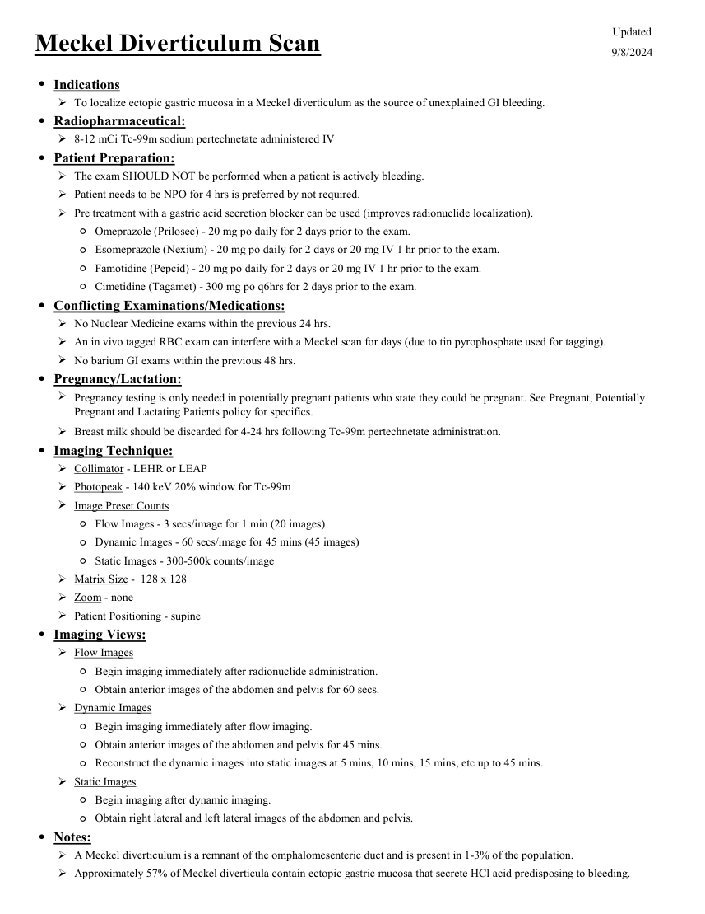
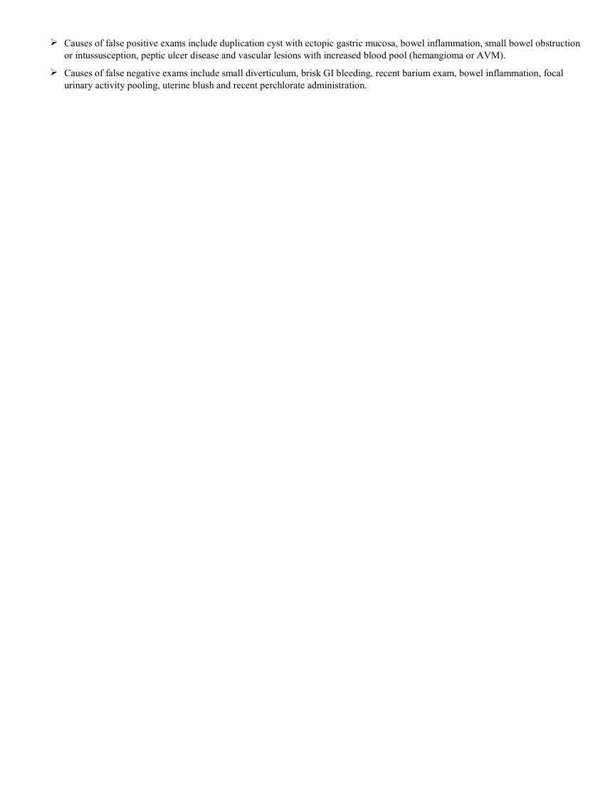

# Medicină nucleară — Diverticul Meckel (MCB)

## Documentul original MCB — Diverticul Meckel

**Protocol · 2 pagini · consultat la 2026-09-27.**

[Descarcă PDF-ul integral](../../assets/mcb-modalities/mn-diverticul-meckel-mcb/document.pdf) · [Sursa MCB](https://ref.mcbradiology.com/Nucs/Protocols/Meckel.pdf) · [Catalogul MCB pentru această modalitate](../mcb/index.md)

Instrucțiunile, valorile și ilustrațiile din documentul original sunt păstrate în **engleză**. Titlul și navigarea sunt în română.

### Pagina 1

{ loading=lazy }

### Pagina 2

{ loading=lazy }

## Textul documentului original

??? abstract "Pagina 1 — text în engleză"

    
Updated
    Meckel Diverticulum Scan
    9/8/2024
    ●Indications
    To localize ectopic gastric mucosa in a Meckel diverticulum as the source of unexplained GI bleeding.
    ●Radiopharmaceutical:
    8-12 mCi Tc-99m sodium pertechnetate administered IV
    ●Patient Preparation:
    The exam SHOULD NOT be performed when a patient is actively bleeding.
    Patient needs to be NPO for 4 hrs is preferred by not required.
    Pre treatment with a gastric acid secretion blocker can be used (improves radionuclide localization).
    ◦Omeprazole (Prilosec) - 20 mg po daily for 2 days prior to the exam.
    ◦Esomeprazole (Nexium) - 20 mg po daily for 2 days or 20 mg IV 1 hr prior to the exam.
    ◦Famotidine (Pepcid) - 20 mg po daily for 2 days or 20 mg IV 1 hr prior to the exam.
    ◦Cimetidine (Tagamet) - 300 mg po q6hrs for 2 days prior to the exam.
    ●Conflicting Examinations/Medications:
    No Nuclear Medicine exams within the previous 24 hrs.
    An in vivo tagged RBC exam can interfere with a Meckel scan for days (due to tin pyrophosphate used for tagging).
    No barium GI exams within the previous 48 hrs.
    ●Pregnancy/Lactation:
    
    Pregnancy testing is only needed in potentially pregnant patients who state they could be pregnant. See Pregnant, Potentially 
    Pregnant and Lactating Patients policy for specifics.
    Breast milk should be discarded for 4-24 hrs following Tc-99m pertechnetate administration.
    ●Imaging Technique:
    Collimator - LEHR or LEAP
    Photopeak - 140 keV 20% window for Tc-99m
    Image Preset Counts
    ◦Flow Images - 3 secs/image for 1 min (20 images)
    ◦Dynamic Images - 60 secs/image for 45 mins (45 images)
    ◦Static Images - 300-500k counts/image
    Matrix Size -  128 x 128
    Zoom - none
    Patient Positioning - supine
    ●Imaging Views:
    Flow Images
    ◦Begin imaging immediately after radionuclide administration.
    ◦Obtain anterior images of the abdomen and pelvis for 60 secs.
    Dynamic Images
    ◦Begin imaging immediately after flow imaging.
    ◦Obtain anterior images of the abdomen and pelvis for 45 mins.
    ◦Reconstruct the dynamic images into static images at 5 mins, 10 mins, 15 mins, etc up to 45 mins.
    Static Images
    ◦Begin imaging after dynamic imaging.
    ◦Obtain right lateral and left lateral images of the abdomen and pelvis.
    ●Notes:
    A Meckel diverticulum is a remnant of the omphalomesenteric duct and is present in 1-3% of the population. 
    Approximately 57% of Meckel diverticula contain ectopic gastric mucosa that secrete HCl acid predisposing to bleeding.
    

??? abstract "Pagina 2 — text în engleză"

    

    Causes of false positive exams include duplication cyst with ectopic gastric mucosa, bowel inflammation, small bowel obstruction 
    or intussusception, peptic ulcer disease and vascular lesions with increased blood pool (hemangioma or AVM).
    
    Causes of false negative exams include small diverticulum, brisk GI bleeding, recent barium exam, bowel inflammation, focal 
    urinary activity pooling, uterine blush and recent perchlorate administration.
    

