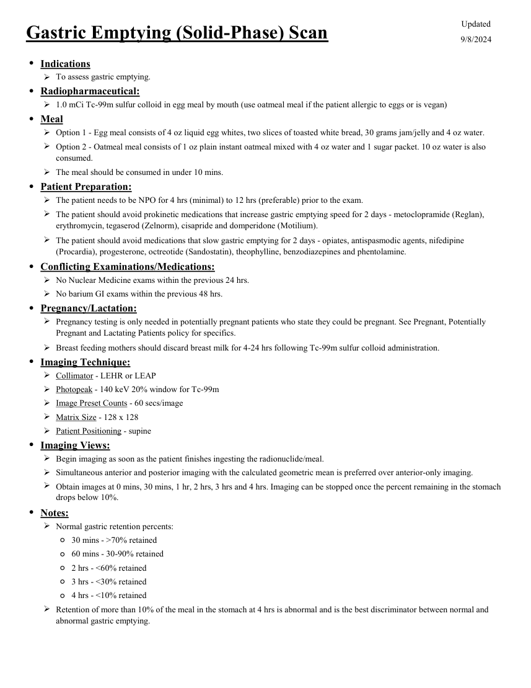

# ☢️ Scintigrafie de Evacuare Gastrică pentru Solide (Gastric Emptying)

<!-- mcb-modalities:start -->
## Documentul original MCB — Evacuare gastrică

**Protocol · 1 pagini · consultat la 2026-09-27.**

[Descarcă PDF-ul integral](../../assets/mcb-modalities/mn-evacuare-gastrica-mcb/document.pdf) · [Sursa MCB](https://ref.mcbradiology.com/Nucs/Protocols/Gastric%20Emptying.pdf) · [Catalogul MCB pentru această modalitate](../mcb/index.md)

Instrucțiunile, valorile și ilustrațiile din documentul original sunt păstrate în **engleză**. Titlul și navigarea sunt în română.

### Pagina 1

{ loading=lazy }

## Textul documentului original

??? abstract "Pagina 1 — text în engleză"

    
Updated
    Gastric Emptying (Solid-Phase) Scan
    9/8/2024
    ●Indications
    To assess gastric emptying.
    
    ●Radiopharmaceutical:
    1.0 mCi Tc-99m sulfur colloid in egg meal by mouth (use oatmeal meal if the patient allergic to eggs or is vegan)
    ●Meal
    Option 1 - Egg meal consists of 4 oz liquid egg whites, two slices of toasted white bread, 30 grams jam/jelly and 4 oz water.
    
    Option 2 - Oatmeal meal consists of 1 oz plain instant oatmeal mixed with 4 oz water and 1 sugar packet. 10 oz water is also 
    consumed.
    The meal should be consumed in under 10 mins.
    ●Patient Preparation:
    The patient needs to be NPO for 4 hrs (minimal) to 12 hrs (preferable) prior to the exam.
    
    The patient should avoid prokinetic medications that increase gastric emptying speed for 2 days - metoclopramide (Reglan), 
    erythromycin, tegaserod (Zelnorm), cisapride and domperidone (Motilium).
    
    The patient should avoid medications that slow gastric emptying for 2 days - opiates, antispasmodic agents, nifedipine 
    (Procardia), progesterone, octreotide (Sandostatin), theophylline, benzodiazepines and phentolamine.
    ●Conflicting Examinations/Medications:
    No Nuclear Medicine exams within the previous 24 hrs.
    No barium GI exams within the previous 48 hrs.
    ●Pregnancy/Lactation:
    
    Pregnancy testing is only needed in potentially pregnant patients who state they could be pregnant. See Pregnant, Potentially 
    Pregnant and Lactating Patients policy for specifics.
    Breast feeding mothers should discard breast milk for 4-24 hrs following Tc-99m sulfur colloid administration.
    ●Imaging Technique:
    Collimator - LEHR or LEAP
    Photopeak - 140 keV 20% window for Tc-99m
    Image Preset Counts - 60 secs/image
    Matrix Size - 128 x 128 
    Patient Positioning - supine
    ●Imaging Views:
    Begin imaging as soon as the patient finishes ingesting the radionuclide/meal.
    Simultaneous anterior and posterior imaging with the calculated geometric mean is preferred over anterior-only imaging.
    
    Obtain images at 0 mins, 30 mins, 1 hr, 2 hrs, 3 hrs and 4 hrs. Imaging can be stopped once the percent remaining in the stomach 
    drops below 10%.
    ●Notes:
    Normal gastric retention percents:
    ◦30 mins - &gt;70% retained
    ◦60 mins - 30-90% retained
    ◦2 hrs - &lt;60% retained
    ◦3 hrs - &lt;30% retained
    ◦4 hrs - &lt;10% retained
    Retention of more than 10% of the meal in the stomach at 4 hrs is abnormal and is the best discriminator between normal and 
    abnormal gastric emptying.
    

<!-- mcb-modalities:end -->

## Sinteza existentă în aplicație

Protocol oficial de **Medicină Nucleară & Radiologie Nucleară** integrat conform standardelor de calitate și radiofarmacie clinică ale **MCB Radiology** și ghidurilor internaționale **SNMMI / EANM**.

  

    ☢️ MEDICINĂ NUCLEARĂ &bull; Clasa 1 (< 1 mSv)
  

  

    Procedură diagnostică funcțională și moleculară. Evaluarea fiziologică in vivo a metabolismului tisular utilizând radiotrasori specifici de emisie gama sau pozitroni (PET/SPECT).
  

  

    <a href="https://ref.mcbradiology.com/Nucs/Protocols/Gastric%20Emptying.pdf" target="_blank" rel="noopener" style="font-weight: 600; color: #a78bfa; text-decoration: none;">
      [:material-file-pdf-box: Protocol Tehnic MCB (PDF)] ➔
    </a>
    <a href="https://ref.mcbradiology.com/Nucs/Practice%20Guidelines/Gastric%20Emptying%20Scintigraphy.pdf" target="_blank" rel="noopener" style="font-weight: 600; color: #c4b5fd; text-decoration: none;">
      [:material-file-pdf-box: Ghid de Practică Clinică (PDF)] ➔
    </a>
  

---

## 1. Indicații Clinice Majore
- Diagnosticul gastroparezei diabetice sau idiopatice
- Investigarea grețurilor cronice, vărsăturilor postprandiale, sațietății precoce și meteorismului
- Evaluarea evacuării gastrice rapide (sindrom de dumping post-chirurgie bariatrică)
- Monitorizarea răspunsului la medicamente prokinetice (Metoclopramid, Domperidonă, Eritromicină)

---

## 2. Radiofarmaceutic, Doză & Radioprotecție
- **Trasor administrat:** `Tc-99m Sulf Coloid (18.5-37 MBq / 0.5-1.0 mCi amestecat și gătit în albuș de ou)`
- **Clasă de iradiere IRIS:** **Clasa 1 (< 1 mSv)**
- **Cale de administrare:** Intravenoasă, inhalatorie sau orală conform protocolului specific.
- **Măsuri de radioprotecție:** Hidratare abundentă post-procedură pentru favorizarea eliminării urinare a radiofarmaceuticului nefixat. Evitarea contactului prelungit cu femei gravide și copii mici timp de 24 ore.

---

## 3. Pregătirea Pacientului
Post alimentar complet de minim 6 ore. Oprirea medicamentelor prokinetice, opioidelor și anticolinergicelor cu 48-72 ore înainte de test. Glicemie < 200 mg/dL în dimineața examinării (hiperglicemia întârzie evacuarea fiziologică).

---

## 4. Protocol Tehnic de Achiziție Imagistică
Prânz standardizat Tougas/SNMMI: albușul a 2 ouă mari amestecate cu Tc-99m sulf coloid și gătite la microunde, 2 felii de pâine prăjită cu gem de căpșuni (30 g) și 120 mL apă plată (consumate în maxim 10 minute). Imagini statice planare anterioare și posterioare (geometric mean) la minutul 0 (imediat), 1 oră, 2 ore și 4 ore.

---

## 5. Criterii de Interpretare Diagnostică
Retenție gastrică normală la 4 ore: < 10% (standard de aur). Retenție > 10% la 4 ore confirmă diagnosticul de gastropareză. Valori normale: 1 oră (30-90%), 2 ore (< 60%), 4 ore (< 10%). Evacuare rapidă: retenție < 30% la 1 oră.

---

## 6. Documente și Ghiduri Asociate
- [:material-file-pdf-box: Protocol Original MCB Radiology](https://ref.mcbradiology.com/Nucs/Protocols/Gastric%20Emptying.pdf){ target="_blank" rel="noopener" }
- [:material-file-pdf-box: Ghid de Practică Medicală SNMMI / EANM](https://ref.mcbradiology.com/Nucs/Practice%20Guidelines/Gastric%20Emptying%20Scintigraphy.pdf){ target="_blank" rel="noopener" }
- [:material-arrow-left: Înapoi la Indexul de Medicină Nucleară](../index.md)
