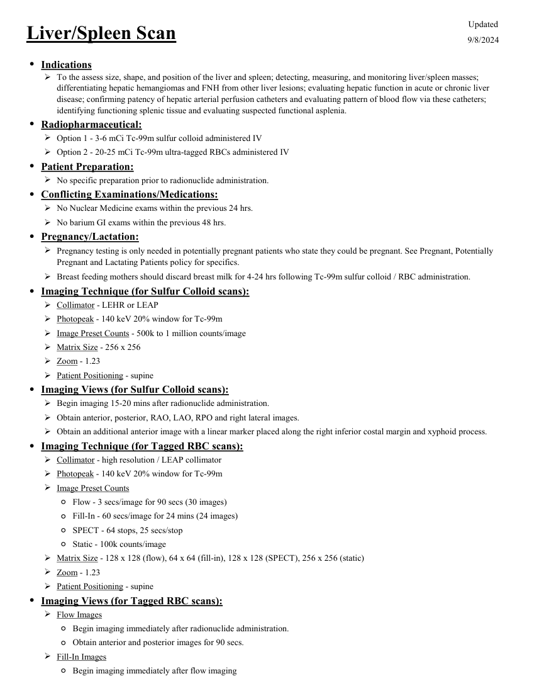
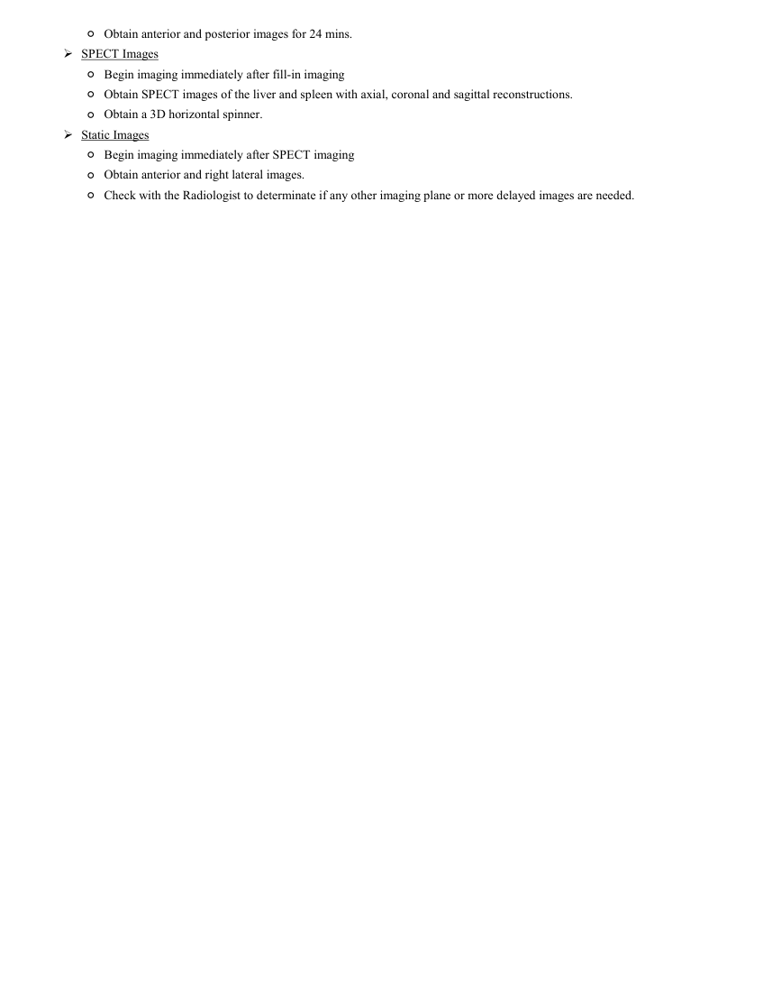

# ☢️ Scintigrafie Ficat-Splină cu Sulf Coloidal (Liver-Spleen Scan)

<!-- mcb-modalities:start -->
## Documentul original MCB — Scintigrafie ficat și splină

**Protocol · 2 pagini · consultat la 2026-09-27.**

[Descarcă PDF-ul integral](../../assets/mcb-modalities/mn-scintigrafie-ficat-si-splina-mcb/document.pdf) · [Sursa MCB](https://ref.mcbradiology.com/Nucs/Protocols/Liver%20Spleen.pdf) · [Catalogul MCB pentru această modalitate](../mcb/index.md)

Instrucțiunile, valorile și ilustrațiile din documentul original sunt păstrate în **engleză**. Titlul și navigarea sunt în română.

### Pagina 1

{ loading=lazy }

### Pagina 2

{ loading=lazy }

## Textul documentului original

??? abstract "Pagina 1 — text în engleză"

    
Updated
    Liver/Spleen Scan
    9/8/2024
    ●Indications
    
    To the assess size, shape, and position of the liver and spleen; detecting, measuring, and monitoring liver/spleen masses; 
    differentiating hepatic hemangiomas and FNH from other liver lesions; evaluating hepatic function in acute or chronic liver 
    disease; confirming patency of hepatic arterial perfusion catheters and evaluating pattern of blood flow via these catheters; 
    identifying functioning splenic tissue and evaluating suspected functional asplenia.
    ●Radiopharmaceutical:
    Option 1 - 3-6 mCi Tc-99m sulfur colloid administered IV
    Option 2 - 20-25 mCi Tc-99m ultra-tagged RBCs administered IV
    ●Patient Preparation:
    No specific preparation prior to radionuclide administration.
    ●Conflicting Examinations/Medications:
    No Nuclear Medicine exams within the previous 24 hrs.
    No barium GI exams within the previous 48 hrs.
    ●Pregnancy/Lactation:
    
    Pregnancy testing is only needed in potentially pregnant patients who state they could be pregnant. See Pregnant, Potentially 
    Pregnant and Lactating Patients policy for specifics.
    Breast feeding mothers should discard breast milk for 4-24 hrs following Tc-99m sulfur colloid / RBC administration.
    ●Imaging Technique (for Sulfur Colloid scans):
    Collimator - LEHR or LEAP
    Photopeak - 140 keV 20% window for Tc-99m
    Image Preset Counts - 500k to 1 million counts/image
    Matrix Size - 256 x 256
    Zoom - 1.23
    Patient Positioning - supine
    ●Imaging Views (for Sulfur Colloid scans):
    Begin imaging 15-20 mins after radionuclide administration.
    Obtain anterior, posterior, RAO, LAO, RPO and right lateral images.
    Obtain an additional anterior image with a linear marker placed along the right inferior costal margin and xyphoid process.
    ●Imaging Technique (for Tagged RBC scans):
    Collimator - high resolution / LEAP collimator
    Photopeak - 140 keV 20% window for Tc-99m
    Image Preset Counts
    ◦Flow - 3 secs/image for 90 secs (30 images)
    ◦Fill-In - 60 secs/image for 24 mins (24 images)
    ◦SPECT - 64 stops, 25 secs/stop
    ◦Static - 100k counts/image
    Matrix Size - 128 x 128 (flow), 64 x 64 (fill-in), 128 x 128 (SPECT), 256 x 256 (static)
    Zoom - 1.23
    Patient Positioning - supine
    ●Imaging Views (for Tagged RBC scans):
    Flow Images
    ◦Begin imaging immediately after radionuclide administration.
    ◦Obtain anterior and posterior images for 90 secs.
    Fill-In Images
    ◦Begin imaging immediately after flow imaging
    

??? abstract "Pagina 2 — text în engleză"

    
◦Obtain anterior and posterior images for 24 mins.
    SPECT Images
    ◦Begin imaging immediately after fill-in imaging
    ◦Obtain SPECT images of the liver and spleen with axial, coronal and sagittal reconstructions.
    ◦Obtain a 3D horizontal spinner.
    Static Images
    ◦Begin imaging immediately after SPECT imaging
    ◦Obtain anterior and right lateral images.
    ◦Check with the Radiologist to determinate if any other imaging plane or more delayed images are needed.
    

<!-- mcb-modalities:end -->

## Sinteza existentă în aplicație

Protocol oficial de **Medicină Nucleară & Radiologie Nucleară** integrat conform standardelor de calitate și radiofarmacie clinică ale **MCB Radiology** și ghidurilor internaționale **SNMMI / EANM**.

  

    ☢️ MEDICINĂ NUCLEARĂ &bull; Clasa 1 - 2 (2 mSv)
  

  

    Procedură diagnostică funcțională și moleculară. Evaluarea fiziologică in vivo a metabolismului tisular utilizând radiotrasori specifici de emisie gama sau pozitroni (PET/SPECT).
  

  

    <a href="https://ref.mcbradiology.com/Nucs/Protocols/Liver%20Spleen.pdf" target="_blank" rel="noopener" style="font-weight: 600; color: #a78bfa; text-decoration: none;">
      [:material-file-pdf-box: Protocol Tehnic MCB (PDF)] ➔
    </a>
    <a href="https://ref.mcbradiology.com/Nucs/Practice%20Guidelines/Liver%20and%20Spleen%20Imaging.pdf" target="_blank" rel="noopener" style="font-weight: 600; color: #c4b5fd; text-decoration: none;">
      [:material-file-pdf-box: Ghid de Practică Clinică (PDF)] ➔
    </a>
  

---

## 1. Indicații Clinice Majore
- Evaluarea cirozei hepatice, hepatopatiilor cronice și a hipertensiunii portale („colloid shift”)
- Diferențierea hiperplaziei nodulare focale (FNH) care conține celule Kupffer de adenomul hepatic
- Evaluarea splenomegaliei și a țesutului splenic ectopic / splenoză peritoneală post-traumă sau post-splenectomie
- Evaluarea funcțională a sistemului reticuloendotelial

---

## 2. Radiofarmaceutic, Doză & Radioprotecție
- **Trasor administrat:** `Tc-99m Sulf Coloid (111-296 MBq / 3-8 mCi i.v.)`
- **Clasă de iradiere IRIS:** **Clasa 1 - 2 (2 mSv)**
- **Cale de administrare:** Intravenoasă, inhalatorie sau orală conform protocolului specific.
- **Măsuri de radioprotecție:** Hidratare abundentă post-procedură pentru favorizarea eliminării urinare a radiofarmaceuticului nefixat. Evitarea contactului prelungit cu femei gravide și copii mici timp de 24 ore.

---

## 3. Pregătirea Pacientului
Fără pregătire specială. Pacientul nu necesită post alimentar.

---

## 4. Protocol Tehnic de Achiziție Imagistică
Particulele coloidale sunt fagocitate de celulele Kupffer hepatice (80-85%), macrofagele splenice (10-15%) și măduva osoasă (1-5%). Achiziția începe la 15-20 minute post-injectare. Proiecții planare multiple (Ant, Post, OAD, OAS, Profil Drept, Profil Stâng) și SPECT sau SPECT/CT abdominal.

---

## 5. Criterii de Interpretare Diagnostică
Distribuție omogenă hepato-splenică normală. Ciroză / Hipertensiune portală: scăderea captării hepatice cu devierea coloidului („colloid shift”) masivă către splină și măduva hematopoietică osoasă. FNH: captare egală sau crescută de coloid comparativ cu parenchimul hepatic adiacent.

---

## 6. Documente și Ghiduri Asociate
- [:material-file-pdf-box: Protocol Original MCB Radiology](https://ref.mcbradiology.com/Nucs/Protocols/Liver%20Spleen.pdf){ target="_blank" rel="noopener" }
- [:material-file-pdf-box: Ghid de Practică Medicală SNMMI / EANM](https://ref.mcbradiology.com/Nucs/Practice%20Guidelines/Liver%20and%20Spleen%20Imaging.pdf){ target="_blank" rel="noopener" }
- [:material-arrow-left: Înapoi la Indexul de Medicină Nucleară](../index.md)
