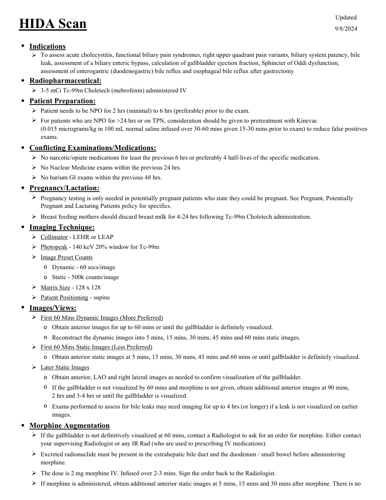
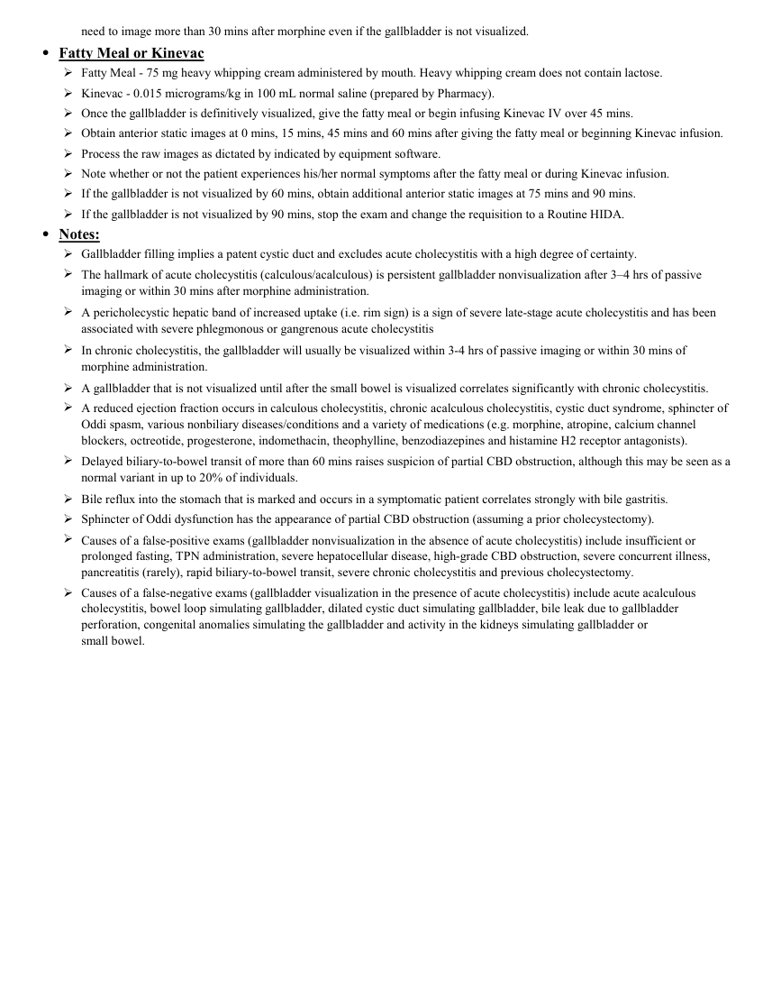

# ☢️ Scintigrafie Hepatobiliară (HIDA Scan / Colecistoscintigrafie)

<!-- mcb-modalities:start -->
## Documentul original MCB — Scintigrafie hepatobiliară HIDA

**Protocol · 2 pagini · consultat la 2026-09-27.**

[Descarcă PDF-ul integral](../../assets/mcb-modalities/mn-scintigrafie-hepatobiliara-hida-mcb/document.pdf) · [Sursa MCB](https://ref.mcbradiology.com/Nucs/Protocols/HIDA.pdf) · [Catalogul MCB pentru această modalitate](../mcb/index.md)

Instrucțiunile, valorile și ilustrațiile din documentul original sunt păstrate în **engleză**. Titlul și navigarea sunt în română.

### Pagina 1

{ loading=lazy }

### Pagina 2

{ loading=lazy }

## Textul documentului original

??? abstract "Pagina 1 — text în engleză"

    
Updated
    HIDA Scan
    9/8/2024
    ●Indications
    
    To assess acute cholecystitis, functional biliary pain syndromes, right upper quadrant pain variants, biliary system patency, bile 
    leak, assessment of a biliary enteric bypass, calculation of gallbladder ejection fraction, Sphincter of Oddi dysfunction, 
    assessment of enterogastric (duodenogastric) bile reflux and esophageal bile reflux after gastrectomy
    ●Radiopharmaceutical:
    3-5 mCi Tc-99m Choletech (mebrofenin) administered IV
    ●Patient Preparation:
    Patient needs to be NPO for 2 hrs (minimal) to 6 hrs (preferable) prior to the exam.
    
    For patients who are NPO for &gt;24 hrs or on TPN, consideration should be given to pretreatment with Kinevac                                            
    (0.015 micrograms/kg in 100 mL normal saline infused over 30-60 mins given 15-30 mins prior to exam) to reduce false positives 
    exams.
    ●Conflicting Examinations/Medications:
    No narcotic/opiate medications for least the previous 6 hrs or preferably 4 half-lives of the specific medication.
    No Nuclear Medicine exams within the previous 24 hrs.
    No barium GI exams within the previous 48 hrs.
    ●Pregnancy/Lactation:
    
    Pregnancy testing is only needed in potentially pregnant patients who state they could be pregnant. See Pregnant, Potentially 
    Pregnant and Lactating Patients policy for specifics.
    Breast feeding mothers should discard breast milk for 4-24 hrs following Tc-99m Choletech administration.
    ●Imaging Technique:
    Collimator - LEHR or LEAP
    Photopeak - 140 keV 20% window for Tc-99m
    Image Preset Counts
    ◦Dynamic - 60 secs/image
    ◦Static - 500k counts/image
    Matrix Size - 128 x 128
    Patient Positioning - supine
    ●Images/Views:
    First 60 Mins Dynamic Images (More Preferred)
    Obtain anterior images for up to 60 mins or until the gallbladder is definitely visualized.
    ◦
    ◦Reconstruct the dynamic images into 5 mins, 15 mins, 30 mins, 45 mins and 60 mins static images.
    First 60 Mins Static Images (Less Preferred)
    Obtain anterior static images at 5 mins, 15 mins, 30 mins, 45 mins and 60 mins or until gallbladder is definitely visualized.
    ◦
    Later Static Images
    ◦Obtain anterior, LAO and right lateral images as needed to confirm visualization of the gallbladder.
    ◦
    If the gallbladder is not visualized by 60 mins and morphine is not given, obtain additional anterior images at 90 mins,                        
    2 hrs and 3-4 hrs or until the gallbladder is visualized.
    ◦
    Exams performed to assess for bile leaks may need imaging for up to 4 hrs (or longer) if a leak is not visualized on earlier 
    images.
    ●Morphine Augmentation
    
    If the gallbladder is not definitively visualized at 60 mins, contact a Radiologist to ask for an order for morphine. Either contact 
    your supervising Radiologist or any IR Rad (who are used to prescribing IV medications). 
    
    Excreted radionuclide must be present in the extrahepatic bile duct and the duodenum / small bowel before administering 
    morphine.
    The dose is 2 mg morphine IV. Infused over 2-3 mins. Sign the order back to the Radiologist.
    
    If morphine is administered, obtain additional anterior static images at 5 mins, 15 mins and 30 mins after morphine. There is no 
    

??? abstract "Pagina 2 — text în engleză"

    
need to image more than 30 mins after morphine even if the gallbladder is not visualized.
    ●Fatty Meal or Kinevac
    Fatty Meal - 75 mg heavy whipping cream administered by mouth. Heavy whipping cream does not contain lactose.
    Kinevac - 0.015 micrograms/kg in 100 mL normal saline (prepared by Pharmacy).
    Once the gallbladder is definitively visualized, give the fatty meal or begin infusing Kinevac IV over 45 mins.
    Obtain anterior static images at 0 mins, 15 mins, 45 mins and 60 mins after giving the fatty meal or beginning Kinevac infusion.
    
    Process the raw images as dictated by indicated by equipment software.
    Note whether or not the patient experiences his/her normal symptoms after the fatty meal or during Kinevac infusion.
    If the gallbladder is not visualized by 60 mins, obtain additional anterior static images at 75 mins and 90 mins.
    If the gallbladder is not visualized by 90 mins, stop the exam and change the requisition to a Routine HIDA. 
    ●Notes:
    Gallbladder filling implies a patent cystic duct and excludes acute cholecystitis with a high degree of certainty.
    
    The hallmark of acute cholecystitis (calculous/acalculous) is persistent gallbladder nonvisualization after 3–4 hrs of passive 
    imaging or within 30 mins after morphine administration. 
    
    A pericholecystic hepatic band of increased uptake (i.e. rim sign) is a sign of severe late-stage acute cholecystitis and has been 
    associated with severe phlegmonous or gangrenous acute cholecystitis
    
    In chronic cholecystitis, the gallbladder will usually be visualized within 3-4 hrs of passive imaging or within 30 mins of 
    morphine administration.
    A gallbladder that is not visualized until after the small bowel is visualized correlates significantly with chronic cholecystitis.
    
    A reduced ejection fraction occurs in calculous cholecystitis, chronic acalculous cholecystitis, cystic duct syndrome, sphincter of 
    Oddi spasm, various nonbiliary diseases/conditions and a variety of medications (e.g. morphine, atropine, calcium channel 
    blockers, octreotide, progesterone, indomethacin, theophylline, benzodiazepines and histamine H2 receptor antagonists).
    
    Delayed biliary-to-bowel transit of more than 60 mins raises suspicion of partial CBD obstruction, although this may be seen as a 
    normal variant in up to 20% of individuals.
    Bile reflux into the stomach that is marked and occurs in a symptomatic patient correlates strongly with bile gastritis.
    Sphincter of Oddi dysfunction has the appearance of partial CBD obstruction (assuming a prior cholecystectomy).
    
    Causes of a false-positive exams (gallbladder nonvisualization in the absence of acute cholecystitis) include insufficient or 
    prolonged fasting, TPN administration, severe hepatocellular disease, high-grade CBD obstruction, severe concurrent illness, 
    pancreatitis (rarely), rapid biliary-to-bowel transit, severe chronic cholecystitis and previous cholecystectomy.
    
    Causes of a false-negative exams (gallbladder visualization in the presence of acute cholecystitis) include acute acalculous 
    cholecystitis, bowel loop simulating gallbladder, dilated cystic duct simulating gallbladder, bile leak due to gallbladder 
    perforation, congenital anomalies simulating the gallbladder and activity in the kidneys simulating gallbladder or
    small bowel.
    

<!-- mcb-modalities:end -->

## Sinteza existentă în aplicație

Protocol oficial de **Medicină Nucleară & Radiologie Nucleară** integrat conform standardelor de calitate și radiofarmacie clinică ale **MCB Radiology** și ghidurilor internaționale **SNMMI / EANM**.

  

    ☢️ MEDICINĂ NUCLEARĂ &bull; Clasa 2 (2 - 4 mSv)
  

  

    Procedură diagnostică funcțională și moleculară. Evaluarea fiziologică in vivo a metabolismului tisular utilizând radiotrasori specifici de emisie gama sau pozitroni (PET/SPECT).
  

  

    <a href="https://ref.mcbradiology.com/Nucs/Protocols/HIDA.pdf" target="_blank" rel="noopener" style="font-weight: 600; color: #a78bfa; text-decoration: none;">
      [:material-file-pdf-box: Protocol Tehnic MCB (PDF)] ➔
    </a>
    <a href="https://ref.mcbradiology.com/Nucs/Practice%20Guidelines/Hepatobiliary%20Scintigraphy.pdf" target="_blank" rel="noopener" style="font-weight: 600; color: #c4b5fd; text-decoration: none;">
      [:material-file-pdf-box: Ghid de Practică Clinică (PDF)] ➔
    </a>
  

---

## 1. Indicații Clinice Majore
- Suspiciune de colecistită acută calculoasă sau acalculoasă (obstrucția ductului cistic)
- Evaluarea colecistitei cronice și a dischineziei biliare prin calculul fracției de ejecție a vezicii biliare (GBEF cu stimulare CCK / Sincalidă)
- Detectarea fistulelor biliare și a extravazării biliare post-colecistectomie sau post-traumă
- Diagnosticul atreziei biliare neonatale la nou-născuți cu icter colestatic prelungit
- Disfuncția de sfincter Oddi

---

## 2. Radiofarmaceutic, Doză & Radioprotecție
- **Trasor administrat:** `Tc-99m Mebrofenin sau Tc-99m Disofenin (185-370 MBq / 5-10 mCi i.v.)`
- **Clasă de iradiere IRIS:** **Clasa 2 (2 - 4 mSv)**
- **Cale de administrare:** Intravenoasă, inhalatorie sau orală conform protocolului specific.
- **Măsuri de radioprotecție:** Hidratare abundentă post-procedură pentru favorizarea eliminării urinare a radiofarmaceuticului nefixat. Evitarea contactului prelungit cu femei gravide și copii mici timp de 24 ore.

---

## 3. Pregătirea Pacientului
Post alimentar strict minim 4 ore și maxim 24 ore. Dacă pacientul a postit > 24 ore sau este pe nutriție parenterală totală (NPT), se pre-tratează cu Sincalidă (Kinevac) 0.02 mcg/kg cu 30 min înainte de examinare pentru evacuarea bilei vâscoase.

---

## 4. Protocol Tehnic de Achiziție Imagistică
Pacient în decubit dorsal, detector anterior peste hipocondrul drept și epigastru. Achiziție dinamică continuă timp de 60 minute (1 cadru/minut). Dacă vezica biliară nu se vizualizează la 60 minute: opțiunea A - imagini tardive la 2-4 ore; opțiunea B - administrare de Morfină sulfat 0.04 mg/kg i.v. pe 3 minute (induce spasmul sfincterului Oddi) și continuare scanare 30 min. Protocol GBEF: perfuzie lentă de Sincalidă 0.02 mcg/kg pe durata a 30-60 minute cu achiziție concomitentă.

---

## 5. Criterii de Interpretare Diagnostică
Examen normal: vizualizarea ficatului la 5 min, a căilor biliare și vezicii biliare la 15-30 min, și a duodenului/intestinului subțire în decurs de 60 min. Colecistită acută: persistența absenței vezicii biliare la 4 ore sau post-morfină, cu căi biliare și intestin vizualizate normal. GBEF normal: > 38% la 60 min post-Sincalidă (valori sub 38% indică dischinezie biliară).

---

## 6. Documente și Ghiduri Asociate
- [:material-file-pdf-box: Protocol Original MCB Radiology](https://ref.mcbradiology.com/Nucs/Protocols/HIDA.pdf){ target="_blank" rel="noopener" }
- [:material-file-pdf-box: Ghid de Practică Medicală SNMMI / EANM](https://ref.mcbradiology.com/Nucs/Practice%20Guidelines/Hepatobiliary%20Scintigraphy.pdf){ target="_blank" rel="noopener" }
- [:material-arrow-left: Înapoi la Indexul de Medicină Nucleară](../index.md)
