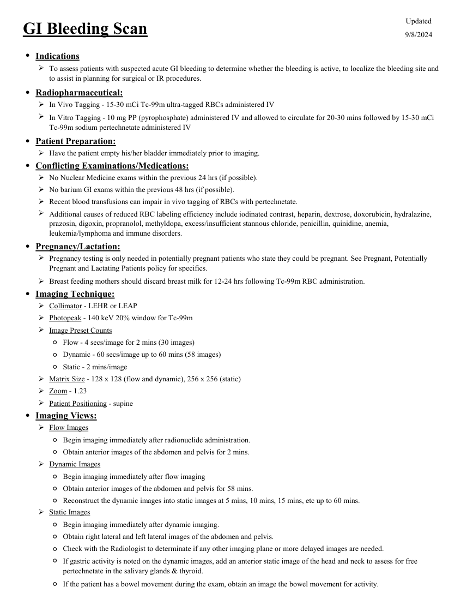
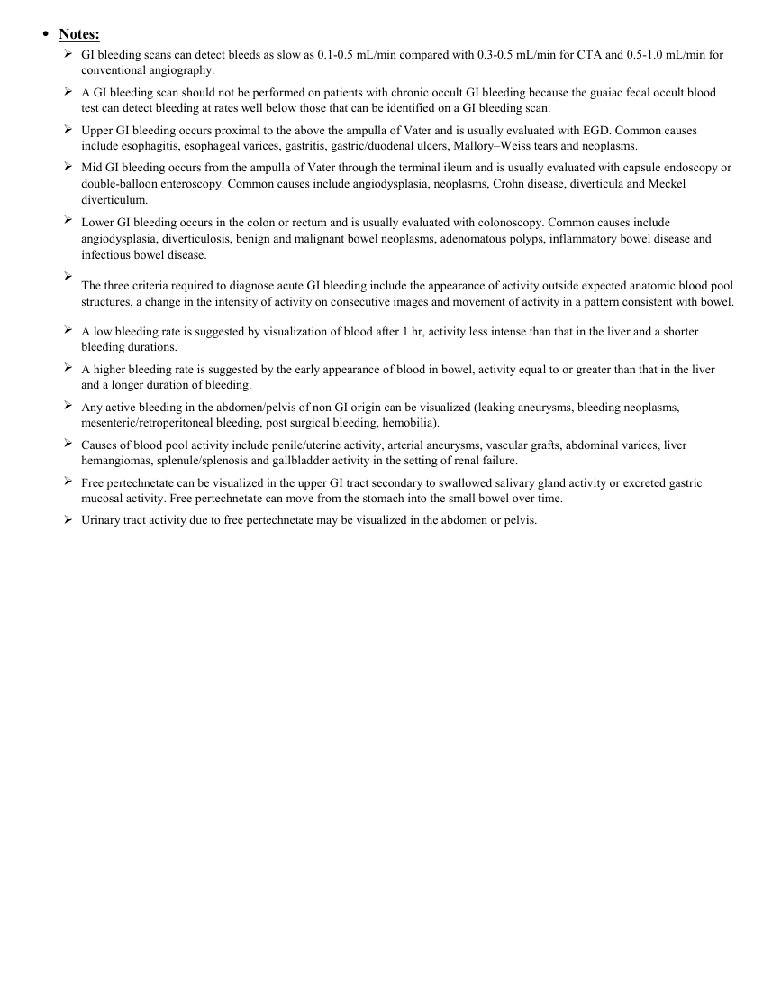

# ☢️ Scintigrafie pentru Detecția Sângerării Digestive Acute (GI Bleed Scan)

<!-- mcb-modalities:start -->
## Documentul original MCB — Sângerare digestivă

**Protocol · 2 pagini · consultat la 2026-09-27.**

[Descarcă PDF-ul integral](../../assets/mcb-modalities/mn-sangerare-digestiva-mcb/document.pdf) · [Sursa MCB](https://ref.mcbradiology.com/Nucs/Protocols/GI%20Bleeding.pdf) · [Catalogul MCB pentru această modalitate](../mcb/index.md)

Instrucțiunile, valorile și ilustrațiile din documentul original sunt păstrate în **engleză**. Titlul și navigarea sunt în română.

### Pagina 1

{ loading=lazy }

### Pagina 2

{ loading=lazy }

## Textul documentului original

??? abstract "Pagina 1 — text în engleză"

    
Updated
    GI Bleeding Scan
    9/8/2024
    ●Indications
    
    To assess patients with suspected acute GI bleeding to determine whether the bleeding is active, to localize the bleeding site and 
    to assist in planning for surgical or IR procedures.
    ●Radiopharmaceutical:
    In Vivo Tagging - 15-30 mCi Tc-99m ultra-tagged RBCs administered IV
    
    In Vitro Tagging - 10 mg PP (pyrophosphate) administered IV and allowed to circulate for 20-30 mins followed by 15-30 mCi                
    Tc-99m sodium pertechnetate administered IV
    ●Patient Preparation:
    Have the patient empty his/her bladder immediately prior to imaging.
    ●Conflicting Examinations/Medications:
    No Nuclear Medicine exams within the previous 24 hrs (if possible).
    No barium GI exams within the previous 48 hrs (if possible).
    Recent blood transfusions can impair in vivo tagging of RBCs with pertechnetate. 
    
    Additional causes of reduced RBC labeling efficiency include iodinated contrast, heparin, dextrose, doxorubicin, hydralazine, 
    prazosin, digoxin, propranolol, methyldopa, excess/insufficient stannous chloride, penicillin, quinidine, anemia, 
    leukemia/lymphoma and immune disorders.
    ●Pregnancy/Lactation:
    
    Pregnancy testing is only needed in potentially pregnant patients who state they could be pregnant. See Pregnant, Potentially 
    Pregnant and Lactating Patients policy for specifics.
    Breast feeding mothers should discard breast milk for 12-24 hrs following Tc-99m RBC administration.
    ●Imaging Technique:
    Collimator - LEHR or LEAP
    Photopeak - 140 keV 20% window for Tc-99m
    Image Preset Counts
    ◦Flow - 4 secs/image for 2 mins (30 images)
    ◦Dynamic - 60 secs/image up to 60 mins (58 images)
    ◦Static - 2 mins/image
    Matrix Size - 128 x 128 (flow and dynamic), 256 x 256 (static)
    Zoom - 1.23
    Patient Positioning - supine
    ●Imaging Views:
    Flow Images
    ◦Begin imaging immediately after radionuclide administration.
    ◦Obtain anterior images of the abdomen and pelvis for 2 mins.
    Dynamic Images
    ◦Begin imaging immediately after flow imaging
    ◦Obtain anterior images of the abdomen and pelvis for 58 mins.
    ◦Reconstruct the dynamic images into static images at 5 mins, 10 mins, 15 mins, etc up to 60 mins.
    Static Images
    ◦Begin imaging immediately after dynamic imaging.
    ◦Obtain right lateral and left lateral images of the abdomen and pelvis.
    ◦Check with the Radiologist to determinate if any other imaging plane or more delayed images are needed.
    ◦
    If gastric activity is noted on the dynamic images, add an anterior static image of the head and neck to assess for free 
    pertechnetate in the salivary glands &amp; thyroid.
    ◦If the patient has a bowel movement during the exam, obtain an image the bowel movement for activity.
    

??? abstract "Pagina 2 — text în engleză"

    
●Notes:
    
    GI bleeding scans can detect bleeds as slow as 0.1-0.5 mL/min compared with 0.3-0.5 mL/min for CTA and 0.5-1.0 mL/min for 
    conventional angiography.
    
    A GI bleeding scan should not be performed on patients with chronic occult GI bleeding because the guaiac fecal occult blood 
    test can detect bleeding at rates well below those that can be identified on a GI bleeding scan.
    
    Upper GI bleeding occurs proximal to the above the ampulla of Vater and is usually evaluated with EGD. Common causes 
    include esophagitis, esophageal varices, gastritis, gastric/duodenal ulcers, Mallory–Weiss tears and neoplasms.
    
    Mid GI bleeding occurs from the ampulla of Vater through the terminal ileum and is usually evaluated with capsule endoscopy or 
    double-balloon enteroscopy. Common causes include angiodysplasia, neoplasms, Crohn disease, diverticula and Meckel 
    diverticulum.
    
    Lower GI bleeding occurs in the colon or rectum and is usually evaluated with colonoscopy. Common causes include 
    angiodysplasia, diverticulosis, benign and malignant bowel neoplasms, adenomatous polyps, inflammatory bowel disease and 
    infectious bowel disease.
    
    The three criteria required to diagnose acute GI bleeding include the appearance of activity outside expected anatomic blood pool 
    structures, a change in the intensity of activity on consecutive images and movement of activity in a pattern consistent with bowel.
    
    A low bleeding rate is suggested by visualization of blood after 1 hr, activity less intense than that in the liver and a shorter 
    bleeding durations.
    
    A higher bleeding rate is suggested by the early appearance of blood in bowel, activity equal to or greater than that in the liver 
    and a longer duration of bleeding.
    
    Any active bleeding in the abdomen/pelvis of non GI origin can be visualized (leaking aneurysms, bleeding neoplasms, 
    mesenteric/retroperitoneal bleeding, post surgical bleeding, hemobilia).
    
    Causes of blood pool activity include penile/uterine activity, arterial aneurysms, vascular grafts, abdominal varices, liver 
    hemangiomas, splenule/splenosis and gallbladder activity in the setting of renal failure.
    
    Free pertechnetate can be visualized in the upper GI tract secondary to swallowed salivary gland activity or excreted gastric 
    mucosal activity. Free pertechnetate can move from the stomach into the small bowel over time.
    Urinary tract activity due to free pertechnetate may be visualized in the abdomen or pelvis.
    

<!-- mcb-modalities:end -->

## Sinteza existentă în aplicație

Protocol oficial de **Medicină Nucleară & Radiologie Nucleară** integrat conform standardelor de calitate și radiofarmacie clinică ale **MCB Radiology** și ghidurilor internaționale **SNMMI / EANM**.

  

    ☢️ MEDICINĂ NUCLEARĂ &bull; Clasa 2 (4 - 6 mSv)
  

  

    Procedură diagnostică funcțională și moleculară. Evaluarea fiziologică in vivo a metabolismului tisular utilizând radiotrasori specifici de emisie gama sau pozitroni (PET/SPECT).
  

  

    <a href="https://ref.mcbradiology.com/Nucs/Protocols/GI%20Bleeding.pdf" target="_blank" rel="noopener" style="font-weight: 600; color: #a78bfa; text-decoration: none;">
      [:material-file-pdf-box: Protocol Tehnic MCB (PDF)] ➔
    </a>
    <a href="https://ref.mcbradiology.com/Nucs/Practice%20Guidelines/GI%20Bleeding%20Scintigraphy.pdf" target="_blank" rel="noopener" style="font-weight: 600; color: #c4b5fd; text-decoration: none;">
      [:material-file-pdf-box: Ghid de Practică Clinică (PDF)] ➔
    </a>
  

---

## 1. Indicații Clinice Majore
- Localizarea focarului de sângerare digestivă inferioară acută activă sau intermitentă
- Sângerări digestive cu debit scăzut (sensibilitate de la 0.05 - 0.1 mL/minut, de 10 ori mai sensibilă decât angiografia clasică)
- Trieri înainte de angiografia intervențională sau embolizare selectivă

---

## 2. Radiofarmaceutic, Doză & Radioprotecție
- **Trasor administrat:** `Tc-99m Hematii Marcate Autologe (UltraTag RBC kit, 740-925 MBq / 20-25 mCi i.v.)`
- **Clasă de iradiere IRIS:** **Clasa 2 (4 - 6 mSv)**
- **Cale de administrare:** Intravenoasă, inhalatorie sau orală conform protocolului specific.
- **Măsuri de radioprotecție:** Hidratare abundentă post-procedură pentru favorizarea eliminării urinare a radiofarmaceuticului nefixat. Evitarea contactului prelungit cu femei gravide și copii mici timp de 24 ore.

---

## 3. Pregătirea Pacientului
Acces venos periferic stabil. Trusă de marcare in vitro UltraTag RBC. Verificarea stabilității hemodinamice a pacientului.

---

## 4. Protocol Tehnic de Achiziție Imagistică
Faza 1 - Dinamică de flux: 1 cadru la fiecare 1-2 secunde timp de 60 secunde. Faza 2 - Dinamică continuă: 1 cadru la fiecare 60 secunde timp de 60-90 minute. Dacă testul este inițial negativ, se pot relua achiziții la 2-4 ore sau până la 24 ore pentru detecția sângerărilor intermitente.

---

## 5. Criterii de Interpretare Diagnostică
Examinare pozitivă: apariția unui focar anormal de acumulare a trasorului care crește în intensitate în timp și se deplasează anterograd sau retrograd de-a lungul lumenului anselor intestinale (conformează peristaltismului).

---

## 6. Documente și Ghiduri Asociate
- [:material-file-pdf-box: Protocol Original MCB Radiology](https://ref.mcbradiology.com/Nucs/Protocols/GI%20Bleeding.pdf){ target="_blank" rel="noopener" }
- [:material-file-pdf-box: Ghid de Practică Medicală SNMMI / EANM](https://ref.mcbradiology.com/Nucs/Practice%20Guidelines/GI%20Bleeding%20Scintigraphy.pdf){ target="_blank" rel="noopener" }
- [:material-arrow-left: Înapoi la Indexul de Medicină Nucleară](../index.md)
