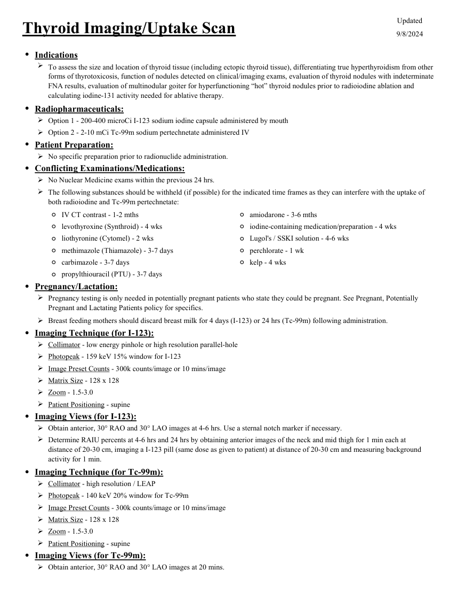
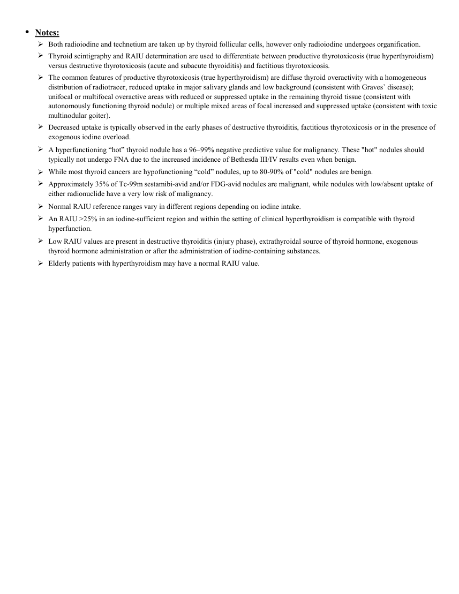

# ☢️ Scintigrafie și Captare Tiroidiană (Iod-123 & Tc-99m)

<!-- mcb-modalities:start -->
## Documentul original MCB — Tiroidă: imagistică și captare

**Protocol · 2 pagini · consultat la 2026-09-27.**

[Descarcă PDF-ul integral](../../assets/mcb-modalities/mn-tiroida-imagistica-si-captare-mcb/document.pdf) · [Sursa MCB](https://ref.mcbradiology.com/Nucs/Protocols/Thyroid%20Imaging%20Uptake.pdf) · [Catalogul MCB pentru această modalitate](../mcb/index.md)

Instrucțiunile, valorile și ilustrațiile din documentul original sunt păstrate în **engleză**. Titlul și navigarea sunt în română.

### Pagina 1

{ loading=lazy }

### Pagina 2

{ loading=lazy }

## Textul documentului original

??? abstract "Pagina 1 — text în engleză"

    
Updated
    Thyroid Imaging/Uptake Scan
    9/8/2024
    ●Indications
    
    To assess the size and location of thyroid tissue (including ectopic thyroid tissue), differentiating true hyperthyroidism from other 
    forms of thyrotoxicosis, function of nodules detected on clinical/imaging exams, evaluation of thyroid nodules with indeterminate 
    FNA results, evaluation of multinodular goiter for hyperfunctioning “hot” thyroid nodules prior to radioiodine ablation and 
    calculating iodine-131 activity needed for ablative therapy.
    ●Radiopharmaceuticals:
    Option 1 - 200-400 microCi I-123 sodium iodine capsule administered by mouth
    Option 2 - 2-10 mCi Tc-99m sodium pertechnetate administered IV
    ●Patient Preparation:
    No specific preparation prior to radionuclide administration.
    ●Conflicting Examinations/Medications:
    No Nuclear Medicine exams within the previous 24 hrs.
    
    The following substances should be withheld (if possible) for the indicated time frames as they can interfere with the uptake of 
    both radioiodine and Tc-99m pertechnetate:
    ◦IV CT contrast - 1-2 mths
    ◦amiodarone - 3-6 mths
    ◦levothyroxine (Synthroid) - 4 wks
    ◦iodine-containing medication/preparation - 4 wks
    ◦liothyronine (Cytomel) - 2 wks
    ◦Lugol&#x27;s / SSKI solution - 4-6 wks
    ◦methimazole (Thiamazole) - 3-7 days
    ◦perchlorate - 1 wk
    ◦carbimazole - 3-7 days
    ◦kelp - 4 wks
    ◦propylthiouracil (PTU) - 3-7 days
    ●Pregnancy/Lactation:
    
    Pregnancy testing is only needed in potentially pregnant patients who state they could be pregnant. See Pregnant, Potentially 
    Pregnant and Lactating Patients policy for specifics.
    Breast feeding mothers should discard breast milk for 4 days (I-123) or 24 hrs (Tc-99m) following administration.
    ●Imaging Technique (for I-123):
    Collimator - low energy pinhole or high resolution parallel-hole
    Photopeak - 159 keV 15% window for I-123
    Image Preset Counts - 300k counts/image or 10 mins/image
    Matrix Size - 128 x 128
    Zoom - 1.5-3.0
    Patient Positioning - supine
    ●Imaging Views (for I-123):
    Obtain anterior, 30° RAO and 30° LAO images at 4-6 hrs. Use a sternal notch marker if necessary.
    
    Determine RAIU percents at 4-6 hrs and 24 hrs by obtaining anterior images of the neck and mid thigh for 1 min each at 
    distance of 20-30 cm, imaging a I-123 pill (same dose as given to patient) at distance of 20-30 cm and measuring background 
    activity for 1 min.
    ●Imaging Technique (for Tc-99m):
    Collimator - high resolution / LEAP
    Photopeak - 140 keV 20% window for Tc-99m
    Image Preset Counts - 300k counts/image or 10 mins/image
    Matrix Size - 128 x 128
    Zoom - 1.5-3.0
    Patient Positioning - supine
    ●Imaging Views (for Tc-99m):
    Obtain anterior, 30° RAO and 30° LAO images at 20 mins.
    

??? abstract "Pagina 2 — text în engleză"

    
●Notes:
    Both radioiodine and technetium are taken up by thyroid follicular cells, however only radioiodine undergoes organification.
    
    Thyroid scintigraphy and RAIU determination are used to differentiate between productive thyrotoxicosis (true hyperthyroidism) 
    versus destructive thyrotoxicosis (acute and subacute thyroiditis) and factitious thyrotoxicosis.
    
    The common features of productive thyrotoxicosis (true hyperthyroidism) are diffuse thyroid overactivity with a homogeneous 
    distribution of radiotracer, reduced uptake in major salivary glands and low background (consistent with Graves’ disease); 
    unifocal or multifocal overactive areas with reduced or suppressed uptake in the remaining thyroid tissue (consistent with 
    autonomously functioning thyroid nodule) or multiple mixed areas of focal increased and suppressed uptake (consistent with toxic 
    multinodular goiter).
    
    Decreased uptake is typically observed in the early phases of destructive thyroiditis, factitious thyrotoxicosis or in the presence of 
    exogenous iodine overload.
    
    A hyperfunctioning “hot” thyroid nodule has a 96–99% negative predictive value for malignancy. These &quot;hot&quot; nodules should 
    typically not undergo FNA due to the increased incidence of Bethesda III/IV results even when benign.
    While most thyroid cancers are hypofunctioning “cold” nodules, up to 80-90% of &quot;cold&quot; nodules are benign.
    
    
    Approximately 35% of Tc-99m sestamibi-avid and/or FDG-avid nodules are malignant, while nodules with low/absent uptake of 
    either radionuclide have a very low risk of malignancy.
    Normal RAIU reference ranges vary in different regions depending on iodine intake.
    
    An RAIU &gt;25% in an iodine-sufficient region and within the setting of clinical hyperthyroidism is compatible with thyroid 
    hyperfunction.
    
    Low RAIU values are present in destructive thyroiditis (injury phase), extrathyroidal source of thyroid hormone, exogenous
    thyroid hormone administration or after the administration of iodine-containing substances.
    Elderly patients with hyperthyroidism may have a normal RAIU value.
    

<!-- mcb-modalities:end -->

## Sinteza existentă în aplicație

Protocol oficial de **Medicină Nucleară & Radiologie Nucleară** integrat conform standardelor de calitate și radiofarmacie clinică ale **MCB Radiology** și ghidurilor internaționale **SNMMI / EANM**.

  

    ☢️ MEDICINĂ NUCLEARĂ &bull; Clasa 1 (1 - 2 mSv)
  

  

    Procedură diagnostică funcțională și moleculară. Evaluarea fiziologică in vivo a metabolismului tisular utilizând radiotrasori specifici de emisie gama sau pozitroni (PET/SPECT).
  

  

    <a href="https://ref.mcbradiology.com/Nucs/Protocols/Thyroid%20Imaging%20Uptake.pdf" target="_blank" rel="noopener" style="font-weight: 600; color: #a78bfa; text-decoration: none;">
      [:material-file-pdf-box: Protocol Tehnic MCB (PDF)] ➔
    </a>
    <a href="https://ref.mcbradiology.com/Nucs/Practice%20Guidelines/Thyroid%20Scintigraphy%20&%20Uptake.pdf" target="_blank" rel="noopener" style="font-weight: 600; color: #c4b5fd; text-decoration: none;">
      [:material-file-pdf-box: Ghid de Practică Clinică (PDF)] ➔
    </a>
  

---

## 1. Indicații Clinice Majore
- Diagnosticul diferențial al hipertiroidismului: boala Basedow-Graves vs. gușă multinodulară toxică (Plummer) vs. adenom toxic autonom vs. tiroidită subacută
- Caracterizarea funcțională a nodulilor tiroidieni: nodul „cald” (hipercaptant, benign) vs. nodul „rece” (hipocaptant, risc de malignitate ce necesită puncție FNB)
- Localizarea țesutului tiroidian ectopic (tiroidă linguală, chist tireoglos, struma ovarii)

---

## 2. Radiofarmaceutic, Doză & Radioprotecție
- **Trasor administrat:** `Iod-123 sodiu oral (3.7-14.8 MBq / 100-400 uCi capsule) sau Tc-99m Pertehnetat (74-185 MBq / 2-5 mCi i.v.)`
- **Clasă de iradiere IRIS:** **Clasa 1 (1 - 2 mSv)**
- **Cale de administrare:** Intravenoasă, inhalatorie sau orală conform protocolului specific.
- **Măsuri de radioprotecție:** Hidratare abundentă post-procedură pentru favorizarea eliminării urinare a radiofarmaceuticului nefixat. Evitarea contactului prelungit cu femei gravide și copii mici timp de 24 ore.

---

## 3. Pregătirea Pacientului
Oprirea alimentelor bogate în iod și a suplimentelor cu iod/alge cu 2 săptămâni înainte. Fără substanțe de contrast CT iodate în ultimele 4-6 săptămâni. Oprirea medicamentelor antitiroidiene (Tiamazol) cu 3-5 zile înainte, iar a Levotiroxinei (T4) cu 4-6 săptămâni înainte.

---

## 4. Protocol Tehnic de Achiziție Imagistică
Captare cu sondă de scintilație la 4-6 ore și 24 ore post-ingestie I-123. Imagini planare cu colimator pinhole (incidențe anterioară, OAD, OAS). Pentru Tc-99m: imagini la 15-20 min post-i.v.

---

## 5. Criterii de Interpretare Diagnostică
Captare normală la 24 ore: 10 - 30%. Boala Graves: captare difuză crescută (40-80%) cu lob piramidal vizibil. Adenom toxic: nodul hipercaptant unic cu supresia restului parenchimului. Tiroidită subacută: captare extrem de scăzută (< 2%).

---

## 6. Documente și Ghiduri Asociate
- [:material-file-pdf-box: Protocol Original MCB Radiology](https://ref.mcbradiology.com/Nucs/Protocols/Thyroid%20Imaging%20Uptake.pdf){ target="_blank" rel="noopener" }
- [:material-file-pdf-box: Ghid de Practică Medicală SNMMI / EANM](https://ref.mcbradiology.com/Nucs/Practice%20Guidelines/Thyroid%20Scintigraphy%20&%20Uptake.pdf){ target="_blank" rel="noopener" }
- [:material-arrow-left: Înapoi la Indexul de Medicină Nucleară](../index.md)
