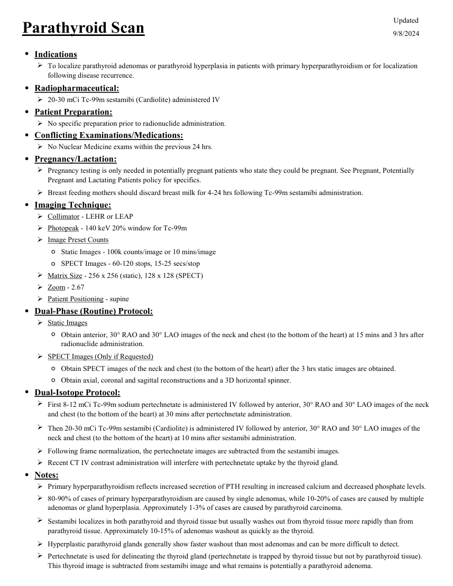
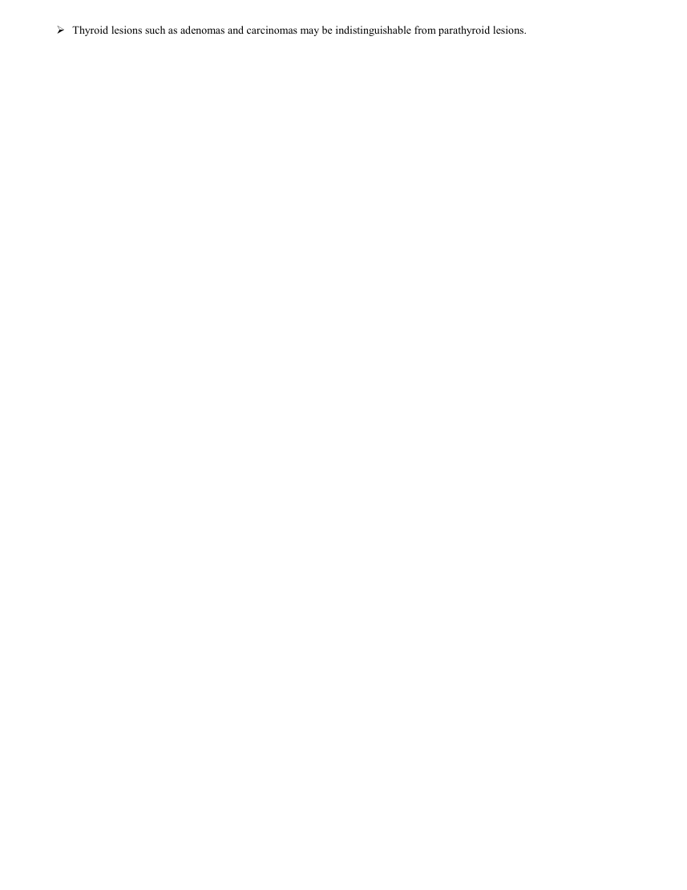

# ☢️ Scintigrafie Paratiroidiană cu Tc-99m Sestamibi și SPECT/CT

<!-- mcb-modalities:start -->
## Documentul original MCB — Paratiroide

**Protocol · 2 pagini · consultat la 2026-09-27.**

[Descarcă PDF-ul integral](../../assets/mcb-modalities/mn-paratiroide-mcb/document.pdf) · [Sursa MCB](https://ref.mcbradiology.com/Nucs/Protocols/Parathyroid.pdf) · [Catalogul MCB pentru această modalitate](../mcb/index.md)

Instrucțiunile, valorile și ilustrațiile din documentul original sunt păstrate în **engleză**. Titlul și navigarea sunt în română.

### Pagina 1

{ loading=lazy }

### Pagina 2

{ loading=lazy }

## Textul documentului original

??? abstract "Pagina 1 — text în engleză"

    
Updated
    Parathyroid Scan
    9/8/2024
    ●Indications
    
    To localize parathyroid adenomas or parathyroid hyperplasia in patients with primary hyperparathyroidism or for localization 
    following disease recurrence.
    ●Radiopharmaceutical:
    20-30 mCi Tc-99m sestamibi (Cardiolite) administered IV
    ●Patient Preparation:
    No specific preparation prior to radionuclide administration.
    ●Conflicting Examinations/Medications:
    No Nuclear Medicine exams within the previous 24 hrs.
    ●Pregnancy/Lactation:
    
    Pregnancy testing is only needed in potentially pregnant patients who state they could be pregnant. See Pregnant, Potentially 
    Pregnant and Lactating Patients policy for specifics.
    Breast feeding mothers should discard breast milk for 4-24 hrs following Tc-99m sestamibi administration.
    ●Imaging Technique:
    Collimator - LEHR or LEAP
    Photopeak - 140 keV 20% window for Tc-99m
    Image Preset Counts
    ◦Static Images - 100k counts/image or 10 mins/image
    ◦SPECT Images - 60-120 stops, 15-25 secs/stop
    Matrix Size - 256 x 256 (static), 128 x 128 (SPECT)
    Zoom - 2.67
    Patient Positioning - supine
    ●Dual-Phase (Routine) Protocol:
    Static Images
    ◦
    Obtain anterior, 30° RAO and 30° LAO images of the neck and chest (to the bottom of the heart) at 15 mins and 3 hrs after 
    radionuclide administration.
    SPECT Images (Only if Requested)
    ◦Obtain SPECT images of the neck and chest (to the bottom of the heart) after the 3 hrs static images are obtained.
    ◦Obtain axial, coronal and sagittal reconstructions and a 3D horizontal spinner.
    ●Dual-Isotope Protocol:
    
    First 8-12 mCi Tc-99m sodium pertechnetate is administered IV followed by anterior, 30° RAO and 30° LAO images of the neck 
    and chest (to the bottom of the heart) at 30 mins after pertechnetate administration.
    
    Then 20-30 mCi Tc-99m sestamibi (Cardiolite) is administered IV followed by anterior, 30° RAO and 30° LAO images of the 
    neck and chest (to the bottom of the heart) at 10 mins after sestamibi administration.
    Following frame normalization, the pertechnetate images are subtracted from the sestamibi images.
    Recent CT IV contrast administration will interfere with pertechnetate uptake by the thyroid gland.
    ●Notes:
    Primary hyperparathyroidism reflects increased secretion of PTH resulting in increased calcium and decreased phosphate levels.
    
    80-90% of cases of primary hyperparathyroidism are caused by single adenomas, while 10-20% of cases are caused by multiple 
    adenomas or gland hyperplasia. Approximately 1-3% of cases are caused by parathyroid carcinoma.
    
    Sestamibi localizes in both parathyroid and thyroid tissue but usually washes out from thyroid tissue more rapidly than from 
    parathyroid tissue. Approximately 10-15% of adenomas washout as quickly as the thyroid.
    Hyperplastic parathyroid glands generally show faster washout than most adenomas and can be more difficult to detect.
    
    Pertechnetate is used for delineating the thyroid gland (pertechnetate is trapped by thyroid tissue but not by parathyroid tissue). 
    This thyroid image is subtracted from sestamibi image and what remains is potentially a parathyroid adenoma.
    

??? abstract "Pagina 2 — text în engleză"

    
Thyroid lesions such as adenomas and carcinomas may be indistinguishable from parathyroid lesions.
    

<!-- mcb-modalities:end -->

## Sinteza existentă în aplicație

Protocol oficial de **Medicină Nucleară & Radiologie Nucleară** integrat conform standardelor de calitate și radiofarmacie clinică ale **MCB Radiology** și ghidurilor internaționale **SNMMI / EANM**.

  

    ☢️ MEDICINĂ NUCLEARĂ &bull; Clasa 2 (4 - 6 mSv)
  

  

    Procedură diagnostică funcțională și moleculară. Evaluarea fiziologică in vivo a metabolismului tisular utilizând radiotrasori specifici de emisie gama sau pozitroni (PET/SPECT).
  

  

    <a href="https://ref.mcbradiology.com/Nucs/Protocols/Parathyroid.pdf" target="_blank" rel="noopener" style="font-weight: 600; color: #a78bfa; text-decoration: none;">
      [:material-file-pdf-box: Protocol Tehnic MCB (PDF)] ➔
    </a>
    <a href="https://ref.mcbradiology.com/Nucs/Practice%20Guidelines/Parathyroid%20Scintigraphy.pdf" target="_blank" rel="noopener" style="font-weight: 600; color: #c4b5fd; text-decoration: none;">
      [:material-file-pdf-box: Ghid de Practică Clinică (PDF)] ➔
    </a>
  

---

## 1. Indicații Clinice Majore
- Localizarea pre-operatorie a adenomului paratiroidian solitar sau multiplu în hiperparatiroidismul primar
- Ghidarea chirurgiei paratiroidiene minim invazive (MIP)
- Localizarea adenoamelor paratiroidiene ectopice (mediastin antero-superior, șanț traheoesofagian, retrofaringian)
- Recidivă de hiperparatiroidism post-chirurgical

---

## 2. Radiofarmaceutic, Doză & Radioprotecție
- **Trasor administrat:** `Tc-99m Sestamibi (MIBI, 740-925 MBq / 20-25 mCi i.v.)`
- **Clasă de iradiere IRIS:** **Clasa 2 (4 - 6 mSv)**
- **Cale de administrare:** Intravenoasă, inhalatorie sau orală conform protocolului specific.
- **Măsuri de radioprotecție:** Hidratare abundentă post-procedură pentru favorizarea eliminării urinare a radiofarmaceuticului nefixat. Evitarea contactului prelungit cu femei gravide și copii mici timp de 24 ore.

---

## 3. Pregătirea Pacientului
Fără pregătire specială. Se recomandă corelarea cu ecografia cervicală de înaltă rezoluție.

---

## 4. Protocol Tehnic de Achiziție Imagistică
Protocol dublă fază (wash-out): Sestamibi se captează inițial atât în tiroidă cât și în paratiroidele bogate în mitocondrii; tiroida elimină trasorul mult mai rapid. Imagini precoce la 10-15 min și imagini tardive la 1.5 - 2.5 ore post-injectare. Achiziție hibridă SPECT/CT cervical și mediastinal la faza tardivă.

---

## 5. Criterii de Interpretare Diagnostică
Adenom paratiroidian: focar persistent de retenție crescută a trasorului la faza tardivă după evacuarea activității din parenchimul tiroidian normal. SPECT/CT oferă localizarea spațială anatomică precisă pentru abordul chirurgical minim invaziv.

---

## 6. Documente și Ghiduri Asociate
- [:material-file-pdf-box: Protocol Original MCB Radiology](https://ref.mcbradiology.com/Nucs/Protocols/Parathyroid.pdf){ target="_blank" rel="noopener" }
- [:material-file-pdf-box: Ghid de Practică Medicală SNMMI / EANM](https://ref.mcbradiology.com/Nucs/Practice%20Guidelines/Parathyroid%20Scintigraphy.pdf){ target="_blank" rel="noopener" }
- [:material-arrow-left: Înapoi la Indexul de Medicină Nucleară](../index.md)
