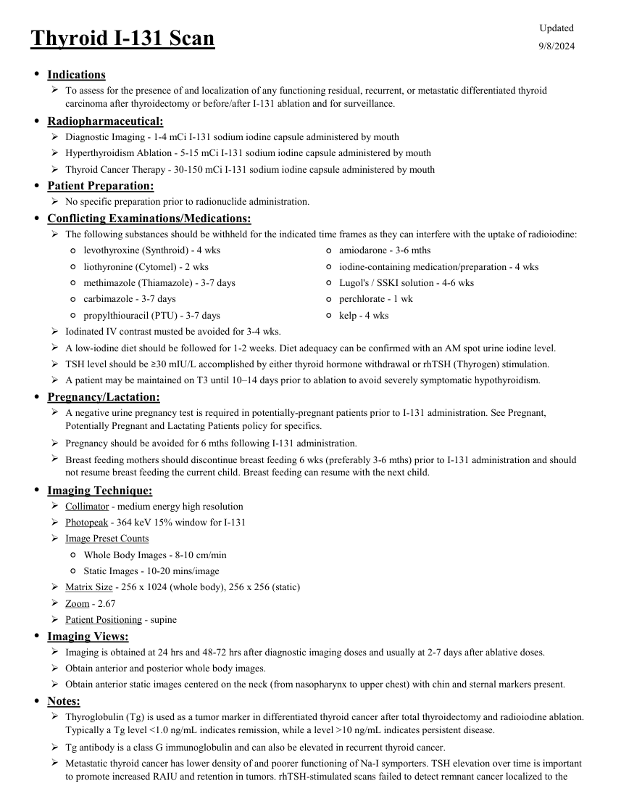
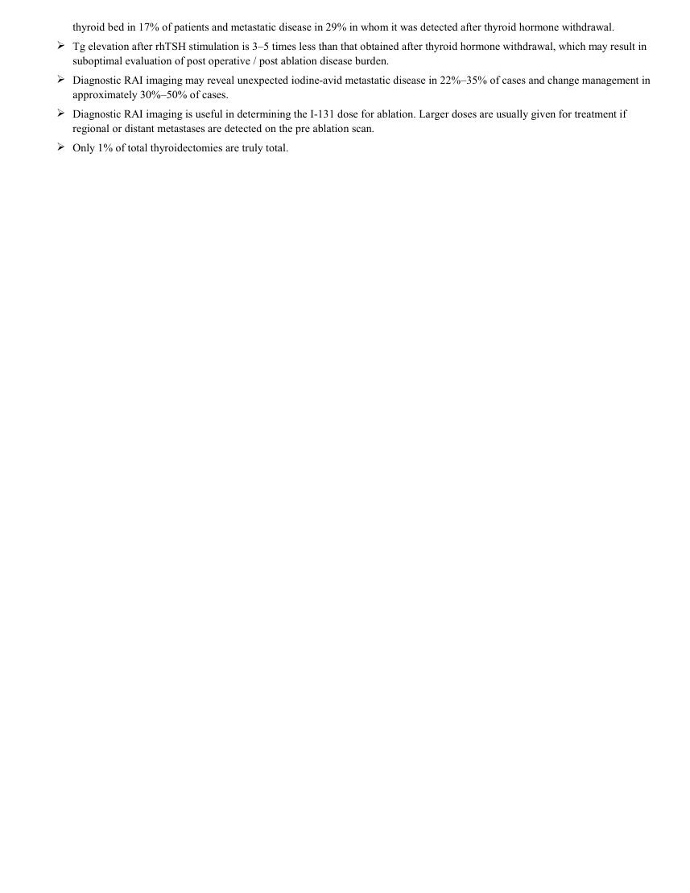

# ☢️ Scintigrafie Whole-Body cu Iod-131 în Cancerul Tiroidian Diferențiat

<!-- mcb-modalities:start -->
## Documentul original MCB — Tiroidă cu iod-131

**Protocol · 2 pagini · consultat la 2026-09-27.**

[Descarcă PDF-ul integral](../../assets/mcb-modalities/mn-tiroida-cu-iod-131-mcb/document.pdf) · [Sursa MCB](https://ref.mcbradiology.com/Nucs/Protocols/Thyroid%20I131.pdf) · [Catalogul MCB pentru această modalitate](../mcb/index.md)

Instrucțiunile, valorile și ilustrațiile din documentul original sunt păstrate în **engleză**. Titlul și navigarea sunt în română.

### Pagina 1

{ loading=lazy }

### Pagina 2

{ loading=lazy }

## Textul documentului original

??? abstract "Pagina 1 — text în engleză"

    
Updated
    Thyroid I-131 Scan
    9/8/2024
    ●Indications
    
    To assess for the presence of and localization of any functioning residual, recurrent, or metastatic differentiated thyroid 
    carcinoma after thyroidectomy or before/after I-131 ablation and for surveillance.
    ●Radiopharmaceutical:
    Diagnostic Imaging - 1-4 mCi I-131 sodium iodine capsule administered by mouth
    Hyperthyroidism Ablation - 5-15 mCi I-131 sodium iodine capsule administered by mouth
    Thyroid Cancer Therapy - 30-150 mCi I-131 sodium iodine capsule administered by mouth
    ●Patient Preparation:
    No specific preparation prior to radionuclide administration.
    ●Conflicting Examinations/Medications:
    The following substances should be withheld for the indicated time frames as they can interfere with the uptake of radioiodine:
    ◦levothyroxine (Synthroid) - 4 wks
    ◦amiodarone - 3-6 mths
    ◦liothyronine (Cytomel) - 2 wks
    ◦iodine-containing medication/preparation - 4 wks
    ◦methimazole (Thiamazole) - 3-7 days
    ◦Lugol&#x27;s / SSKI solution - 4-6 wks
    ◦carbimazole - 3-7 days
    ◦perchlorate - 1 wk
    ◦propylthiouracil (PTU) - 3-7 days
    ◦kelp - 4 wks
    Iodinated IV contrast musted be avoided for 3-4 wks.
    A low-iodine diet should be followed for 1-2 weeks. Diet adequacy can be confirmed with an AM spot urine iodine level.
    TSH level should be ≥30 mIU/L accomplished by either thyroid hormone withdrawal or rhTSH (Thyrogen) stimulation.
    A patient may be maintained on T3 until 10–14 days prior to ablation to avoid severely symptomatic hypothyroidism.
    ●Pregnancy/Lactation:
    
    A negative urine pregnancy test is required in potentially-pregnant patients prior to I-131 administration. See Pregnant, 
    Potentially Pregnant and Lactating Patients policy for specifics.
    Pregnancy should be avoided for 6 mths following I-131 administration.
    
    Breast feeding mothers should discontinue breast feeding 6 wks (preferably 3-6 mths) prior to I-131 administration and should 
    not resume breast feeding the current child. Breast feeding can resume with the next child.
    ●Imaging Technique:
    Collimator - medium energy high resolution
    Photopeak - 364 keV 15% window for I-131
    Image Preset Counts
    ◦Whole Body Images - 8-10 cm/min
    ◦Static Images - 10-20 mins/image
    Matrix Size - 256 x 1024 (whole body), 256 x 256 (static) 
    Zoom - 2.67
    Patient Positioning - supine
    ●Imaging Views:
    Imaging is obtained at 24 hrs and 48-72 hrs after diagnostic imaging doses and usually at 2-7 days after ablative doses.
    Obtain anterior and posterior whole body images.
    Obtain anterior static images centered on the neck (from nasopharynx to upper chest) with chin and sternal markers present.
    ●Notes:
    
    Thyroglobulin (Tg) is used as a tumor marker in differentiated thyroid cancer after total thyroidectomy and radioiodine ablation. 
    Typically a Tg level &lt;1.0 ng/mL indicates remission, while a level &gt;10 ng/mL indicates persistent disease.
    Tg antibody is a class G immunoglobulin and can also be elevated in recurrent thyroid cancer.
    
    Metastatic thyroid cancer has lower density of and poorer functioning of Na-I symporters. TSH elevation over time is important 
    to promote increased RAIU and retention in tumors. rhTSH-stimulated scans failed to detect remnant cancer localized to the 
    thyroid bed in 17% of patients and metastatic disease in 29% in whom it was detected after thyroid hormone withdrawal.
    

??? abstract "Pagina 2 — text în engleză"

    
thyroid bed in 17% of patients and metastatic disease in 29% in whom it was detected after thyroid hormone withdrawal.
    
    Tg elevation after rhTSH stimulation is 3–5 times less than that obtained after thyroid hormone withdrawal, which may result in 
    suboptimal evaluation of post operative / post ablation disease burden.
    
    Diagnostic RAI imaging may reveal unexpected iodine-avid metastatic disease in 22%–35% of cases and change management in 
    approximately 30%–50% of cases.
    
    Diagnostic RAI imaging is useful in determining the I-131 dose for ablation. Larger doses are usually given for treatment if 
    regional or distant metastases are detected on the pre ablation scan.
    Only 1% of total thyroidectomies are truly total.
    

<!-- mcb-modalities:end -->

## Sinteza existentă în aplicație

Protocol oficial de **Medicină Nucleară & Radiologie Nucleară** integrat conform standardelor de calitate și radiofarmacie clinică ale **MCB Radiology** și ghidurilor internaționale **SNMMI / EANM**.

  

    ☢️ MEDICINĂ NUCLEARĂ &bull; Terapeutic / Diagnostic
  

  

    Procedură diagnostică funcțională și moleculară. Evaluarea fiziologică in vivo a metabolismului tisular utilizând radiotrasori specifici de emisie gama sau pozitroni (PET/SPECT).
  

  

    <a href="https://ref.mcbradiology.com/Nucs/Protocols/Thyroid%20I131.pdf" target="_blank" rel="noopener" style="font-weight: 600; color: #a78bfa; text-decoration: none;">
      [:material-file-pdf-box: Protocol Tehnic MCB (PDF)] ➔
    </a>
    <a href="https://ref.mcbradiology.com/Nucs/Practice%20Guidelines/Thyroid%20Cancer%20I131.pdf" target="_blank" rel="noopener" style="font-weight: 600; color: #c4b5fd; text-decoration: none;">
      [:material-file-pdf-box: Ghid de Practică Clinică (PDF)] ➔
    </a>
  

---

## 1. Indicații Clinice Majore
- Bilanțul post-tiroidectomie totală în cancerul tiroidian diferențiat (papilar sau folicular)
- Detectarea țesutului tiroidian restant în loja cervicală înainte de ablația cu radioiod
- Depistarea metastazelor la distanță (ganglionare, pulmonare miliare, osoase) la pacienți cu tiroglobulină serică detectabilă

---

## 2. Radiofarmaceutic, Doză & Radioprotecție
- **Trasor administrat:** `Iod-131 sodiu oral (74-185 MBq / 2-5 mCi diagnostic; sau post-terapeutic 1110-7400 MBq / 30-200 mCi)`
- **Clasă de iradiere IRIS:** **Terapeutic / Diagnostic**
- **Cale de administrare:** Intravenoasă, inhalatorie sau orală conform protocolului specific.
- **Măsuri de radioprotecție:** Hidratare abundentă post-procedură pentru favorizarea eliminării urinare a radiofarmaceuticului nefixat. Evitarea contactului prelungit cu femei gravide și copii mici timp de 24 ore.

---

## 3. Pregătirea Pacientului
Stimulare TSH obligatorie (TSH > 30 uIU/mL): fie prin sevraj hormonal de levotiroxină 4 săptămâni, fie prin administrare de TSH uman recombinant (Thyrogen). Dietă strictă hipoiodată timp de 14 zile.

---

## 4. Protocol Tehnic de Achiziție Imagistică
Scanare corp întreg antero-posterioară la 48-72 ore post-ingestie (diagnostic) sau la 5-7 zile post-terapeutic. Colimator de înaltă energie (HEGP), fotopic la 364 keV.

---

## 5. Criterii de Interpretare Diagnostică
Fixare normală fiziologică în mucoasa nazală, glande salivare, stomac, tract urinar. Orice focar focal în afara acestor arii reprezintă metastază sau rest tisular tiroidian.

---

## 6. Documente și Ghiduri Asociate
- [:material-file-pdf-box: Protocol Original MCB Radiology](https://ref.mcbradiology.com/Nucs/Protocols/Thyroid%20I131.pdf){ target="_blank" rel="noopener" }
- [:material-file-pdf-box: Ghid de Practică Medicală SNMMI / EANM](https://ref.mcbradiology.com/Nucs/Practice%20Guidelines/Thyroid%20Cancer%20I131.pdf){ target="_blank" rel="noopener" }
- [:material-arrow-left: Înapoi la Indexul de Medicină Nucleară](../index.md)
