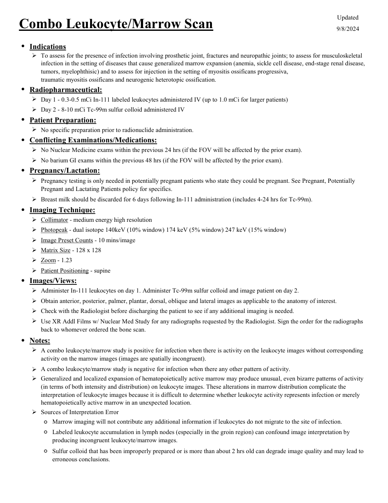

# Medicină nucleară — Leucocite marcate și măduvă osoasă (MCB)

## Documentul original MCB — Leucocite marcate și măduvă osoasă

**Protocol · 1 pagini · consultat la 2026-09-27.**

[Descarcă PDF-ul integral](../../assets/mcb-modalities/mn-leucocite-marcate-si-maduva-osoasa-mcb/document.pdf) · [Sursa MCB](https://ref.mcbradiology.com/Nucs/Protocols/WBC%20Marrow%20Combo.pdf) · [Catalogul MCB pentru această modalitate](../mcb/index.md)

Instrucțiunile, valorile și ilustrațiile din documentul original sunt păstrate în **engleză**. Titlul și navigarea sunt în română.

### Pagina 1

{ loading=lazy }

## Textul documentului original

??? abstract "Pagina 1 — text în engleză"

    
Updated
    Combo Leukocyte/Marrow Scan
    9/8/2024
    ●Indications
    
    To assess for the presence of infection involving prosthetic joint, fractures and neuropathic joints; to assess for musculoskeletal 
    infection in the setting of diseases that cause generalized marrow expansion (anemia, sickle cell disease, end-stage renal disease, 
    tumors, myelophthisic) and to assess for injection in the setting of myositis ossificans progressiva,
    traumatic myositis ossificans and neurogenic heterotopic ossification.
    ●Radiopharmaceutical:
    Day 1 - 0.3-0.5 mCi In-111 labeled leukocytes administered IV (up to 1.0 mCi for larger patients)
    Day 2 - 8-10 mCi Tc-99m sulfur colloid administered IV
    ●Patient Preparation:
    No specific preparation prior to radionuclide administration.
    ●Conflicting Examinations/Medications:
    No Nuclear Medicine exams within the previous 24 hrs (if the FOV will be affected by the prior exam).
    No barium GI exams within the previous 48 hrs (if the FOV will be affected by the prior exam).
    ●Pregnancy/Lactation:
    
    Pregnancy testing is only needed in potentially pregnant patients who state they could be pregnant. See Pregnant, Potentially 
    Pregnant and Lactating Patients policy for specifics.
    Breast milk should be discarded for 6 days following In-111 administration (includes 4-24 hrs for Tc-99m).
    ●Imaging Technique:
    Collimator - medium energy high resolution
    Photopeak - dual isotope 140keV (10% window) 174 keV (5% window) 247 keV (15% window)
    Image Preset Counts - 10 mins/image
    Matrix Size - 128 x 128
    Zoom - 1.23
    Patient Positioning - supine
    ●Images/Views:
    Administer In-111 leukocytes on day 1. Administer Tc-99m sulfur colloid and image patient on day 2.
    Obtain anterior, posterior, palmer, plantar, dorsal, oblique and lateral images as applicable to the anatomy of interest.
    Check with the Radiologist before discharging the patient to see if any additional imaging is needed.
    
    Use XR Addl Films w/ Nuclear Med Study for any radiographs requested by the Radiologist. Sign the order for the radiographs 
    back to whomever ordered the bone scan.
    ●Notes:
    
    A combo leukocyte/marrow study is positive for infection when there is activity on the leukocyte images without corresponding 
    activity on the marrow images (images are spatially incongruent).
    
    
    A combo leukocyte/marrow study is negative for infection when there any other pattern of activity.
    Generalized and localized expansion of hematopoietically active marrow may produce unusual, even bizarre patterns of activity 
    (in terms of both intensity and distribution) on leukocyte images. These alterations in marrow distribution complicate the 
    interpretation of leukocyte images because it is difficult to determine whether leukocyte activity represents infection or merely 
    hematopoietically active marrow in an unexpected location.
    Sources of Interpretation Error
    Marrow imaging will not contribute any additional information if leukocytes do not migrate to the site of infection.
    ◦
    ◦
    Labeled leukocyte accumulation in lymph nodes (especially in the groin region) can confound image interpretation by 
    producing incongruent leukocyte/marrow images.
    ◦
    Sulfur colloid that has been improperly prepared or is more than about 2 hrs old can degrade image quality and may lead to 
    erroneous conclusions.
    

