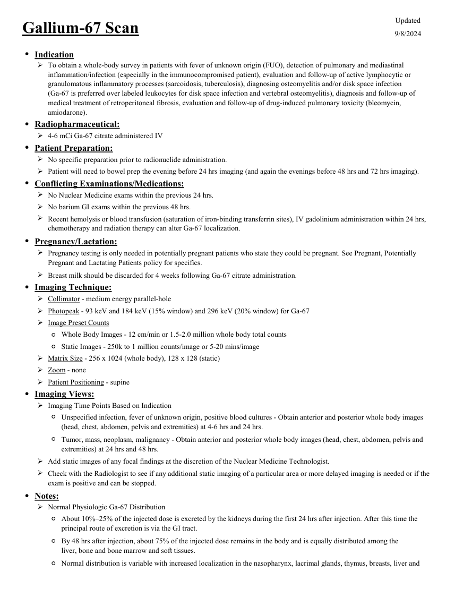
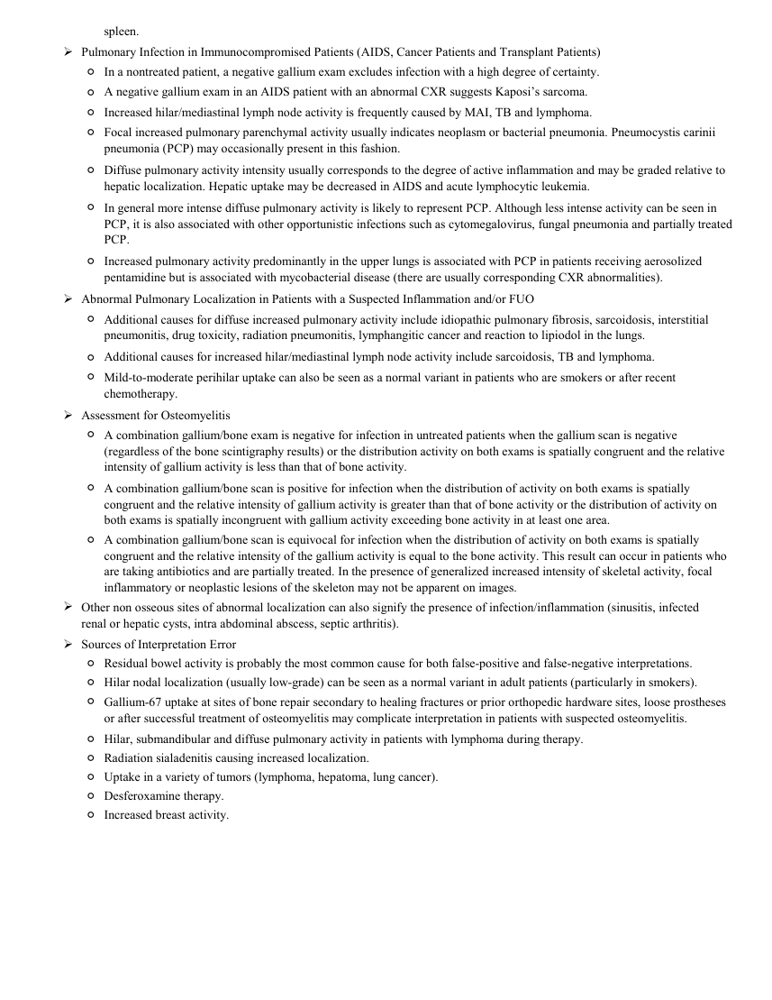

# Medicină nucleară — Scintigrafie cu galiu (MCB)

## Documentul original MCB — Scintigrafie cu galiu

**Protocol · 2 pagini · consultat la 2026-09-27.**

[Descarcă PDF-ul integral](../../assets/mcb-modalities/mn-scintigrafie-cu-galiu-mcb/document.pdf) · [Sursa MCB](https://ref.mcbradiology.com/Nucs/Protocols/Gallium.pdf) · [Catalogul MCB pentru această modalitate](../mcb/index.md)

Instrucțiunile, valorile și ilustrațiile din documentul original sunt păstrate în **engleză**. Titlul și navigarea sunt în română.

### Pagina 1

{ loading=lazy }

### Pagina 2

{ loading=lazy }

## Textul documentului original

??? abstract "Pagina 1 — text în engleză"

    
Updated
    Gallium-67 Scan
    9/8/2024
    ●Indication
    
    To obtain a whole-body survey in patients with fever of unknown origin (FUO), detection of pulmonary and mediastinal 
    inflammation/infection (especially in the immunocompromised patient), evaluation and follow-up of active lymphocytic or 
    granulomatous inflammatory processes (sarcoidosis, tuberculosis), diagnosing osteomyelitis and/or disk space infection                             
    (Ga-67 is preferred over labeled leukocytes for disk space infection and vertebral osteomyelitis), diagnosis and follow-up of 
    medical treatment of retroperitoneal fibrosis, evaluation and follow-up of drug-induced pulmonary toxicity (bleomycin, 
    amiodarone).
    ●Radiopharmaceutical:
    4-6 mCi Ga-67 citrate administered IV
    ●Patient Preparation:
    No specific preparation prior to radionuclide administration.
    Patient will need to bowel prep the evening before 24 hrs imaging (and again the evenings before 48 hrs and 72 hrs imaging).
    ●Conflicting Examinations/Medications:
    No Nuclear Medicine exams within the previous 24 hrs.
    No barium GI exams within the previous 48 hrs.
    
    Recent hemolysis or blood transfusion (saturation of iron-binding transferrin sites), IV gadolinium administration within 24 hrs, 
    chemotherapy and radiation therapy can alter Ga-67 localization.  
    ●Pregnancy/Lactation:
    
    Pregnancy testing is only needed in potentially pregnant patients who state they could be pregnant. See Pregnant, Potentially 
    Pregnant and Lactating Patients policy for specifics.
    Breast milk should be discarded for 4 weeks following Ga-67 citrate administration.
    ●Imaging Technique:
    Collimator - medium energy parallel-hole
    Photopeak - 93 keV and 184 keV (15% window) and 296 keV (20% window) for Ga-67
    Image Preset Counts
    ◦Whole Body Images - 12 cm/min or 1.5-2.0 million whole body total counts
    ◦Static Images - 250k to 1 million counts/image or 5-20 mins/image
    Matrix Size - 256 x 1024 (whole body), 128 x 128 (static) 
    Zoom - none
    Patient Positioning - supine
    ●Imaging Views:
    Imaging Time Points Based on Indication
    ◦
    Unspecified infection, fever of unknown origin, positive blood cultures - Obtain anterior and posterior whole body images 
    (head, chest, abdomen, pelvis and extremities) at 4-6 hrs and 24 hrs.
    ◦
    Tumor, mass, neoplasm, malignancy - Obtain anterior and posterior whole body images (head, chest, abdomen, pelvis and 
    extremities) at 24 hrs and 48 hrs.
    Add static images of any focal findings at the discretion of the Nuclear Medicine Technologist.
    
    Check with the Radiologist to see if any additional static imaging of a particular area or more delayed imaging is needed or if the 
    exam is positive and can be stopped.
    ●Notes:
    Normal Physiologic Ga-67 Distribution
    ◦
    About 10%–25% of the injected dose is excreted by the kidneys during the first 24 hrs after injection. After this time the 
    principal route of excretion is via the GI tract.
    ◦
    By 48 hrs after injection, about 75% of the injected dose remains in the body and is equally distributed among the
    liver, bone and bone marrow and soft tissues. 
    Normal distribution is variable with increased localization in the nasopharynx, lacrimal glands, thymus, breasts, liver and 
    ◦
    

??? abstract "Pagina 2 — text în engleză"

    
spleen.
    Pulmonary Infection in Immunocompromised Patients (AIDS, Cancer Patients and Transplant Patients)
    ◦In a nontreated patient, a negative gallium exam excludes infection with a high degree of certainty.
    ◦A negative gallium exam in an AIDS patient with an abnormal CXR suggests Kaposi’s sarcoma.
    ◦Increased hilar/mediastinal lymph node activity is frequently caused by MAI, TB and lymphoma.
    ◦
    Focal increased pulmonary parenchymal activity usually indicates neoplasm or bacterial pneumonia. Pneumocystis carinii  
    pneumonia (PCP) may occasionally present in this fashion.
    ◦
    Diffuse pulmonary activity intensity usually corresponds to the degree of active inflammation and may be graded relative to 
    hepatic localization. Hepatic uptake may be decreased in AIDS and acute lymphocytic leukemia.
    ◦
    In general more intense diffuse pulmonary activity is likely to represent PCP. Although less intense activity can be seen in 
    PCP, it is also associated with other opportunistic infections such as cytomegalovirus, fungal pneumonia and partially treated 
    PCP.
    ◦
    Increased pulmonary activity predominantly in the upper lungs is associated with PCP in patients receiving aerosolized
    pentamidine but is associated with mycobacterial disease (there are usually corresponding CXR abnormalities).
    Abnormal Pulmonary Localization in Patients with a Suspected Inflammation and/or FUO
    ◦
    Additional causes for diffuse increased pulmonary activity include idiopathic pulmonary fibrosis, sarcoidosis, interstitial
    pneumonitis, drug toxicity, radiation pneumonitis, lymphangitic cancer and reaction to lipiodol in the lungs.
    ◦Additional causes for increased hilar/mediastinal lymph node activity include sarcoidosis, TB and lymphoma.
    ◦
    Mild-to-moderate perihilar uptake can also be seen as a normal variant in patients who are smokers or after recent 
    chemotherapy.
    Assessment for Osteomyelitis
    ◦
    A combination gallium/bone exam is negative for infection in untreated patients when the gallium scan is negative 
    (regardless of the bone scintigraphy results) or the distribution activity on both exams is spatially congruent and the relative
    intensity of gallium activity is less than that of bone activity.
    ◦
    A combination gallium/bone scan is positive for infection when the distribution of activity on both exams is spatially 
    congruent and the relative intensity of gallium activity is greater than that of bone activity or the distribution of activity on 
    both exams is spatially incongruent with gallium activity exceeding bone activity in at least one area.
    ◦
    A combination gallium/bone scan is equivocal for infection when the distribution of activity on both exams is spatially
    congruent and the relative intensity of the gallium activity is equal to the bone activity. This result can occur in patients who
    are taking antibiotics and are partially treated. In the presence of generalized increased intensity of skeletal activity, focal 
    inflammatory or neoplastic lesions of the skeleton may not be apparent on images.
    
    Other non osseous sites of abnormal localization can also signify the presence of infection/inflammation (sinusitis, infected
    renal or hepatic cysts, intra abdominal abscess, septic arthritis).
    Sources of Interpretation Error
    ◦Residual bowel activity is probably the most common cause for both false-positive and false-negative interpretations.
    ◦Hilar nodal localization (usually low-grade) can be seen as a normal variant in adult patients (particularly in smokers).
    ◦
    Gallium-67 uptake at sites of bone repair secondary to healing fractures or prior orthopedic hardware sites, loose prostheses 
    or after successful treatment of osteomyelitis may complicate interpretation in patients with suspected osteomyelitis.
    ◦Hilar, submandibular and diffuse pulmonary activity in patients with lymphoma during therapy.
    ◦Radiation sialadenitis causing increased localization.
    ◦Uptake in a variety of tumors (lymphoma, hepatoma, lung cancer).
    ◦Desferoxamine therapy.
    ◦Increased breast activity.
    

