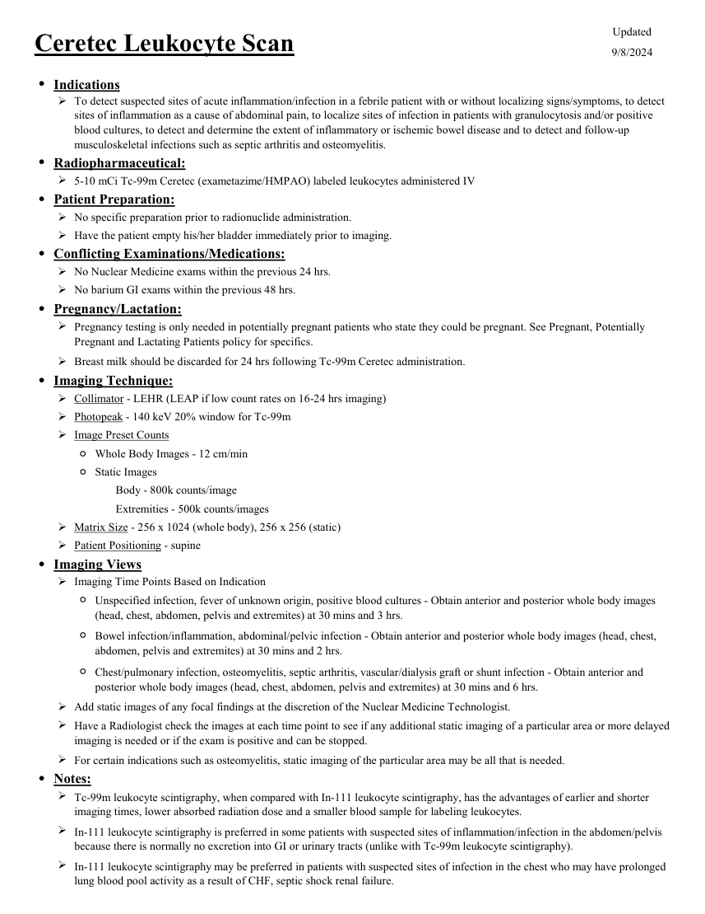
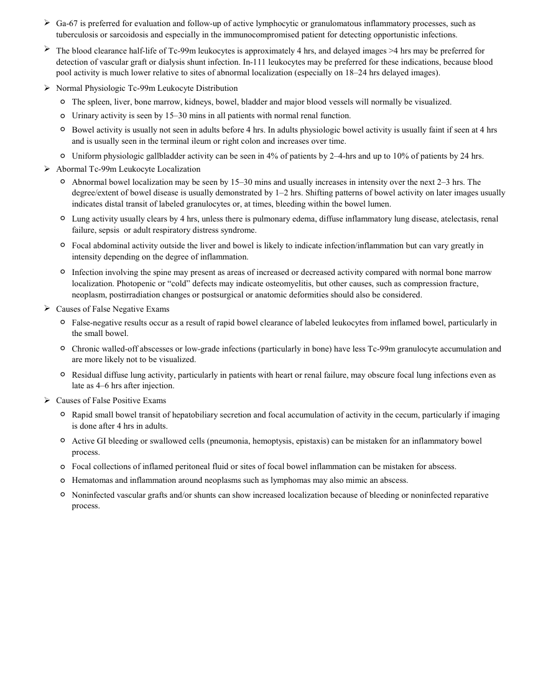

# ☢️ Scintigrafie cu Leucocite Marcate cu Tc-99m HMPAO (Ceretec WBC)

<!-- mcb-modalities:start -->
## Documentul original MCB — Leucocite marcate cu Ceretec

**Protocol · 2 pagini · consultat la 2026-09-27.**

[Descarcă PDF-ul integral](../../assets/mcb-modalities/mn-leucocite-marcate-cu-ceretec-mcb/document.pdf) · [Sursa MCB](https://ref.mcbradiology.com/Nucs/Protocols/WBC%20Ceretec.pdf) · [Catalogul MCB pentru această modalitate](../mcb/index.md)

Instrucțiunile, valorile și ilustrațiile din documentul original sunt păstrate în **engleză**. Titlul și navigarea sunt în română.

### Pagina 1

{ loading=lazy }

### Pagina 2

{ loading=lazy }

## Textul documentului original

??? abstract "Pagina 1 — text în engleză"

    
Updated
    Ceretec Leukocyte Scan
    9/8/2024
    ●Indications
    
    To detect suspected sites of acute inflammation/infection in a febrile patient with or without localizing signs/symptoms, to detect 
    sites of inflammation as a cause of abdominal pain, to localize sites of infection in patients with granulocytosis and/or positive 
    blood cultures, to detect and determine the extent of inflammatory or ischemic bowel disease and to detect and follow-up 
    musculoskeletal infections such as septic arthritis and osteomyelitis.
    ●Radiopharmaceutical:
    5-10 mCi Tc-99m Ceretec (exametazime/HMPAO) labeled leukocytes administered IV
    ●Patient Preparation:
    No specific preparation prior to radionuclide administration.
    Have the patient empty his/her bladder immediately prior to imaging.
    ●Conflicting Examinations/Medications:
    No Nuclear Medicine exams within the previous 24 hrs.
    No barium GI exams within the previous 48 hrs.
    ●Pregnancy/Lactation:
    
    Pregnancy testing is only needed in potentially pregnant patients who state they could be pregnant. See Pregnant, Potentially 
    Pregnant and Lactating Patients policy for specifics.
    Breast milk should be discarded for 24 hrs following Tc-99m Ceretec administration.
    ●Imaging Technique:
    Collimator - LEHR (LEAP if low count rates on 16-24 hrs imaging)
    Photopeak - 140 keV 20% window for Tc-99m
    Image Preset Counts
    ◦Whole Body Images - 12 cm/min
    ◦Static Images
    Body - 800k counts/image
    Extremities - 500k counts/images
    Matrix Size - 256 x 1024 (whole body), 256 x 256 (static) 
    Patient Positioning - supine
    ●Imaging Views
    Imaging Time Points Based on Indication
    ◦
    Unspecified infection, fever of unknown origin, positive blood cultures - Obtain anterior and posterior whole body images 
    (head, chest, abdomen, pelvis and extremites) at 30 mins and 3 hrs.
    ◦
    Bowel infection/inflammation, abdominal/pelvic infection - Obtain anterior and posterior whole body images (head, chest, 
    abdomen, pelvis and extremites) at 30 mins and 2 hrs.
    ◦
    Chest/pulmonary infection, osteomyelitis, septic arthritis, vascular/dialysis graft or shunt infection - Obtain anterior and 
    posterior whole body images (head, chest, abdomen, pelvis and extremites) at 30 mins and 6 hrs.
    Add static images of any focal findings at the discretion of the Nuclear Medicine Technologist.
    
    Have a Radiologist check the images at each time point to see if any additional static imaging of a particular area or more delayed 
    imaging is needed or if the exam is positive and can be stopped.
    For certain indications such as osteomyelitis, static imaging of the particular area may be all that is needed.
    ●Notes:
    
    Tc-99m leukocyte scintigraphy, when compared with In-111 leukocyte scintigraphy, has the advantages of earlier and shorter 
    imaging times, lower absorbed radiation dose and a smaller blood sample for labeling leukocytes.
    
    In-111 leukocyte scintigraphy is preferred in some patients with suspected sites of inflammation/infection in the abdomen/pelvis 
    because there is normally no excretion into GI or urinary tracts (unlike with Tc-99m leukocyte scintigraphy).
    
    In-111 leukocyte scintigraphy may be preferred in patients with suspected sites of infection in the chest who may have prolonged 
    lung blood pool activity as a result of CHF, septic shock renal failure.
    

??? abstract "Pagina 2 — text în engleză"

    

    Ga-67 is preferred for evaluation and follow-up of active lymphocytic or granulomatous inflammatory processes, such as 
    tuberculosis or sarcoidosis and especially in the immunocompromised patient for detecting opportunistic infections.
    
    The blood clearance half-life of Tc-99m leukocytes is approximately 4 hrs, and delayed images &gt;4 hrs may be preferred for 
    detection of vascular graft or dialysis shunt infection. In-111 leukocytes may be preferred for these indications, because blood 
    pool activity is much lower relative to sites of abnormal localization (especially on 18–24 hrs delayed images).
    Normal Physiologic Tc-99m Leukocyte Distribution
    ◦The spleen, liver, bone marrow, kidneys, bowel, bladder and major blood vessels will normally be visualized.
    ◦Urinary activity is seen by 15–30 mins in all patients with normal renal function.
    ◦
    Bowel activity is usually not seen in adults before 4 hrs. In adults physiologic bowel activity is usually faint if seen at 4 hrs 
    and is usually seen in the terminal ileum or right colon and increases over time.
    ◦Uniform physiologic gallbladder activity can be seen in 4% of patients by 2–4-hrs and up to 10% of patients by 24 hrs.
    Abormal Tc-99m Leukocyte Localization
    ◦
    Abnormal bowel localization may be seen by 15–30 mins and usually increases in intensity over the next 2–3 hrs. The 
    degree/extent of bowel disease is usually demonstrated by 1–2 hrs. Shifting patterns of bowel activity on later images usually 
    indicates distal transit of labeled granulocytes or, at times, bleeding within the bowel lumen.
    ◦
    Lung activity usually clears by 4 hrs, unless there is pulmonary edema, diffuse inflammatory lung disease, atelectasis, renal 
    failure, sepsis  or adult respiratory distress syndrome.
    ◦
    Focal abdominal activity outside the liver and bowel is likely to indicate infection/inflammation but can vary greatly in 
    intensity depending on the degree of inflammation.
    ◦
    Infection involving the spine may present as areas of increased or decreased activity compared with normal bone marrow 
    localization. Photopenic or “cold” defects may indicate osteomyelitis, but other causes, such as compression fracture, 
    neoplasm, postirradiation changes or postsurgical or anatomic deformities should also be considered.
    Causes of False Negative Exams
    ◦
    False-negative results occur as a result of rapid bowel clearance of labeled leukocytes from inflamed bowel, particularly in 
    the small bowel.
    ◦
    Chronic walled-off abscesses or low-grade infections (particularly in bone) have less Tc-99m granulocyte accumulation and 
    are more likely not to be visualized. 
    ◦
    Residual diffuse lung activity, particularly in patients with heart or renal failure, may obscure focal lung infections even as 
    late as 4–6 hrs after injection.
    Causes of False Positive Exams
    ◦
    Rapid small bowel transit of hepatobiliary secretion and focal accumulation of activity in the cecum, particularly if imaging 
    is done after 4 hrs in adults.
    ◦
    Active GI bleeding or swallowed cells (pneumonia, hemoptysis, epistaxis) can be mistaken for an inflammatory bowel 
    process.
    Focal collections of inflamed peritoneal fluid or sites of focal bowel inflammation can be mistaken for abscess.
    Hematomas and inflammation around neoplasms such as lymphomas may also mimic an abscess. 
    ◦
    ◦
    ◦
    Noninfected vascular grafts and/or shunts can show increased localization because of bleeding or noninfected reparative 
    process.
    

<!-- mcb-modalities:end -->

## Sinteza existentă în aplicație

Protocol oficial de **Medicină Nucleară & Radiologie Nucleară** integrat conform standardelor de calitate și radiofarmacie clinică ale **MCB Radiology** și ghidurilor internaționale **SNMMI / EANM**.

  

    ☢️ MEDICINĂ NUCLEARĂ &bull; Clasa 2 (5 - 7 mSv)
  

  

    Procedură diagnostică funcțională și moleculară. Evaluarea fiziologică in vivo a metabolismului tisular utilizând radiotrasori specifici de emisie gama sau pozitroni (PET/SPECT).
  

  

    <a href="https://ref.mcbradiology.com/Nucs/Protocols/WBC%20Ceretec.pdf" target="_blank" rel="noopener" style="font-weight: 600; color: #a78bfa; text-decoration: none;">
      [:material-file-pdf-box: Protocol Tehnic MCB (PDF)] ➔
    </a>
    <a href="https://ref.mcbradiology.com/Nucs/Practice%20Guidelines/WBC%20Scintigraphy.pdf" target="_blank" rel="noopener" style="font-weight: 600; color: #c4b5fd; text-decoration: none;">
      [:material-file-pdf-box: Ghid de Practică Clinică (PDF)] ➔
    </a>
  

---

## 1. Indicații Clinice Majore
- Infecții musculoscheletale la extremități (picior diabetic neuropat cu suspiciune de osteomielită)
- Evaluarea extinderii și activității bolilor inflamatorii intestinale (boala Crohn, colită ulcerativă)
- Infecții acute de proteză articulară sau de material de osteosinteză
- Infecții de grefon vascular periferic

---

## 2. Radiofarmaceutic, Doză & Radioprotecție
- **Trasor administrat:** `Leucocite autologe marcate cu Tc-99m HMPAO (Ceretec, 370-740 MBq / 10-20 mCi i.v.)`
- **Clasă de iradiere IRIS:** **Clasa 2 (5 - 7 mSv)**
- **Cale de administrare:** Intravenoasă, inhalatorie sau orală conform protocolului specific.
- **Măsuri de radioprotecție:** Hidratare abundentă post-procedură pentru favorizarea eliminării urinare a radiofarmaceuticului nefixat. Evitarea contactului prelungit cu femei gravide și copii mici timp de 24 ore.

---

## 3. Pregătirea Pacientului
Recoltare a 50-60 mL sânge heparinat autolog pentru separare leucocitară în laborator radiofarmaceutic (durată 2-3 ore). Număr leucocite pacient > 3.000/uL. Reinjectare sigură a celulelor pacientului.

---

## 4. Protocol Tehnic de Achiziție Imagistică
Imagini timpurii la 30-60 min (obligatorii pentru patologia abdominală înainte de excreția biliară nespecifică) și imagini tardive la 3-4 ore. SPECT/CT focalizat pe regiunea afectată.

---

## 5. Criterii de Interpretare Diagnostică
Focar de acumulare crescută a leucocitelor care crește în timp confirmă prezența procesului infecțios activ bacterian cu neutrofile.

---

## 6. Documente și Ghiduri Asociate
- [:material-file-pdf-box: Protocol Original MCB Radiology](https://ref.mcbradiology.com/Nucs/Protocols/WBC%20Ceretec.pdf){ target="_blank" rel="noopener" }
- [:material-file-pdf-box: Ghid de Practică Medicală SNMMI / EANM](https://ref.mcbradiology.com/Nucs/Practice%20Guidelines/WBC%20Scintigraphy.pdf){ target="_blank" rel="noopener" }
- [:material-arrow-left: Înapoi la Indexul de Medicină Nucleară](../index.md)
