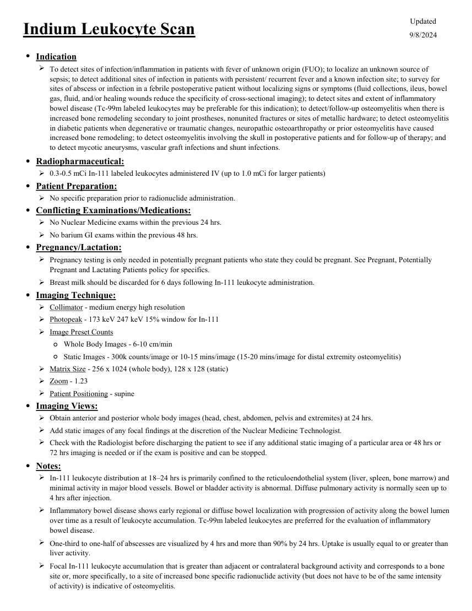
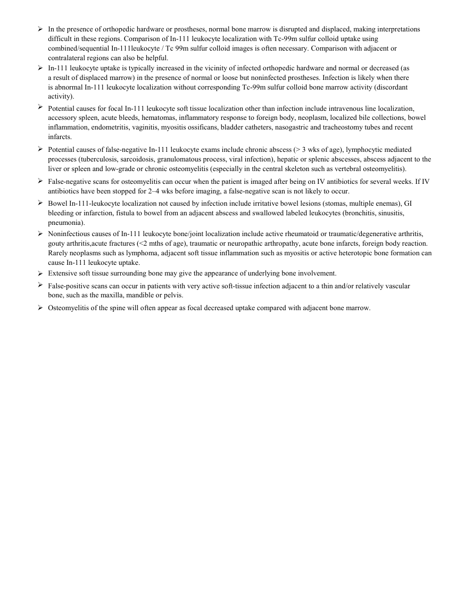

# ☢️ Scintigrafie cu Leucocite Marcate cu Indiu-111 Oxină (In-111 WBC)

<!-- mcb-modalities:start -->
## Documentul original MCB — Leucocite marcate cu indiu

**Protocol · 2 pagini · consultat la 2026-09-27.**

[Descarcă PDF-ul integral](../../assets/mcb-modalities/mn-leucocite-marcate-cu-indiu-mcb/document.pdf) · [Sursa MCB](https://ref.mcbradiology.com/Nucs/Protocols/WBC%20Indium.pdf) · [Catalogul MCB pentru această modalitate](../mcb/index.md)

Instrucțiunile, valorile și ilustrațiile din documentul original sunt păstrate în **engleză**. Titlul și navigarea sunt în română.

### Pagina 1

{ loading=lazy }

### Pagina 2

{ loading=lazy }

## Textul documentului original

??? abstract "Pagina 1 — text în engleză"

    
Updated
    Indium Leukocyte Scan
    9/8/2024
    ●Indication
    
    To detect sites of infection/inflammation in patients with fever of unknown origin (FUO); to localize an unknown source of 
    sepsis; to detect additional sites of infection in patients with persistent/ recurrent fever and a known infection site; to survey for 
    sites of abscess or infection in a febrile postoperative patient without localizing signs or symptoms (fluid collections, ileus, bowel 
    gas, fluid, and/or healing wounds reduce the specificity of cross-sectional imaging); to detect sites and extent of inflammatory 
    bowel disease (Tc-99m labeled leukocytes may be preferable for this indication); to detect/follow-up osteomyelitis when there is 
    increased bone remodeling secondary to joint prostheses, nonunited fractures or sites of metallic hardware; to detect osteomyelitis 
    in diabetic patients when degenerative or traumatic changes, neuropathic osteoarthropathy or prior osteomyelitis have caused 
    increased bone remodeling; to detect osteomyelitis involving the skull in postoperative patients and for follow-up of therapy; and 
    to detect mycotic aneurysms, vascular graft infections and shunt infections.
    ●Radiopharmaceutical:
    0.3-0.5 mCi In-111 labeled leukocytes administered IV (up to 1.0 mCi for larger patients)
    ●Patient Preparation:
    No specific preparation prior to radionuclide administration.
    ●Conflicting Examinations/Medications:
    No Nuclear Medicine exams within the previous 24 hrs.
    No barium GI exams within the previous 48 hrs.
    ●Pregnancy/Lactation:
    
    Pregnancy testing is only needed in potentially pregnant patients who state they could be pregnant. See Pregnant, Potentially 
    Pregnant and Lactating Patients policy for specifics.
    Breast milk should be discarded for 6 days following In-111 leukocyte administration.
    ●Imaging Technique:
    Collimator - medium energy high resolution
    Photopeak - 173 keV 247 keV 15% window for In-111
    Image Preset Counts
    ◦Whole Body Images - 6-10 cm/min
    ◦Static Images - 300k counts/image or 10-15 mins/image (15-20 mins/image for distal extremity osteomyelitis)
    Matrix Size - 256 x 1024 (whole body), 128 x 128 (static) 
    Zoom - 1.23
    Patient Positioning - supine
    ●Imaging Views:
    Obtain anterior and posterior whole body images (head, chest, abdomen, pelvis and extremites) at 24 hrs.
    Add static images of any focal findings at the discretion of the Nuclear Medicine Technologist.
    
    Check with the Radiologist before discharging the patient to see if any additional static imaging of a particular area or 48 hrs or 
    72 hrs imaging is needed or if the exam is positive and can be stopped.
    ●Notes:
    
    In-111 leukocyte distribution at 18–24 hrs is primarily confined to the reticuloendothelial system (liver, spleen, bone marrow) and 
    minimal activity in major blood vessels. Bowel or bladder activity is abnormal. Diffuse pulmonary activity is normally seen up to 
    4 hrs after injection.
    
    Inflammatory bowel disease shows early regional or diffuse bowel localization with progression of activity along the bowel lumen 
    over time as a result of leukocyte accumulation. Tc-99m labeled leukocytes are preferred for the evaluation of inflammatory 
    bowel disease.
    
    One-third to one-half of abscesses are visualized by 4 hrs and more than 90% by 24 hrs. Uptake is usually equal to or greater than 
    liver activity.
    
    Focal In-111 leukocyte accumulation that is greater than adjacent or contralateral background activity and corresponds to a bone 
    site or, more specifically, to a site of increased bone specific radionuclide activity (but does not have to be of the same intensity 
    of activity) is indicative of osteomyelitis.
    

??? abstract "Pagina 2 — text în engleză"

    

    In the presence of orthopedic hardware or prostheses, normal bone marrow is disrupted and displaced, making interpretations
    difficult in these regions. Comparison of In-111 leukocyte localization with Tc-99m sulfur colloid uptake using 
    combined/sequential In-111leukocyte / Tc 99m sulfur colloid images is often necessary. Comparison with adjacent or 
    contralateral regions can also be helpful.
    
    In-111 leukocyte uptake is typically increased in the vicinity of infected orthopedic hardware and normal or decreased (as
    a result of displaced marrow) in the presence of normal or loose but noninfected prostheses. Infection is likely when there
    is abnormal In-111 leukocyte localization without corresponding Tc-99m sulfur colloid bone marrow activity (discordant 
    activity).
    
    Potential causes for focal In-111 leukocyte soft tissue localization other than infection include intravenous line localization, 
    accessory spleen, acute bleeds, hematomas, inflammatory response to foreign body, neoplasm, localized bile collections, bowel 
    inflammation, endometritis, vaginitis, myositis ossificans, bladder catheters, nasogastric and tracheostomy tubes and recent
    infarcts.
    
    Potential causes of false-negative In-111 leukocyte exams include chronic abscess (&gt; 3 wks of age), lymphocytic mediated 
    processes (tuberculosis, sarcoidosis, granulomatous process, viral infection), hepatic or splenic abscesses, abscess adjacent to the 
    liver or spleen and low-grade or chronic osteomyelitis (especially in the central skeleton such as vertebral osteomyelitis).
    
    False-negative scans for osteomyelitis can occur when the patient is imaged after being on IV antibiotics for several weeks. If IV 
    antibiotics have been stopped for 2–4 wks before imaging, a false-negative scan is not likely to occur.
    
    Bowel In-111-leukocyte localization not caused by infection include irritative bowel lesions (stomas, multiple enemas), GI
    bleeding or infarction, fistula to bowel from an adjacent abscess and swallowed labeled leukocytes (bronchitis, sinusitis, 
    pneumonia).
    
    Noninfectious causes of In-111 leukocyte bone/joint localization include active rheumatoid or traumatic/degenerative arthritis, 
    gouty arthritis,acute fractures (&lt;2 mths of age), traumatic or neuropathic arthropathy, acute bone infarcts, foreign body reaction. 
    Rarely neoplasms such as lymphoma, adjacent soft tissue inflammation such as myositis or active heterotopic bone formation can 
    cause In-111 leukocyte uptake.
    Extensive soft tissue surrounding bone may give the appearance of underlying bone involvement.
    
    
    False-positive scans can occur in patients with very active soft-tissue infection adjacent to a thin and/or relatively vascular
    bone, such as the maxilla, mandible or pelvis.
    Osteomyelitis of the spine will often appear as focal decreased uptake compared with adjacent bone marrow.
    
    

<!-- mcb-modalities:end -->

## Sinteza existentă în aplicație

Protocol oficial de **Medicină Nucleară & Radiologie Nucleară** integrat conform standardelor de calitate și radiofarmacie clinică ale **MCB Radiology** și ghidurilor internaționale **SNMMI / EANM**.

  

    ☢️ MEDICINĂ NUCLEARĂ &bull; Clasa 3 (7 - 10 mSv)
  

  

    Procedură diagnostică funcțională și moleculară. Evaluarea fiziologică in vivo a metabolismului tisular utilizând radiotrasori specifici de emisie gama sau pozitroni (PET/SPECT).
  

  

    <a href="https://ref.mcbradiology.com/Nucs/Protocols/WBC%20Indium.pdf" target="_blank" rel="noopener" style="font-weight: 600; color: #a78bfa; text-decoration: none;">
      [:material-file-pdf-box: Protocol Tehnic MCB (PDF)] ➔
    </a>
    <a href="https://ref.mcbradiology.com/Nucs/Practice%20Guidelines/WBC%20Scintigraphy.pdf" target="_blank" rel="noopener" style="font-weight: 600; color: #c4b5fd; text-decoration: none;">
      [:material-file-pdf-box: Ghid de Practică Clinică (PDF)] ➔
    </a>
  

---

## 1. Indicații Clinice Majore
- Febra de origine necunoscută (FUO) și localizarea abceselor oculte intra-abdominale sau retroperitoneale
- Osteomielită cronică sau suprapusă pe schelet modificat structural
- Infecții de proteză valvulară cardiacă sau de dispozitive cardiace (stimulatoare, defibrilatoare)
- Avantaj major: absența excreției fiziologice gastrointestinale la 24 ore (contrast superior în abdomen față de Tc-99m Ceretec)

---

## 2. Radiofarmaceutic, Doză & Radioprotecție
- **Trasor administrat:** `Leucocite autologe marcate cu In-111 Oxină (11-18.5 MBq / 300-500 uCi reinjectate i.v.)`
- **Clasă de iradiere IRIS:** **Clasa 3 (7 - 10 mSv)**
- **Cale de administrare:** Intravenoasă, inhalatorie sau orală conform protocolului specific.
- **Măsuri de radioprotecție:** Hidratare abundentă post-procedură pentru favorizarea eliminării urinare a radiofarmaceuticului nefixat. Evitarea contactului prelungit cu femei gravide și copii mici timp de 24 ore.

---

## 3. Pregătirea Pacientului
Separare celulară autologă a sângelui pacientului în laborator de radiofarmacie. Reinjectare lentă strict intravenoasă.

---

## 4. Protocol Tehnic de Achiziție Imagistică
Colimator de energie medie (MEGP), fotopicuri la 171 keV și 245 keV. Achiziții planare la 18-24 ore post-injectare (opțional imagini la 4 ore) + SPECT/CT.

---

## 5. Criterii de Interpretare Diagnostică
Focar focal patologic asimetric de hiperfixare a leucocitelor la 24 ore indică focar infecțios activ.

---

## 6. Documente și Ghiduri Asociate
- [:material-file-pdf-box: Protocol Original MCB Radiology](https://ref.mcbradiology.com/Nucs/Protocols/WBC%20Indium.pdf){ target="_blank" rel="noopener" }
- [:material-file-pdf-box: Ghid de Practică Medicală SNMMI / EANM](https://ref.mcbradiology.com/Nucs/Practice%20Guidelines/WBC%20Scintigraphy.pdf){ target="_blank" rel="noopener" }
- [:material-arrow-left: Înapoi la Indexul de Medicină Nucleară](../index.md)
