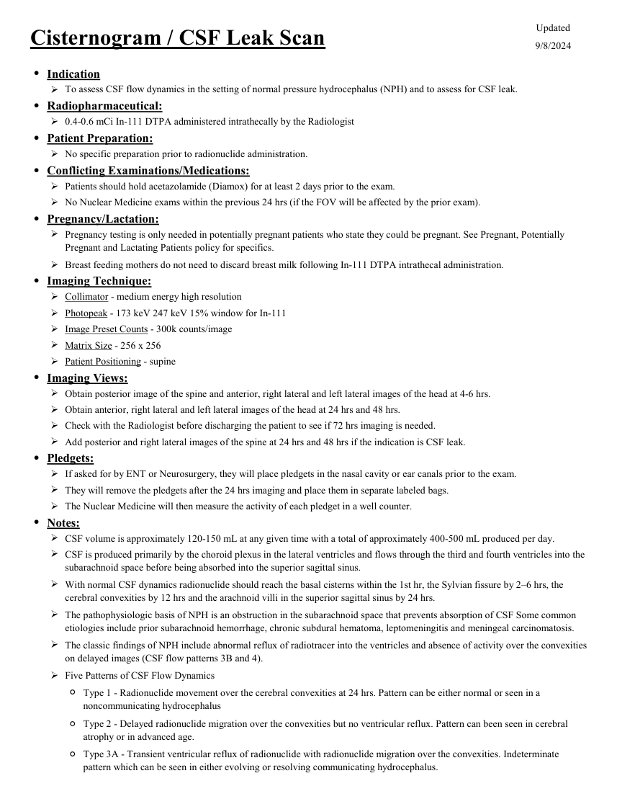
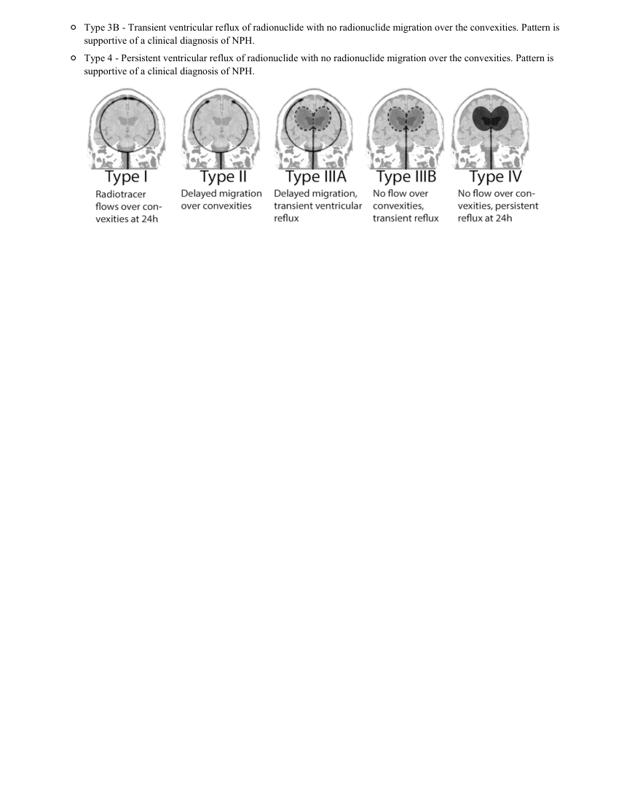

# ☢️ Cisternografie Radioizotopică pentru Fistulă de Lichid Cefalorahidian (CSF Leak)

<!-- mcb-modalities:start -->
## Documentul original MCB — Cisternografie și fistulă LCR

**Protocol · 2 pagini · consultat la 2026-09-27.**

[Descarcă PDF-ul integral](../../assets/mcb-modalities/mn-cisternografie-si-fistula-lcr-mcb/document.pdf) · [Sursa MCB](https://ref.mcbradiology.com/Nucs/Protocols/Cisternogram%20CSF%20Leak.pdf) · [Catalogul MCB pentru această modalitate](../mcb/index.md)

Instrucțiunile, valorile și ilustrațiile din documentul original sunt păstrate în **engleză**. Titlul și navigarea sunt în română.

### Pagina 1

{ loading=lazy }

### Pagina 2

{ loading=lazy }

## Textul documentului original

??? abstract "Pagina 1 — text în engleză"

    
Updated
    Cisternogram / CSF Leak Scan
    9/8/2024
    ●Indication
    To assess CSF flow dynamics in the setting of normal pressure hydrocephalus (NPH) and to assess for CSF leak.
    
    ●Radiopharmaceutical:
    0.4-0.6 mCi In-111 DTPA administered intrathecally by the Radiologist
    ●Patient Preparation:
    No specific preparation prior to radionuclide administration.
    ●Conflicting Examinations/Medications:
    Patients should hold acetazolamide (Diamox) for at least 2 days prior to the exam.
    No Nuclear Medicine exams within the previous 24 hrs (if the FOV will be affected by the prior exam).
    ●Pregnancy/Lactation:
    
    Pregnancy testing is only needed in potentially pregnant patients who state they could be pregnant. See Pregnant, Potentially 
    Pregnant and Lactating Patients policy for specifics.
    Breast feeding mothers do not need to discard breast milk following In-111 DTPA intrathecal administration.
    ●Imaging Technique:
    Collimator - medium energy high resolution
    Photopeak - 173 keV 247 keV 15% window for In-111
    Image Preset Counts - 300k counts/image
    Matrix Size - 256 x 256
    Patient Positioning - supine
    ●Imaging Views:
    Obtain posterior image of the spine and anterior, right lateral and left lateral images of the head at 4-6 hrs.
    Obtain anterior, right lateral and left lateral images of the head at 24 hrs and 48 hrs.
    Check with the Radiologist before discharging the patient to see if 72 hrs imaging is needed.
    Add posterior and right lateral images of the spine at 24 hrs and 48 hrs if the indication is CSF leak.
    ●Pledgets:
    If asked for by ENT or Neurosurgery, they will place pledgets in the nasal cavity or ear canals prior to the exam.
    They will remove the pledgets after the 24 hrs imaging and place them in separate labeled bags. 
    The Nuclear Medicine will then measure the activity of each pledget in a well counter.
    ●Notes:
    CSF volume is approximately 120-150 mL at any given time with a total of approximately 400-500 mL produced per day.
    
    CSF is produced primarily by the choroid plexus in the lateral ventricles and flows through the third and fourth ventricles into the 
    subarachnoid space before being absorbed into the superior sagittal sinus.
    
    With normal CSF dynamics radionuclide should reach the basal cisterns within the 1st hr, the Sylvian fissure by 2–6 hrs, the 
    cerebral convexities by 12 hrs and the arachnoid villi in the superior sagittal sinus by 24 hrs.
    
    The pathophysiologic basis of NPH is an obstruction in the subarachnoid space that prevents absorption of CSF Some common 
    etiologies include prior subarachnoid hemorrhage, chronic subdural hematoma, leptomeningitis and meningeal carcinomatosis.
    
    The classic findings of NPH include abnormal reflux of radiotracer into the ventricles and absence of activity over the convexities 
    on delayed images (CSF flow patterns 3B and 4).
    Five Patterns of CSF Flow Dynamics
    ◦
    Type 1 - Radionuclide movement over the cerebral convexities at 24 hrs. Pattern can be either normal or seen in a 
    noncommunicating hydrocephalus
    ◦
    Type 2 - Delayed radionuclide migration over the convexities but no ventricular reflux. Pattern can been seen in cerebral 
    atrophy or in advanced age.
    ◦
    Type 3A - Transient ventricular reflux of radionuclide with radionuclide migration over the convexities. Indeterminate 
    pattern which can be seen in either evolving or resolving communicating hydrocephalus.
    

??? abstract "Pagina 2 — text în engleză"

    
◦
    Type 3B - Transient ventricular reflux of radionuclide with no radionuclide migration over the convexities. Pattern is 
    supportive of a clinical diagnosis of NPH.
    ◦Type 4 - Persistent ventricular reflux of radionuclide with no radionuclide migration over the convexities. Pattern is 
    supportive of a clinical diagnosis of NPH.
    

<!-- mcb-modalities:end -->

## Sinteza existentă în aplicație

Protocol oficial de **Medicină Nucleară & Radiologie Nucleară** integrat conform standardelor de calitate și radiofarmacie clinică ale **MCB Radiology** și ghidurilor internaționale **SNMMI / EANM**.

  

    ☢️ MEDICINĂ NUCLEARĂ &bull; Clasa 2 (2 - 3 mSv)
  

  

    Procedură diagnostică funcțională și moleculară. Evaluarea fiziologică in vivo a metabolismului tisular utilizând radiotrasori specifici de emisie gama sau pozitroni (PET/SPECT).
  

  

    <a href="https://ref.mcbradiology.com/Nucs/Protocols/Cisternogram%20CSF%20Leak.pdf" target="_blank" rel="noopener" style="font-weight: 600; color: #a78bfa; text-decoration: none;">
      [:material-file-pdf-box: Protocol Tehnic MCB (PDF)] ➔
    </a>
    <a href="https://ref.mcbradiology.com/Nucs/Practice%20Guidelines/Cisternography.pdf" target="_blank" rel="noopener" style="font-weight: 600; color: #c4b5fd; text-decoration: none;">
      [:material-file-pdf-box: Ghid de Practică Clinică (PDF)] ➔
    </a>
  

---

## 1. Indicații Clinice Majore
- Localizarea și confirmarea fistulelor de lichid cefalorahidian (rinolicvoree sau otolicvoree post-traumatică sau post-chirurgicală)
- Diagnosticul hidrocefaliei cu presiune normală (NPH)
- Evaluarea permeabilității șunturilor ventriculo-peritoneale

---

## 2. Radiofarmaceutic, Doză & Radioprotecție
- **Trasor administrat:** `Indiu-111 DTPA (18.5-37 MBq / 0.5-1.0 mCi injectat intratecal prin puncție lombară)`
- **Clasă de iradiere IRIS:** **Clasa 2 (2 - 3 mSv)**
- **Cale de administrare:** Intravenoasă, inhalatorie sau orală conform protocolului specific.
- **Măsuri de radioprotecție:** Hidratare abundentă post-procedură pentru favorizarea eliminării urinare a radiofarmaceuticului nefixat. Evitarea contactului prelungit cu femei gravide și copii mici timp de 24 ore.

---

## 3. Pregătirea Pacientului
Puncție lombară sterilă L3-L4 efectuată de medic. Plasare de tampoane nazale/auriculare numerotate pentru contorizare radioactivă comparativă cu plasma.

---

## 4. Protocol Tehnic de Achiziție Imagistică
Injectare intratecală lentă. Imagini statice ale coloanei și capului la 4-6 ore, 24 ore și 48 ore post-injectare. Măsurarea radioactivității tampoanelor în spectrometru gama.

---

## 5. Criterii de Interpretare Diagnostică
Fistulă LCR activă: apariția unui focar anormal de radiotrasor în cavitatea nazală, sinusuri paranazale sau conduct auditiv extern, confirmat de un raport radioactivitate tampon/ser > 2-3:1.

---

## 6. Documente și Ghiduri Asociate
- [:material-file-pdf-box: Protocol Original MCB Radiology](https://ref.mcbradiology.com/Nucs/Protocols/Cisternogram%20CSF%20Leak.pdf){ target="_blank" rel="noopener" }
- [:material-file-pdf-box: Ghid de Practică Medicală SNMMI / EANM](https://ref.mcbradiology.com/Nucs/Practice%20Guidelines/Cisternography.pdf){ target="_blank" rel="noopener" }
- [:material-arrow-left: Înapoi la Indexul de Medicină Nucleară](../index.md)
