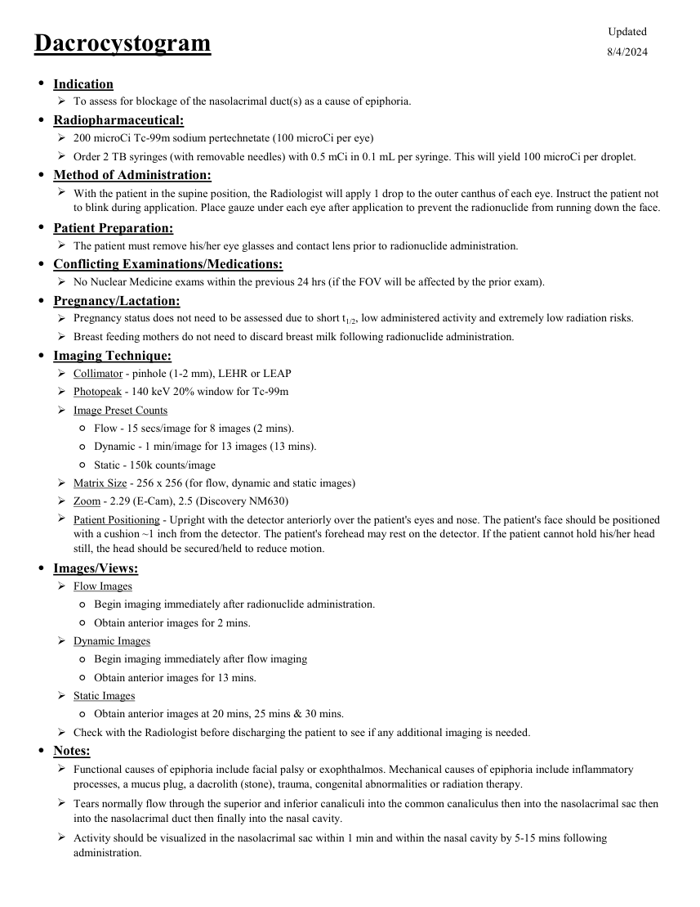

# Medicină nucleară — Dacrioscintigrafie (MCB)

## Documentul original MCB — Dacrioscintigrafie

**Protocol · 1 pagini · consultat la 2026-09-27.**

[Descarcă PDF-ul integral](../../assets/mcb-modalities/mn-dacrioscintigrafie-mcb/document.pdf) · [Sursa MCB](https://ref.mcbradiology.com/Nucs/Protocols/Dacrocystogram.pdf) · [Catalogul MCB pentru această modalitate](../mcb/index.md)

Instrucțiunile, valorile și ilustrațiile din documentul original sunt păstrate în **engleză**. Titlul și navigarea sunt în română.

### Pagina 1

{ loading=lazy }

## Textul documentului original

??? abstract "Pagina 1 — text în engleză"

    
Updated
    Dacrocystogram
    8/4/2024
    ●Indication
    To assess for blockage of the nasolacrimal duct(s) as a cause of epiphoria.
    
    ●Radiopharmaceutical:
    200 microCi Tc-99m sodium pertechnetate (100 microCi per eye)
    Order 2 TB syringes (with removable needles) with 0.5 mCi in 0.1 mL per syringe. This will yield 100 microCi per droplet.
    ●Method of Administration:
    
    With the patient in the supine position, the Radiologist will apply 1 drop to the outer canthus of each eye. Instruct the patient not 
    to blink during application. Place gauze under each eye after application to prevent the radionuclide from running down the face. 
    ●Patient Preparation:
    The patient must remove his/her eye glasses and contact lens prior to radionuclide administration.
    ●Conflicting Examinations/Medications:
    No Nuclear Medicine exams within the previous 24 hrs (if the FOV will be affected by the prior exam).
    ●Pregnancy/Lactation:
    Pregnancy status does not need to be assessed due to short t1/2, low administered activity and extremely low radiation risks.
    Breast feeding mothers do not need to discard breast milk following radionuclide administration.
    ●Imaging Technique:
    Collimator - pinhole (1-2 mm), LEHR or LEAP
    Photopeak - 140 keV 20% window for Tc-99m
    Image Preset Counts
    ◦Flow - 15 secs/image for 8 images (2 mins).
    ◦Dynamic - 1 min/image for 13 images (13 mins).
    ◦Static - 150k counts/image
    Matrix Size - 256 x 256 (for flow, dynamic and static images)
    Zoom - 2.29 (E-Cam), 2.5 (Discovery NM630)
    
    Patient Positioning - Upright with the detector anteriorly over the patient&#x27;s eyes and nose. The patient&#x27;s face should be positioned 
    with a cushion ~1 inch from the detector. The patient&#x27;s forehead may rest on the detector. If the patient cannot hold his/her head 
    still, the head should be secured/held to reduce motion.
    ●Images/Views:
    Flow Images
    ◦Begin imaging immediately after radionuclide administration.
    ◦Obtain anterior images for 2 mins.
    Dynamic Images
    ◦Begin imaging immediately after flow imaging
    ◦Obtain anterior images for 13 mins.
    Static Images
    ◦Obtain anterior images at 20 mins, 25 mins &amp; 30 mins.
    Check with the Radiologist before discharging the patient to see if any additional imaging is needed.
    ●Notes:
    
    Functional causes of epiphoria include facial palsy or exophthalmos. Mechanical causes of epiphoria include inflammatory 
    processes, a mucus plug, a dacrolith (stone), trauma, congenital abnormalities or radiation therapy.
    
    Tears normally flow through the superior and inferior canaliculi into the common canaliculus then into the nasolacrimal sac then 
    into the nasolacrimal duct then finally into the nasal cavity.
    Activity should be visualized in the nasolacrimal sac within 1 min and within the nasal cavity by 5-15 mins following 
    administration.
    

