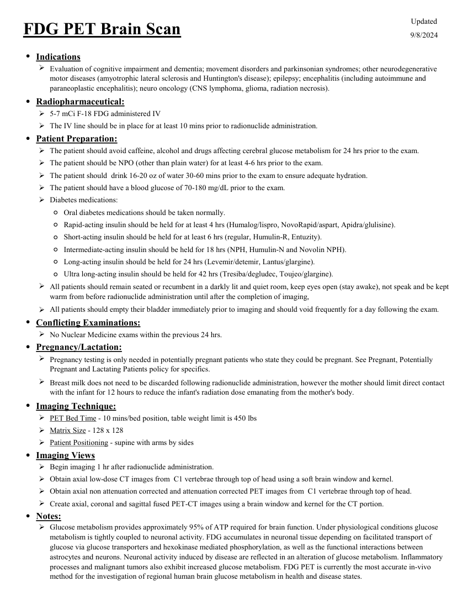
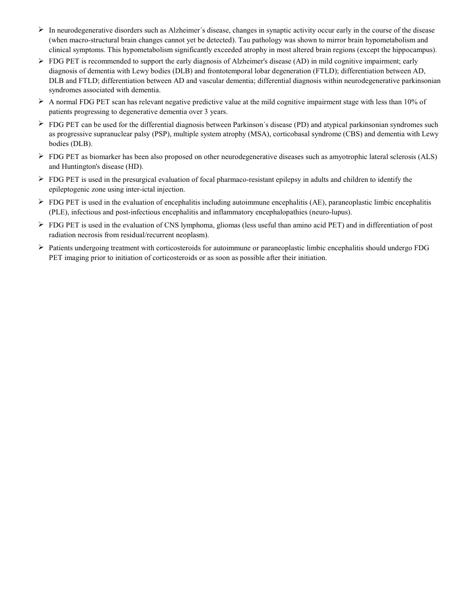

# ☢️ PET-CT Cerebral cu 18F-FDG în Neurologie (Brain Metabolism)

<!-- mcb-modalities:start -->
## Documentul original MCB — PET cerebral cu FDG

**Protocol · 2 pagini · consultat la 2026-09-27.**

[Descarcă PDF-ul integral](../../assets/mcb-modalities/mn-pet-cerebral-cu-fdg-mcb/document.pdf) · [Sursa MCB](https://ref.mcbradiology.com/Nucs/Protocols/PET%20FDG%20Brain.pdf) · [Catalogul MCB pentru această modalitate](../mcb/index.md)

Instrucțiunile, valorile și ilustrațiile din documentul original sunt păstrate în **engleză**. Titlul și navigarea sunt în română.

### Pagina 1

{ loading=lazy }

### Pagina 2

{ loading=lazy }

## Textul documentului original

??? abstract "Pagina 1 — text în engleză"

    
Updated
    FDG PET Brain Scan
    9/8/2024
    ●Indications
    
    Evaluation of cognitive impairment and dementia; movement disorders and parkinsonian syndromes; other neurodegenerative 
    motor diseases (amyotrophic lateral sclerosis and Huntington&#x27;s disease); epilepsy; encephalitis (including autoimmune and 
    paraneoplastic encephalitis); neuro oncology (CNS lymphoma, glioma, radiation necrosis).
    ●Radiopharmaceutical:
    5-7 mCi F-18 FDG administered IV
    The IV line should be in place for at least 10 mins prior to radionuclide administration.
    ●Patient Preparation:
    The patient should avoid caffeine, alcohol and drugs affecting cerebral glucose metabolism for 24 hrs prior to the exam.
    The patient should be NPO (other than plain water) for at least 4-6 hrs prior to the exam.
    The patient should  drink 16-20 oz of water 30-60 mins prior to the exam to ensure adequate hydration.
    The patient should have a blood glucose of 70-180 mg/dL prior to the exam.
    Diabetes medications:
    Ultra long-acting insulin should be held for 42 hrs (Tresiba/degludec, Toujeo/glargine).
    ◦Oral diabetes medications should be taken normally.
    ◦Rapid-acting insulin should be held for at least 4 hrs (Humalog/lispro, NovoRapid/aspart, Apidra/glulisine).
    ◦Short-acting insulin should be held for at least 6 hrs (regular, Humulin-R, Entuzity).
    ◦Intermediate-acting insulin should be held for 18 hrs (NPH, Humulin-N and Novolin NPH).
    ◦Long-acting insulin should be held for 24 hrs (Levemir/detemir, Lantus/glargine).
    ◦
    
    All patients should remain seated or recumbent in a darkly lit and quiet room, keep eyes open (stay awake), not speak and be kept 
    warm from before radionuclide administration until after the completion of imaging,
    All patients should empty their bladder immediately prior to imaging and should void frequently for a day following the exam.
    
    ●Conflicting Examinations:
    No Nuclear Medicine exams within the previous 24 hrs.
    ●Pregnancy/Lactation:
    
    Pregnancy testing is only needed in potentially pregnant patients who state they could be pregnant. See Pregnant, Potentially 
    Pregnant and Lactating Patients policy for specifics.
    
    Breast milk does not need to be discarded following radionuclide administration, however the mother should limit direct contact 
    with the infant for 12 hours to reduce the infant&#x27;s radiation dose emanating from the mother&#x27;s body.
    ●Imaging Technique:
    PET Bed Time - 10 mins/bed position, table weight limit is 450 lbs
    Matrix Size - 128 x 128
    Patient Positioning - supine with arms by sides
    ●Imaging Views
    Begin imaging 1 hr after radionuclide administration.
    Obtain axial low-dose CT images from  C1 vertebrae through top of head using a soft brain window and kernel.
    Obtain axial non attenuation corrected and attenuation corrected PET images from  C1 vertebrae through top of head.
    Create axial, coronal and sagittal fused PET-CT images using a brain window and kernel for the CT portion.
    ●Notes:
    
    Glucose metabolism provides approximately 95% of ATP required for brain function. Under physiological conditions glucose 
    metabolism is tightly coupled to neuronal activity. FDG accumulates in neuronal tissue depending on facilitated transport of 
    glucose via glucose transporters and hexokinase mediated phosphorylation, as well as the functional interactions between 
    astrocytes and neurons. Neuronal activity induced by disease are reflected in an alteration of glucose metabolism. Inflammatory 
    processes and malignant tumors also exhibit increased glucose metabolism. FDG PET is currently the most accurate in-vivo 
    method for the investigation of regional human brain glucose metabolism in health and disease states.
    

??? abstract "Pagina 2 — text în engleză"

    

    In neurodegenerative disorders such as Alzheimer´s disease, changes in synaptic activity occur early in the course of the disease 
    (when macro-structural brain changes cannot yet be detected). Tau pathology was shown to mirror brain hypometabolism and 
    clinical symptoms. This hypometabolism significantly exceeded atrophy in most altered brain regions (except the hippocampus).
    
    FDG PET is recommended to support the early diagnosis of Alzheimer&#x27;s disease (AD) in mild cognitive impairment; early 
    diagnosis of dementia with Lewy bodies (DLB) and frontotemporal lobar degeneration (FTLD); differentiation between AD, 
    DLB and FTLD; differentiation between AD and vascular dementia; differential diagnosis within neurodegenerative parkinsonian 
    syndromes associated with dementia.
    
    A normal FDG PET scan has relevant negative predictive value at the mild cognitive impairment stage with less than 10% of 
    patients progressing to degenerative dementia over 3 years.
    
    FDG PET can be used for the differential diagnosis between Parkinson´s disease (PD) and atypical parkinsonian syndromes such 
    as progressive supranuclear palsy (PSP), multiple system atrophy (MSA), corticobasal syndrome (CBS) and dementia with Lewy 
    bodies (DLB).
    
    FDG PET as biomarker has been also proposed on other neurodegenerative diseases such as amyotrophic lateral sclerosis (ALS) 
    and Huntington&#x27;s disease (HD).
    
    FDG PET is used in the presurgical evaluation of focal pharmaco-resistant epilepsy in adults and children to identify the 
    epileptogenic zone using inter-ictal injection.
    
    FDG PET is used in the evaluation of encephalitis including autoimmune encephalitis (AE), paraneoplastic limbic encephalitis 
    (PLE), infectious and post-infectious encephalitis and inflammatory encephalopathies (neuro-lupus).
    
    FDG PET is used in the evaluation of CNS lymphoma, gliomas (less useful than amino acid PET) and in differentiation of post 
    radiation necrosis from residual/recurrent neoplasm).
    
    Patients undergoing treatment with corticosteroids for autoimmune or paraneoplastic limbic encephalitis should undergo FDG 
    PET imaging prior to initiation of corticosteroids or as soon as possible after their initiation.
    

<!-- mcb-modalities:end -->

## Sinteza existentă în aplicație

Protocol oficial de **Medicină Nucleară & Radiologie Nucleară** integrat conform standardelor de calitate și radiofarmacie clinică ale **MCB Radiology** și ghidurilor internaționale **SNMMI / EANM**.

  

    ☢️ MEDICINĂ NUCLEARĂ &bull; Clasa 2 (5 - 7 mSv)
  

  

    Procedură diagnostică funcțională și moleculară. Evaluarea fiziologică in vivo a metabolismului tisular utilizând radiotrasori specifici de emisie gama sau pozitroni (PET/SPECT).
  

  

    <a href="https://ref.mcbradiology.com/Nucs/Protocols/PET%20FDG%20Brain.pdf" target="_blank" rel="noopener" style="font-weight: 600; color: #a78bfa; text-decoration: none;">
      [:material-file-pdf-box: Protocol Tehnic MCB (PDF)] ➔
    </a>
    <a href="https://ref.mcbradiology.com/Nucs/Practice%20Guidelines/FDG%20PET%20Brain.pdf" target="_blank" rel="noopener" style="font-weight: 600; color: #c4b5fd; text-decoration: none;">
      [:material-file-pdf-box: Ghid de Practică Clinică (PDF)] ➔
    </a>
  

---

## 1. Indicații Clinice Majore
- Localizarea focarului epileptogen interictal în epilepsia refractară farmacologic în vederea rezecției chirurgicale
- Diferențierea bolilor neurodegenerative: Demență Alzheimer (hipometabolism temporo-parietal posterior și cingular posterior) vs. Demență Fronto-Temporală vs. Demență cu Corpi Lewy
- Diferențierea recidivei tumorale cerebrale de radionecroza post-radioterapie

---

## 2. Radiofarmaceutic, Doză & Radioprotecție
- **Trasor administrat:** `Fluor-18 Fluordeoxiglucoză (18F-FDG, 185-370 MBq / 5-10 mCi i.v.)`
- **Clasă de iradiere IRIS:** **Clasa 2 (5 - 7 mSv)**
- **Cale de administrare:** Intravenoasă, inhalatorie sau orală conform protocolului specific.
- **Măsuri de radioprotecție:** Hidratare abundentă post-procedură pentru favorizarea eliminării urinare a radiofarmaceuticului nefixat. Evitarea contactului prelungit cu femei gravide și copii mici timp de 24 ore.

---

## 3. Pregătirea Pacientului
Post alimentar strict minim 4-6 ore. Glicemie < 150 mg/dL. Cameră de injectare liniștită, întunecată, fără stimuli vizuali sau auditivi timp de 30-45 minute post-injectare.

---

## 4. Protocol Tehnic de Achiziție Imagistică
Timp de biodistribuție: 45 minute. Scanare dedicată a extremității cefalice (10-15 minute PET 3D de înaltă rezoluție + CT pentru corecție de atenuare).

---

## 5. Criterii de Interpretare Diagnostică
Cartografiere metabolică a consumului regional de glucoză. Focar epileptogen interictal: zonă focală de hipometabolism. Boala Alzheimer: hipometabolism bilateral simetric/asimetric în cortexul temporo-parietal și precuneus.

---

## 6. Documente și Ghiduri Asociate
- [:material-file-pdf-box: Protocol Original MCB Radiology](https://ref.mcbradiology.com/Nucs/Protocols/PET%20FDG%20Brain.pdf){ target="_blank" rel="noopener" }
- [:material-file-pdf-box: Ghid de Practică Medicală SNMMI / EANM](https://ref.mcbradiology.com/Nucs/Practice%20Guidelines/FDG%20PET%20Brain.pdf){ target="_blank" rel="noopener" }
- [:material-arrow-left: Înapoi la Indexul de Medicină Nucleară](../index.md)
