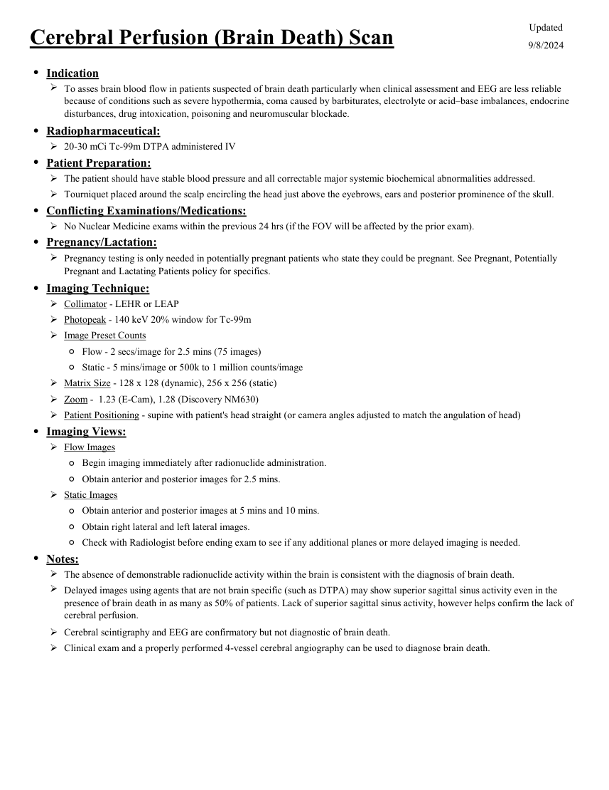

# ☢️ Scintigrafie de Perfuzie Cerebrală pentru Confirmarea Morții Cerebrale

<!-- mcb-modalities:start -->
## Documentul original MCB — Evaluarea morții cerebrale

**Protocol · 1 pagini · consultat la 2026-09-27.**

[Descarcă PDF-ul integral](../../assets/mcb-modalities/mn-evaluarea-mortii-cerebrale-mcb/document.pdf) · [Sursa MCB](https://ref.mcbradiology.com/Nucs/Protocols/Brain%20Death.pdf) · [Catalogul MCB pentru această modalitate](../mcb/index.md)

Instrucțiunile, valorile și ilustrațiile din documentul original sunt păstrate în **engleză**. Titlul și navigarea sunt în română.

### Pagina 1

{ loading=lazy }

## Textul documentului original

??? abstract "Pagina 1 — text în engleză"

    
Updated
    Cerebral Perfusion (Brain Death) Scan
    9/8/2024
    ●Indication
    
    To asses brain blood flow in patients suspected of brain death particularly when clinical assessment and EEG are less reliable
    because of conditions such as severe hypothermia, coma caused by barbiturates, electrolyte or acid–base imbalances, endocrine 
    disturbances, drug intoxication, poisoning and neuromuscular blockade.
    ●Radiopharmaceutical:
    20-30 mCi Tc-99m DTPA administered IV
    ●Patient Preparation:
    The patient should have stable blood pressure and all correctable major systemic biochemical abnormalities addressed.
    Tourniquet placed around the scalp encircling the head just above the eyebrows, ears and posterior prominence of the skull.
    ●Conflicting Examinations/Medications:
    No Nuclear Medicine exams within the previous 24 hrs (if the FOV will be affected by the prior exam).
    ●Pregnancy/Lactation:
    
    Pregnancy testing is only needed in potentially pregnant patients who state they could be pregnant. See Pregnant, Potentially 
    Pregnant and Lactating Patients policy for specifics.
    ●Imaging Technique:
    Collimator - LEHR or LEAP 
    Photopeak - 140 keV 20% window for Tc-99m 
    Image Preset Counts
    ◦Flow - 2 secs/image for 2.5 mins (75 images)
    ◦Static - 5 mins/image or 500k to 1 million counts/image
    Matrix Size - 128 x 128 (dynamic), 256 x 256 (static)
    Zoom -  1.23 (E-Cam), 1.28 (Discovery NM630)
    Patient Positioning - supine with patient&#x27;s head straight (or camera angles adjusted to match the angulation of head)
    ●Imaging Views:
    Flow Images
    ◦Begin imaging immediately after radionuclide administration.
    ◦Obtain anterior and posterior images for 2.5 mins.
    Static Images
    ◦Obtain anterior and posterior images at 5 mins and 10 mins.
    ◦Obtain right lateral and left lateral images.
    ◦Check with Radiologist before ending exam to see if any additional planes or more delayed imaging is needed.
    ●Notes:
    The absence of demonstrable radionuclide activity within the brain is consistent with the diagnosis of brain death.
    
    Delayed images using agents that are not brain specific (such as DTPA) may show superior sagittal sinus activity even in the 
    presence of brain death in as many as 50% of patients. Lack of superior sagittal sinus activity, however helps confirm the lack of 
    cerebral perfusion.
    Cerebral scintigraphy and EEG are confirmatory but not diagnostic of brain death.
    Clinical exam and a properly performed 4-vessel cerebral angiography can be used to diagnose brain death.
    

<!-- mcb-modalities:end -->

## Sinteza existentă în aplicație

Protocol oficial de **Medicină Nucleară & Radiologie Nucleară** integrat conform standardelor de calitate și radiofarmacie clinică ale **MCB Radiology** și ghidurilor internaționale **SNMMI / EANM**.

  

    ☢️ MEDICINĂ NUCLEARĂ &bull; Clasa 2 (4 - 5 mSv)
  

  

    Procedură diagnostică funcțională și moleculară. Evaluarea fiziologică in vivo a metabolismului tisular utilizând radiotrasori specifici de emisie gama sau pozitroni (PET/SPECT).
  

  

    <a href="https://ref.mcbradiology.com/Nucs/Protocols/Brain%20Death.pdf" target="_blank" rel="noopener" style="font-weight: 600; color: #a78bfa; text-decoration: none;">
      [:material-file-pdf-box: Protocol Tehnic MCB (PDF)] ➔
    </a>
    <a href="https://ref.mcbradiology.com/Nucs/Practice%20Guidelines/Brain%20Death%20Scintigraphy.pdf" target="_blank" rel="noopener" style="font-weight: 600; color: #c4b5fd; text-decoration: none;">
      [:material-file-pdf-box: Ghid de Practică Clinică (PDF)] ➔
    </a>
  

---

## 1. Indicații Clinice Majore
- Test paraclinic instrumental de confirmare a morții cerebrale conform legislației de transplant
- Situații clinice în care examenul neurologic nu poate fi evaluat concludent (hipotermie terapeutică, comă barbiturică indusă, leziuni faciale majore)

---

## 2. Radiofarmaceutic, Doză & Radioprotecție
- **Trasor administrat:** `Tc-99m HMPAO (Exametazimă) sau Tc-99m ECD (Bicisat) (740-1110 MBq / 20-30 mCi i.v.)`
- **Clasă de iradiere IRIS:** **Clasa 2 (4 - 5 mSv)**
- **Cale de administrare:** Intravenoasă, inhalatorie sau orală conform protocolului specific.
- **Măsuri de radioprotecție:** Hidratare abundentă post-procedură pentru favorizarea eliminării urinare a radiofarmaceuticului nefixat. Evitarea contactului prelungit cu femei gravide și copii mici timp de 24 ore.

---

## 3. Pregătirea Pacientului
Trusă radiofarmaceutică preparată proaspăt cu verificare a purității radiochimice > 90%. Acces venos periferic larg permeabil.

---

## 4. Protocol Tehnic de Achiziție Imagistică
Faza 1 (Angiografie de flux): 1 cadru/secundă timp de 60 secunde anterior cap/gât. Faza 2 (Statică parenchimatoasă): imagini statice la 15-30 minute în proiecții anterioară, posterioară și laterale.

---

## 5. Criterii de Interpretare Diagnostică
Moarte cerebrală: absența completă a fluxului arterial intracranian pe arterele carotide interne și absența fixării parenchimatoase în emisfere și trunchi cerebral (semnul „hollow skull” / craniu vid). Prezența fluxului în carotida externă cu persistarea captării faciale / nazale (semnul „hot nose”).

---

## 6. Documente și Ghiduri Asociate
- [:material-file-pdf-box: Protocol Original MCB Radiology](https://ref.mcbradiology.com/Nucs/Protocols/Brain%20Death.pdf){ target="_blank" rel="noopener" }
- [:material-file-pdf-box: Ghid de Practică Medicală SNMMI / EANM](https://ref.mcbradiology.com/Nucs/Practice%20Guidelines/Brain%20Death%20Scintigraphy.pdf){ target="_blank" rel="noopener" }
- [:material-arrow-left: Înapoi la Indexul de Medicină Nucleară](../index.md)
