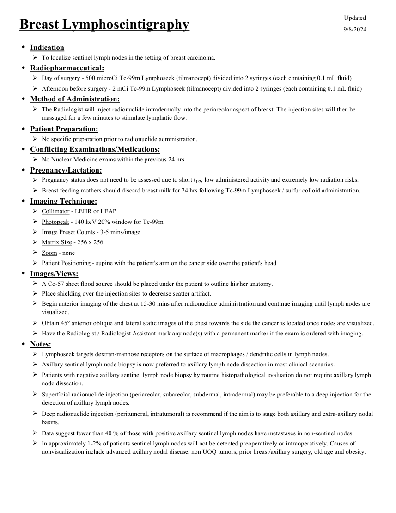

# ☢️ Limfoscintigrafie pentru Detecția Ganglionului Santinelă Mamar (SLND)

<!-- mcb-modalities:start -->
## Documentul original MCB — Limfoscintigrafie mamară

**Protocol · 1 pagini · consultat la 2026-09-27.**

[Descarcă PDF-ul integral](../../assets/mcb-modalities/mn-limfoscintigrafie-mamara-mcb/document.pdf) · [Sursa MCB](https://ref.mcbradiology.com/Nucs/Protocols/Lympho%20Breast.pdf) · [Catalogul MCB pentru această modalitate](../mcb/index.md)

Instrucțiunile, valorile și ilustrațiile din documentul original sunt păstrate în **engleză**. Titlul și navigarea sunt în română.

### Pagina 1

{ loading=lazy }

## Textul documentului original

??? abstract "Pagina 1 — text în engleză"

    
Updated
    Breast Lymphoscintigraphy
    9/8/2024
    ●Indication
    To localize sentinel lymph nodes in the setting of breast carcinoma.
    ●Radiopharmaceutical:
    Day of surgery - 500 microCi Tc-99m Lymphoseek (tilmanocept) divided into 2 syringes (each containing 0.1 mL fluid)
    Afternoon before surgery - 2 mCi Tc-99m Lymphoseek (tilmanocept) divided into 2 syringes (each containing 0.1 mL fluid)
    ●Method of Administration:
    
    The Radiologist will inject radionuclide intradermally into the periareolar aspect of breast. The injection sites will then be 
    massaged for a few minutes to stimulate lymphatic flow.
    ●Patient Preparation:
    No specific preparation prior to radionuclide administration.
    ●Conflicting Examinations/Medications:
    No Nuclear Medicine exams within the previous 24 hrs.
    ●Pregnancy/Lactation:
    Pregnancy status does not need to be assessed due to short t1/2, low administered activity and extremely low radiation risks.
    Breast feeding mothers should discard breast milk for 24 hrs following Tc-99m Lymphoseek / sulfur colloid administration.
    ●Imaging Technique:
    Collimator - LEHR or LEAP
    Photopeak - 140 keV 20% window for Tc-99m
    Image Preset Counts - 3-5 mins/image
    Matrix Size - 256 x 256
    Zoom - none
    Patient Positioning - supine with the patient&#x27;s arm on the cancer side over the patient&#x27;s head
    ●Images/Views:
    A Co-57 sheet flood source should be placed under the patient to outline his/her anatomy.
    Place shielding over the injection sites to decrease scatter artifact.
    
    Begin anterior imaging of the chest at 15-30 mins after radionuclide administration and continue imaging until lymph nodes are 
    visualized.
    Obtain 45° anterior oblique and lateral static images of the chest towards the side the cancer is located once nodes are visualized.
    Have the Radiologist / Radiologist Assistant mark any node(s) with a permanent marker if the exam is ordered with imaging.
    ●Notes:
    Lymphoseek targets dextran-mannose receptors on the surface of macrophages / dendritic cells in lymph nodes.
    Axillary sentinel lymph node biopsy is now preferred to axillary lymph node dissection in most clinical scenarios.
    
    Patients with negative axillary sentinel lymph node biopsy by routine histopathological evaluation do not require axillary lymph 
    node dissection.
    
    Superficial radionuclide injection (periareolar, subareolar, subdermal, intradermal) may be preferable to a deep injection for the 
    detection of axillary lymph nodes.
    
    Deep radionuclide injection (peritumoral, intratumoral) is recommend if the aim is to stage both axillary and extra-axillary nodal 
    basins.
    Data suggest fewer than 40 % of those with positive axillary sentinel lymph nodes have metastases in non-sentinel nodes.
    
    In approximately 1-2% of patients sentinel lymph nodes will not be detected preoperatively or intraoperatively. Causes of 
    nonvisualization include advanced axillary nodal disease, non UOQ tumors, prior breast/axillary surgery, old age and obesity.
    

<!-- mcb-modalities:end -->

## Sinteza existentă în aplicație

Protocol oficial de **Medicină Nucleară & Radiologie Nucleară** integrat conform standardelor de calitate și radiofarmacie clinică ale **MCB Radiology** și ghidurilor internaționale **SNMMI / EANM**.

  

    ☢️ MEDICINĂ NUCLEARĂ &bull; Clasa 1 (< 1 mSv)
  

  

    Procedură diagnostică funcțională și moleculară. Evaluarea fiziologică in vivo a metabolismului tisular utilizând radiotrasori specifici de emisie gama sau pozitroni (PET/SPECT).
  

  

    <a href="https://ref.mcbradiology.com/Nucs/Protocols/Lympho%20Breast.pdf" target="_blank" rel="noopener" style="font-weight: 600; color: #a78bfa; text-decoration: none;">
      [:material-file-pdf-box: Protocol Tehnic MCB (PDF)] ➔
    </a>
    <a href="https://ref.mcbradiology.com/Nucs/Practice%20Guidelines/Lymphoscintigraphy%20Breast.pdf" target="_blank" rel="noopener" style="font-weight: 600; color: #c4b5fd; text-decoration: none;">
      [:material-file-pdf-box: Ghid de Practică Clinică (PDF)] ➔
    </a>
  

---

## 1. Indicații Clinice Majore
- Identificarea primului releu ganglionar limfatic (ganglion santinelă) la paciente cu cancer mamar stadiul incipient (T1-T2, N0 clinic)
- Ghidarea biopsiei minim invazive intraoperatorii pentru evitarea limfadenectomiei axilare complete inutile

---

## 2. Radiofarmaceutic, Doză & Radioprotecție
- **Trasor administrat:** `Tc-99m Tilmanocept (Lymphoseek) sau Tc-99m Nanocoloid de Albumină filtrat (18.5-37 MBq / 0.5-1.0 mCi)`
- **Clasă de iradiere IRIS:** **Clasa 1 (< 1 mSv)**
- **Cale de administrare:** Intravenoasă, inhalatorie sau orală conform protocolului specific.
- **Măsuri de radioprotecție:** Hidratare abundentă post-procedură pentru favorizarea eliminării urinare a radiofarmaceuticului nefixat. Evitarea contactului prelungit cu femei gravide și copii mici timp de 24 ore.

---

## 3. Pregătirea Pacientului
Fără pregătire specială. Procedură efectuată în dimineața intervenției sau în după-amiaza precedentă (protocol 2 zile).

---

## 4. Protocol Tehnic de Achiziție Imagistică
Injectare intradermică periareolară sau peritumorală subareolară în 2-4 cadrane (volum 0.1-0.2 mL/depozit) urmată de masaj blând 3-5 min. Imagini planare anterioare și oblice la 15-45 min + reperaj cutanat cu marker radioactiv și cerneală chirurgicală.

---

## 5. Criterii de Interpretare Diagnostică
Migrare rapidă pe vasele limfatice axilare către 1-2 ganglioni santinelă. Detectare acustică intraoperatorie cu gamma-probe chirurgical.

---

## 6. Documente și Ghiduri Asociate
- [:material-file-pdf-box: Protocol Original MCB Radiology](https://ref.mcbradiology.com/Nucs/Protocols/Lympho%20Breast.pdf){ target="_blank" rel="noopener" }
- [:material-file-pdf-box: Ghid de Practică Medicală SNMMI / EANM](https://ref.mcbradiology.com/Nucs/Practice%20Guidelines/Lymphoscintigraphy%20Breast.pdf){ target="_blank" rel="noopener" }
- [:material-arrow-left: Înapoi la Indexul de Medicină Nucleară](../index.md)
