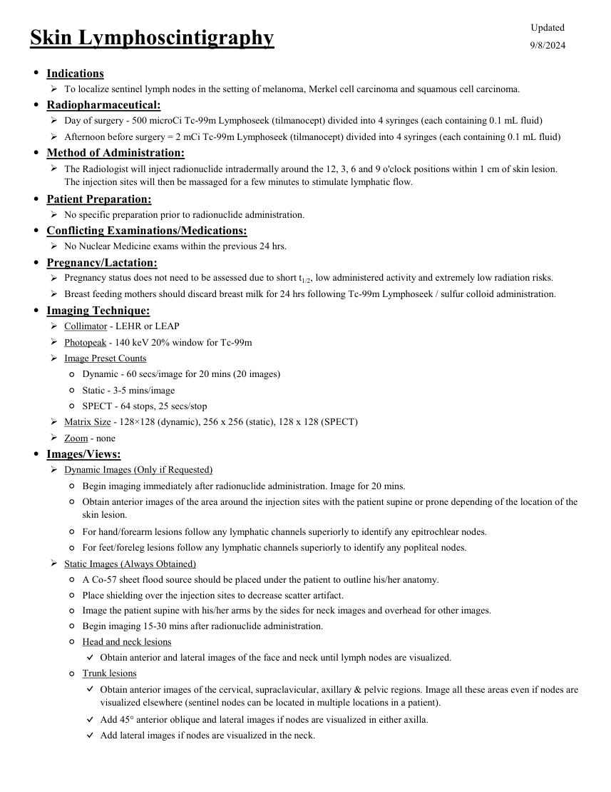
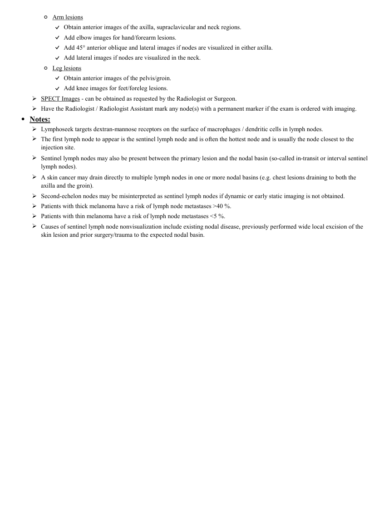

# ☢️ Limfoscintigrafie Cutanată pentru Ganglionul Santinelă în Melanom Malign

<!-- mcb-modalities:start -->
## Documentul original MCB — Limfoscintigrafie cutanată

**Protocol · 2 pagini · consultat la 2026-09-27.**

[Descarcă PDF-ul integral](../../assets/mcb-modalities/mn-limfoscintigrafie-cutanata-mcb/document.pdf) · [Sursa MCB](https://ref.mcbradiology.com/Nucs/Protocols/Lympho%20Skin.pdf) · [Catalogul MCB pentru această modalitate](../mcb/index.md)

Instrucțiunile, valorile și ilustrațiile din documentul original sunt păstrate în **engleză**. Titlul și navigarea sunt în română.

### Pagina 1

{ loading=lazy }

### Pagina 2

{ loading=lazy }

## Textul documentului original

??? abstract "Pagina 1 — text în engleză"

    
Updated
    Skin Lymphoscintigraphy
    9/8/2024
    ●Indications
    To localize sentinel lymph nodes in the setting of melanoma, Merkel cell carcinoma and squamous cell carcinoma.
    ●Radiopharmaceutical:
    Day of surgery - 500 microCi Tc-99m Lymphoseek (tilmanocept) divided into 4 syringes (each containing 0.1 mL fluid)
    Afternoon before surgery = 2 mCi Tc-99m Lymphoseek (tilmanocept) divided into 4 syringes (each containing 0.1 mL fluid)
    ●Method of Administration:
    
    The Radiologist will inject radionuclide intradermally around the 12, 3, 6 and 9 o&#x27;clock positions within 1 cm of skin lesion.                      
    The injection sites will then be massaged for a few minutes to stimulate lymphatic flow.
    ●Patient Preparation:
    No specific preparation prior to radionuclide administration.
    ●Conflicting Examinations/Medications:
    No Nuclear Medicine exams within the previous 24 hrs.
    ●Pregnancy/Lactation:
    Pregnancy status does not need to be assessed due to short t1/2, low administered activity and extremely low radiation risks.
    Breast feeding mothers should discard breast milk for 24 hrs following Tc-99m Lymphoseek / sulfur colloid administration.
    ●Imaging Technique:
    Collimator - LEHR or LEAP
    Photopeak - 140 keV 20% window for Tc-99m
    Image Preset Counts
    ◦Dynamic - 60 secs/image for 20 mins (20 images)
    ◦Static - 3-5 mins/image
    ◦SPECT - 64 stops, 25 secs/stop
    Matrix Size - 128×128 (dynamic), 256 x 256 (static), 128 x 128 (SPECT)
    Zoom - none
    ●Images/Views:
    Dynamic Images (Only if Requested)
    ◦Begin imaging immediately after radionuclide administration. Image for 20 mins.
    ◦
    Obtain anterior images of the area around the injection sites with the patient supine or prone depending of the location of the 
    skin lesion.
    ◦For hand/forearm lesions follow any lymphatic channels superiorly to identify any epitrochlear nodes.
    ◦For feet/foreleg lesions follow any lymphatic channels superiorly to identify any popliteal nodes.
    Static Images (Always Obtained)
    ◦A Co-57 sheet flood source should be placed under the patient to outline his/her anatomy.
    ◦Place shielding over the injection sites to decrease scatter artifact.
    ◦Image the patient supine with his/her arms by the sides for neck images and overhead for other images.
    ◦Begin imaging 15-30 mins after radionuclide administration.
    ◦Head and neck lesions
    ✓Obtain anterior and lateral images of the face and neck until lymph nodes are visualized.
    ◦Trunk lesions
    ✓
    Obtain anterior images of the cervical, supraclavicular, axillary &amp; pelvic regions. Image all these areas even if nodes are 
    visualized elsewhere (sentinel nodes can be located in multiple locations in a patient).
    ✓Add 45° anterior oblique and lateral images if nodes are visualized in either axilla.
    ✓Add lateral images if nodes are visualized in the neck.
    

??? abstract "Pagina 2 — text în engleză"

    
◦Arm lesions
    ✓Obtain anterior images of the axilla, supraclavicular and neck regions. 
    ✓Add elbow images for hand/forearm lesions.
    ✓Add 45° anterior oblique and lateral images if nodes are visualized in either axilla.
    ✓Add lateral images if nodes are visualized in the neck.
    ◦Leg lesions
    ✓Obtain anterior images of the pelvis/groin. 
    ✓Add knee images for feet/foreleg lesions.
    SPECT Images - can be obtained as requested by the Radiologist or Surgeon.
    Have the Radiologist / Radiologist Assistant mark any node(s) with a permanent marker if the exam is ordered with imaging.
    ●Notes:
    Lymphoseek targets dextran-mannose receptors on the surface of macrophages / dendritic cells in lymph nodes.
    
    The first lymph node to appear is the sentinel lymph node and is often the hottest node and is usually the node closest to the 
    injection site.
    
    Sentinel lymph nodes may also be present between the primary lesion and the nodal basin (so-called in-transit or interval sentinel 
    lymph nodes).
    
    A skin cancer may drain directly to multiple lymph nodes in one or more nodal basins (e.g. chest lesions draining to both the 
    axilla and the groin).
    Second-echelon nodes may be misinterpreted as sentinel lymph nodes if dynamic or early static imaging is not obtained.
    Patients with thick melanoma have a risk of lymph node metastases &gt;40 %.
    Patients with thin melanoma have a risk of lymph node metastases &lt;5 %.
    
    Causes of sentinel lymph node nonvisualization include existing nodal disease, previously performed wide local excision of the 
    skin lesion and prior surgery/trauma to the expected nodal basin.
    

<!-- mcb-modalities:end -->

## Sinteza existentă în aplicație

Protocol oficial de **Medicină Nucleară & Radiologie Nucleară** integrat conform standardelor de calitate și radiofarmacie clinică ale **MCB Radiology** și ghidurilor internaționale **SNMMI / EANM**.

  

    ☢️ MEDICINĂ NUCLEARĂ &bull; Clasa 1 (< 1 mSv)
  

  

    Procedură diagnostică funcțională și moleculară. Evaluarea fiziologică in vivo a metabolismului tisular utilizând radiotrasori specifici de emisie gama sau pozitroni (PET/SPECT).
  

  

    <a href="https://ref.mcbradiology.com/Nucs/Protocols/Lympho%20Skin.pdf" target="_blank" rel="noopener" style="font-weight: 600; color: #a78bfa; text-decoration: none;">
      [:material-file-pdf-box: Protocol Tehnic MCB (PDF)] ➔
    </a>
    <a href="https://ref.mcbradiology.com/Nucs/Practice%20Guidelines/Lymphoscintigraphy%20Melanoma.pdf" target="_blank" rel="noopener" style="font-weight: 600; color: #c4b5fd; text-decoration: none;">
      [:material-file-pdf-box: Ghid de Practică Clinică (PDF)] ➔
    </a>
  

---

## 1. Indicații Clinice Majore
- Identificarea bazinului limfatic de drenaj și a primului releu ganglionar (ganglion santinelă) în melanomul malign cu grosime Breslow > 0.8 mm sau cu factori de risc histologic (ulcerație, mitoze)
- Determinarea drenajului limfatic imprevizibil (melanoame de trunchi, cap și gât ce pot drena în multiple bazine limfatice)
- Reperaj cutanat preoperator pentru biopsie țintită

---

## 2. Radiofarmaceutic, Doză & Radioprotecție
- **Trasor administrat:** `Tc-99m Tilmanocept (Lymphoseek) sau Nanocoloid de Albumină filtrat (18.5-37 MBq / 0.5-1.0 mCi)`
- **Clasă de iradiere IRIS:** **Clasa 1 (< 1 mSv)**
- **Cale de administrare:** Intravenoasă, inhalatorie sau orală conform protocolului specific.
- **Măsuri de radioprotecție:** Hidratare abundentă post-procedură pentru favorizarea eliminării urinare a radiofarmaceuticului nefixat. Evitarea contactului prelungit cu femei gravide și copii mici timp de 24 ore.

---

## 3. Pregătirea Pacientului
Fără pregătire specială. Se realizează în ziua intervenției chirurgicale.

---

## 4. Protocol Tehnic de Achiziție Imagistică
Injectare strict intradermică a 4 micro-depozite (0.1 mL fiecare) în jurul leziunii primare sau cicatricii de biopsie. Achiziție dinamică imediată la camera gama timp de 15-30 minute pentru vizualizarea canalelor limfatice, urmată de imagini statice și marcare cutanată a ganglionilor calzi.

---

## 5. Criterii de Interpretare Diagnostică
Identificarea precisă a tuturor ganglionilor limfatici care primesc drenaj direct din leziune și ghidarea exciziei cu sondă gamma intraoperatorie.

---

## 6. Documente și Ghiduri Asociate
- [:material-file-pdf-box: Protocol Original MCB Radiology](https://ref.mcbradiology.com/Nucs/Protocols/Lympho%20Skin.pdf){ target="_blank" rel="noopener" }
- [:material-file-pdf-box: Ghid de Practică Medicală SNMMI / EANM](https://ref.mcbradiology.com/Nucs/Practice%20Guidelines/Lymphoscintigraphy%20Melanoma.pdf){ target="_blank" rel="noopener" }
- [:material-arrow-left: Înapoi la Indexul de Medicină Nucleară](../index.md)
