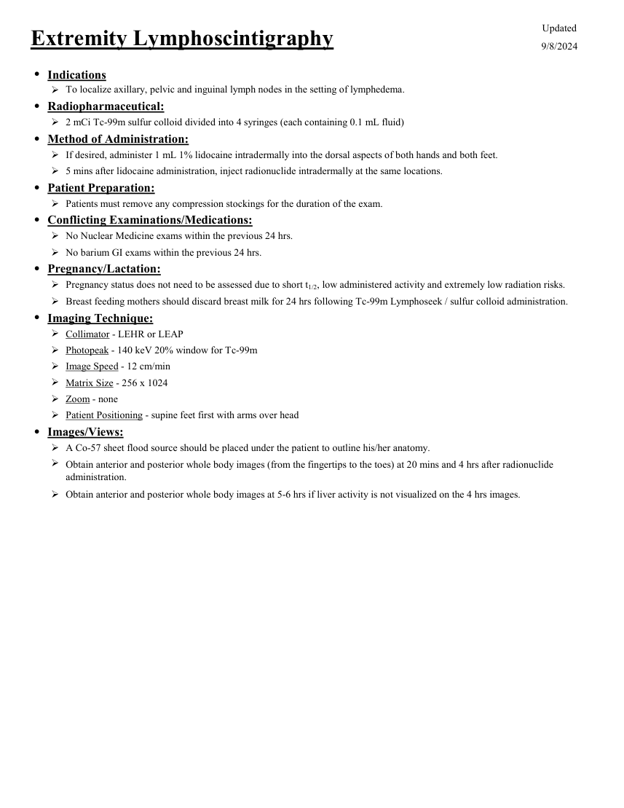

# Medicină nucleară — Limfoscintigrafie extremități (MCB)

## Documentul original MCB — Limfoscintigrafie extremități

**Protocol · 1 pagini · consultat la 2026-09-27.**

[Descarcă PDF-ul integral](../../assets/mcb-modalities/mn-limfoscintigrafie-extremitati-mcb/document.pdf) · [Sursa MCB](https://ref.mcbradiology.com/Nucs/Protocols/Lympho%20Extremity.pdf) · [Catalogul MCB pentru această modalitate](../mcb/index.md)

Instrucțiunile, valorile și ilustrațiile din documentul original sunt păstrate în **engleză**. Titlul și navigarea sunt în română.

### Pagina 1

{ loading=lazy }

## Textul documentului original

??? abstract "Pagina 1 — text în engleză"

    
Updated
    Extremity Lymphoscintigraphy
    9/8/2024
    ●Indications
    To localize axillary, pelvic and inguinal lymph nodes in the setting of lymphedema.
    
    ●Radiopharmaceutical:
    2 mCi Tc-99m sulfur colloid divided into 4 syringes (each containing 0.1 mL fluid)
    ●Method of Administration:
    If desired, administer 1 mL 1% lidocaine intradermally into the dorsal aspects of both hands and both feet.
    5 mins after lidocaine administration, inject radionuclide intradermally at the same locations.
    ●Patient Preparation:
    Patients must remove any compression stockings for the duration of the exam.
    ●Conflicting Examinations/Medications:
    No Nuclear Medicine exams within the previous 24 hrs.
    No barium GI exams within the previous 24 hrs.
    ●Pregnancy/Lactation:
    Pregnancy status does not need to be assessed due to short t1/2, low administered activity and extremely low radiation risks.
    Breast feeding mothers should discard breast milk for 24 hrs following Tc-99m Lymphoseek / sulfur colloid administration.
    ●Imaging Technique:
    Collimator - LEHR or LEAP
    Photopeak - 140 keV 20% window for Tc-99m
    Image Speed - 12 cm/min
    Matrix Size - 256 x 1024
    Zoom - none
    Patient Positioning - supine feet first with arms over head
    ●Images/Views:
    A Co-57 sheet flood source should be placed under the patient to outline his/her anatomy.
    
    Obtain anterior and posterior whole body images (from the fingertips to the toes) at 20 mins and 4 hrs after radionuclide 
    administration.
    Obtain anterior and posterior whole body images at 5-6 hrs if liver activity is not visualized on the 4 hrs images.
    

