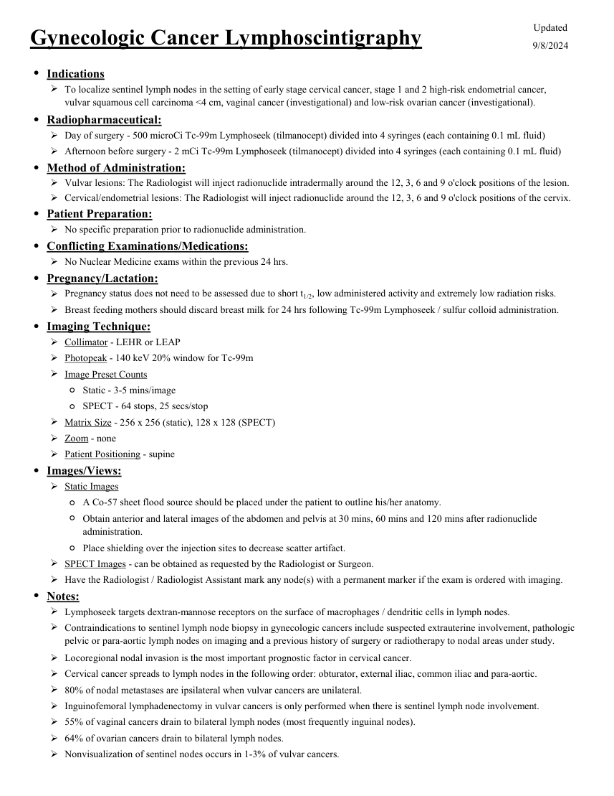

# Medicină nucleară — Limfoscintigrafie ginecologică (MCB)

## Documentul original MCB — Limfoscintigrafie ginecologică

**Protocol · 2 pagini · consultat la 2026-09-27.**

[Descarcă PDF-ul integral](../../assets/mcb-modalities/mn-limfoscintigrafie-ginecologica-mcb/document.pdf) · [Sursa MCB](https://ref.mcbradiology.com/Nucs/Protocols/Lympho%20Gynecologic.pdf) · [Catalogul MCB pentru această modalitate](../mcb/index.md)

Instrucțiunile, valorile și ilustrațiile din documentul original sunt păstrate în **engleză**. Titlul și navigarea sunt în română.

### Pagina 1

{ loading=lazy }

### Pagina 2

{ loading=lazy }

## Textul documentului original

??? abstract "Pagina 1 — text în engleză"

    
Updated
    Gynecologic Cancer Lymphoscintigraphy
    9/8/2024
    ●Indications
    
    To localize sentinel lymph nodes in the setting of early stage cervical cancer, stage 1 and 2 high-risk endometrial cancer,                           
    vulvar squamous cell carcinoma &lt;4 cm, vaginal cancer (investigational) and low-risk ovarian cancer (investigational).
    ●Radiopharmaceutical:
    Day of surgery - 500 microCi Tc-99m Lymphoseek (tilmanocept) divided into 4 syringes (each containing 0.1 mL fluid)
    Afternoon before surgery - 2 mCi Tc-99m Lymphoseek (tilmanocept) divided into 4 syringes (each containing 0.1 mL fluid)
    ●Method of Administration:
    Cervical/endometrial lesions: The Radiologist will inject radionuclide around the 12, 3, 6 and 9 o&#x27;clock positions of the cervix. 
    Vulvar lesions: The Radiologist will inject radionuclide intradermally around the 12, 3, 6 and 9 o&#x27;clock positions of the lesion.  
    
    ●Patient Preparation:
    No specific preparation prior to radionuclide administration.
    ●Conflicting Examinations/Medications:
    No Nuclear Medicine exams within the previous 24 hrs.
    ●Pregnancy/Lactation:
    Pregnancy status does not need to be assessed due to short t1/2, low administered activity and extremely low radiation risks.
    Breast feeding mothers should discard breast milk for 24 hrs following Tc-99m Lymphoseek / sulfur colloid administration.
    ●Imaging Technique:
    Collimator - LEHR or LEAP
    Photopeak - 140 keV 20% window for Tc-99m
    Image Preset Counts
    ◦Static - 3-5 mins/image
    ◦SPECT - 64 stops, 25 secs/stop
    Matrix Size - 256 x 256 (static), 128 x 128 (SPECT)
    Zoom - none
    Patient Positioning - supine
    ●Images/Views:
    Static Images
    ◦A Co-57 sheet flood source should be placed under the patient to outline his/her anatomy.
    ◦
    Obtain anterior and lateral images of the abdomen and pelvis at 30 mins, 60 mins and 120 mins after radionuclide 
    administration.
    ◦Place shielding over the injection sites to decrease scatter artifact.
    SPECT Images - can be obtained as requested by the Radiologist or Surgeon.
    Have the Radiologist / Radiologist Assistant mark any node(s) with a permanent marker if the exam is ordered with imaging.
    ●Notes:
    Lymphoseek targets dextran-mannose receptors on the surface of macrophages / dendritic cells in lymph nodes.
    
    Contraindications to sentinel lymph node biopsy in gynecologic cancers include suspected extrauterine involvement, pathologic 
    pelvic or para-aortic lymph nodes on imaging and a previous history of surgery or radiotherapy to nodal areas under study.
    Locoregional nodal invasion is the most important prognostic factor in cervical cancer.
    Cervical cancer spreads to lymph nodes in the following order: obturator, external iliac, common iliac and para-aortic.
    80% of nodal metastases are ipsilateral when vulvar cancers are unilateral.
    Inguinofemoral lymphadenectomy in vulvar cancers is only performed when there is sentinel lymph node involvement.
    55% of vaginal cancers drain to bilateral lymph nodes (most frequently inguinal nodes). 
    64% of ovarian cancers drain to bilateral lymph nodes.
    Nonvisualization of sentinel nodes occurs in 1-3% of vulvar cancers.
    

??? abstract "Pagina 2 — text în engleză"

    
Nonvisualization of sentinel nodes occurs in 10-15% of cervical and endometrial cancers.
    

