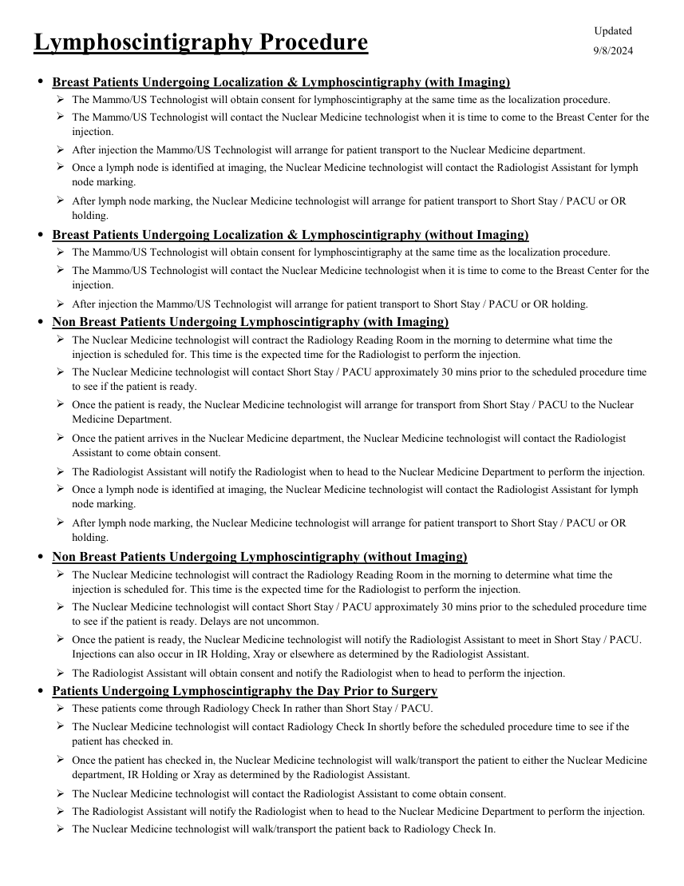
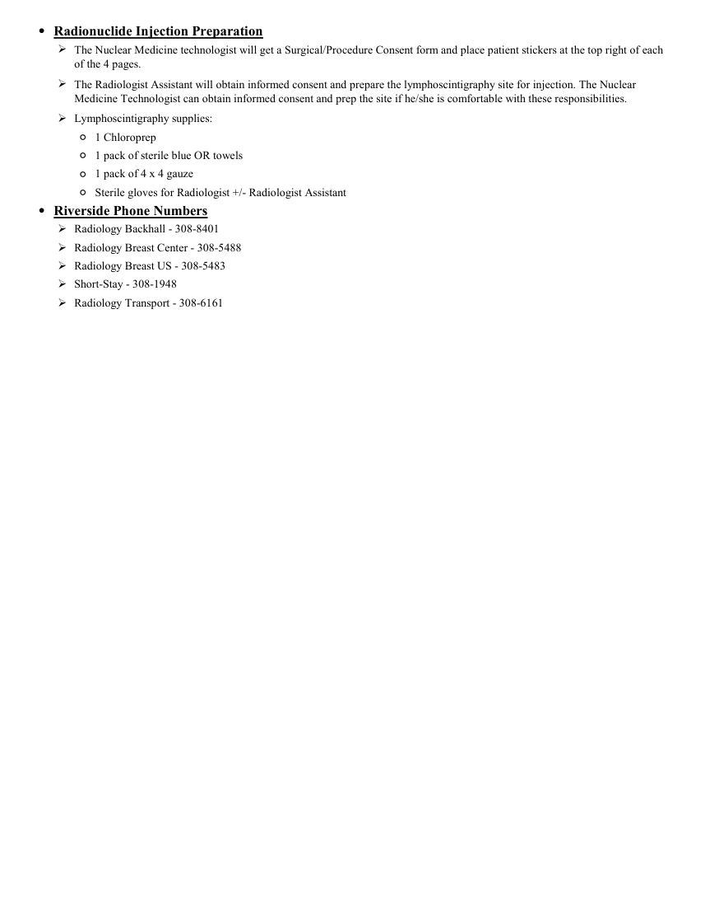

# Medicină nucleară — Procedură de limfoscintigrafie (MCB)

## Documentul original MCB — Procedură de limfoscintigrafie

**Protocol · 2 pagini · consultat la 2026-09-27.**

[Descarcă PDF-ul integral](../../assets/mcb-modalities/mn-procedura-de-limfoscintigrafie-mcb/document.pdf) · [Sursa MCB](https://ref.mcbradiology.com/Nucs/Protocols/Lympho%20Procedure.pdf) · [Catalogul MCB pentru această modalitate](../mcb/index.md)

Instrucțiunile, valorile și ilustrațiile din documentul original sunt păstrate în **engleză**. Titlul și navigarea sunt în română.

### Pagina 1

{ loading=lazy }

### Pagina 2

{ loading=lazy }

## Textul documentului original

??? abstract "Pagina 1 — text în engleză"

    
Updated
    Lymphoscintigraphy Procedure
    9/8/2024
    ●Breast Patients Undergoing Localization &amp; Lymphoscintigraphy (with Imaging)
    The Mammo/US Technologist will obtain consent for lymphoscintigraphy at the same time as the localization procedure.
    
    The Mammo/US Technologist will contact the Nuclear Medicine technologist when it is time to come to the Breast Center for the 
    injection.
    After injection the Mammo/US Technologist will arrange for patient transport to the Nuclear Medicine department.
    
    
    Once a lymph node is identified at imaging, the Nuclear Medicine technologist will contact the Radiologist Assistant for lymph 
    node marking.
    
    After lymph node marking, the Nuclear Medicine technologist will arrange for patient transport to Short Stay / PACU or OR 
    holding.
    ●Breast Patients Undergoing Localization &amp; Lymphoscintigraphy (without Imaging)
    The Mammo/US Technologist will obtain consent for lymphoscintigraphy at the same time as the localization procedure.
    
    The Mammo/US Technologist will contact the Nuclear Medicine technologist when it is time to come to the Breast Center for the 
    injection.
    After injection the Mammo/US Technologist will arrange for patient transport to Short Stay / PACU or OR holding.
    ●Non Breast Patients Undergoing Lymphoscintigraphy (with Imaging)
    
    The Nuclear Medicine technologist will contract the Radiology Reading Room in the morning to determine what time the 
    injection is scheduled for. This time is the expected time for the Radiologist to perform the injection.
    
    The Nuclear Medicine technologist will contact Short Stay / PACU approximately 30 mins prior to the scheduled procedure time 
    to see if the patient is ready.
    
    Once the patient is ready, the Nuclear Medicine technologist will arrange for transport from Short Stay / PACU to the Nuclear 
    Medicine Department.
    
    Once the patient arrives in the Nuclear Medicine department, the Nuclear Medicine technologist will contact the Radiologist 
    Assistant to come obtain consent.
    The Radiologist Assistant will notify the Radiologist when to head to the Nuclear Medicine Department to perform the injection.
    
    Once a lymph node is identified at imaging, the Nuclear Medicine technologist will contact the Radiologist Assistant for lymph 
    node marking.
    
    After lymph node marking, the Nuclear Medicine technologist will arrange for patient transport to Short Stay / PACU or OR 
    holding.
    ●Non Breast Patients Undergoing Lymphoscintigraphy (without Imaging)
    
    The Nuclear Medicine technologist will contract the Radiology Reading Room in the morning to determine what time the 
    injection is scheduled for. This time is the expected time for the Radiologist to perform the injection.
    
    The Nuclear Medicine technologist will contact Short Stay / PACU approximately 30 mins prior to the scheduled procedure time 
    to see if the patient is ready. Delays are not uncommon.
    
    Once the patient is ready, the Nuclear Medicine technologist will notify the Radiologist Assistant to meet in Short Stay / PACU. 
    Injections can also occur in IR Holding, Xray or elsewhere as determined by the Radiologist Assistant.
    The Radiologist Assistant will obtain consent and notify the Radiologist when to head to perform the injection.
    ●Patients Undergoing Lymphoscintigraphy the Day Prior to Surgery
    These patients come through Radiology Check In rather than Short Stay / PACU.
    
    The Nuclear Medicine technologist will contact Radiology Check In shortly before the scheduled procedure time to see if the 
    patient has checked in.
    
    Once the patient has checked in, the Nuclear Medicine technologist will walk/transport the patient to either the Nuclear Medicine 
    department, IR Holding or Xray as determined by the Radiologist Assistant.
    The Nuclear Medicine technologist will contact the Radiologist Assistant to come obtain consent.
    The Radiologist Assistant will notify the Radiologist when to head to the Nuclear Medicine Department to perform the injection.
    The Nuclear Medicine technologist will walk/transport the patient back to Radiology Check In.
    

??? abstract "Pagina 2 — text în engleză"

    
●Radionuclide Injection Preparation
    
    The Nuclear Medicine technologist will get a Surgical/Procedure Consent form and place patient stickers at the top right of each 
    of the 4 pages.
    
    The Radiologist Assistant will obtain informed consent and prepare the lymphoscintigraphy site for injection. The Nuclear 
    Medicine Technologist can obtain informed consent and prep the site if he/she is comfortable with these responsibilities.
    Lymphoscintigraphy supplies:
    ◦1 Chloroprep
    ◦1 pack of sterile blue OR towels
    ◦1 pack of 4 x 4 gauze
    ◦Sterile gloves for Radiologist +/- Radiologist Assistant
    ●Riverside Phone Numbers
    Radiology Backhall - 308-8401
    Radiology Breast Center - 308-5488
    Radiology Breast US - 308-5483
    Short-Stay - 308-1948
    Radiology Transport - 308-6161
    

