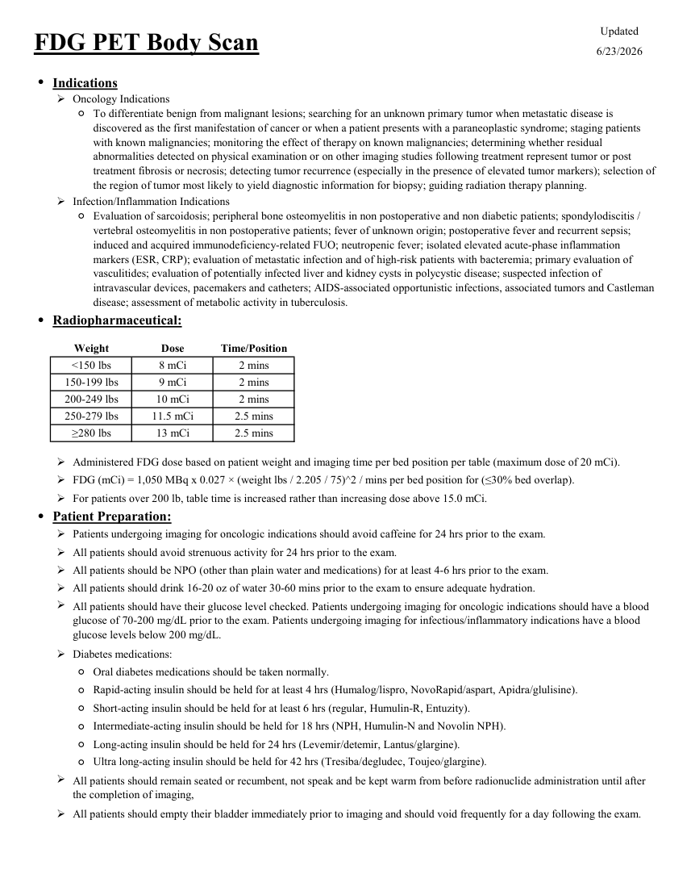
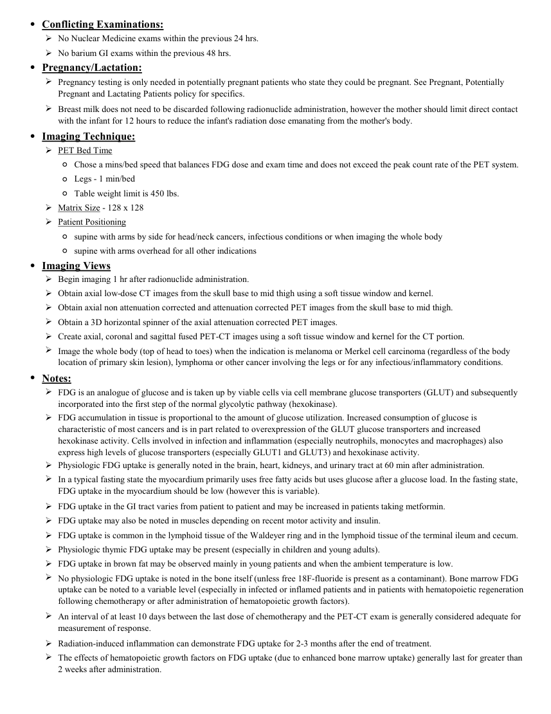
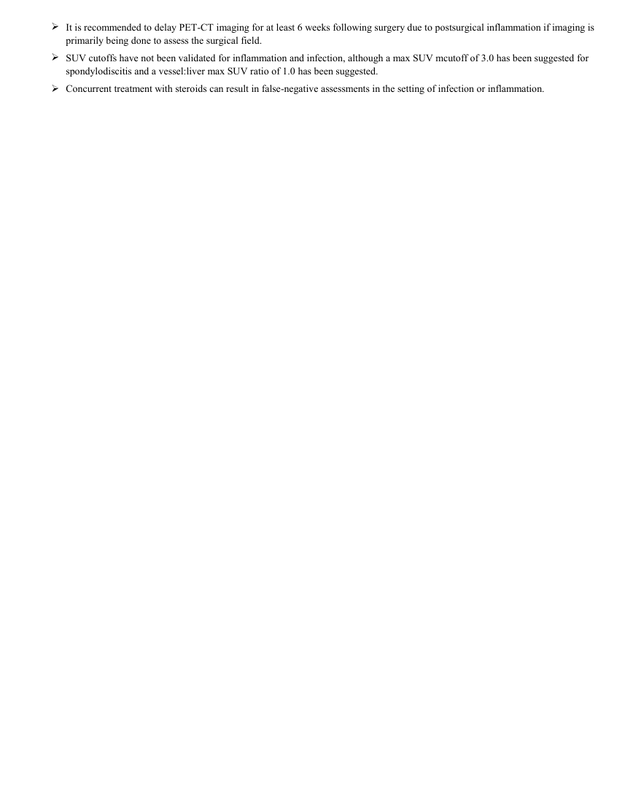

# ☢️ PET-CT cu 18F-FDG în Oncologie (Whole Body Tumor Imaging)

<!-- mcb-modalities:start -->
## Documentul original MCB — PET corporal cu FDG

**Protocol · 3 pagini · consultat la 2026-09-27.**

[Descarcă PDF-ul integral](../../assets/mcb-modalities/mn-pet-corporal-cu-fdg-mcb/document.pdf) · [Sursa MCB](https://ref.mcbradiology.com/Nucs/Protocols/PET%20FDG%20Body.pdf) · [Catalogul MCB pentru această modalitate](../mcb/index.md)

Instrucțiunile, valorile și ilustrațiile din documentul original sunt păstrate în **engleză**. Titlul și navigarea sunt în română.

### Pagina 1

{ loading=lazy }

### Pagina 2

{ loading=lazy }

### Pagina 3

{ loading=lazy }

## Textul documentului original

??? abstract "Pagina 1 — text în engleză"

    
Updated
    FDG PET Body Scan
    6/23/2026
    ●Indications
    Oncology Indications
    ◦
    To differentiate benign from malignant lesions; searching for an unknown primary tumor when metastatic disease is 
    discovered as the first manifestation of cancer or when a patient presents with a paraneoplastic syndrome; staging patients 
    with known malignancies; monitoring the effect of therapy on known malignancies; determining whether residual 
    abnormalities detected on physical examination or on other imaging studies following treatment represent tumor or post 
    treatment fibrosis or necrosis; detecting tumor recurrence (especially in the presence of elevated tumor markers); selection of 
    the region of tumor most likely to yield diagnostic information for biopsy; guiding radiation therapy planning.
    Infection/Inflammation Indications
    ◦
    Evaluation of sarcoidosis; peripheral bone osteomyelitis in non postoperative and non diabetic patients; spondylodiscitis / 
    vertebral osteomyelitis in non postoperative patients; fever of unknown origin; postoperative fever and recurrent sepsis; 
    induced and acquired immunodeficiency-related FUO; neutropenic fever; isolated elevated acute-phase inflammation 
    markers (ESR, CRP); evaluation of metastatic infection and of high-risk patients with bacteremia; primary evaluation of 
    vasculitides; evaluation of potentially infected liver and kidney cysts in polycystic disease; suspected infection of 
    intravascular devices, pacemakers and catheters; AIDS-associated opportunistic infections, associated tumors and Castleman 
    disease; assessment of metabolic activity in tuberculosis.
    ●Radiopharmaceutical:
    Weight
    Dose
    Time/Position
    2 mins
    &lt;150 lbs
    8 mCi
    2 mins
    150-199 lbs
    9 mCi
    200-249 lbs
    10 mCi
    2 mins
    250-279 lbs
    11.5 mCi
    2.5 mins
    13 mCi
    ≥280 lbs
    2.5 mins
    Administered FDG dose based on patient weight and imaging time per bed position per table (maximum dose of 20 mCi).
    FDG (mCi) = 1,050 MBq x 0.027 × (weight lbs / 2.205 / 75)^2 / mins per bed position for (≤30% bed overlap).
    For patients over 200 lb, table time is increased rather than increasing dose above 15.0 mCi.
    ●Patient Preparation:
    Patients undergoing imaging for oncologic indications should avoid caffeine for 24 hrs prior to the exam.
    All patients should avoid strenuous activity for 24 hrs prior to the exam.
    All patients should be NPO (other than plain water and medications) for at least 4-6 hrs prior to the exam.
    All patients should drink 16-20 oz of water 30-60 mins prior to the exam to ensure adequate hydration.
    
    All patients should have their glucose level checked. Patients undergoing imaging for oncologic indications should have a blood 
    glucose of 70-200 mg/dL prior to the exam. Patients undergoing imaging for infectious/inflammatory indications have a blood 
    glucose levels below 200 mg/dL.
    Diabetes medications:
    Ultra long-acting insulin should be held for 42 hrs (Tresiba/degludec, Toujeo/glargine).
    ◦Oral diabetes medications should be taken normally.
    ◦Rapid-acting insulin should be held for at least 4 hrs (Humalog/lispro, NovoRapid/aspart, Apidra/glulisine).
    ◦Short-acting insulin should be held for at least 6 hrs (regular, Humulin-R, Entuzity).
    ◦Intermediate-acting insulin should be held for 18 hrs (NPH, Humulin-N and Novolin NPH).
    ◦Long-acting insulin should be held for 24 hrs (Levemir/detemir, Lantus/glargine).
    ◦
    
    All patients should remain seated or recumbent, not speak and be kept warm from before radionuclide administration until after 
    the completion of imaging,
    All patients should empty their bladder immediately prior to imaging and should void frequently for a day following the exam.
    
    

??? abstract "Pagina 2 — text în engleză"

    
●Conflicting Examinations:
    No Nuclear Medicine exams within the previous 24 hrs.
    No barium GI exams within the previous 48 hrs.
    ●Pregnancy/Lactation:
    
    Pregnancy testing is only needed in potentially pregnant patients who state they could be pregnant. See Pregnant, Potentially 
    Pregnant and Lactating Patients policy for specifics.
    
    Breast milk does not need to be discarded following radionuclide administration, however the mother should limit direct contact 
    with the infant for 12 hours to reduce the infant&#x27;s radiation dose emanating from the mother&#x27;s body.
    ●Imaging Technique:
    PET Bed Time
    ◦Chose a mins/bed speed that balances FDG dose and exam time and does not exceed the peak count rate of the PET system.
    ◦Legs - 1 min/bed
    ◦Table weight limit is 450 lbs.
    Matrix Size - 128 x 128
    Patient Positioning
    ◦supine with arms by side for head/neck cancers, infectious conditions or when imaging the whole body
    ◦supine with arms overhead for all other indications
    ●Imaging Views
    Begin imaging 1 hr after radionuclide administration.
    Obtain axial low-dose CT images from the skull base to mid thigh using a soft tissue window and kernel.
    Obtain axial non attenuation corrected and attenuation corrected PET images from the skull base to mid thigh.
    Obtain a 3D horizontal spinner of the axial attenuation corrected PET images.
    Create axial, coronal and sagittal fused PET-CT images using a soft tissue window and kernel for the CT portion.
    
    Image the whole body (top of head to toes) when the indication is melanoma or Merkel cell carcinoma (regardless of the body 
    location of primary skin lesion), lymphoma or other cancer involving the legs or for any infectious/inflammatory conditions.
    ●Notes:
    
    FDG is an analogue of glucose and is taken up by viable cells via cell membrane glucose transporters (GLUT) and subsequently 
    incorporated into the first step of the normal glycolytic pathway (hexokinase).
    
    FDG accumulation in tissue is proportional to the amount of glucose utilization. Increased consumption of glucose is 
    characteristic of most cancers and is in part related to overexpression of the GLUT glucose transporters and increased
    hexokinase activity. Cells involved in infection and inflammation (especially neutrophils, monocytes and macrophages) also 
    express high levels of glucose transporters (especially GLUT1 and GLUT3) and hexokinase activity.
    Physiologic FDG uptake is generally noted in the brain, heart, kidneys, and urinary tract at 60 min after administration.
    
    In a typical fasting state the myocardium primarily uses free fatty acids but uses glucose after a glucose load. In the fasting state, 
    FDG uptake in the myocardium should be low (however this is variable).
    FDG uptake in the GI tract varies from patient to patient and may be increased in patients taking metformin.
    FDG uptake may also be noted in muscles depending on recent motor activity and insulin.
    FDG uptake is common in the lymphoid tissue of the Waldeyer ring and in the lymphoid tissue of the terminal ileum and cecum.
    Physiologic thymic FDG uptake may be present (especially in children and young adults).
    FDG uptake in brown fat may be observed mainly in young patients and when the ambient temperature is low.
    
    No physiologic FDG uptake is noted in the bone itself (unless free 18F-fluoride is present as a contaminant). Bone marrow FDG 
    uptake can be noted to a variable level (especially in infected or inflamed patients and in patients with hematopoietic regeneration 
    following chemotherapy or after administration of hematopoietic growth factors).
    
    An interval of at least 10 days between the last dose of chemotherapy and the PET-CT exam is generally considered adequate for 
    measurement of response.
    Radiation-induced inflammation can demonstrate FDG uptake for 2-3 months after the end of treatment.
    
    The effects of hematopoietic growth factors on FDG uptake (due to enhanced bone marrow uptake) generally last for greater than 
    2 weeks after administration.
    

??? abstract "Pagina 3 — text în engleză"

    

    It is recommended to delay PET-CT imaging for at least 6 weeks following surgery due to postsurgical inflammation if imaging is 
    primarily being done to assess the surgical field.
    
    SUV cutoffs have not been validated for inflammation and infection, although a max SUV mcutoff of 3.0 has been suggested for 
    spondylodiscitis and a vessel:liver max SUV ratio of 1.0 has been suggested.
    Concurrent treatment with steroids can result in false-negative assessments in the setting of infection or inflammation.
    

<!-- mcb-modalities:end -->

## Sinteza existentă în aplicație

Protocol oficial de **Medicină Nucleară & Radiologie Nucleară** integrat conform standardelor de calitate și radiofarmacie clinică ale **MCB Radiology** și ghidurilor internaționale **SNMMI / EANM**.

  

    ☢️ MEDICINĂ NUCLEARĂ &bull; Clasa 3 (7 - 12 mSv)
  

  

    Procedură diagnostică funcțională și moleculară. Evaluarea fiziologică in vivo a metabolismului tisular utilizând radiotrasori specifici de emisie gama sau pozitroni (PET/SPECT).
  

  

    <a href="https://ref.mcbradiology.com/Nucs/Protocols/PET%20FDG%20Body.pdf" target="_blank" rel="noopener" style="font-weight: 600; color: #a78bfa; text-decoration: none;">
      [:material-file-pdf-box: Protocol Tehnic MCB (PDF)] ➔
    </a>
    <a href="https://ref.mcbradiology.com/Nucs/Practice%20Guidelines/FDG%20PET%20for%20Tumor%20Imaging.pdf" target="_blank" rel="noopener" style="font-weight: 600; color: #c4b5fd; text-decoration: none;">
      [:material-file-pdf-box: Ghid de Practică Clinică (PDF)] ➔
    </a>
  

---

## 1. Indicații Clinice Majore
- Stadializarea inițială, restadializarea și evaluarea eficienței terapeutice (chimioterapie, radioterapie, imunoterapie) în limfoame, cancer bronhopulmonar, cancer colo-rectal, melanom, cancere ORL, esofagiene etc.
- Detectarea recidivelor tumorale la pacienți cu markeri tumorali serici în creștere și imagistică convențională negativă
- Caracterizarea nodulului pulmonar solitar > 8 mm

---

## 2. Radiofarmaceutic, Doză & Radioprotecție
- **Trasor administrat:** `Fluor-18 Fluordeoxiglucoză (18F-FDG, 185-370 MBq / 5-10 mCi i.v. calculat la 3.7-5.2 MBq/kg)`
- **Clasă de iradiere IRIS:** **Clasa 3 (7 - 12 mSv)**
- **Cale de administrare:** Intravenoasă, inhalatorie sau orală conform protocolului specific.
- **Măsuri de radioprotecție:** Hidratare abundentă post-procedură pentru favorizarea eliminării urinare a radiofarmaceuticului nefixat. Evitarea contactului prelungit cu femei gravide și copii mici timp de 24 ore.

---

## 3. Pregătirea Pacientului
Post alimentar strict de minim 6 ore. Hidratare cu apă plată (fără zahăr). Glicemie < 150-180 mg/dL înainte de injectare. Repaus fizic absolut și mediu cald timp de 60 min post-injectare pentru prevenirea captării în mușchi și grăsimea brună.

---

## 4. Protocol Tehnic de Achiziție Imagistică
Timp de biodistribuție: 60 ± 10 minute în cameră de liniște. Scanare hibridă PET-CT de la vertex până la jumătatea coapselor (sau din creștet până în tălpi pentru melanom), combinând CT cu doză joasă pentru corecție de atenuare și localizare anatomică cu achiziție 3D PET (1.5 - 3 min/pat).

---

## 5. Criterii de Interpretare Diagnostică
Calculul valorii standardizate a captării (SUVmax). Zone de hipermetabolism glucidic suspecte oncologic corelate cu leziunile anatomice CT. Criterii RECIST / PERCIST pentru răspuns terapeutic.

---

## 6. Documente și Ghiduri Asociate
- [:material-file-pdf-box: Protocol Original MCB Radiology](https://ref.mcbradiology.com/Nucs/Protocols/PET%20FDG%20Body.pdf){ target="_blank" rel="noopener" }
- [:material-file-pdf-box: Ghid de Practică Medicală SNMMI / EANM](https://ref.mcbradiology.com/Nucs/Practice%20Guidelines/FDG%20PET%20for%20Tumor%20Imaging.pdf){ target="_blank" rel="noopener" }
- [:material-arrow-left: Înapoi la Indexul de Medicină Nucleară](../index.md)
