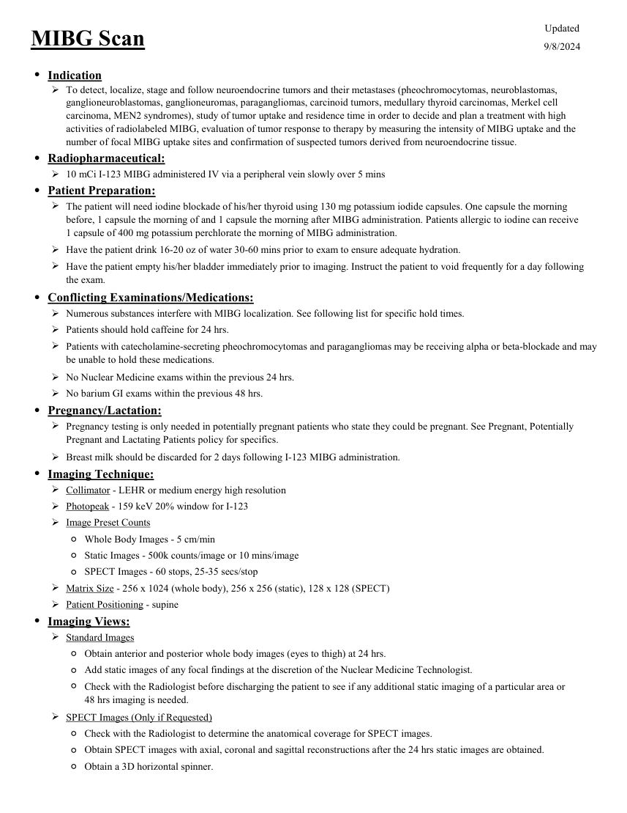
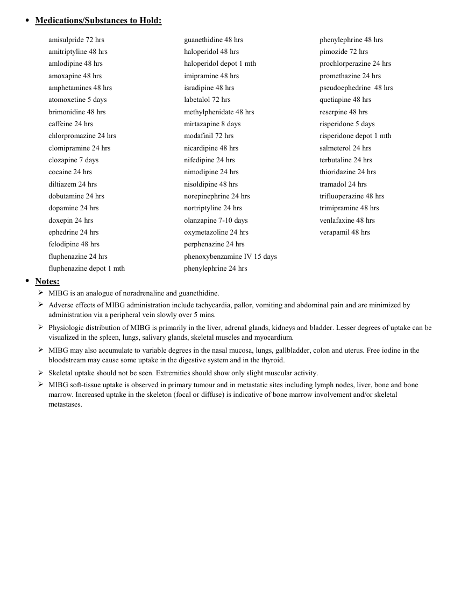

# ☢️ Scintigrafie cu I-123 / I-131 MIBG (Metaiodobenzilguanidină)

<!-- mcb-modalities:start -->
## Documentul original MCB — Scintigrafie MIBG

**Protocol · 2 pagini · consultat la 2026-09-27.**

[Descarcă PDF-ul integral](../../assets/mcb-modalities/mn-scintigrafie-mibg-mcb/document.pdf) · [Sursa MCB](https://ref.mcbradiology.com/Nucs/Protocols/MIBG.pdf) · [Catalogul MCB pentru această modalitate](../mcb/index.md)

Instrucțiunile, valorile și ilustrațiile din documentul original sunt păstrate în **engleză**. Titlul și navigarea sunt în română.

### Pagina 1

{ loading=lazy }

### Pagina 2

{ loading=lazy }

## Textul documentului original

??? abstract "Pagina 1 — text în engleză"

    
Updated
    MIBG Scan
    9/8/2024
    ●Indication
    
    To detect, localize, stage and follow neuroendocrine tumors and their metastases (pheochromocytomas, neuroblastomas, 
    ganglioneuroblastomas, ganglioneuromas, paragangliomas, carcinoid tumors, medullary thyroid carcinomas, Merkel cell 
    carcinoma, MEN2 syndromes), study of tumor uptake and residence time in order to decide and plan a treatment with high 
    activities of radiolabeled MIBG, evaluation of tumor response to therapy by measuring the intensity of MIBG uptake and the 
    number of focal MIBG uptake sites and confirmation of suspected tumors derived from neuroendocrine tissue.
    ●Radiopharmaceutical:
    10 mCi I-123 MIBG administered IV via a peripheral vein slowly over 5 mins
    ●Patient Preparation:
    
    The patient will need iodine blockade of his/her thyroid using 130 mg potassium iodide capsules. One capsule the morning 
    before, 1 capsule the morning of and 1 capsule the morning after MIBG administration. Patients allergic to iodine can receive                   
    1 capsule of 400 mg potassium perchlorate the morning of MIBG administration.
    Have the patient drink 16-20 oz of water 30-60 mins prior to exam to ensure adequate hydration.
    
    Have the patient empty his/her bladder immediately prior to imaging. Instruct the patient to void frequently for a day following 
    the exam.
    ●Conflicting Examinations/Medications:
    Numerous substances interfere with MIBG localization. See following list for specific hold times.
    Patients should hold caffeine for 24 hrs.
    
    Patients with catecholamine-secreting pheochromocytomas and paragangliomas may be receiving alpha or beta-blockade and may 
    be unable to hold these medications.
    No Nuclear Medicine exams within the previous 24 hrs.
    No barium GI exams within the previous 48 hrs.
    ●Pregnancy/Lactation:
    
    Pregnancy testing is only needed in potentially pregnant patients who state they could be pregnant. See Pregnant, Potentially 
    Pregnant and Lactating Patients policy for specifics.
    Breast milk should be discarded for 2 days following I-123 MIBG administration.
    ●Imaging Technique:
    Collimator - LEHR or medium energy high resolution
    Photopeak - 159 keV 20% window for I-123
    Image Preset Counts
    ◦Whole Body Images - 5 cm/min
    ◦Static Images - 500k counts/image or 10 mins/image
    ◦SPECT Images - 60 stops, 25-35 secs/stop
    Matrix Size - 256 x 1024 (whole body), 256 x 256 (static), 128 x 128 (SPECT)
    Patient Positioning - supine
    ●Imaging Views:
    Standard Images
    ◦Obtain anterior and posterior whole body images (eyes to thigh) at 24 hrs.
    ◦Add static images of any focal findings at the discretion of the Nuclear Medicine Technologist.
    ◦
    Check with the Radiologist before discharging the patient to see if any additional static imaging of a particular area or                        
    48 hrs imaging is needed.
    SPECT Images (Only if Requested)
    ◦Check with the Radiologist to determine the anatomical coverage for SPECT images.
    ◦Obtain SPECT images with axial, coronal and sagittal reconstructions after the 24 hrs static images are obtained.
    ◦Obtain a 3D horizontal spinner.
    

??? abstract "Pagina 2 — text în engleză"

    
●Medications/Substances to Hold:
    amisulpride 72 hrs
    guanethidine 48 hrs
    phenylephrine 48 hrs
    amitriptyline 48 hrs
    haloperidol 48 hrs
    pimozide 72 hrs
    amlodipine 48 hrs
    haloperidol depot 1 mth
    prochlorperazine 24 hrs
    amoxapine 48 hrs
    imipramine 48 hrs
    promethazine 24 hrs
    amphetamines 48 hrs
    isradipine 48 hrs
    pseudoephedrine  48 hrs
    atomoxetine 5 days
    labetalol 72 hrs
    quetiapine 48 hrs
    brimonidine 48 hrs
    methylphenidate 48 hrs
    reserpine 48 hrs
    caffeine 24 hrs
    mirtazapine 8 days
    risperidone 5 days
    chlorpromazine 24 hrs
    modafinil 72 hrs
    risperidone depot 1 mth
    clomipramine 24 hrs
    nicardipine 48 hrs
    salmeterol 24 hrs
    clozapine 7 days
    nifedipine 24 hrs
    terbutaline 24 hrs
    cocaine 24 hrs
    nimodipine 24 hrs
    thioridazine 24 hrs
    diltiazem 24 hrs
    nisoldipine 48 hrs
    tramadol 24 hrs
    dobutamine 24 hrs
    norepinephrine 24 hrs
    trifluoperazine 48 hrs
    dopamine 24 hrs
    nortriptyline 24 hrs
    trimipramine 48 hrs
    doxepin 24 hrs
    olanzapine 7-10 days
    venlafaxine 48 hrs
    ephedrine 24 hrs
    oxymetazoline 24 hrs
    verapamil 48 hrs
    felodipine 48 hrs
    perphenazine 24 hrs
    fluphenazine 24 hrs
    phenoxybenzamine IV 15 days
    fluphenazine depot 1 mth
    phenylephrine 24 hrs
    ●Notes:
    MIBG is an analogue of noradrenaline and guanethidine.
    
    Adverse effects of MIBG administration include tachycardia, pallor, vomiting and abdominal pain and are minimized by 
    administration via a peripheral vein slowly over 5 mins.
    
    Physiologic distribution of MIBG is primarily in the liver, adrenal glands, kidneys and bladder. Lesser degrees of uptake can be 
    visualized in the spleen, lungs, salivary glands, skeletal muscles and myocardium.
    
    MIBG may also accumulate to variable degrees in the nasal mucosa, lungs, gallbladder, colon and uterus. Free iodine in the 
    bloodstream may cause some uptake in the digestive system and in the thyroid.
    Skeletal uptake should not be seen. Extremities should show only slight muscular activity.
    
    MIBG soft-tissue uptake is observed in primary tumour and in metastatic sites including lymph nodes, liver, bone and bone 
    marrow. Increased uptake in the skeleton (focal or diffuse) is indicative of bone marrow involvement and/or skeletal
    metastases.
    

<!-- mcb-modalities:end -->

## Sinteza existentă în aplicație

Protocol oficial de **Medicină Nucleară & Radiologie Nucleară** integrat conform standardelor de calitate și radiofarmacie clinică ale **MCB Radiology** și ghidurilor internaționale **SNMMI / EANM**.

  

    ☢️ MEDICINĂ NUCLEARĂ &bull; Clasa 2 - 3 (5 - 8 mSv)
  

  

    Procedură diagnostică funcțională și moleculară. Evaluarea fiziologică in vivo a metabolismului tisular utilizând radiotrasori specifici de emisie gama sau pozitroni (PET/SPECT).
  

  

    <a href="https://ref.mcbradiology.com/Nucs/Protocols/MIBG.pdf" target="_blank" rel="noopener" style="font-weight: 600; color: #a78bfa; text-decoration: none;">
      [:material-file-pdf-box: Protocol Tehnic MCB (PDF)] ➔
    </a>
    <a href="https://ref.mcbradiology.com/Nucs/Practice%20Guidelines/MIBG%20Scintigraphy.pdf" target="_blank" rel="noopener" style="font-weight: 600; color: #c4b5fd; text-decoration: none;">
      [:material-file-pdf-box: Ghid de Practică Clinică (PDF)] ➔
    </a>
  

---

## 1. Indicații Clinice Majore
- Stadializarea, evaluarea răspunsului și depistarea recidivelor în neuroblastom la sugari și copii
- Localizarea feocromocitoamelor suprarenaliene și a paraganglioamelor extra-adrenale
- Evaluarea carcinomului medular tiroidian
- Evaluarea pacienților înainte de radioterapia metabolică cu doze mari de I-131 MIBG

---

## 2. Radiofarmaceutic, Doză & Radioprotecție
- **Trasor administrat:** `Iod-123 MIBG (111-370 MBq / 3-10 mCi i.v.) sau Iod-131 MIBG (18.5-37 MBq / 0.5-1.0 mCi)`
- **Clasă de iradiere IRIS:** **Clasa 2 - 3 (5 - 8 mSv)**
- **Cale de administrare:** Intravenoasă, inhalatorie sau orală conform protocolului specific.
- **Măsuri de radioprotecție:** Hidratare abundentă post-procedură pentru favorizarea eliminării urinare a radiofarmaceuticului nefixat. Evitarea contactului prelungit cu femei gravide și copii mici timp de 24 ore.

---

## 3. Pregătirea Pacientului
Blocarea tiroidei cu soluție Lugol sau iodură de potasiu (SSKI) începută cu 24-48 ore înainte și continuată 3-5 zile. Oprirea medicamentelor interferente: simpatomimetice, decongestionante, antidepresive triciclice, labetalol, rezerpină cu 1-2 săptămâni înainte.

---

## 4. Protocol Tehnic de Achiziție Imagistică
Injectare intravenoasă lentă pe durata a 2-5 minute. Achiziții planare corp întreg la 24 ore (și 48 ore pentru I-131) post-injectare + SPECT/CT toraco-abdominal.

---

## 5. Criterii de Interpretare Diagnostică
Localizarea focarelor de hiperfixare pe lanțurile simpatice, suprarenale sau metastaze scheletice/ganglionare.

---

## 6. Documente și Ghiduri Asociate
- [:material-file-pdf-box: Protocol Original MCB Radiology](https://ref.mcbradiology.com/Nucs/Protocols/MIBG.pdf){ target="_blank" rel="noopener" }
- [:material-file-pdf-box: Ghid de Practică Medicală SNMMI / EANM](https://ref.mcbradiology.com/Nucs/Practice%20Guidelines/MIBG%20Scintigraphy.pdf){ target="_blank" rel="noopener" }
- [:material-arrow-left: Înapoi la Indexul de Medicină Nucleară](../index.md)
