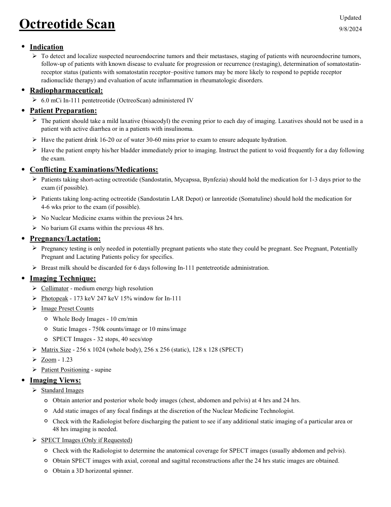
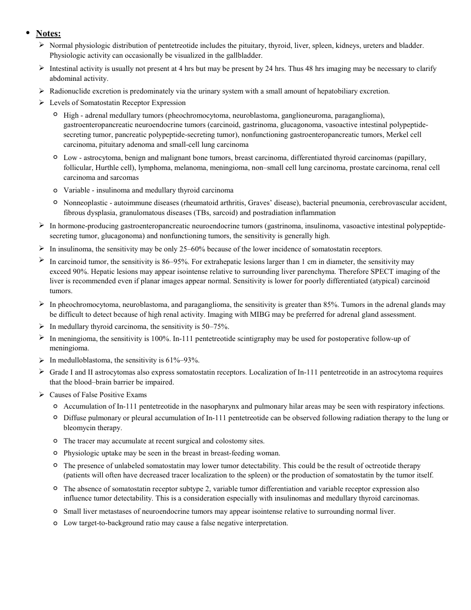

# ☢️ Scintigrafie a Receptorilor de Somatostatină cu In-111 Pentetreotid (OctreoScan)

<!-- mcb-modalities:start -->
## Documentul original MCB — Scintigrafie cu octreotid

**Protocol · 2 pagini · consultat la 2026-09-27.**

[Descarcă PDF-ul integral](../../assets/mcb-modalities/mn-scintigrafie-cu-octreotid-mcb/document.pdf) · [Sursa MCB](https://ref.mcbradiology.com/Nucs/Protocols/Octreotide.pdf) · [Catalogul MCB pentru această modalitate](../mcb/index.md)

Instrucțiunile, valorile și ilustrațiile din documentul original sunt păstrate în **engleză**. Titlul și navigarea sunt în română.

### Pagina 1

{ loading=lazy }

### Pagina 2

{ loading=lazy }

## Textul documentului original

??? abstract "Pagina 1 — text în engleză"

    
Updated
    Octreotide Scan
    9/8/2024
    ●Indication
    
    To detect and localize suspected neuroendocrine tumors and their metastases, staging of patients with neuroendocrine tumors, 
    follow-up of patients with known disease to evaluate for progression or recurrence (restaging), determination of somatostatin-
    receptor status (patients with somatostatin receptor–positive tumors may be more likely to respond to peptide receptor 
    radionuclide therapy) and evaluation of acute inflammation in rheumatologic disorders.
    ●Radiopharmaceutical:
    6.0 mCi In-111 pentetreotide (OctreoScan) administered IV
    ●Patient Preparation:
    
    The patient should take a mild laxative (bisacodyl) the evening prior to each day of imaging. Laxatives should not be used in a 
    patient with active diarrhea or in a patients with insulinoma.
    Have the patient drink 16-20 oz of water 30-60 mins prior to exam to ensure adequate hydration.
    
    Have the patient empty his/her bladder immediately prior to imaging. Instruct the patient to void frequently for a day following 
    the exam.
    ●Conflicting Examinations/Medications:
    
    Patients taking short-acting octreotide (Sandostatin, Mycapssa, Bynfezia) should hold the medication for 1-3 days prior to the 
    exam (if possible).
    
    Patients taking long-acting octreotide (Sandostatin LAR Depot) or lanreotide (Somatuline) should hold the medication for                    
    4-6 wks prior to the exam (if possible).
    No Nuclear Medicine exams within the previous 24 hrs.
    No barium GI exams within the previous 48 hrs.
    ●Pregnancy/Lactation:
    
    Pregnancy testing is only needed in potentially pregnant patients who state they could be pregnant. See Pregnant, Potentially 
    Pregnant and Lactating Patients policy for specifics.
    Breast milk should be discarded for 6 days following In-111 pentetreotide administration.
    ●Imaging Technique:
    Collimator - medium energy high resolution
    Photopeak - 173 keV 247 keV 15% window for In-111
    Image Preset Counts
    ◦Whole Body Images - 10 cm/min
    ◦Static Images - 750k counts/image or 10 mins/image
    ◦SPECT Images - 32 stops, 40 secs/stop
    Matrix Size - 256 x 1024 (whole body), 256 x 256 (static), 128 x 128 (SPECT)
    Zoom - 1.23
    Patient Positioning - supine
    ●Imaging Views:
    Standard Images
    ◦Obtain anterior and posterior whole body images (chest, abdomen and pelvis) at 4 hrs and 24 hrs.
    ◦Add static images of any focal findings at the discretion of the Nuclear Medicine Technologist.
    ◦
    Check with the Radiologist before discharging the patient to see if any additional static imaging of a particular area or                        
    48 hrs imaging is needed.
    SPECT Images (Only if Requested)
    ◦Check with the Radiologist to determine the anatomical coverage for SPECT images (usually abdomen and pelvis).
    ◦Obtain SPECT images with axial, coronal and sagittal reconstructions after the 24 hrs static images are obtained.
    ◦Obtain a 3D horizontal spinner.
    

??? abstract "Pagina 2 — text în engleză"

    
●Notes:
    
    Normal physiologic distribution of pentetreotide includes the pituitary, thyroid, liver, spleen, kidneys, ureters and bladder. 
    Physiologic activity can occasionally be visualized in the gallbladder.
    
    Intestinal activity is usually not present at 4 hrs but may be present by 24 hrs. Thus 48 hrs imaging may be necessary to clarify 
    abdominal activity.
    Radionuclide excretion is predominately via the urinary system with a small amount of hepatobiliary excretion.
    Levels of Somatostatin Receptor Expression
    ◦
    High - adrenal medullary tumors (pheochromocytoma, neuroblastoma, ganglioneuroma, paraganglioma), 
    gastroenteropancreatic neuroendocrine tumors (carcinoid, gastrinoma, glucagonoma, vasoactive intestinal polypeptide-
    secreting tumor, pancreatic polypeptide-secreting tumor), nonfunctioning gastroenteropancreatic tumors, Merkel cell 
    carcinoma, pituitary adenoma and small-cell lung carcinoma
    ◦
    Low - astrocytoma, benign and malignant bone tumors, breast carcinoma, differentiated thyroid carcinomas (papillary, 
    follicular, Hurthle cell), lymphoma, melanoma, meningioma, non–small cell lung carcinoma, prostate carcinoma, renal cell 
    carcinoma and sarcomas
    ◦Variable - insulinoma and medullary thyroid carcinoma
    ◦
    Nonneoplastic - autoimmune diseases (rheumatoid arthritis, Graves’ disease), bacterial pneumonia, cerebrovascular accident, 
    fibrous dysplasia, granulomatous diseases (TBs, sarcoid) and postradiation inflammation
    
    In hormone-producing gastroenteropancreatic neuroendocrine tumors (gastrinoma, insulinoma, vasoactive intestinal polypeptide-
    secreting tumor, glucagonoma) and nonfunctioning tumors, the sensitivity is generally high.
    In insulinoma, the sensitivity may be only 25–60% because of the lower incidence of somatostatin receptors.
    
    In carcinoid tumor, the sensitivity is 86–95%. For extrahepatic lesions larger than 1 cm in diameter, the sensitivity may
    exceed 90%. Hepatic lesions may appear isointense relative to surrounding liver parenchyma. Therefore SPECT imaging of the 
    liver is recommended even if planar images appear normal. Sensitivity is lower for poorly differentiated (atypical) carcinoid 
    tumors.
    
    In pheochromocytoma, neuroblastoma, and paraganglioma, the sensitivity is greater than 85%. Tumors in the adrenal glands may 
    be difficult to detect because of high renal activity. Imaging with MIBG may be preferred for adrenal gland assessment.
    In medullary thyroid carcinoma, the sensitivity is 50–75%.
    
    In meningioma, the sensitivity is 100%. In-111 pentetreotide scintigraphy may be used for postoperative follow-up of
    meningioma.
    In medulloblastoma, the sensitivity is 61%–93%. 
    
    
    Grade I and II astrocytomas also express somatostatin receptors. Localization of In-111 pentetreotide in an astrocytoma requires 
    that the blood–brain barrier be impaired.
    Causes of False Positive Exams
    ◦Accumulation of In-111 pentetreotide in the nasopharynx and pulmonary hilar areas may be seen with respiratory infections.
    ◦
    Diffuse pulmonary or pleural accumulation of In-111 pentetreotide can be observed following radiation therapy to the lung or 
    bleomycin therapy.
    ◦The tracer may accumulate at recent surgical and colostomy sites.
    ◦Physiologic uptake may be seen in the breast in breast-feeding woman.
    ◦
    The presence of unlabeled somatostatin may lower tumor detectability. This could be the result of octreotide therapy 
    (patients will often have decreased tracer localization to the spleen) or the production of somatostatin by the tumor itself.
    ◦
    The absence of somatostatin receptor subtype 2, variable tumor differentiation and variable receptor expression also
    influence tumor detectability. This is a consideration especially with insulinomas and medullary thyroid carcinomas.
    ◦Small liver metastases of neuroendocrine tumors may appear isointense relative to surrounding normal liver.
    ◦Low target-to-background ratio may cause a false negative interpretation. 
    

<!-- mcb-modalities:end -->

## Sinteza existentă în aplicație

Protocol oficial de **Medicină Nucleară & Radiologie Nucleară** integrat conform standardelor de calitate și radiofarmacie clinică ale **MCB Radiology** și ghidurilor internaționale **SNMMI / EANM**.

  

    ☢️ MEDICINĂ NUCLEARĂ &bull; Clasa 3 (8 - 10 mSv)
  

  

    Procedură diagnostică funcțională și moleculară. Evaluarea fiziologică in vivo a metabolismului tisular utilizând radiotrasori specifici de emisie gama sau pozitroni (PET/SPECT).
  

  

    <a href="https://ref.mcbradiology.com/Nucs/Protocols/Octreotide.pdf" target="_blank" rel="noopener" style="font-weight: 600; color: #a78bfa; text-decoration: none;">
      [:material-file-pdf-box: Protocol Tehnic MCB (PDF)] ➔
    </a>
    <a href="https://ref.mcbradiology.com/Nucs/Practice%20Guidelines/Somatostatin%20Receptor%20Scintigraphy.pdf" target="_blank" rel="noopener" style="font-weight: 600; color: #c4b5fd; text-decoration: none;">
      [:material-file-pdf-box: Ghid de Practică Clinică (PDF)] ➔
    </a>
  

---

## 1. Indicații Clinice Majore
- Diagnosticul, stadializarea și monitorizarea tumorilor neuroendocrine (NET) gastro-entero-pancreatice (carcinoid, gastrinom, insulinom, glucagonom)
- Localizarea tumorilor primitive și a metastazelor hepatice sau ganglionare cu receptori de somatostatină (SSTR2 și SSTR5)
- Selecția candidaților eligibili pentru terapia cu radioliganzii peptidici Lu-177 Dotatate (PRRT)

---

## 2. Radiofarmaceutic, Doză & Radioprotecție
- **Trasor administrat:** `Indiu-111 Pentetreotide (OctreoScan, 111-222 MBq / 3-6 mCi i.v.)`
- **Clasă de iradiere IRIS:** **Clasa 3 (8 - 10 mSv)**
- **Cale de administrare:** Intravenoasă, inhalatorie sau orală conform protocolului specific.
- **Măsuri de radioprotecție:** Hidratare abundentă post-procedură pentru favorizarea eliminării urinare a radiofarmaceuticului nefixat. Evitarea contactului prelungit cu femei gravide și copii mici timp de 24 ore.

---

## 3. Pregătirea Pacientului
Hidratare bună. Oprirea analogilor de somatostatină cu acțiune scurtă (Octreotid subcutanat) cu 24-48 ore înainte, iar a formelor retard (LAR) cu 3-4 săptămâni înainte (dacă este tolerat clinic). Laxativ ușor în seara anterioară scanării de 24 ore pentru clearance-ul intestinal.

---

## 4. Protocol Tehnic de Achiziție Imagistică
Imagini planare la 4 ore și 24 ore post-injectare (opțional 48 ore). Colimator MEGP. SPECT sau SPECT/CT obligatoriu pentru abdomen și pelvis la 24 ore.

---

## 5. Criterii de Interpretare Diagnostică
Fixare intensă în tumorile neuroendocrine bogate în receptori de somatostatină. Evaluare Krenning score (grad 1-4) pentru stabilirea indicației de radioterapie PRRT.

---

## 6. Documente și Ghiduri Asociate
- [:material-file-pdf-box: Protocol Original MCB Radiology](https://ref.mcbradiology.com/Nucs/Protocols/Octreotide.pdf){ target="_blank" rel="noopener" }
- [:material-file-pdf-box: Ghid de Practică Medicală SNMMI / EANM](https://ref.mcbradiology.com/Nucs/Practice%20Guidelines/Somatostatin%20Receptor%20Scintigraphy.pdf){ target="_blank" rel="noopener" }
- [:material-arrow-left: Înapoi la Indexul de Medicină Nucleară](../index.md)
