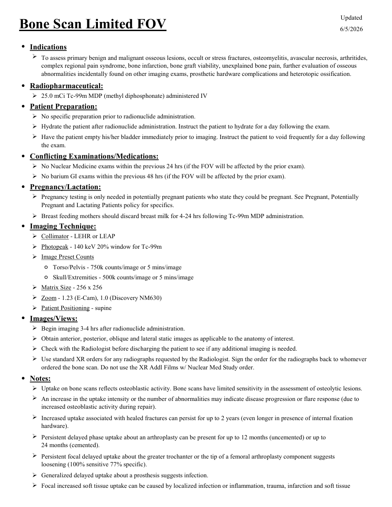
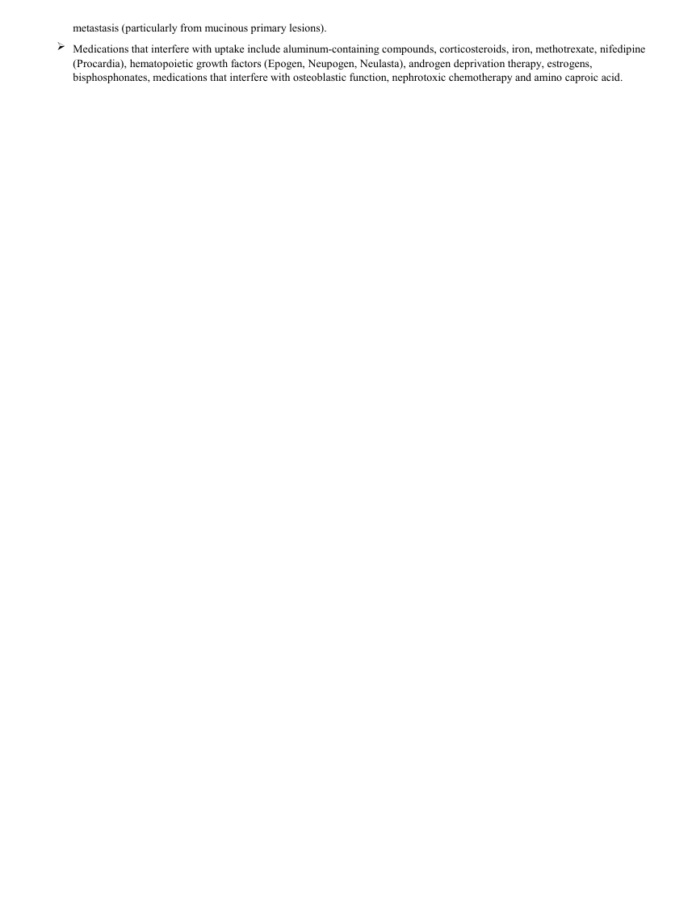

# Medicină nucleară — Scintigrafie osoasă limitată (MCB)

## Documentul original MCB — Scintigrafie osoasă limitată

**Protocol · 2 pagini · consultat la 2026-09-27.**

[Descarcă PDF-ul integral](../../assets/mcb-modalities/mn-scintigrafie-osoasa-limitata-mcb/document.pdf) · [Sursa MCB](https://ref.mcbradiology.com/Nucs/Protocols/Bone%20Scan%20Limited.pdf) · [Catalogul MCB pentru această modalitate](../mcb/index.md)

Instrucțiunile, valorile și ilustrațiile din documentul original sunt păstrate în **engleză**. Titlul și navigarea sunt în română.

### Pagina 1

{ loading=lazy }

### Pagina 2

{ loading=lazy }

## Textul documentului original

??? abstract "Pagina 1 — text în engleză"

    
Updated
    Bone Scan Limited FOV
    6/5/2026
    ●Indications
    
    To assess primary benign and malignant osseous lesions, occult or stress fractures, osteomyelitis, avascular necrosis, arthritides, 
    complex regional pain syndrome, bone infarction, bone graft viability, unexplained bone pain, further evaluation of osseous 
    abnormalities incidentally found on other imaging exams, prosthetic hardware complications and heterotopic ossification.
    ●Radiopharmaceutical:
    25.0 mCi Tc-99m MDP (methyl diphosphonate) administered IV
    ●Patient Preparation:
    No specific preparation prior to radionuclide administration.
    Hydrate the patient after radionuclide administration. Instruct the patient to hydrate for a day following the exam.
    
    Have the patient empty his/her bladder immediately prior to imaging. Instruct the patient to void frequently for a day following 
    the exam.
    ●Conflicting Examinations/Medications:
    No Nuclear Medicine exams within the previous 24 hrs (if the FOV will be affected by the prior exam).
    No barium GI exams within the previous 48 hrs (if the FOV will be affected by the prior exam).
    ●Pregnancy/Lactation:
    
    Pregnancy testing is only needed in potentially pregnant patients who state they could be pregnant. See Pregnant, Potentially 
    Pregnant and Lactating Patients policy for specifics.
    Breast feeding mothers should discard breast milk for 4-24 hrs following Tc-99m MDP administration.
    ●Imaging Technique:
    Collimator - LEHR or LEAP
    Photopeak - 140 keV 20% window for Tc-99m
    Image Preset Counts
    ◦Torso/Pelvis - 750k counts/image or 5 mins/image
    ◦Skull/Extremities - 500k counts/image or 5 mins/image
    Matrix Size - 256 x 256
    Zoom - 1.23 (E-Cam), 1.0 (Discovery NM630)
    Patient Positioning - supine
    ●Images/Views:
    Begin imaging 3-4 hrs after radionuclide administration.
    Obtain anterior, posterior, oblique and lateral static images as applicable to the anatomy of interest.
    Check with the Radiologist before discharging the patient to see if any additional imaging is needed.
    
    Use standard XR orders for any radiographs requested by the Radiologist. Sign the order for the radiographs back to whomever 
    ordered the bone scan. Do not use the XR Addl Films w/ Nuclear Med Study order.
    ●Notes:
    Uptake on bone scans reflects osteoblastic activity. Bone scans have limited sensitivity in the assessment of osteolytic lesions.
    
    An increase in the uptake intensity or the number of abnormalities may indicate disease progression or flare response (due to 
    increased osteoblastic activity during repair). 
    
    Increased uptake associated with healed fractures can persist for up to 2 years (even longer in presence of internal fixation 
    hardware).
    
    Persistent delayed phase uptake about an arthroplasty can be present for up to 12 months (uncemented) or up to                                         
    24 months (cemented).
    
    Persistent focal delayed uptake about the greater trochanter or the tip of a femoral arthroplasty component suggests                     
    loosening (100% sensitive 77% specific). 
    Generalized delayed uptake about a prosthesis suggests infection.
    
    Focal increased soft tissue uptake can be caused by localized infection or inflammation, trauma, infarction and soft tissue 
    

??? abstract "Pagina 2 — text în engleză"

    
metastasis (particularly from mucinous primary lesions).
    Medications that interfere with uptake include aluminum-containing compounds, corticosteroids, iron, methotrexate, nifedipine 
    (Procardia), hematopoietic growth factors (Epogen, Neupogen, Neulasta), androgen deprivation therapy, estrogens, 
    bisphosphonates, medications that interfere with osteoblastic function, nephrotoxic chemotherapy and amino caproic acid.
    

