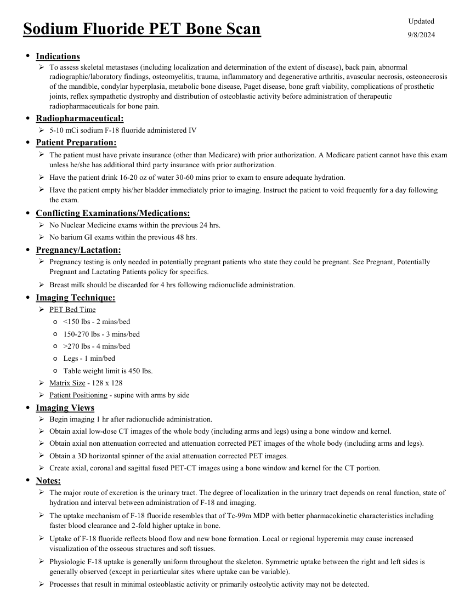
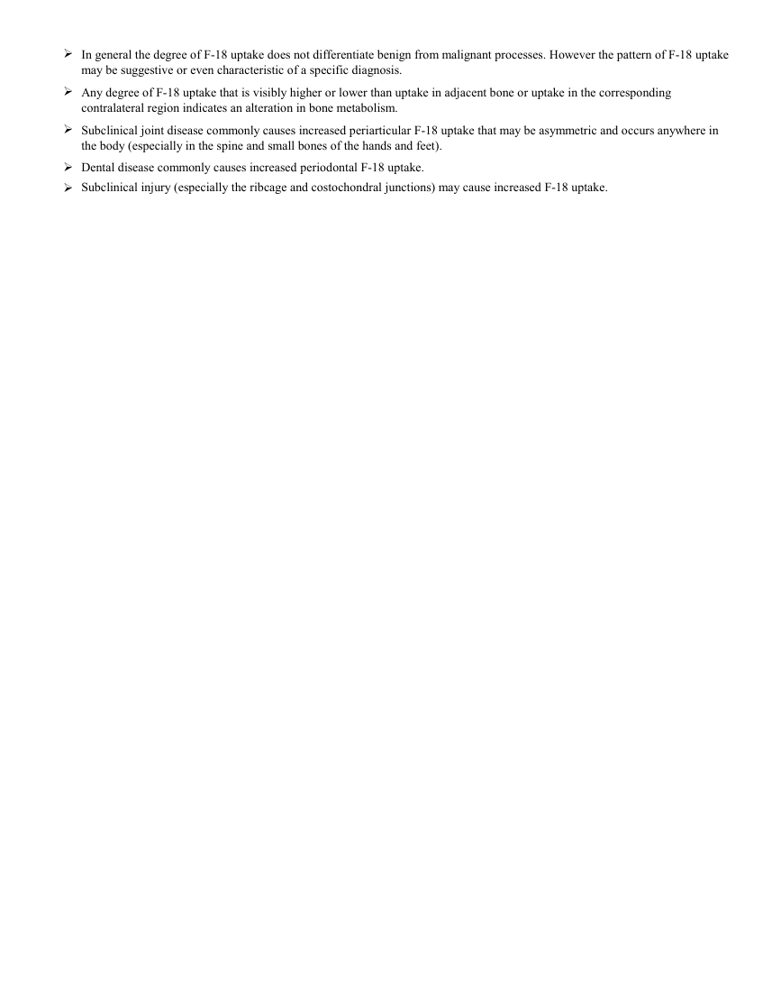

# ☢️ PET-CT Osos cu Fluorură de Sodiu (18F-NaF Bone PET/CT)

<!-- mcb-modalities:start -->
## Documentul original MCB — PET cu NaF

**Protocol · 2 pagini · consultat la 2026-09-27.**

[Descarcă PDF-ul integral](../../assets/mcb-modalities/mn-pet-cu-naf-mcb/document.pdf) · [Sursa MCB](https://ref.mcbradiology.com/Nucs/Protocols/PET%20NaF.pdf) · [Catalogul MCB pentru această modalitate](../mcb/index.md)

Instrucțiunile, valorile și ilustrațiile din documentul original sunt păstrate în **engleză**. Titlul și navigarea sunt în română.

### Pagina 1

{ loading=lazy }

### Pagina 2

{ loading=lazy }

## Textul documentului original

??? abstract "Pagina 1 — text în engleză"

    
Updated
    Sodium Fluoride PET Bone Scan
    9/8/2024
    ●Indications
    
    To assess skeletal metastases (including localization and determination of the extent of disease), back pain, abnormal 
    radiographic/laboratory findings, osteomyelitis, trauma, inflammatory and degenerative arthritis, avascular necrosis, osteonecrosis 
    of the mandible, condylar hyperplasia, metabolic bone disease, Paget disease, bone graft viability, complications of prosthetic 
    joints, reflex sympathetic dystrophy and distribution of osteoblastic activity before administration of therapeutic 
    radiopharmaceuticals for bone pain.
    ●Radiopharmaceutical:
    5-10 mCi sodium F-18 fluoride administered IV
    ●Patient Preparation:
    
    The patient must have private insurance (other than Medicare) with prior authorization. A Medicare patient cannot have this exam 
    unless he/she has additional third party insurance with prior authorization.
    Have the patient drink 16-20 oz of water 30-60 mins prior to exam to ensure adequate hydration.
    
    Have the patient empty his/her bladder immediately prior to imaging. Instruct the patient to void frequently for a day following 
    the exam.
    ●Conflicting Examinations/Medications:
    No Nuclear Medicine exams within the previous 24 hrs.
    No barium GI exams within the previous 48 hrs.
    ●Pregnancy/Lactation:
    
    Pregnancy testing is only needed in potentially pregnant patients who state they could be pregnant. See Pregnant, Potentially 
    Pregnant and Lactating Patients policy for specifics.
    Breast milk should be discarded for 4 hrs following radionuclide administration.
    ●Imaging Technique:
    PET Bed Time
    ◦&lt;150 lbs - 2 mins/bed
    ◦150-270 lbs - 3 mins/bed
    ◦&gt;270 lbs - 4 mins/bed
    ◦Legs - 1 min/bed
    ◦Table weight limit is 450 lbs.
    Matrix Size - 128 x 128
    Patient Positioning - supine with arms by side
    ●Imaging Views
    Begin imaging 1 hr after radionuclide administration.
    Obtain axial low-dose CT images of the whole body (including arms and legs) using a bone window and kernel.
    Obtain axial non attenuation corrected and attenuation corrected PET images of the whole body (including arms and legs).
    Obtain a 3D horizontal spinner of the axial attenuation corrected PET images.
    Create axial, coronal and sagittal fused PET-CT images using a bone window and kernel for the CT portion.
    ●Notes:
    
    The major route of excretion is the urinary tract. The degree of localization in the urinary tract depends on renal function, state of 
    hydration and interval between administration of F-18 and imaging.
    
    The uptake mechanism of F-18 fluoride resembles that of Tc-99m MDP with better pharmacokinetic characteristics including 
    faster blood clearance and 2-fold higher uptake in bone.
    
    Uptake of F-18 fluoride reflects blood flow and new bone formation. Local or regional hyperemia may cause increased 
    visualization of the osseous structures and soft tissues.
    
    Physiologic F-18 uptake is generally uniform throughout the skeleton. Symmetric uptake between the right and left sides is 
    generally observed (except in periarticular sites where uptake can be variable).
    Processes that result in minimal osteoblastic activity or primarily osteolytic activity may not be detected.
    
    

??? abstract "Pagina 2 — text în engleză"

    

    In general the degree of F-18 uptake does not differentiate benign from malignant processes. However the pattern of F-18 uptake 
    may be suggestive or even characteristic of a specific diagnosis.
    
    Any degree of F-18 uptake that is visibly higher or lower than uptake in adjacent bone or uptake in the corresponding
    contralateral region indicates an alteration in bone metabolism.
    
    Subclinical joint disease commonly causes increased periarticular F-18 uptake that may be asymmetric and occurs anywhere in 
    the body (especially in the spine and small bones of the hands and feet).
    Dental disease commonly causes increased periodontal F-18 uptake. 
    
    Subclinical injury (especially the ribcage and costochondral junctions) may cause increased F-18 uptake.
    
    

<!-- mcb-modalities:end -->

## Sinteza existentă în aplicație

Protocol oficial de **Medicină Nucleară & Radiologie Nucleară** integrat conform standardelor de calitate și radiofarmacie clinică ale **MCB Radiology** și ghidurilor internaționale **SNMMI / EANM**.

  

    ☢️ MEDICINĂ NUCLEARĂ &bull; Clasa 2 (4 - 6 mSv)
  

  

    Procedură diagnostică funcțională și moleculară. Evaluarea fiziologică in vivo a metabolismului tisular utilizând radiotrasori specifici de emisie gama sau pozitroni (PET/SPECT).
  

  

    <a href="https://ref.mcbradiology.com/Nucs/Protocols/PET%20NaF.pdf" target="_blank" rel="noopener" style="font-weight: 600; color: #a78bfa; text-decoration: none;">
      [:material-file-pdf-box: Protocol Tehnic MCB (PDF)] ➔
    </a>
    <a href="https://ref.mcbradiology.com/Nucs/Practice%20Guidelines/Sodium%20Fluoride%20PET.pdf" target="_blank" rel="noopener" style="font-weight: 600; color: #c4b5fd; text-decoration: none;">
      [:material-file-pdf-box: Ghid de Practică Clinică (PDF)] ➔
    </a>
  

---

## 1. Indicații Clinice Majore
- Cea mai sensibilă metodă imagistică pentru detectarea metastazelor osoase în cancerul de prostată și cancerul mamar
- Evaluarea metastazelor atât osteoblastice cât și osteolitice timpurii
- Evaluarea durerilor scheletice la pacienți cu scintigrafie Tc-99m echivocă

---

## 2. Radiofarmaceutic, Doză & Radioprotecție
- **Trasor administrat:** `Fluor-18 Fluorură de Sodiu (18F-NaF, 185-370 MBq / 5-10 mCi i.v.)`
- **Clasă de iradiere IRIS:** **Clasa 2 (4 - 6 mSv)**
- **Cale de administrare:** Intravenoasă, inhalatorie sau orală conform protocolului specific.
- **Măsuri de radioprotecție:** Hidratare abundentă post-procedură pentru favorizarea eliminării urinare a radiofarmaceuticului nefixat. Evitarea contactului prelungit cu femei gravide și copii mici timp de 24 ore.

---

## 3. Pregătirea Pacientului
Hidratare generoasă cu apă. Nu necesită post alimentar (spre deosebire de 18F-FDG).

---

## 4. Protocol Tehnic de Achiziție Imagistică
Timp de repaus post-injectare: 45-60 minute. Scanare hibridă PET-CT vertex-picioare (sau trunchi) cu achiziție 3D PET (1-2 min/pat) și CT cu doză joasă.

---

## 5. Criterii de Interpretare Diagnostică
Rezoluție spațială de 4-5 mm (mult superioară camerei gama). Clearance sangvin rapid și captare scheletică dublă comparativ cu fosfonații clasici de Tc-99m.

---

## 6. Documente și Ghiduri Asociate
- [:material-file-pdf-box: Protocol Original MCB Radiology](https://ref.mcbradiology.com/Nucs/Protocols/PET%20NaF.pdf){ target="_blank" rel="noopener" }
- [:material-file-pdf-box: Ghid de Practică Medicală SNMMI / EANM](https://ref.mcbradiology.com/Nucs/Practice%20Guidelines/Sodium%20Fluoride%20PET.pdf){ target="_blank" rel="noopener" }
- [:material-arrow-left: Înapoi la Indexul de Medicină Nucleară](../index.md)
