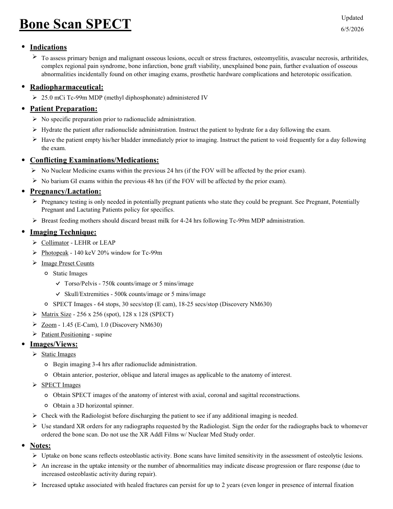
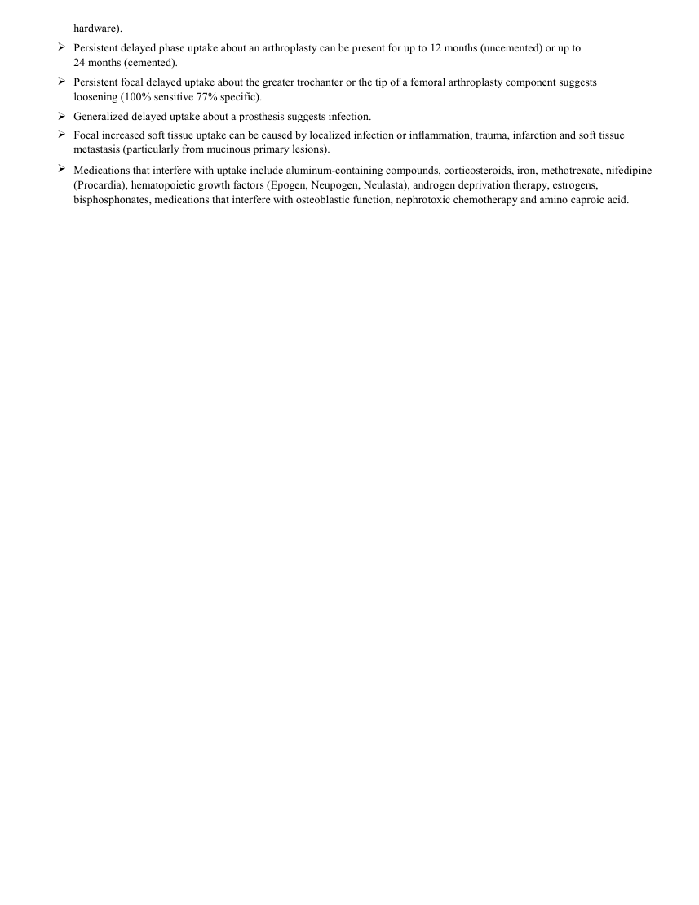

# ☢️ Scintigrafie Osoasă SPECT și SPECT/CT Focalizat

<!-- mcb-modalities:start -->
## Documentul original MCB — Scintigrafie osoasă SPECT

**Protocol · 2 pagini · consultat la 2026-09-27.**

[Descarcă PDF-ul integral](../../assets/mcb-modalities/mn-scintigrafie-osoasa-spect-mcb/document.pdf) · [Sursa MCB](https://ref.mcbradiology.com/Nucs/Protocols/Bone%20Scan%20SPECT.pdf) · [Catalogul MCB pentru această modalitate](../mcb/index.md)

Instrucțiunile, valorile și ilustrațiile din documentul original sunt păstrate în **engleză**. Titlul și navigarea sunt în română.

### Pagina 1

{ loading=lazy }

### Pagina 2

{ loading=lazy }

## Textul documentului original

??? abstract "Pagina 1 — text în engleză"

    
Updated
    Bone Scan SPECT
    6/5/2026
    ●Indications
    
    To assess primary benign and malignant osseous lesions, occult or stress fractures, osteomyelitis, avascular necrosis, arthritides, 
    complex regional pain syndrome, bone infarction, bone graft viability, unexplained bone pain, further evaluation of osseous 
    abnormalities incidentally found on other imaging exams, prosthetic hardware complications and heterotopic ossification.
    ●Radiopharmaceutical:
    25.0 mCi Tc-99m MDP (methyl diphosphonate) administered IV
    ●Patient Preparation:
    No specific preparation prior to radionuclide administration.
    Hydrate the patient after radionuclide administration. Instruct the patient to hydrate for a day following the exam.
    
    Have the patient empty his/her bladder immediately prior to imaging. Instruct the patient to void frequently for a day following 
    the exam.
    ●Conflicting Examinations/Medications:
    
    No Nuclear Medicine exams within the previous 24 hrs (if the FOV will be affected by the prior exam).
    No barium GI exams within the previous 48 hrs (if the FOV will be affected by the prior exam).
    ●Pregnancy/Lactation:
    
    Pregnancy testing is only needed in potentially pregnant patients who state they could be pregnant. See Pregnant, Potentially 
    Pregnant and Lactating Patients policy for specifics.
    Breast feeding mothers should discard breast milk for 4-24 hrs following Tc-99m MDP administration.
    ●Imaging Technique:
    Collimator - LEHR or LEAP
    Photopeak - 140 keV 20% window for Tc-99m
    Image Preset Counts
    ◦Static Images
    ✓Torso/Pelvis - 750k counts/image or 5 mins/image
    ✓Skull/Extremities - 500k counts/image or 5 mins/image
    ◦SPECT Images - 64 stops, 30 secs/stop (E cam), 18-25 secs/stop (Discovery NM630)
    Matrix Size - 256 x 256 (spot), 128 x 128 (SPECT)
    Zoom - 1.45 (E-Cam), 1.0 (Discovery NM630)
    Patient Positioning - supine
    ●Images/Views:
    Static Images
    ◦Begin imaging 3-4 hrs after radionuclide administration.
    ◦Obtain anterior, posterior, oblique and lateral images as applicable to the anatomy of interest.
    SPECT Images
    ◦Obtain SPECT images of the anatomy of interest with axial, coronal and sagittal reconstructions.
    ◦Obtain a 3D horizontal spinner.
    Check with the Radiologist before discharging the patient to see if any additional imaging is needed.
    
    Use standard XR orders for any radiographs requested by the Radiologist. Sign the order for the radiographs back to whomever 
    ordered the bone scan. Do not use the XR Addl Films w/ Nuclear Med Study order.
    ●Notes:
    Uptake on bone scans reflects osteoblastic activity. Bone scans have limited sensitivity in the assessment of osteolytic lesions.
    
    An increase in the uptake intensity or the number of abnormalities may indicate disease progression or flare response (due to 
    increased osteoblastic activity during repair). 
    
    Increased uptake associated with healed fractures can persist for up to 2 years (even longer in presence of internal fixation 
    

??? abstract "Pagina 2 — text în engleză"

    
hardware).
    
    Persistent delayed phase uptake about an arthroplasty can be present for up to 12 months (uncemented) or up to                                         
    24 months (cemented).
    
    Persistent focal delayed uptake about the greater trochanter or the tip of a femoral arthroplasty component suggests                     
    loosening (100% sensitive 77% specific). 
    Generalized delayed uptake about a prosthesis suggests infection.
    
    Focal increased soft tissue uptake can be caused by localized infection or inflammation, trauma, infarction and soft tissue 
    metastasis (particularly from mucinous primary lesions).
    
    Medications that interfere with uptake include aluminum-containing compounds, corticosteroids, iron, methotrexate, nifedipine 
    (Procardia), hematopoietic growth factors (Epogen, Neupogen, Neulasta), androgen deprivation therapy, estrogens, 
    bisphosphonates, medications that interfere with osteoblastic function, nephrotoxic chemotherapy and amino caproic acid.
    

<!-- mcb-modalities:end -->

## Sinteza existentă în aplicație

Protocol oficial de **Medicină Nucleară & Radiologie Nucleară** integrat conform standardelor de calitate și radiofarmacie clinică ale **MCB Radiology** și ghidurilor internaționale **SNMMI / EANM**.

  

    ☢️ MEDICINĂ NUCLEARĂ &bull; Clasa 2 (4 - 5 mSv)
  

  

    Procedură diagnostică funcțională și moleculară. Evaluarea fiziologică in vivo a metabolismului tisular utilizând radiotrasori specifici de emisie gama sau pozitroni (PET/SPECT).
  

  

    <a href="https://ref.mcbradiology.com/Nucs/Protocols/Bone%20Scan%20SPECT.pdf" target="_blank" rel="noopener" style="font-weight: 600; color: #a78bfa; text-decoration: none;">
      [:material-file-pdf-box: Protocol Tehnic MCB (PDF)] ➔
    </a>
    <a href="https://ref.mcbradiology.com/Nucs/Practice%20Guidelines/Bone%20Scintigraphy.pdf" target="_blank" rel="noopener" style="font-weight: 600; color: #c4b5fd; text-decoration: none;">
      [:material-file-pdf-box: Ghid de Practică Clinică (PDF)] ➔
    </a>
  

---

## 1. Indicații Clinice Majore
- Spondiloliză și leziuni de stres ale pars interarticularis la tineri sportivi cu lombalgie
- Localizarea exactă a leziunilor articulare complexe în picior, gleznă și încheietura mâinii
- Diferențierea leziunilor degenerative de metastaze pe corpii vertebrali sau arcurile posterioare

---

## 2. Radiofarmaceutic, Doză & Radioprotecție
- **Trasor administrat:** `Tc-99m MDP / HDP (740-1110 MBq / 20-30 mCi i.v.)`
- **Clasă de iradiere IRIS:** **Clasa 2 (4 - 5 mSv)**
- **Cale de administrare:** Intravenoasă, inhalatorie sau orală conform protocolului specific.
- **Măsuri de radioprotecție:** Hidratare abundentă post-procedură pentru favorizarea eliminării urinare a radiofarmaceuticului nefixat. Evitarea contactului prelungit cu femei gravide și copii mici timp de 24 ore.

---

## 3. Pregătirea Pacientului
Hidratare adecvată și evacuare vezicală.

---

## 4. Protocol Tehnic de Achiziție Imagistică
Achiziție tomografică SPECT (rotație 360°, 60-128 proiecții) combinată cu CT cu doză joasă pentru corecție de atenuare și fuziune anatomică milimetrică.

---

## 5. Criterii de Interpretare Diagnostică
Rezoluție de contrast superioară scintigrafiei planare. Permite separarea captării din fațetele articulare de pedicul sau corpul vertebral.

---

## 6. Documente și Ghiduri Asociate
- [:material-file-pdf-box: Protocol Original MCB Radiology](https://ref.mcbradiology.com/Nucs/Protocols/Bone%20Scan%20SPECT.pdf){ target="_blank" rel="noopener" }
- [:material-file-pdf-box: Ghid de Practică Medicală SNMMI / EANM](https://ref.mcbradiology.com/Nucs/Practice%20Guidelines/Bone%20Scintigraphy.pdf){ target="_blank" rel="noopener" }
- [:material-arrow-left: Înapoi la Indexul de Medicină Nucleară](../index.md)
