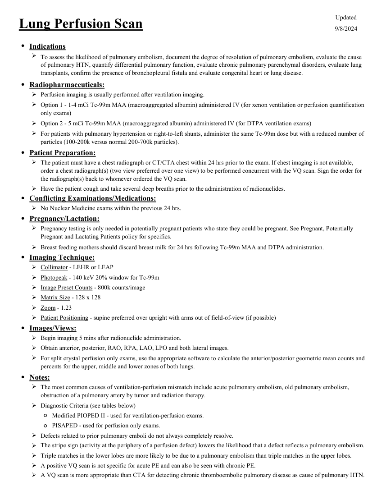
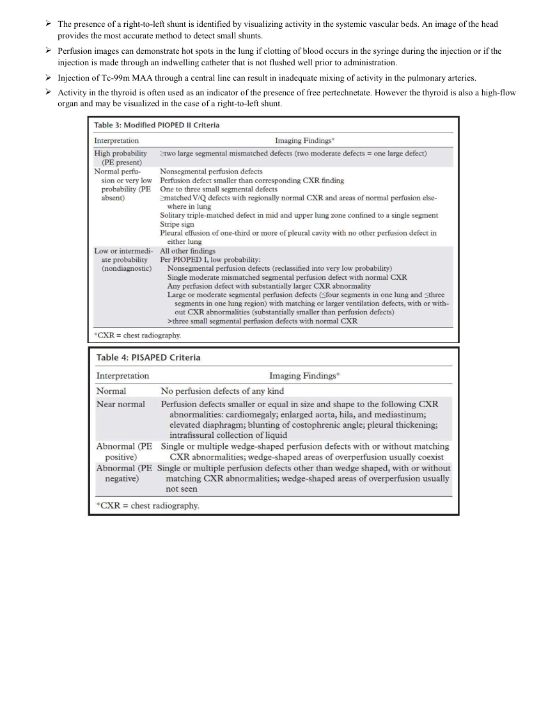

# Medicină nucleară — Perfuzie pulmonară (MCB)

## Documentul original MCB — Perfuzie pulmonară

**Protocol · 2 pagini · consultat la 2026-09-27.**

[Descarcă PDF-ul integral](../../assets/mcb-modalities/mn-perfuzie-pulmonara-mcb/document.pdf) · [Sursa MCB](https://ref.mcbradiology.com/Nucs/Protocols/Lung%20Perfusion.pdf) · [Catalogul MCB pentru această modalitate](../mcb/index.md)

Instrucțiunile, valorile și ilustrațiile din documentul original sunt păstrate în **engleză**. Titlul și navigarea sunt în română.

### Pagina 1

{ loading=lazy }

### Pagina 2

{ loading=lazy }

## Textul documentului original

??? abstract "Pagina 1 — text în engleză"

    
Updated
    Lung Perfusion Scan
    9/8/2024
    ●Indications
    
    To assess the likelihood of pulmonary embolism, document the degree of resolution of pulmonary embolism, evaluate the cause 
    of pulmonary HTN, quantify differential pulmonary function, evaluate chronic pulmonary parenchymal disorders, evaluate lung 
    transplants, confirm the presence of bronchopleural fistula and evaluate congenital heart or lung disease.
    ●Radiopharmaceuticals:
    Perfusion imaging is usually performed after ventilation imaging.
    
    Option 1 - 1-4 mCi Tc-99m MAA (macroaggregated albumin) administered IV (for xenon ventilation or perfusion quantification 
    only exams)
    Option 2 - 5 mCi Tc-99m MAA (macroaggregated albumin) administered IV (for DTPA ventilation exams)
    
    For patients with pulmonary hypertension or right-to-left shunts, administer the same Tc-99m dose but with a reduced number of 
    particles (100-200k versus normal 200-700k particles).
    ●Patient Preparation:
    
    The patient must have a chest radiograph or CT/CTA chest within 24 hrs prior to the exam. If chest imaging is not available, 
    order a chest radiograph(s) (two view preferred over one view) to be performed concurrent with the VQ scan. Sign the order for 
    the radiograph(s) back to whomever ordered the VQ scan.
    Have the patient cough and take several deep breaths prior to the administration of radionuclides.
    ●Conflicting Examinations/Medications:
    No Nuclear Medicine exams within the previous 24 hrs.
    ●Pregnancy/Lactation:
    
    Pregnancy testing is only needed in potentially pregnant patients who state they could be pregnant. See Pregnant, Potentially 
    Pregnant and Lactating Patients policy for specifics.
    Breast feeding mothers should discard breast milk for 24 hrs following Tc-99m MAA and DTPA administration.
    ●Imaging Technique:
    Collimator - LEHR or LEAP
    Photopeak - 140 keV 20% window for Tc-99m
    Image Preset Counts - 800k counts/image
    Matrix Size - 128 x 128
    Zoom - 1.23
    Patient Positioning - supine preferred over upright with arms out of field-of-view (if possible)
    ●Images/Views:
    Begin imaging 5 mins after radionuclide administration.
    Obtain anterior, posterior, RAO, RPA, LAO, LPO and both lateral images.
    
    For split crystal perfusion only exams, use the appropriate software to calculate the anterior/posterior geometric mean counts and 
    percents for the upper, middle and lower zones of both lungs.
    ●Notes:
    
    The most common causes of ventilation-perfusion mismatch include acute pulmonary embolism, old pulmonary embolism, 
    obstruction of a pulmonary artery by tumor and radiation therapy.
    Diagnostic Criteria (see tables below)
    ◦Modified PIOPED II - used for ventilation-perfusion exams.
    ◦PISAPED - used for perfusion only exams.
    Defects related to prior pulmonary emboli do not always completely resolve.
    The stripe sign (activity at the periphery of a perfusion defect) lowers the likelihood that a defect reflects a pulmonary embolism.
    
    Triple matches in the lower lobes are more likely to be due to a pulmonary embolism than triple matches in the upper lobes.
    
    A positive VQ scan is not specific for acute PE and can also be seen with chronic PE.
    A VQ scan is more appropriate than CTA for detecting chronic thromboembolic pulmonary disease as cause of pulmonary HTN.
    

??? abstract "Pagina 2 — text în engleză"

    

    The presence of a right-to-left shunt is identified by visualizing activity in the systemic vascular beds. An image of the head 
    provides the most accurate method to detect small shunts.
    
    Perfusion images can demonstrate hot spots in the lung if clotting of blood occurs in the syringe during the injection or if the 
    injection is made through an indwelling catheter that is not flushed well prior to administration.
    Injection of Tc-99m MAA through a central line can result in inadequate mixing of activity in the pulmonary arteries.
    
    Activity in the thyroid is often used as an indicator of the presence of free pertechnetate. However the thyroid is also a high-flow 
    organ and may be visualized in the case of a right-to-left shunt.
    

