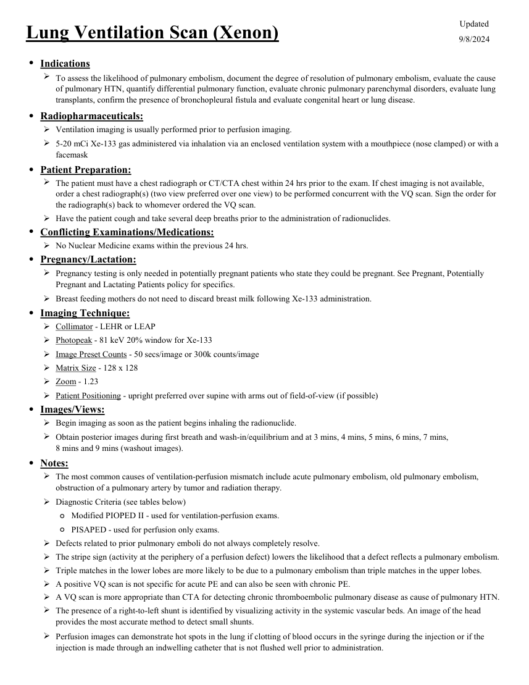
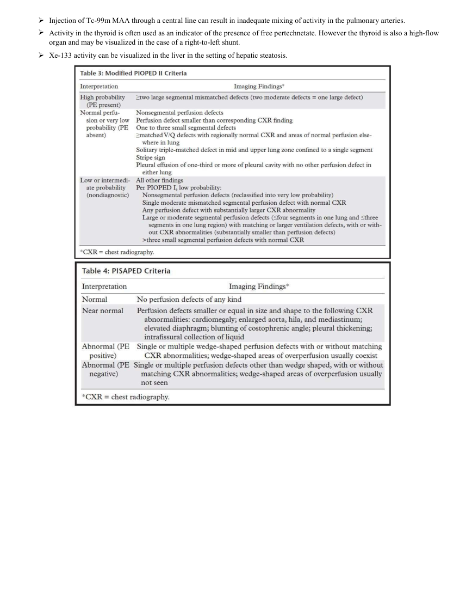

# ☢️ Scintigrafie de Ventilație și Perfuzie Pulmonară (V/Q Scan)

<!-- mcb-modalities:start -->
## Documentul original MCB — Ventilație pulmonară cu xenon

**Protocol · 2 pagini · consultat la 2026-09-27.**

[Descarcă PDF-ul integral](../../assets/mcb-modalities/mn-ventilatie-pulmonara-cu-xenon-mcb/document.pdf) · [Sursa MCB](https://ref.mcbradiology.com/Nucs/Protocols/Lung%20Ventilation%20Xenon.pdf) · [Catalogul MCB pentru această modalitate](../mcb/index.md)

Instrucțiunile, valorile și ilustrațiile din documentul original sunt păstrate în **engleză**. Titlul și navigarea sunt în română.

### Pagina 1

{ loading=lazy }

### Pagina 2

{ loading=lazy }

## Textul documentului original

??? abstract "Pagina 1 — text în engleză"

    
Updated
    Lung Ventilation Scan (Xenon)
    9/8/2024
    ●Indications
    
    To assess the likelihood of pulmonary embolism, document the degree of resolution of pulmonary embolism, evaluate the cause 
    of pulmonary HTN, quantify differential pulmonary function, evaluate chronic pulmonary parenchymal disorders, evaluate lung 
    transplants, confirm the presence of bronchopleural fistula and evaluate congenital heart or lung disease.
    ●Radiopharmaceuticals:
    Ventilation imaging is usually performed prior to perfusion imaging.
    
    5-20 mCi Xe-133 gas administered via inhalation via an enclosed ventilation system with a mouthpiece (nose clamped) or with a 
    facemask
    ●Patient Preparation:
    
    The patient must have a chest radiograph or CT/CTA chest within 24 hrs prior to the exam. If chest imaging is not available, 
    order a chest radiograph(s) (two view preferred over one view) to be performed concurrent with the VQ scan. Sign the order for 
    the radiograph(s) back to whomever ordered the VQ scan.
    Have the patient cough and take several deep breaths prior to the administration of radionuclides.
    ●Conflicting Examinations/Medications:
    No Nuclear Medicine exams within the previous 24 hrs.
    ●Pregnancy/Lactation:
    
    Pregnancy testing is only needed in potentially pregnant patients who state they could be pregnant. See Pregnant, Potentially 
    Pregnant and Lactating Patients policy for specifics.
    Breast feeding mothers do not need to discard breast milk following Xe-133 administration.
    ●Imaging Technique:
    Collimator - LEHR or LEAP
    Photopeak - 81 keV 20% window for Xe-133
    Image Preset Counts - 50 secs/image or 300k counts/image
    Matrix Size - 128 x 128
    Zoom - 1.23
    Patient Positioning - upright preferred over supine with arms out of field-of-view (if possible)
    ●Images/Views:
    Begin imaging as soon as the patient begins inhaling the radionuclide.
    
    Obtain posterior images during first breath and wash-in/equilibrium and at 3 mins, 4 mins, 5 mins, 6 mins, 7 mins,                                     
    8 mins and 9 mins (washout images).
    ●Notes:
    
    The most common causes of ventilation-perfusion mismatch include acute pulmonary embolism, old pulmonary embolism, 
    obstruction of a pulmonary artery by tumor and radiation therapy.
    Diagnostic Criteria (see tables below)
    ◦Modified PIOPED II - used for ventilation-perfusion exams.
    ◦PISAPED - used for perfusion only exams.
    Defects related to prior pulmonary emboli do not always completely resolve.
    The stripe sign (activity at the periphery of a perfusion defect) lowers the likelihood that a defect reflects a pulmonary embolism.
    
    Triple matches in the lower lobes are more likely to be due to a pulmonary embolism than triple matches in the upper lobes.
    
    A positive VQ scan is not specific for acute PE and can also be seen with chronic PE.
    A VQ scan is more appropriate than CTA for detecting chronic thromboembolic pulmonary disease as cause of pulmonary HTN.
    
    The presence of a right-to-left shunt is identified by visualizing activity in the systemic vascular beds. An image of the head 
    provides the most accurate method to detect small shunts.
    
    Perfusion images can demonstrate hot spots in the lung if clotting of blood occurs in the syringe during the injection or if the 
    injection is made through an indwelling catheter that is not flushed well prior to administration.
    

??? abstract "Pagina 2 — text în engleză"

    
Injection of Tc-99m MAA through a central line can result in inadequate mixing of activity in the pulmonary arteries.
    
    Activity in the thyroid is often used as an indicator of the presence of free pertechnetate. However the thyroid is also a high-flow 
    organ and may be visualized in the case of a right-to-left shunt.
    Xe-133 activity can be visualized in the liver in the setting of hepatic steatosis.
    

<!-- mcb-modalities:end -->

## Sinteza existentă în aplicație

Protocol oficial de **Medicină Nucleară & Radiologie Nucleară** integrat conform standardelor de calitate și radiofarmacie clinică ale **MCB Radiology** și ghidurilor internaționale **SNMMI / EANM**.

  

    ☢️ MEDICINĂ NUCLEARĂ &bull; Clasa 2 (2 - 3 mSv)
  

  

    Procedură diagnostică funcțională și moleculară. Evaluarea fiziologică in vivo a metabolismului tisular utilizând radiotrasori specifici de emisie gama sau pozitroni (PET/SPECT).
  

  

    <a href="https://ref.mcbradiology.com/Nucs/Protocols/Lung%20Ventilation%20Xenon.pdf" target="_blank" rel="noopener" style="font-weight: 600; color: #a78bfa; text-decoration: none;">
      [:material-file-pdf-box: Protocol Tehnic MCB (PDF)] ➔
    </a>
    <a href="https://ref.mcbradiology.com/Nucs/Practice%20Guidelines/Lung%20Scintigraphy.pdf" target="_blank" rel="noopener" style="font-weight: 600; color: #c4b5fd; text-decoration: none;">
      [:material-file-pdf-box: Ghid de Practică Clinică (PDF)] ➔
    </a>
  

---

## 1. Indicații Clinice Majore
- Suspiciune de trombembolism pulmonar acut (TEP), în special la pacienți cu contraindicație la substanță de contrast iodată (insuficiență renală severă, alergie la iod)
- Suspiciune de TEP la paciente gravide (doză de iradiere fetală mai redusă comparativ cu angio-CT)
- Evaluare cantitativă pre-operatorie a funcției pulmonare segmentare înainte de rezecție sau lobectomie
- Monitorizarea hipertensiunii pulmonare cronice tromboembolice (CTEPH)

---

## 2. Radiofarmaceutic, Doză & Radioprotecție
- **Trasor administrat:** `Xenon-133 gaz (370-740 MBq / 10-20 mCi) sau Tc-99m DTPA aerosol (925-1110 MBq / 25-30 mCi în nebulizator); Tc-99m MAA (Macroagregate de Albumină, 74-148 MBq / 2-4 mCi, 200.000-500.000 particule)`
- **Clasă de iradiere IRIS:** **Clasa 2 (2 - 3 mSv)**
- **Cale de administrare:** Intravenoasă, inhalatorie sau orală conform protocolului specific.
- **Măsuri de radioprotecție:** Hidratare abundentă post-procedură pentru favorizarea eliminării urinare a radiofarmaceuticului nefixat. Evitarea contactului prelungit cu femei gravide și copii mici timp de 24 ore.

---

## 3. Pregătirea Pacientului
Radiografie toracică PA și profil efectuată în ultimele 24 de ore (obligatorie pentru interpretare). Pacient așezat în șezut pentru faza de ventilație.

---

## 4. Protocol Tehnic de Achiziție Imagistică
Faza 1 - Ventilație: Respirație unică, echilibru (3-5 min) și wash-out (evacuare) cu Xenon-133, achiziție posterioară continuă. Faza 2 - Perfuzie: Injectare intravenoasă lentă de Tc-99m MAA în decubit dorsal (asigură distribuție uniformă a particulelor), urmată de achiziții planare în 8 incidențe (Ant, Post, OAD, OAS, OPD, OPS, Profil Drept, Profil Stâng) cu colimator de joasă energie și înaltă rezoluție (LEHR) sau SPECT/CT.

---

## 5. Criterii de Interpretare Diagnostică
Criterii PIOPED II revizuite: Mismatch V/Q (defecte de perfuzie segmentare/subsegmentare cu ventilație normală și radiografie toracică normală) indică probabilitate înaltă de embolie pulmonară. Match V/Q (defecte concordante) sugerează boală parenchimatoasă (BPOC, pneumonie, atelectazie).

---

## 6. Documente și Ghiduri Asociate
- [:material-file-pdf-box: Protocol Original MCB Radiology](https://ref.mcbradiology.com/Nucs/Protocols/Lung%20Ventilation%20Xenon.pdf){ target="_blank" rel="noopener" }
- [:material-file-pdf-box: Ghid de Practică Medicală SNMMI / EANM](https://ref.mcbradiology.com/Nucs/Practice%20Guidelines/Lung%20Scintigraphy.pdf){ target="_blank" rel="noopener" }
- [:material-arrow-left: Înapoi la Indexul de Medicină Nucleară](../index.md)
