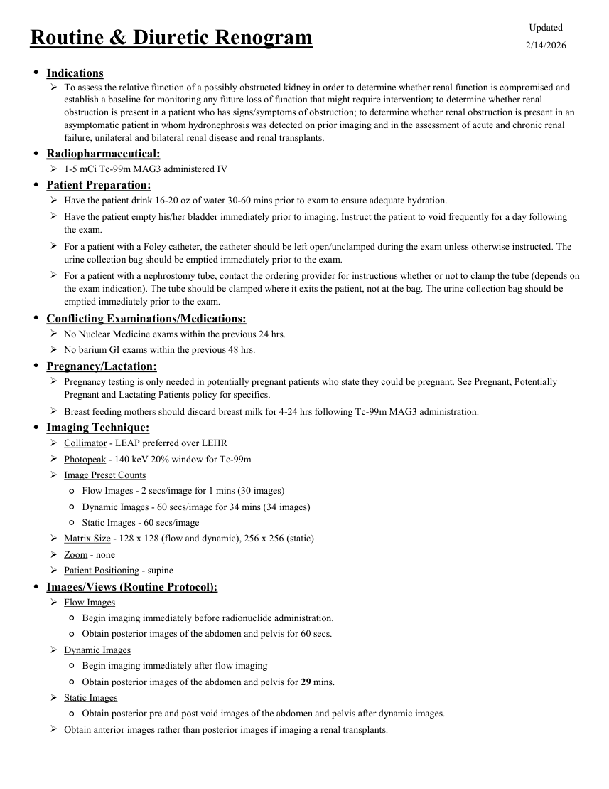
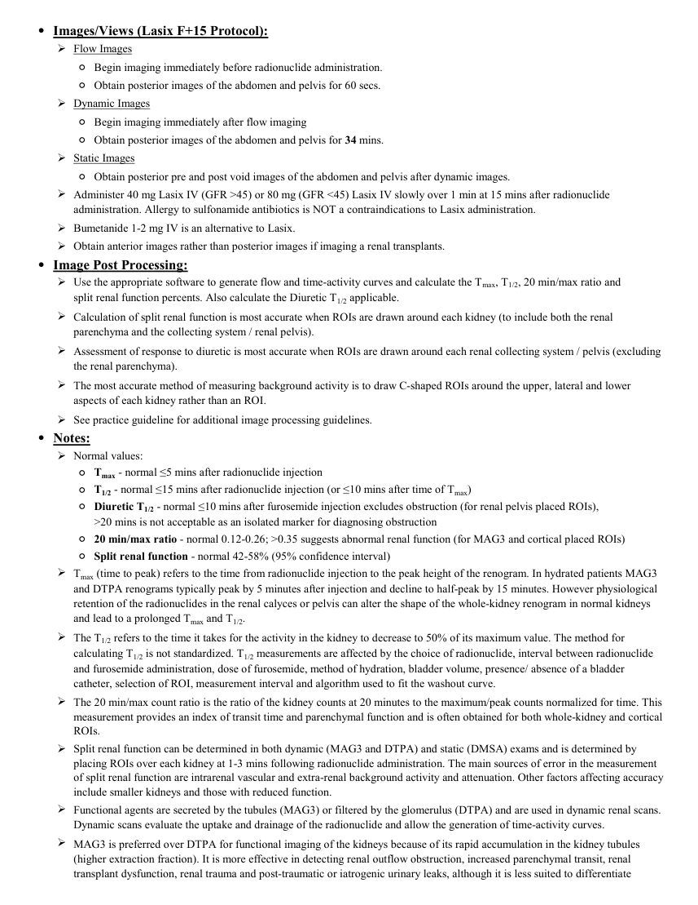
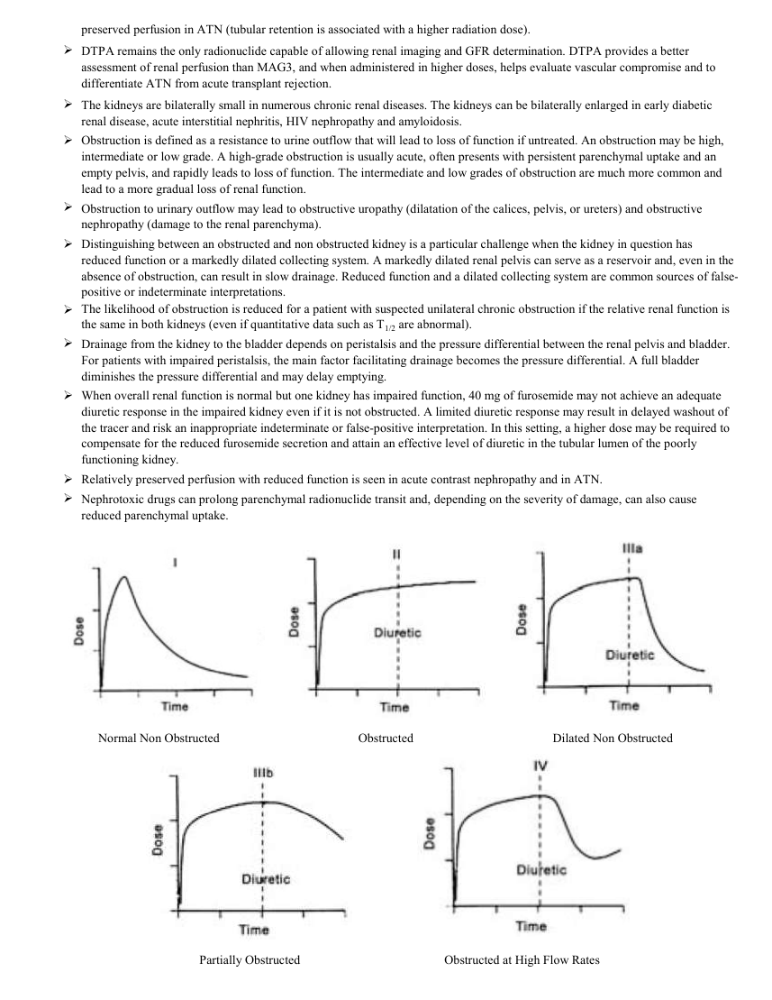

# Medicină nucleară — Scintigrafie renală (MCB)

## Documentul original MCB — Scintigrafie renală

**Protocol · 3 pagini · consultat la 2026-09-27.**

[Descarcă PDF-ul integral](../../assets/mcb-modalities/mn-scintigrafie-renala-mcb/document.pdf) · [Sursa MCB](https://ref.mcbradiology.com/Nucs/Protocols/Renal%20Scan.pdf) · [Catalogul MCB pentru această modalitate](../mcb/index.md)

Instrucțiunile, valorile și ilustrațiile din documentul original sunt păstrate în **engleză**. Titlul și navigarea sunt în română.

### Pagina 1

{ loading=lazy }

### Pagina 2

{ loading=lazy }

### Pagina 3

{ loading=lazy }

## Textul documentului original

??? abstract "Pagina 1 — text în engleză"

    
Updated
    Routine &amp; Diuretic Renogram
    2/14/2026
    ●Indications
    
    To assess the relative function of a possibly obstructed kidney in order to determine whether renal function is compromised and 
    establish a baseline for monitoring any future loss of function that might require intervention; to determine whether renal 
    obstruction is present in a patient who has signs/symptoms of obstruction; to determine whether renal obstruction is present in an 
    asymptomatic patient in whom hydronephrosis was detected on prior imaging and in the assessment of acute and chronic renal 
    failure, unilateral and bilateral renal disease and renal transplants.
    ●Radiopharmaceutical:
    1-5 mCi Tc-99m MAG3 administered IV
    ●Patient Preparation:
    Have the patient drink 16-20 oz of water 30-60 mins prior to exam to ensure adequate hydration.
    
    Have the patient empty his/her bladder immediately prior to imaging. Instruct the patient to void frequently for a day following 
    the exam.
    
    For a patient with a Foley catheter, the catheter should be left open/unclamped during the exam unless otherwise instructed. The 
    urine collection bag should be emptied immediately prior to the exam.
    
    For a patient with a nephrostomy tube, contact the ordering provider for instructions whether or not to clamp the tube (depends on 
    the exam indication). The tube should be clamped where it exits the patient, not at the bag. The urine collection bag should be 
    emptied immediately prior to the exam.
    ●Conflicting Examinations/Medications:
    No Nuclear Medicine exams within the previous 24 hrs.
    No barium GI exams within the previous 48 hrs.
    ●Pregnancy/Lactation:
    
    Pregnancy testing is only needed in potentially pregnant patients who state they could be pregnant. See Pregnant, Potentially 
    Pregnant and Lactating Patients policy for specifics.
    Breast feeding mothers should discard breast milk for 4-24 hrs following Tc-99m MAG3 administration.
    ●Imaging Technique:
    Collimator - LEAP preferred over LEHR
    Photopeak - 140 keV 20% window for Tc-99m
    Image Preset Counts
    ◦Flow Images - 2 secs/image for 1 mins (30 images)
    ◦Dynamic Images - 60 secs/image for 34 mins (34 images)
    ◦Static Images - 60 secs/image
    Matrix Size - 128 x 128 (flow and dynamic), 256 x 256 (static)
    Zoom - none
    Patient Positioning - supine
    ●Images/Views (Routine Protocol):
    Flow Images
    ◦Begin imaging immediately before radionuclide administration.
    ◦Obtain posterior images of the abdomen and pelvis for 60 secs.
    Dynamic Images
    ◦Begin imaging immediately after flow imaging
    ◦Obtain posterior images of the abdomen and pelvis for 29 mins.
    Static Images
    ◦Obtain posterior pre and post void images of the abdomen and pelvis after dynamic images.
    Obtain anterior images rather than posterior images if imaging a renal transplants.
    

??? abstract "Pagina 2 — text în engleză"

    
●Images/Views (Lasix F+15 Protocol):
    Flow Images
    ◦Begin imaging immediately before radionuclide administration.
    ◦Obtain posterior images of the abdomen and pelvis for 60 secs.
    Dynamic Images
    ◦Begin imaging immediately after flow imaging
    ◦Obtain posterior images of the abdomen and pelvis for 34 mins.
    Static Images
    ◦Obtain posterior pre and post void images of the abdomen and pelvis after dynamic images.
    
    Administer 40 mg Lasix IV (GFR &gt;45) or 80 mg (GFR &lt;45) Lasix IV slowly over 1 min at 15 mins after radionuclide 
    administration. Allergy to sulfonamide antibiotics is NOT a contraindications to Lasix administration.
    Bumetanide 1-2 mg IV is an alternative to Lasix.
    Obtain anterior images rather than posterior images if imaging a renal transplants.
    ●Image Post Processing:
    
    Use the appropriate software to generate flow and time-activity curves and calculate the Tmax, T1/2, 20 min/max ratio and                           
    split renal function percents. Also calculate the Diuretic T1/2 applicable. 
    
    Calculation of split renal function is most accurate when ROIs are drawn around each kidney (to include both the renal 
    parenchyma and the collecting system / renal pelvis).
    
    Assessment of response to diuretic is most accurate when ROIs are drawn around each renal collecting system / pelvis (excluding 
    the renal parenchyma).
    
    The most accurate method of measuring background activity is to draw C-shaped ROIs around the upper, lateral and lower 
    aspects of each kidney rather than an ROI.
    See practice guideline for additional image processing guidelines.
    ●Notes:
    Normal values:
    ◦Tmax - normal ≤5 mins after radionuclide injection
    ◦T1/2 - normal ≤15 mins after radionuclide injection (or ≤10 mins after time of Tmax)
    ◦
    Diuretic T1/2 - normal ≤10 mins after furosemide injection excludes obstruction (for renal pelvis placed ROIs),                                   
    &gt;20 mins is not acceptable as an isolated marker for diagnosing obstruction
    ◦20 min/max ratio - normal 0.12-0.26; &gt;0.35 suggests abnormal renal function (for MAG3 and cortical placed ROIs)
    ◦Split renal function - normal 42-58% (95% confidence interval)
    
    Tmax (time to peak) refers to the time from radionuclide injection to the peak height of the renogram. In hydrated patients MAG3 
    and DTPA renograms typically peak by 5 minutes after injection and decline to half-peak by 15 minutes. However physiological 
    retention of the radionuclides in the renal calyces or pelvis can alter the shape of the whole-kidney renogram in normal kidneys 
    and lead to a prolonged Tmax and T1/2.
    
    The T1/2 refers to the time it takes for the activity in the kidney to decrease to 50% of its maximum value. The method for 
    calculating T1/2 is not standardized. T1/2 measurements are affected by the choice of radionuclide, interval between radionuclide 
    and furosemide administration, dose of furosemide, method of hydration, bladder volume, presence/ absence of a bladder 
    catheter, selection of ROI, measurement interval and algorithm used to fit the washout curve.
    
    The 20 min/max count ratio is the ratio of the kidney counts at 20 minutes to the maximum/peak counts normalized for time. This 
    measurement provides an index of transit time and parenchymal function and is often obtained for both whole-kidney and cortical 
    ROIs.
    
    Split renal function can be determined in both dynamic (MAG3 and DTPA) and static (DMSA) exams and is determined by 
    placing ROIs over each kidney at 1-3 mins following radionuclide administration. The main sources of error in the measurement 
    of split renal function are intrarenal vascular and extra-renal background activity and attenuation. Other factors affecting accuracy 
    include smaller kidneys and those with reduced function.
    
    Functional agents are secreted by the tubules (MAG3) or filtered by the glomerulus (DTPA) and are used in dynamic renal scans. 
    Dynamic scans evaluate the uptake and drainage of the radionuclide and allow the generation of time-activity curves.
    MAG3 is preferred over DTPA for functional imaging of the kidneys because of its rapid accumulation in the kidney tubules 
    (higher extraction fraction). It is more effective in detecting renal outflow obstruction, increased parenchymal transit, renal 
    transplant dysfunction, renal trauma and post-traumatic or iatrogenic urinary leaks, although it is less suited to differentiate 
    preserved perfusion in ATN (tubular retention is associated with a higher radiation dose).
    

??? abstract "Pagina 3 — text în engleză"

    
preserved perfusion in ATN (tubular retention is associated with a higher radiation dose).
    
    DTPA remains the only radionuclide capable of allowing renal imaging and GFR determination. DTPA provides a better 
    assessment of renal perfusion than MAG3, and when administered in higher doses, helps evaluate vascular compromise and to 
    differentiate ATN from acute transplant rejection.
    
    The kidneys are bilaterally small in numerous chronic renal diseases. The kidneys can be bilaterally enlarged in early diabetic 
    renal disease, acute interstitial nephritis, HIV nephropathy and amyloidosis.
    
    Obstruction is defined as a resistance to urine outflow that will lead to loss of function if untreated. An obstruction may be high, 
    intermediate or low grade. A high-grade obstruction is usually acute, often presents with persistent parenchymal uptake and an 
    empty pelvis, and rapidly leads to loss of function. The intermediate and low grades of obstruction are much more common and 
    lead to a more gradual loss of renal function.
    
    Obstruction to urinary outflow may lead to obstructive uropathy (dilatation of the calices, pelvis, or ureters) and obstructive 
    nephropathy (damage to the renal parenchyma).
    
    Distinguishing between an obstructed and non obstructed kidney is a particular challenge when the kidney in question has 
    reduced function or a markedly dilated collecting system. A markedly dilated renal pelvis can serve as a reservoir and, even in the 
    absence of obstruction, can result in slow drainage. Reduced function and a dilated collecting system are common sources of false-
    positive or indeterminate interpretations.
    
    The likelihood of obstruction is reduced for a patient with suspected unilateral chronic obstruction if the relative renal function is 
    the same in both kidneys (even if quantitative data such as T1/2 are abnormal).
    
    Drainage from the kidney to the bladder depends on peristalsis and the pressure differential between the renal pelvis and bladder. 
    For patients with impaired peristalsis, the main factor facilitating drainage becomes the pressure differential. A full bladder 
    diminishes the pressure differential and may delay emptying.
    
    When overall renal function is normal but one kidney has impaired function, 40 mg of furosemide may not achieve an adequate 
    diuretic response in the impaired kidney even if it is not obstructed. A limited diuretic response may result in delayed washout of 
    the tracer and risk an inappropriate indeterminate or false-positive interpretation. In this setting, a higher dose may be required to 
    compensate for the reduced furosemide secretion and attain an effective level of diuretic in the tubular lumen of the poorly 
    functioning kidney.
    Relatively preserved perfusion with reduced function is seen in acute contrast nephropathy and in ATN.
    
    Nephrotoxic drugs can prolong parenchymal radionuclide transit and, depending on the severity of damage, can also cause 
    reduced parenchymal uptake.
    Normal Non Obstructed
    Obstructed
    Dilated Non Obstructed
    Partially Obstructed
    Obstructed at High Flow Rates
    

