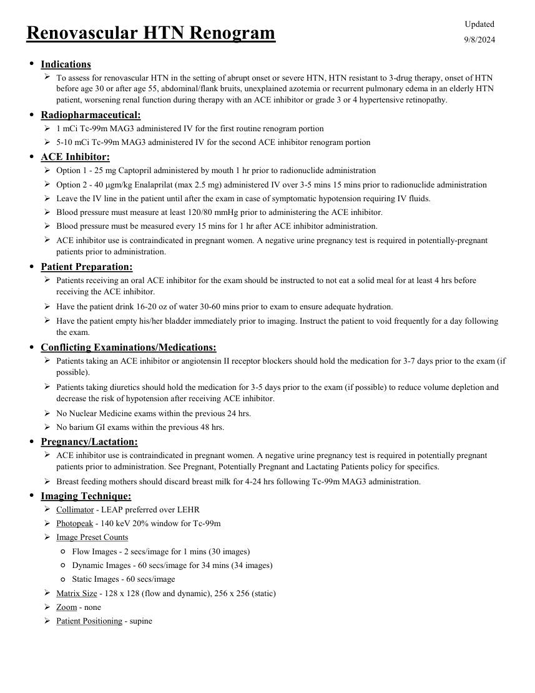
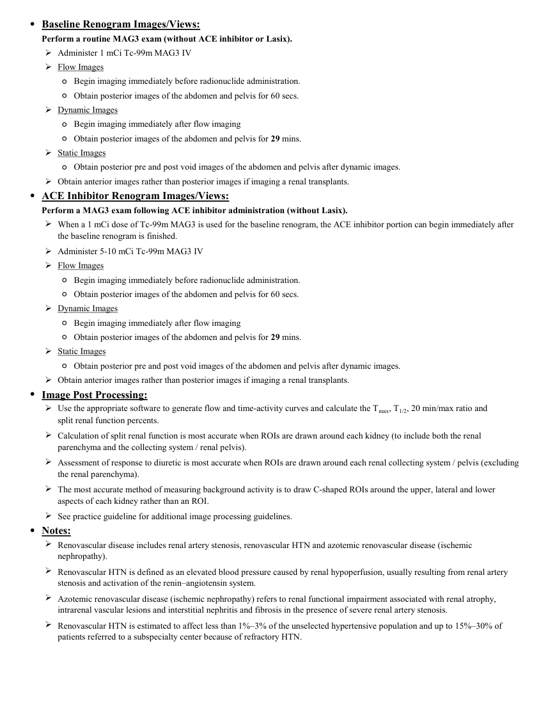
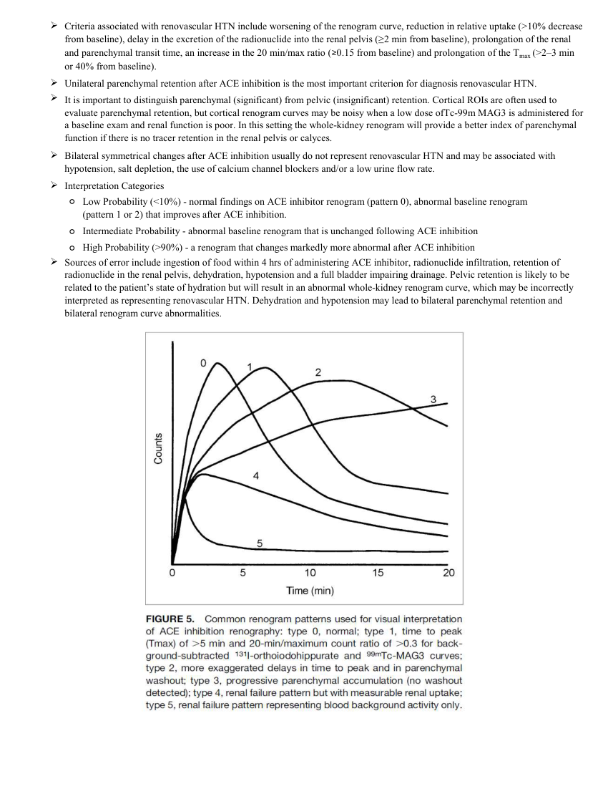

# ☢️ Scintigrafie Renală cu Captopril pentru Hipertensiune Renovasculară

<!-- mcb-modalities:start -->
## Documentul original MCB — Hipertensiune renovasculară

**Protocol · 3 pagini · consultat la 2026-09-27.**

[Descarcă PDF-ul integral](../../assets/mcb-modalities/mn-hipertensiune-renovasculara-mcb/document.pdf) · [Sursa MCB](https://ref.mcbradiology.com/Nucs/Protocols/Renal%20Vascular%20HTN.pdf) · [Catalogul MCB pentru această modalitate](../mcb/index.md)

Instrucțiunile, valorile și ilustrațiile din documentul original sunt păstrate în **engleză**. Titlul și navigarea sunt în română.

### Pagina 1

{ loading=lazy }

### Pagina 2

{ loading=lazy }

### Pagina 3

{ loading=lazy }

## Textul documentului original

??? abstract "Pagina 1 — text în engleză"

    
Updated
    Renovascular HTN Renogram
    9/8/2024
    ●Indications
    
    To assess for renovascular HTN in the setting of abrupt onset or severe HTN, HTN resistant to 3-drug therapy, onset of HTN 
    before age 30 or after age 55, abdominal/flank bruits, unexplained azotemia or recurrent pulmonary edema in an elderly HTN 
    patient, worsening renal function during therapy with an ACE inhibitor or grade 3 or 4 hypertensive retinopathy.
    ●Radiopharmaceutical:
    1 mCi Tc-99m MAG3 administered IV for the first routine renogram portion
    5-10 mCi Tc-99m MAG3 administered IV for the second ACE inhibitor renogram portion
    ●ACE Inhibitor:
    Option 1 - 25 mg Captopril administered by mouth 1 hr prior to radionuclide administration
    Option 2 - 40 mgm/kg Enalaprilat (max 2.5 mg) administered IV over 3-5 mins 15 mins prior to radionuclide administration
    Leave the IV line in the patient until after the exam in case of symptomatic hypotension requiring IV fluids.
    Blood pressure must measure at least 120/80 mmHg prior to administering the ACE inhibitor.
    Blood pressure must be measured every 15 mins for 1 hr after ACE inhibitor administration.
    
    ACE inhibitor use is contraindicated in pregnant women. A negative urine pregnancy test is required in potentially-pregnant 
    patients prior to administration.
    ●Patient Preparation:
    
    Patients receiving an oral ACE inhibitor for the exam should be instructed to not eat a solid meal for at least 4 hrs before 
    receiving the ACE inhibitor.
    Have the patient drink 16-20 oz of water 30-60 mins prior to exam to ensure adequate hydration.
    
    Have the patient empty his/her bladder immediately prior to imaging. Instruct the patient to void frequently for a day following 
    the exam.
    ●Conflicting Examinations/Medications:
    
    Patients taking an ACE inhibitor or angiotensin II receptor blockers should hold the medication for 3-7 days prior to the exam (if 
    possible).
    
    Patients taking diuretics should hold the medication for 3-5 days prior to the exam (if possible) to reduce volume depletion and 
    decrease the risk of hypotension after receiving ACE inhibitor.
    No Nuclear Medicine exams within the previous 24 hrs.
    No barium GI exams within the previous 48 hrs.
    ●Pregnancy/Lactation:
    
    ACE inhibitor use is contraindicated in pregnant women. A negative urine pregnancy test is required in potentially pregnant 
    patients prior to administration. See Pregnant, Potentially Pregnant and Lactating Patients policy for specifics.
    Breast feeding mothers should discard breast milk for 4-24 hrs following Tc-99m MAG3 administration.
    ●Imaging Technique:
    Collimator - LEAP preferred over LEHR
    Photopeak - 140 keV 20% window for Tc-99m
    Image Preset Counts
    ◦Flow Images - 2 secs/image for 1 mins (30 images)
    ◦Dynamic Images - 60 secs/image for 34 mins (34 images)
    ◦Static Images - 60 secs/image
    Matrix Size - 128 x 128 (flow and dynamic), 256 x 256 (static)
    Zoom - none
    Patient Positioning - supine
    

??? abstract "Pagina 2 — text în engleză"

    
●Baseline Renogram Images/Views:
    Perform a routine MAG3 exam (without ACE inhibitor or Lasix).
    Administer 1 mCi Tc-99m MAG3 IV
    Flow Images
    ◦Begin imaging immediately before radionuclide administration.
    ◦Obtain posterior images of the abdomen and pelvis for 60 secs.
    Dynamic Images
    ◦Begin imaging immediately after flow imaging
    ◦Obtain posterior images of the abdomen and pelvis for 29 mins.
    Static Images
    ◦Obtain posterior pre and post void images of the abdomen and pelvis after dynamic images.
    Obtain anterior images rather than posterior images if imaging a renal transplants.
    ●ACE Inhibitor Renogram Images/Views:
    Perform a MAG3 exam following ACE inhibitor administration (without Lasix).
    
    When a 1 mCi dose of Tc-99m MAG3 is used for the baseline renogram, the ACE inhibitor portion can begin immediately after 
    the baseline renogram is finished.
    Administer 5-10 mCi Tc-99m MAG3 IV
    Flow Images
    ◦Begin imaging immediately before radionuclide administration.
    ◦Obtain posterior images of the abdomen and pelvis for 60 secs.
    Dynamic Images
    ◦Begin imaging immediately after flow imaging
    ◦Obtain posterior images of the abdomen and pelvis for 29 mins.
    Static Images
    ◦Obtain posterior pre and post void images of the abdomen and pelvis after dynamic images.
    Obtain anterior images rather than posterior images if imaging a renal transplants.
    ●Image Post Processing:
    
    Use the appropriate software to generate flow and time-activity curves and calculate the Tmax, T1/2, 20 min/max ratio and                           
    split renal function percents.
    
    Calculation of split renal function is most accurate when ROIs are drawn around each kidney (to include both the renal 
    parenchyma and the collecting system / renal pelvis).
    
    Assessment of response to diuretic is most accurate when ROIs are drawn around each renal collecting system / pelvis (excluding 
    the renal parenchyma).
    
    The most accurate method of measuring background activity is to draw C-shaped ROIs around the upper, lateral and lower 
    aspects of each kidney rather than an ROI.
    See practice guideline for additional image processing guidelines.
    ●Notes:
    
    Renovascular disease includes renal artery stenosis, renovascular HTN and azotemic renovascular disease (ischemic 
    nephropathy).
    
    Renovascular HTN is defined as an elevated blood pressure caused by renal hypoperfusion, usually resulting from renal artery 
    stenosis and activation of the renin–angiotensin system.
    
    Azotemic renovascular disease (ischemic nephropathy) refers to renal functional impairment associated with renal atrophy, 
    intrarenal vascular lesions and interstitial nephritis and fibrosis in the presence of severe renal artery stenosis.
    
    Renovascular HTN is estimated to affect less than 1%–3% of the unselected hypertensive population and up to 15%–30% of 
    patients referred to a subspecialty center because of refractory HTN.
    

??? abstract "Pagina 3 — text în engleză"

    

    Criteria associated with renovascular HTN include worsening of the renogram curve, reduction in relative uptake (&gt;10% decrease 
    from baseline), delay in the excretion of the radionuclide into the renal pelvis (≥2 min from baseline), prolongation of the renal 
    and parenchymal transit time, an increase in the 20 min/max ratio (≥0.15 from baseline) and prolongation of the Tmax (&gt;2–3 min 
    or 40% from baseline). 
    Unilateral parenchymal retention after ACE inhibition is the most important criterion for diagnosis renovascular HTN.
    
    It is important to distinguish parenchymal (significant) from pelvic (insignificant) retention. Cortical ROIs are often used to 
    evaluate parenchymal retention, but cortical renogram curves may be noisy when a low dose ofTc-99m MAG3 is administered for 
    a baseline exam and renal function is poor. In this setting the whole-kidney renogram will provide a better index of parenchymal 
    function if there is no tracer retention in the renal pelvis or calyces.
    
    Bilateral symmetrical changes after ACE inhibition usually do not represent renovascular HTN and may be associated with 
    hypotension, salt depletion, the use of calcium channel blockers and/or a low urine flow rate.
    Interpretation Categories
    ◦
    Low Probability (&lt;10%) - normal findings on ACE inhibitor renogram (pattern 0), abnormal baseline renogram                                  
    (pattern 1 or 2) that improves after ACE inhibition.
    Intermediate Probability - abnormal baseline renogram that is unchanged following ACE inhibition
    High Probability (&gt;90%) - a renogram that changes markedly more abnormal after ACE inhibition
    ◦
    ◦
    
    Sources of error include ingestion of food within 4 hrs of administering ACE inhibitor, radionuclide infiltration, retention of 
    radionuclide in the renal pelvis, dehydration, hypotension and a full bladder impairing drainage. Pelvic retention is likely to be 
    related to the patient’s state of hydration but will result in an abnormal whole-kidney renogram curve, which may be incorrectly 
    interpreted as representing renovascular HTN. Dehydration and hypotension may lead to bilateral parenchymal retention and 
    bilateral renogram curve abnormalities.
    

<!-- mcb-modalities:end -->

## Sinteza existentă în aplicație

Protocol oficial de **Medicină Nucleară & Radiologie Nucleară** integrat conform standardelor de calitate și radiofarmacie clinică ale **MCB Radiology** și ghidurilor internaționale **SNMMI / EANM**.

  

    ☢️ MEDICINĂ NUCLEARĂ &bull; Clasa 1 - 2 (2 mSv)
  

  

    Procedură diagnostică funcțională și moleculară. Evaluarea fiziologică in vivo a metabolismului tisular utilizând radiotrasori specifici de emisie gama sau pozitroni (PET/SPECT).
  

  

    <a href="https://ref.mcbradiology.com/Nucs/Protocols/Renal%20Vascular%20HTN.pdf" target="_blank" rel="noopener" style="font-weight: 600; color: #a78bfa; text-decoration: none;">
      [:material-file-pdf-box: Protocol Tehnic MCB (PDF)] ➔
    </a>
    <a href="https://ref.mcbradiology.com/Nucs/Practice%20Guidelines/Renal%20Captopril%20Scintigraphy.pdf" target="_blank" rel="noopener" style="font-weight: 600; color: #c4b5fd; text-decoration: none;">
      [:material-file-pdf-box: Ghid de Practică Clinică (PDF)] ➔
    </a>
  

---

## 1. Indicații Clinice Majore
- Diagnosticul stenozei de arteră renală hemodinamic semnificative cu hipertensiune renovasculară
- Prezicerea succesului clinic al revascularizării (angioplastie percutanată cu stent sau chirurgie)
- Hipertensiune arterială refractară la tratament triplu sau debut la vârste tinere / avansate

---

## 2. Radiofarmaceutic, Doză & Radioprotecție
- **Trasor administrat:** `Tc-99m MAG3 sau Tc-99m DTPA (185-370 MBq / 5-10 mCi i.v.)`
- **Clasă de iradiere IRIS:** **Clasa 1 - 2 (2 mSv)**
- **Cale de administrare:** Intravenoasă, inhalatorie sau orală conform protocolului specific.
- **Măsuri de radioprotecție:** Hidratare abundentă post-procedură pentru favorizarea eliminării urinare a radiofarmaceuticului nefixat. Evitarea contactului prelungit cu femei gravide și copii mici timp de 24 ore.

---

## 3. Pregătirea Pacientului
Oprirea inhibitorilor ECA (Captopril, Enalapril) cu 48-72 ore înainte și a blocanților de receptori AT1 (sartani) cu 5-7 zile înainte. Hidratare orală bună.

---

## 4. Protocol Tehnic de Achiziție Imagistică
Protocol în 1 sau 2 zile: Administrare Captopril oral (25-50 mg sfărâmat în apă) cu 60 minute înainte de injectarea trasorului. Monitorizarea tensiunii arteriale la fiecare 15 minute. Achiziție dinamică timp de 30 minute identică cu renograma de bază.

---

## 5. Criterii de Interpretare Diagnostică
Test pozitiv de probabilitate înaltă: scăderea marcată a funcției renale relative a rinichiului afectat (> 10%) și/sau întârzierea marcată a timpului până la vârful de captare (Tmax) post-Captopril, comparativ cu renograma de bază fără inhibitor.

---

## 6. Documente și Ghiduri Asociate
- [:material-file-pdf-box: Protocol Original MCB Radiology](https://ref.mcbradiology.com/Nucs/Protocols/Renal%20Vascular%20HTN.pdf){ target="_blank" rel="noopener" }
- [:material-file-pdf-box: Ghid de Practică Medicală SNMMI / EANM](https://ref.mcbradiology.com/Nucs/Practice%20Guidelines/Renal%20Captopril%20Scintigraphy.pdf){ target="_blank" rel="noopener" }
- [:material-arrow-left: Înapoi la Indexul de Medicină Nucleară](../index.md)
