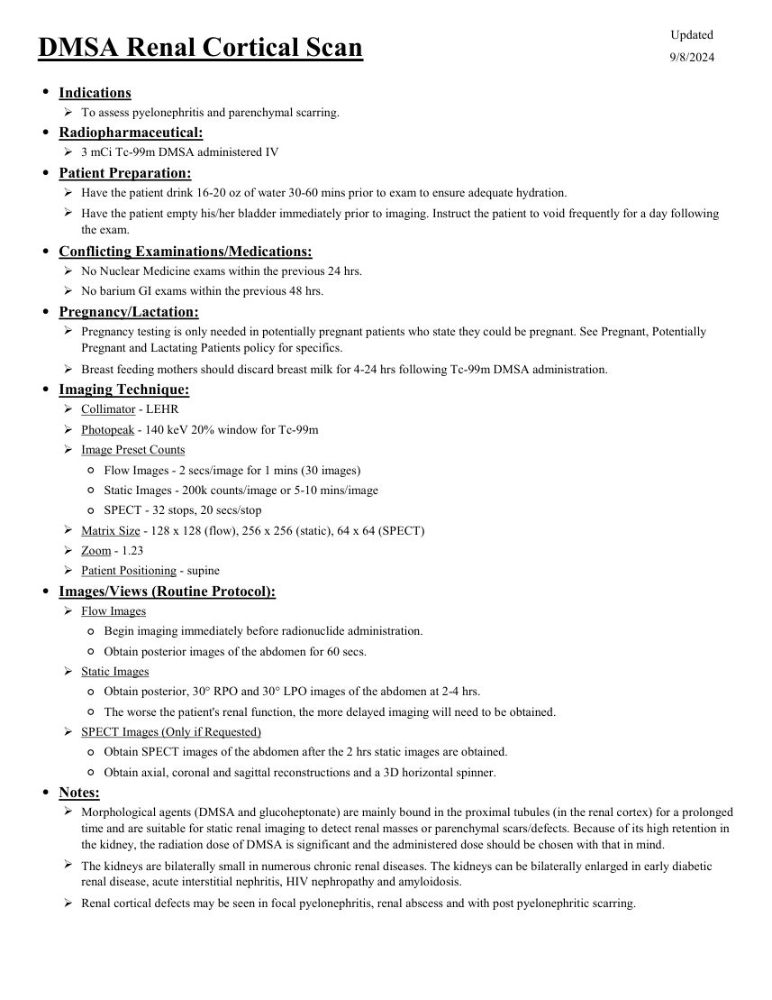

# ☢️ Scintigrafie Renală Corticală cu DMSA

<!-- mcb-modalities:start -->
## Documentul original MCB — Scintigrafie renală DMSA

**Protocol · 1 pagini · consultat la 2026-09-27.**

[Descarcă PDF-ul integral](../../assets/mcb-modalities/mn-scintigrafie-renala-dmsa-mcb/document.pdf) · [Sursa MCB](https://ref.mcbradiology.com/Nucs/Protocols/Renal%20DMSA.pdf) · [Catalogul MCB pentru această modalitate](../mcb/index.md)

Instrucțiunile, valorile și ilustrațiile din documentul original sunt păstrate în **engleză**. Titlul și navigarea sunt în română.

### Pagina 1

{ loading=lazy }

## Textul documentului original

??? abstract "Pagina 1 — text în engleză"

    
Updated
    DMSA Renal Cortical Scan
    9/8/2024
    ●Indications
    To assess pyelonephritis and parenchymal scarring.
    ●Radiopharmaceutical:
    3 mCi Tc-99m DMSA administered IV
    ●Patient Preparation:
    Have the patient drink 16-20 oz of water 30-60 mins prior to exam to ensure adequate hydration.
    
    Have the patient empty his/her bladder immediately prior to imaging. Instruct the patient to void frequently for a day following 
    the exam.
    ●Conflicting Examinations/Medications:
    No Nuclear Medicine exams within the previous 24 hrs.
    No barium GI exams within the previous 48 hrs.
    ●Pregnancy/Lactation:
    
    Pregnancy testing is only needed in potentially pregnant patients who state they could be pregnant. See Pregnant, Potentially 
    Pregnant and Lactating Patients policy for specifics.
    Breast feeding mothers should discard breast milk for 4-24 hrs following Tc-99m DMSA administration.
    ●Imaging Technique:
    Collimator - LEHR
    Photopeak - 140 keV 20% window for Tc-99m
    Image Preset Counts
    ◦Flow Images - 2 secs/image for 1 mins (30 images)
    ◦Static Images - 200k counts/image or 5-10 mins/image
    ◦SPECT - 32 stops, 20 secs/stop
    Matrix Size - 128 x 128 (flow), 256 x 256 (static), 64 x 64 (SPECT)
    Zoom - 1.23
    Patient Positioning - supine
    ●Images/Views (Routine Protocol):
    Flow Images
    ◦Begin imaging immediately before radionuclide administration.
    ◦Obtain posterior images of the abdomen for 60 secs.
    Static Images
    ◦Obtain posterior, 30° RPO and 30° LPO images of the abdomen at 2-4 hrs.
    ◦The worse the patient&#x27;s renal function, the more delayed imaging will need to be obtained.
    SPECT Images (Only if Requested)
    ◦Obtain SPECT images of the abdomen after the 2 hrs static images are obtained.
    ◦Obtain axial, coronal and sagittal reconstructions and a 3D horizontal spinner.
    ●Notes:
    
    Morphological agents (DMSA and glucoheptonate) are mainly bound in the proximal tubules (in the renal cortex) for a prolonged 
    time and are suitable for static renal imaging to detect renal masses or parenchymal scars/defects. Because of its high retention in 
    the kidney, the radiation dose of DMSA is significant and the administered dose should be chosen with that in mind.
    
    The kidneys are bilaterally small in numerous chronic renal diseases. The kidneys can be bilaterally enlarged in early diabetic 
    renal disease, acute interstitial nephritis, HIV nephropathy and amyloidosis.
    Renal cortical defects may be seen in focal pyelonephritis, renal abscess and with post pyelonephritic scarring.
    

<!-- mcb-modalities:end -->

## Sinteza existentă în aplicație

Protocol oficial de **Medicină Nucleară & Radiologie Nucleară** integrat conform standardelor de calitate și radiofarmacie clinică ale **MCB Radiology** și ghidurilor internaționale **SNMMI / EANM**.

  

    ☢️ MEDICINĂ NUCLEARĂ &bull; Clasa 1 (1 - 2 mSv)
  

  

    Procedură diagnostică funcțională și moleculară. Evaluarea fiziologică in vivo a metabolismului tisular utilizând radiotrasori specifici de emisie gama sau pozitroni (PET/SPECT).
  

  

    <a href="https://ref.mcbradiology.com/Nucs/Protocols/Renal%20DMSA.pdf" target="_blank" rel="noopener" style="font-weight: 600; color: #a78bfa; text-decoration: none;">
      [:material-file-pdf-box: Protocol Tehnic MCB (PDF)] ➔
    </a>
    <a href="https://ref.mcbradiology.com/Nucs/Practice%20Guidelines/Renal%20Scintigraphy.pdf" target="_blank" rel="noopener" style="font-weight: 600; color: #c4b5fd; text-decoration: none;">
      [:material-file-pdf-box: Ghid de Practică Clinică (PDF)] ➔
    </a>
  

---

## 1. Indicații Clinice Majore
- Standardul de aur imagistic pentru detecția cicatricilor renale post-pielonefrită la copii cu reflux vezico-ureteral (RVU)
- Diagnosticul pielonefritei acute (defecte focale fotopenice)
- Calculul precis al masei corticale funcționale renale relative
- Anomalii de poziție/fuziune (rinichi în potcoavă, ectopie renală)

---

## 2. Radiofarmaceutic, Doză & Radioprotecție
- **Trasor administrat:** `Tc-99m DMSA (Acid Dimercaptosuccinic, 74-185 MBq / 2-5 mCi i.v.)`
- **Clasă de iradiere IRIS:** **Clasa 1 (1 - 2 mSv)**
- **Cale de administrare:** Intravenoasă, inhalatorie sau orală conform protocolului specific.
- **Măsuri de radioprotecție:** Hidratare abundentă post-procedură pentru favorizarea eliminării urinare a radiofarmaceuticului nefixat. Evitarea contactului prelungit cu femei gravide și copii mici timp de 24 ore.

---

## 3. Pregătirea Pacientului
Hidratare adecvată. Nu necesită post alimentar.

---

## 4. Protocol Tehnic de Achiziție Imagistică
DMSA se leagă stabil de tubii contorți proximali. Achiziția începe la 2-4 ore post-injectare pentru a permite clearance-ul sangvin. Incidențe planare de înaltă rezoluție (Posterior, OAP Dreaptă și Stângă) sau SPECT / SPECT-CT.

---

## 5. Criterii de Interpretare Diagnostică
Contur cortical neted și fixare omogenă. Cicatrice renală: defect cortical fotopenic triunghiular sau liniar cu pierdere de volum cortical. Pielonefrită acută: defect fără pierdere de volum.

---

## 6. Documente și Ghiduri Asociate
- [:material-file-pdf-box: Protocol Original MCB Radiology](https://ref.mcbradiology.com/Nucs/Protocols/Renal%20DMSA.pdf){ target="_blank" rel="noopener" }
- [:material-file-pdf-box: Ghid de Practică Medicală SNMMI / EANM](https://ref.mcbradiology.com/Nucs/Practice%20Guidelines/Renal%20Scintigraphy.pdf){ target="_blank" rel="noopener" }
- [:material-arrow-left: Înapoi la Indexul de Medicină Nucleară](../index.md)
