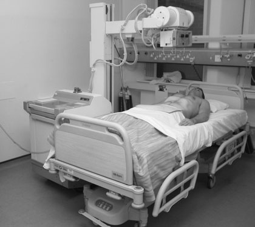
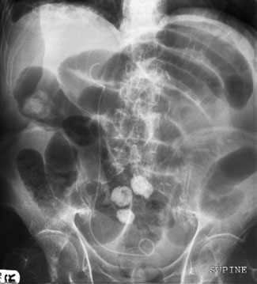
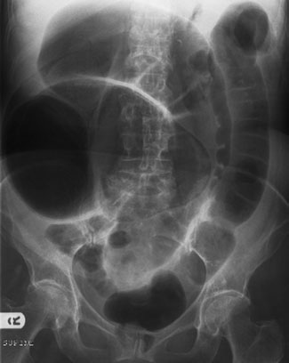

# Rx Abdomen Antero-Posterior (AP) - Decubit Dorsal

  📷 Radiografie Convențională (Rx)
  <strong>Actualizat:</strong> 2026-09-16
  <strong>Autor:</strong> Departamentul de Radiologie / Referință Clark (Ed. 12)

---

-   __1. Rezumat Clinic & Indicații__

    ---

    === "Indicații Clinice"

        - distensie gazoasă a oricărei porțiuni a tractului gastrointestinal;
        - pneumoperitoneu (aer liber subdiafragmatic) sau lichid în cavitatea peritoneală;
        - nivele hidroaerice în intestine;
        - localizarea unui corp străin radiopac radiopac;
        - semne de anevrism aortic. Incidență antero-posterioară (AP) – decubit dorsal

    === "Ghid Național IRIS"

        !!! info "Referință Primară: Ghidul Național IRIS (Ordinul MS 1342/2012)"
            - **Capitol Ghid IRIS:** *Aparat digestiv & Abdomen*
            - **Grad de Recomandare:** **Grad B**
            - **Nivel de Iradiere Estimată:** `Clasa 2 (Foarte mică ~ 0.7 - 1.2 mSv)`

            [:octicons-search-16: Deschide Ghidul IRIS](../../iris.md){ .md-button .md-button--primary } [:material-open-in-new: Aplicația Oficială PWA](https://radiologie-pediatrica.ro/iris/){ .md-button target="_blank" rel="noopener" }

-   __2. Poziționare & Centrare Fascicul__

    ---

    - **Poziție Pacient:**
        - Cu pacientul în decubit dorsal, caseta cu grilă antidifuzoare este poziționată cu grijă sub abdomen. Pacientul poate fi ridicat utilizând o tehnică de ridicare bine exersată și sigură, în timp ce caseta este strecurată sub el. Trebuie avut grijă să nu se provoace durere pacientului prin forțarea casetei în poziție sau prin utilizarea unei casete reci, care ar putea provoca un șoc pacientului.
        - Caseta cu grilă antidifuzoare trebuie poziționată astfel încât să includă simfiza pubiană la marginea inferioară a imaginii. Caseta trebuie, de asemenea, să fie în poziție orizontală pe pat și să nu fie înclinată. Dacă nu este așezată orizontal, grila poate atenua fasciculul de radiații, ceea ce poate crea aspectul unei leziuni cu radioopacitate crescută, precum o masă intraabdominală, din cauza scăderii densității optice a imaginii.
    - **Punct de Centrare Fascicul:**
        - Se orientează raza centrală perpendicular pe casetă, pe linia mediană, la nivelul crestelor iliace.
        - Expunerea se efectuează în apnee la sfârșitul expirului complet. 358 Radiografie de abdomen cu aparat mobil, în decubit dorsal, evidențiind ocluzie intestinală la nivelul intestinului subțire (nivele hidroaerice centrale). Se observă, de asemenea, un stent ureteral drept cu capăt în buclă, deoarece pacientul avea carcinom cu celule tranziționale al vezicii urinare. Radiografie de abdomen cu aparat mobil, în decubit dorsal, evidențiind obstrucție colonică distală. Distensie gazoasă. Abdomen în incidență antero-posterioară (AP), pacient în decubit dorsal. Pneumoperitoneu (aer liber subdiafragmatic) în cavitatea peritoneală. Torace în incidență antero-posterioară (AP), pacient în ortostatism. Abdomen în incidență antero-posterioară (AP), pacient în decubit dorsal. Incidență antero-posterioară (AP)/postero-anterioară în decubit lateral stâng. Nivele hidroaerice. Abdomen în incidență antero-posterioară (AP), pacient în ortostatism. Corp străin radiopac. Abdomen în incidență antero-posterioară (AP), pacient în decubit dorsal. Anevrism aortic. Abdomen în incidență antero-posterioară (AP), pacient în decubit dorsal. Incidență de profil (decubit dorsal).
    - **Distanță Focar-Film (DFF / SID):** 100 cm
    - **Comandă Respiratorie:** Expunerea se efectuează în apnee la sfârșitul expirului complet

-   __3. Parametri Tehnici Expunere__

    ---

    | Parametru Tehnic | Valoare Configurare Generator / Tub |
    |:-----------------|:-------------------------------------|
    | **Tensiune Tub (kV)** | DE CONFIGURAT PE APARAT |
    | **Sarcină / Produs Curent-Timp (mAs)** | Conform AEC / grosimii anatomice |
    | **Distanță Focar-Film (DFF / SID)** | 100 cm |
    | **Grilă Antidifuzoare (Bucky)** | Conform grosimii anatomice (> 10-12 cm cu grilă) |
    | **Dimensiune Focar** | Focar Mic (0.6 mm) |
    | **Camere de Ionizare AEC** | DE CONFIGURAT PE APARAT |
    | **Colimare Fascicul** | Colimare strictă la aria anatomică de interes diagnostic |
    | **Filtrare Tub** | Totală ≥ 2.5 mm Al echivalent (conform Clark: 3.0 mm Al echivalent) |

-   __4. Criterii de Calitate & Reușită Imagine__

    ---

    - Vizualizarea clară a întregii arii anatomice (Abdomen).
    - Absența artefactelor de mișcare; trabeculație osoasă și contururi nete.
    - Densitate optică și contrast adecvate pentru diferențierea țesuturilor moi de structurile osoase.

-   __5. Protecție Radiologică (ALARA)__

    ---

    - Ecranare gonadică cu șorț plumbat dacă gonadele sunt în apropierea fasciculului util (regula ALARA).
    - Colimare precisă la dimensiunea anatomică strict necesară pentru reducerea dozei și a radiației difuze.
    - Verificarea posibilității unei sarcini la pacientele de vârstă fertilă înainte de expunere.

!!! note "Observații Clinice & Tehnice"
    - Radiografiile pot fi efectuate utilizând o tehnică cu kVp ridicat pentru a scurta timpul de expunere și a reduce neclaritatea cauzată de mișcare, deși radiația difuză crescută poate deteriora contrastul și poate reduce vizibilitatea contururilor organelor.
    - Se pot utiliza suporturi din spumă pentru a preveni rotația pacientului.

### 🖼️ Imagini

<figure class="protocol-image-card" markdown>

<figcaption><strong>Radiografia cu aparat mobil este adesea necesară în cazurile de afecțiuni acute abdomi-</strong> — Poziționarea pacientului și centrarea fasciculului conform Clark (Ed. 12)</figcaption>

</figure>

<figure class="protocol-image-card" markdown>

<figcaption><strong>fascicul de radiații, care poate crea aspectul de</strong> — Aspect radiografic / ghid de poziționare conform tratatului Clark (Ed. 12)</figcaption>

</figure>

<figure class="protocol-image-card" markdown>

<figcaption><strong>Radiografie de abdomen cu aparat mobil, în decubit dorsal, evidențiind ocluzie intestinală la nivelul intestinului subțire (nivele hidroaerice centrale).</strong> — Aspect radiografic / ghid de poziționare conform tratatului Clark (Ed. 12)</figcaption>

</figure>

=== "Ghid Rapid de Execuție"

    1. **Identificarea și verificarea pacientului:** verificare identitate, zonă de examinat, consimțământ conform procedurii și evaluarea posibilității unei sarcini, când este relevantă.
    2. **Pregătire:** îndepărtarea oricăror obiecte radiopace (bijuterii, agrafe, fermoare, proteze, pansamente dense).
    3. **Poziționare precisă:** alinierea receptorului de imagine și a tubului la distanța prescrisă (100 cm).
    4. **Colimare strictă:** adaptarea fasciculului strict la regiunea de diagnostic pentru scăderea iradierii și reducerea radiației difuze.
    5. **Radioprotecție:** verificarea [politicii RX](../radioprotectie.md), cu măsuri distincte pentru pacient, personal și însoțitor.

## Surse de documentare

- [Clark's Positioning in Radiography (Ed. 12), Pagina 373](https://books.google.com/books/about/Clark_s_Positioning_in_Radiography.html?id=Xxu6MwEACAAJ)
