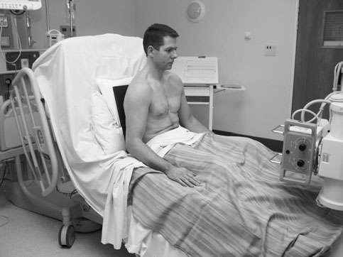
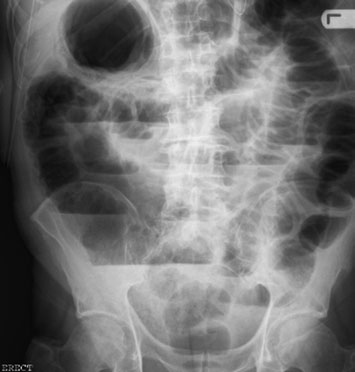
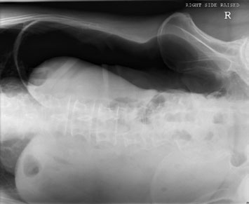
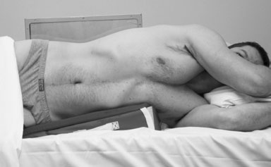

# Rx Abdomen Antero-Posterior (AP) - Ortostatism

  📷 Radiografie Convențională (Rx)
  <strong>Actualizat:</strong> 2026-09-16
  <strong>Autor:</strong> Departamentul de Radiologie / Referință Clark (Ed. 12)

---

-   __1. Rezumat Clinic & Indicații__

    ---

    === "Indicații Clinice"

        - 359 12 Abdomen în incidență antero-posterioară (AP) – ortostatism. Aparatul mobil este poziționat astfel încât să permită radiografia cu fascicul orizontal, necesară pentru evidențierea nivelelor hidroaerice.

    === "Ghid Național IRIS"

        !!! info "Referință Primară: Ghidul Național IRIS (Ordinul MS 1342/2012)"
            - **Capitol Ghid IRIS:** *Aparat digestiv & Abdomen*
            - **Grad de Recomandare:** **Grad B**
            - **Nivel de Iradiere Estimată:** `Clasa 2 (Foarte mică ~ 0.7 - 1.2 mSv)`

            [:octicons-search-16: Deschide Ghidul IRIS](../../iris.md){ .md-button .md-button--primary } [:material-open-in-new: Aplicația Oficială PWA](https://radiologie-pediatrica.ro/iris/){ .md-button target="_blank" rel="noopener" }

-   __2. Poziționare & Centrare Fascicul__

    ---

    - **Poziție Pacient:**
        - Pacientul este menținut în decubit lateral stâng timp de 10-20 minute, permițând acumularea aerului liber spre flancul drept pentru a evita suprapunerea pe bula gastrică, o problemă de diagnostic diferențial când aerul este prezent în partea stângă a abdomenului, în regiunea stomacului.
        - Caseta cu grilă antidifuzoare este sprijinită vertical, în unghi drept față de raza centrală orizontală, și este poziționată pe / sprijinită de fața posterioară a pacientului, astfel încât să includă partea dreaptă a cupolelor diafragmatice.
    - **Punct de Centrare Fascicul:**
        - Raza centrală orizontală este orientată perpendicular pe centrul casetei, utilizând o casetă cu grilă antidifuzoare de 35 × 43 cm. Radiografie de abdomen în incidență antero-posterioară (AP), în ortostatism, evidențiind ocluzie intestinală la nivelul intestinului subțire (nivele hidroaerice centrale), cu gaz în peretele intestinal (cadranul superior drept), indicând o perforație iminentă. Imagine a abdomenului în incidență antero-posterioară (AP), în decubit lateral stâng, evidențiind aer liber în cavitatea abdominală.
    - **Distanță Focar-Film (DFF / SID):** 100 cm
    - **Comandă Respiratorie:** Apnee pe durata expunerii (apnee în inspir pentru torace; expir pentru Abdomen/bazin).

-   __3. Parametri Tehnici Expunere__

    ---

    | Parametru Tehnic | Valoare Configurare Generator / Tub |
    |:-----------------|:-------------------------------------|
    | **Tensiune Tub (kV)** | DE CONFIGURAT PE APARAT |
    | **Sarcină / Produs Curent-Timp (mAs)** | Conform AEC / grosimii anatomice |
    | **Distanță Focar-Film (DFF / SID)** | 100 cm |
    | **Grilă Antidifuzoare (Bucky)** | Conform grosimii anatomice (> 10-12 cm cu grilă) |
    | **Dimensiune Focar** | Focar Mic (0.6 mm) |
    | **Camere de Ionizare AEC** | DE CONFIGURAT PE APARAT |
    | **Colimare Fascicul** | Colimare strictă adaptată pe receptor 35 x 43 cm |
    | **Filtrare Tub** | Totală ≥ 2.5 mm Al echivalent (conform Clark: 3.0 mm Al echivalent) |

-   __4. Criterii de Calitate & Reușită Imagine__

    ---

    - Vizualizarea clară a întregii arii anatomice (Abdomen).
    - Absența artefactelor de mișcare; trabeculație osoasă și contururi nete.
    - Densitate optică și contrast adecvate pentru diferențierea țesuturilor moi de structurile osoase.

-   __5. Protecție Radiologică (ALARA)__

    ---

    - Ecranare gonadică cu șorț plumbat dacă gonadele sunt în apropierea fasciculului util (regula ALARA).
    - Colimare precisă la dimensiunea anatomică strict necesară pentru reducerea dozei și a radiației difuze.
    - Verificarea posibilității unei sarcini la pacientele de vârstă fertilă înainte de expunere.

!!! note "Observații Clinice & Tehnice"
    Pregătirea pacientului prin îndepărtarea tuturor accesoriilor radio-opace.

### 🖼️ Imagini

<figure class="protocol-image-card" markdown>

<figcaption><strong>Radiografie de abdomen în incidență antero-posterioară (AP), în ortostatism, evidențiind intestinul subțire</strong> — Poziționarea pacientului și centrarea fasciculului conform Clark (Ed. 12)</figcaption>

</figure>

<figure class="protocol-image-card" markdown>

<figcaption><strong>Imagine a abdomenului în incidență antero-posterioară (AP), în decubit lateral stâng, evidențiind</strong> — Aspect radiografic / ghid de poziționare conform tratatului Clark (Ed. 12)</figcaption>

</figure>

<figure class="protocol-image-card" markdown>

<figcaption><strong>Figura 3: Aspect radiografic / Poziționare (Clark Ed. 12)</strong> — Aspect radiografic / ghid de poziționare conform tratatului Clark (Ed. 12)</figcaption>

</figure>

<figure class="protocol-image-card" markdown>

<figcaption><strong>Figura 4: Aspect radiografic / Poziționare (Clark Ed. 12)</strong> — Aspect radiografic / ghid de poziționare conform tratatului Clark (Ed. 12)</figcaption>

</figure>

=== "Ghid Rapid de Execuție"

    1. **Identificarea și verificarea pacientului:** verificare identitate, zonă de examinat, consimțământ conform procedurii și evaluarea posibilității unei sarcini, când este relevantă.
    2. **Pregătire:** îndepărtarea oricăror obiecte radiopace (bijuterii, agrafe, fermoare, proteze, pansamente dense).
    3. **Poziționare precisă:** alinierea receptorului de imagine și a tubului la distanța prescrisă (100 cm).
    4. **Colimare strictă:** adaptarea fasciculului strict la regiunea de diagnostic pentru scăderea iradierii și reducerea radiației difuze.
    5. **Radioprotecție:** verificarea [politicii RX](../radioprotectie.md), cu măsuri distincte pentru pacient, personal și însoțitor.

## Surse de documentare

- [Clark's Positioning in Radiography (Ed. 12), Pagina 374](https://books.google.com/books/about/Clark_s_Positioning_in_Radiography.html?id=Xxu6MwEACAAJ)
