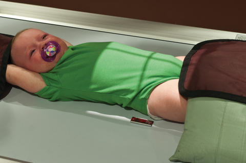
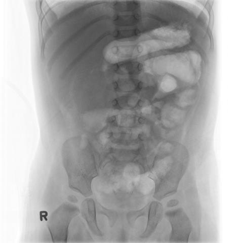

# Rx Abdomen AP (Antero-Posterior) (KUB)

  📷 Radiografie Convențională (Rx)
  <strong>Actualizat:</strong> 2026-09-15
  <strong>Autor:</strong> Departamentul de Radiologie / Referință Bontrager

---

-   __1. Rezumat Clinic & Indicații__

    ---

    === "Indicații Clinice"

        - Pathology of the Abdomen—evaluate gas patterns, soft tissue, and possible calcifications
        - Other anomalies or diseases of Abdomen

    === "Ghid Național IRIS"

        !!! info "Referință Primară: Ghidul Național IRIS (Ordinul MS 1342/2012)"
            - **Capitol Ghid IRIS:** *Ghidul Național IRIS*
            - **Grad de Recomandare:** **De verificat pe indicație; fără grad atribuit automat**
            - **Nivel de Iradiere Estimată:** `De verificat pentru examinarea și populația selectate`

            [:octicons-search-16: Deschide Ghidul IRIS](../../iris.md){ .md-button .md-button--primary } [:material-open-in-new: Aplicația Oficială PWA](https://radiologie-pediatrica.ro/iris/){ .md-button target="_blank" rel="noopener" }
-   __2. Poziționare & Centrare Fascicul__

    ---

    - **Poziție Pacient:** Conform incidenței standard descrise
    - **Punct de Centrare Fascicul:** Infants and small children—CR and cassette centered 1 inch (2.5 cm) above umbilicus Older children and adolescents—CR centered at level of creasta iliacă (corespunzător L4-L5)
    - **Distanță Focar-Film (DFF / SID):** 100 cm
    - **Comandă Respiratorie:** With infants and young children, watch the breathing pattern. When Abdomen is still, make the exposure. If the patient is crying, make the exposure as the patient takes a breath to let out a cry. Children older than 5 years of age usually can hold their breath after a practice session. Fig. 16.59 Child immobilized with sandbags for AP Abdomen. (Note sandbags under and over lower limbs.) Abdomen ROUTINE AP (KUB) SPECIAL AP Ortostatism Lateral and dorsal decubitus

-   __3. Parametri Tehnici Expunere__

    ---

    | Parametru Tehnic | Valoare Configurare Generator / Tub |
    |:-----------------|:-------------------------------------|
    | **Tensiune Tub (kV)** | 60-75 kV |
    | **Sarcină / Produs Curent-Timp (mAs)** | DE CONFIGURAT PE APARAT |
    | **Distanță Focar-Film (DFF / SID)** | 100 cm |
    | **Grilă Antidifuzoare (Bucky)** | Cu grilă antidifuzoare Bucky |
    | **Dimensiune Focar** | Focar Mic (0.6 mm) |
    | **Camere de Ionizare AEC** | Camerele laterale (sau camera centrală funcție de regiune) |
    | **Colimare Fascicul** | Strictă pe regiunea de interes anatomic |
    | **Filtrare Tub** | Totală ≥ 2.5 mm Al echivalent |

-   __4. Criterii de Calitate & Reușită Imagine__

    ---

    - Soft tissue border outlines and gasfilled structures such as the stomach and intestines, calcifications (if present), and faint bony skeletal structures are shown (Fig. 16.60). POSITION:
    - Vertebral column is aligned to center of radiograph.
    - Absența rotației anatomice: clavicule echidistante față de linia apofizelor spinoase exists; Bazin (Pelvis), hips, and lower rib cage are symmetric.
    - collimation field size to area of interest. Exposure:
    - No motion is evident, and diaphragm and gas patterns appear sharp.
    - Optimal image receptor exposure and contrast to visualize bony structure outlines such as Coaste (Grilaj Costal) and vertebrae through abdominal contents without overexposing gasfilled structures. Decubit Dorsal 4/66kv Fig. 16.60 AP Abdomen, Decubit Dorsal (demonstrates distended airfilled stomach). (Case courtesy Associate Professor Frank Gaillard, Radiopaedia.org, rID: 6502.)

-   __5. Protecție Radiologică (ALARA)__

    ---

    - Ecranare gonadică și a organelor radiosensibile conform procedurilor locale de radioprotecție ALARA.
    - Colimare strictă la aria de interes pentru limitarea radiației difuze.
    - Verificarea posibilității unei sarcini la pacientele de vârstă fertilă înainte de expunere.

### 🖼️ Imagini

<figure class="protocol-image-card" markdown>

<figcaption><strong>Fig. 16.59 Child immobilized with sandbags for AP Abdomen. (Note</strong> — Poziționare pacient conform Ghidului Bontrager (Fig. 16.59 Child immobilized with sandbags for AP abdomen. (Note)</figcaption>

</figure>

<figure class="protocol-image-card" markdown>

<figcaption><strong>Fig. 16.60 AP Abdomen, Decubit Dorsal (demonstrates distended air-</strong> — Aspect radiografic de referință conform Ghidului Bontrager (Fig. 16.60 AP abdomen, supine (demonstrates distended air-)</figcaption>

</figure>

=== "Ghid Rapid de Execuție"

    1. **Identificarea și verificarea pacientului:** verificare identitate, zonă de examinat, consimțământ conform procedurii și evaluarea posibilității unei sarcini, când este relevantă.
    2. **Pregătire:** îndepărtarea oricăror obiecte radiopace (bijuterii, agrafe, fermoare, proteze, pansamente dense).
    3. **Poziționare precisă:** alinierea receptorului de imagine și a tubului la distanța prescrisă (100 cm).
    4. **Colimare strictă:** adaptarea fasciculului strict la regiunea de diagnostic pentru scăderea iradierii și reducerea radiației difuze.
    5. **Radioprotecție:** verificarea [politicii RX](../radioprotectie.md), cu măsuri distincte pentru pacient, personal și însoțitor.

## Surse de documentare

- [Bontrager's Textbook of Radiographic Positioning (Ed. 9/10), Pagina 666](https://www.elsevier.com/books/textbook-of-radiographic-positioning-and-related-anatomy/lampignano/978-0-323-65367-1)
