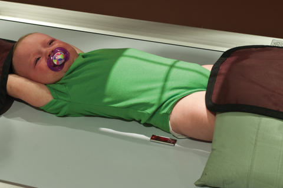
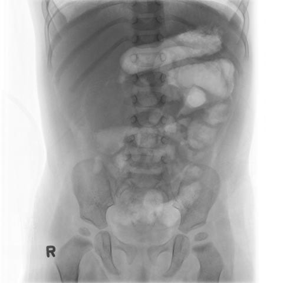

# Rx Abdomen AP (Antero-Posterior) (KUB)

  📷 Radiografie Convențională (Rx)
  <strong>Actualizat:</strong> 2026-09-15
  <strong>Autor:</strong> Departamentul de Radiologie / Referință Bontrager

---

-   __1. Rezumat Clinic & Indicații__

    ---

    === "Indicații Clinice"

        - Patologie abdominală acută/cronică: evaluarea distribuției gazelor și a nivelurilor hidroaerice, a țesuturilor moi și a eventualelor calcificări
        - Alte anomalii sau afecțiuni ale cavității abdominale

    === "Ghid Național IRIS"

        !!! info "Referință Primară: Ghidul Național IRIS (Ordinul MS 1342/2012)"
            - **Capitol Ghid IRIS:** *Ghidul Național IRIS*
            - **Grad de Recomandare:** **De verificat pe indicație; fără grad atribuit automat**
            - **Nivel de Iradiere Estimată:** `De verificat pentru examinarea și populația selectate`

            [:octicons-search-16: Deschide Ghidul IRIS](../../iris.md){ .md-button .md-button--primary } [:material-open-in-new: Aplicația Oficială PWA](https://radiologie-pediatrica.ro/iris/){ .md-button target="_blank" rel="noopener" }
-   __2. Poziționare & Centrare Fascicul__

    ---

    - **Poziție Pacient:** Conform incidenței standard descrise
    - **Punct de Centrare Fascicul:** Sugari și copii mici: raza centrală și caseta se centrează la 2.5 cm deasupra ombilicului. Copii mai mari și adolescenți—raza centrală centrată la nivelul nivelului crestei iliace (corespunzător L4-L5)
    - **Distanță Focar-Film (DFF / SID):** 100 cm
    - **Comandă Respiratorie:** La sugari și copii mici, se monitorizează dinamica respiratorie; expunerea se declanșează când abdomenul este complet imobil. Dacă pacientul plânge, expunerea se efectuează în momentul în care copilul inspiră adânc înainte de a plânge. Copiii cu vârsta peste 5 ani pot menține de regulă apneea după o scurtă simulare/exersare prealabilă. Fig. 16.59 Copil imobilizat cu săculeți cu nisip pentru radiografia de abdomen AP. (Notă: săculeți cu nisip plasați sub și peste membrele inferioare.) Abdomen DE RUTINĂ AP (KUB) SPECIAL AP în ortostatism, în decubit lateral și dorsal

-   __3. Parametri Tehnici Expunere__

    ---

    | Parametru Tehnic | Valoare Configurare Generator / Tub |
    |:-----------------|:-------------------------------------|
    | **Tensiune Tub (kV)** | 60-75 kV |
    | **Sarcină / Produs Curent-Timp (mAs)** | DE CONFIGURAT PE APARAT |
    | **Distanță Focar-Film (DFF / SID)** | 100 cm |
    | **Grilă Antidifuzoare (Bucky)** | Cu grilă antidifuzoare Bucky |
    | **Dimensiune Focar** | Focar Mic (0.6 mm) |
    | **Camere de Ionizare AEC** | Camerele laterale (sau camera centrală, în funcție de regiune) |
    | **Colimare Fascicul** | Colimare strictă pe regiunea anatomică de interes diagnostic |
    | **Filtrare Tub** | Totală ≥ 2.5 mm Al echivalent |

-   __4. Criterii de Calitate & Reușită Imagine__

    ---

    - Sunt vizualizate contururile părților moi și structurile cu conținut gazos, precum stomacul și intestinele, calcificările (dacă sunt prezente) și structurile osoase slab conturate (Fig. 16.60). Poziție:
    - Coloana vertebrală este aliniată la centrul radiografiei.
    - Absența rotației anatomice: claviculele sunt echidistante față de linia apofizelor spinoase; bazinul, șoldurile și partea inferioară a grilajului costal sunt simetrice.
    - Dimensiunea câmpului colimat este adaptată ariei de interes diagnostic. Expunere:
    - Nu se evidențiază mișcare, iar cupolele diafragmatice și distribuția gazelor apar net conturate.
    - Expunere optimă a receptorului de imagine și contrast optim pentru vizualizarea contururilor structurilor osoase, precum coastele (grilajul costal) și vertebrele, prin conținutul abdominal, fără supraexpunerea structurilor cu conținut gazos. Decubit dorsal 4/66kv Fig. 16.60 Abdomen AP, decubit dorsal (evidențiază stomacul destins, plin cu aer). (Caz oferit prin amabilitatea conferențiarului universitar Frank Gaillard, Radiopaedia.org, rID: 6502.)

-   __5. Protecție Radiologică (ALARA)__

    ---

    - Ecranare gonadică și a organelor radiosensibile conform procedurilor locale de radioprotecție ALARA.
    - Colimare strictă la aria de interes pentru limitarea radiației difuze.
    - Verificarea posibilității unei sarcini la pacientele de vârstă fertilă înainte de expunere.

### 🖼️ Imagini

<figure class="protocol-image-card" markdown>

<figcaption><strong>Fig. 16.59 Copil imobilizat cu săculeți cu nisip pentru radiografia de abdomen AP. (Observați</strong> — Poziționarea pacientului conform Ghidului Bontrager (Fig. 16.59 Copil imobilizat cu săculeți cu nisip pentru radiografia de abdomen AP. (Observați)</figcaption>

</figure>

<figure class="protocol-image-card" markdown>

<figcaption><strong>Fig. 16.60 Abdomen AP, decubit dorsal (evidențiază distensia cu aer-</strong> — Aspect radiografic de referință conform Ghidului Bontrager (Fig. 16.60 Abdomen AP, în decubit dorsal (evidențiază distensia cu aer-)</figcaption>

</figure>

=== "Ghid Rapid de Execuție"

    1. **Identificarea și verificarea pacientului:** verificare identitate, zonă de examinat, consimțământ conform procedurii și evaluarea posibilității unei sarcini, când este relevantă.
    2. **Pregătire:** îndepărtarea oricăror obiecte radiopace (bijuterii, agrafe, fermoare, proteze, pansamente dense).
    3. **Poziționare precisă:** alinierea receptorului de imagine și a tubului la distanța prescrisă (100 cm).
    4. **Colimare strictă:** adaptarea fasciculului strict la regiunea de diagnostic pentru scăderea iradierii și reducerea radiației difuze.
    5. **Radioprotecție:** verificarea [politicii RX](../radioprotectie.md), cu măsuri distincte pentru pacient, personal și însoțitor.

## Surse de documentare

- [Bontrager's Textbook of Radiographic Positioning (Ed. 9/10), Pagina 666](https://www.elsevier.com/books/textbook-of-radiographic-positioning-and-related-anatomy/lampignano/978-0-323-65367-1)
