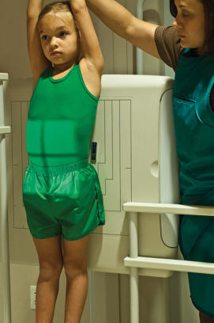
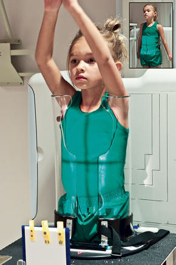
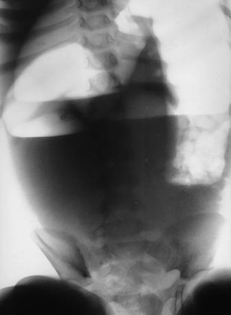

# Rx Abdomen AP Ortostatism PROJECTION

  📷 Radiografie Convențională (Rx)
  <strong>Actualizat:</strong> 2026-09-15
  <strong>Autor:</strong> Departamentul de Radiologie / Referință Bontrager

---

-   __1. Rezumat Clinic & Indicații__

    ---

    === "Indicații Clinice"

        - Pathology of the Abdomen, including possible intestinal obstruction by demonstration of airfluid levels or free intraabdominal air. Generally, this projection is part of a threeway or acute Abdomen series (Decubit Dorsal, Ortostatism, and decubitus).

    === "Ghid Național IRIS"

        !!! info "Referință Primară: Ghidul Național IRIS (Ordinul MS 1342/2012)"
            - **Capitol Ghid IRIS:** *Ghidul Național IRIS*
            - **Grad de Recomandare:** **De verificat pe indicație; fără grad atribuit automat**
            - **Nivel de Iradiere Estimată:** `De verificat pentru examinarea și populația selectate`

            [:octicons-search-16: Deschide Ghidul IRIS](../../iris.md){ .md-button .md-button--primary } [:material-open-in-new: Aplicația Oficială PWA](https://radiologie-pediatrica.ro/iris/){ .md-button target="_blank" rel="noopener" }
-   __2. Poziționare & Centrare Fascicul__

    ---

    - **Poziție Pacient:** Conform incidenței standard descrise
    - **Punct de Centrare Fascicul:** With infants and small children, center CR and IR 1 inch (2.5 cm) above umbilicus. With older children and adolescents, center CR at approximately 1 inch (2.5 cm) to 2 inches (5 cm) (depending on the height of the child) above the level of the creasta iliacă (corespunzător L4-L5), which should place top collimation border and top of film at level of the axilla to include the diaphragm on IR.
    - **Distanță Focar-Film (DFF / SID):** 100 cm
    - **Comandă Respiratorie:** With infants and children, watch the breathing pattern. When the Abdomen is still, make the exposure. If the patient is crying, make the exposure as the patient takes a breath in to let out a cry. Children older than 5 years usually can hold their breath after a practice session. Fig. 16.61 Ortostatism AP Abdomen. (Parent holding child should be wearing lead apron and gloves.) Abdomen ROUTINE AP (KUB) SPECIAL AP Ortostatism Lateral and dorsal decubitus

-   __3. Parametri Tehnici Expunere__

    ---

    | Parametru Tehnic | Valoare Configurare Generator / Tub |
    |:-----------------|:-------------------------------------|
    | **Tensiune Tub (kV)** | DE CONFIGURAT PE APARAT |
    | **Sarcină / Produs Curent-Timp (mAs)** | DE CONFIGURAT PE APARAT |
    | **Distanță Focar-Film (DFF / SID)** | 100 cm |
    | **Grilă Antidifuzoare (Bucky)** | Conform grosimii anatomice (> 10 cm cu grilă) |
    | **Dimensiune Focar** | Focar Mic (0.6 mm) |
    | **Camere de Ionizare AEC** | DE CONFIGURAT PE APARAT |
    | **Colimare Fascicul** | field size—determined by size of patient, portrait Grid if larger than 4 to 4½ inches (10 to 12 cm) in thickness Shortest exposure time possible kVp range—60–75 |
    | **Filtrare Tub** | Totală ≥ 2.5 mm Al echivalent |

-   __4. Criterii de Calitate & Reușită Imagine__

    ---

    - Entire contents of Abdomen are shown, including gas patterns and airfluid levels and soft tissue if not obscured by excessive fluid in distended Abdomen, as shown in Fig. 16.63. POSITION:
    - Vertebral column is aligned to center of radiograph.
    - Absența rotației anatomice: clavicule echidistante față de linia apofizelor spinoase exists; Bazin (Pelvis) and hips should be symmetric.
    - Collimation to area of interest. EXPOSURE:
    - No motion is evident, and diaphragm and gas pattern borders appear sharp.
    - Bony Bazin (Pelvis) and vertebral body outlines are evident through abdominal contents without overexposing airfilled structures. Five year old Fig. 16.62 Ortostatism AP Abdomen with PiggO- Stat. Note top of IR (if such a designation) at axilla to include diaphragm. Inset, A 5year- old child in front of the IR. R Fig. 16.63 Ortostatism AP Abdomen (demonstrates fluid levels and distended airfilled large bowel).

-   __5. Protecție Radiologică (ALARA)__

    ---

    - Ecranare gonadică și a organelor radiosensibile conform procedurilor locale de radioprotecție ALARA.
    - Colimare strictă la aria de interes pentru limitarea radiației difuze.
    - Verificarea posibilității unei sarcini la pacientele de vârstă fertilă înainte de expunere.

### 🖼️ Imagini

<figure class="protocol-image-card" markdown>

<figcaption><strong>Fig. 16.61 Ortostatism AP Abdomen. (Parent holding child should be</strong> — Poziționare pacient conform Ghidului Bontrager (Fig. 16.61 Erect AP abdomen. (Parent holding child should be)</figcaption>

</figure>

<figure class="protocol-image-card" markdown>

<figcaption><strong>Fig. 16.62 Ortostatism AP Abdomen with Pigg-</strong> — Aspect radiografic de referință conform Ghidului Bontrager (Fig. 16.62 Erect AP abdomen with Pigg-)</figcaption>

</figure>

<figure class="protocol-image-card" markdown>

<figcaption><strong>Fig. 16.63 Ortostatism AP Abdomen (demonstrates fluid levels and</strong> — Aspect radiografic de referință conform Ghidului Bontrager (Fig. 16.63 Erect AP abdomen (demonstrates fluid levels and)</figcaption>

</figure>

=== "Ghid Rapid de Execuție"

    1. **Identificarea și verificarea pacientului:** verificare identitate, zonă de examinat, consimțământ conform procedurii și evaluarea posibilității unei sarcini, când este relevantă.
    2. **Pregătire:** îndepărtarea oricăror obiecte radiopace (bijuterii, agrafe, fermoare, proteze, pansamente dense).
    3. **Poziționare precisă:** alinierea receptorului de imagine și a tubului la distanța prescrisă (100 cm).
    4. **Colimare strictă:** adaptarea fasciculului strict la regiunea de diagnostic pentru scăderea iradierii și reducerea radiației difuze.
    5. **Radioprotecție:** verificarea [politicii RX](../radioprotectie.md), cu măsuri distincte pentru pacient, personal și însoțitor.

## Surse de documentare

- [Bontrager's Textbook of Radiographic Positioning (Ed. 9/10), Pagina 667](https://www.elsevier.com/books/textbook-of-radiographic-positioning-and-related-anatomy/lampignano/978-0-323-65367-1)
