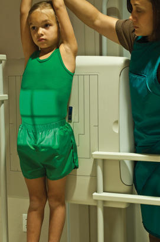
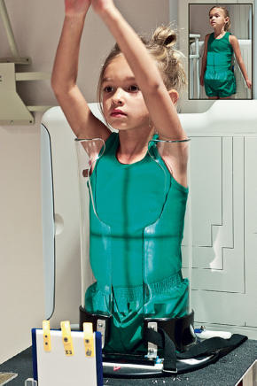
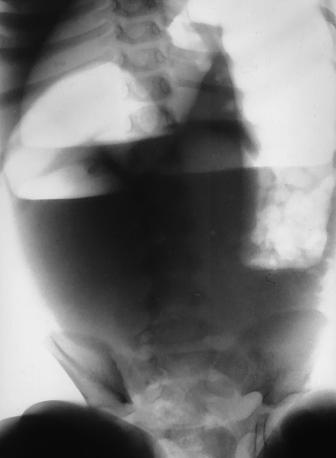

# Rx Abdomen AP în Ortostatism

  📷 Radiografie Convențională (Rx)
  <strong>Actualizat:</strong> 2026-09-15
  <strong>Autor:</strong> Departamentul de Radiologie / Referință Bontrager

---

-   __1. Rezumat Clinic & Indicații__

    ---

    === "Indicații Clinice"

        - Patologie abdominală, inclusiv posibilă ocluzie intestinală (niveluri hidroaerice), prin evidențierea nivelurilor hidroaerice sau a aerului liber intraabdominal. În general, această incidență face parte din seria de trei incidențe sau din seria pentru abdomen acut (decubit dorsal, ortostatism și decubit).

    === "Ghid Național IRIS"

        !!! info "Referință Primară: Ghidul Național IRIS (Ordinul MS 1342/2012)"
            - **Capitol Ghid IRIS:** *Ghidul Național IRIS*
            - **Grad de Recomandare:** **De verificat pe indicație; fără grad atribuit automat**
            - **Nivel de Iradiere Estimată:** `De verificat pentru examinarea și populația selectate`

            [:octicons-search-16: Deschide Ghidul IRIS](../../iris.md){ .md-button .md-button--primary } [:material-open-in-new: Aplicația Oficială PWA](https://radiologie-pediatrica.ro/iris/){ .md-button target="_blank" rel="noopener" }
-   __2. Poziționare & Centrare Fascicul__

    ---

    - **Poziție Pacient:** Conform incidenței standard descrise
    - **Punct de Centrare Fascicul:** La sugari și copii mici, centrați raza centrală și receptorul de imagine la 1 inch (2.5 cm) deasupra ombilicului. La copiii mai mari și adolescenți, centrați raza centrală la aproximativ 1 inch (2.5 cm) până la 2 inchi (5 cm) (în funcție de înălțimea copilului) deasupra nivelului crestei iliace (corespunzător L4-L5), astfel încât marginea superioară a câmpului colimat și marginea superioară a filmului radiologic să fie la nivelul axilei, pentru a include cupolele diafragmatice pe receptorul de imagine.
    - **Distanță Focar-Film (DFF / SID):** 100 cm
    - **Comandă Respiratorie:** La sugari și copii mici, se monitorizează dinamica respiratorie; expunerea se efectuează când toracele/abdomenul este imobil. Când abdomenul este imobil, se declanșează expunerea. Dacă pacientul plânge, expunerea se efectuează în momentul în care copilul inspiră adânc înainte de a plânge. Copiii cu vârsta peste 5 ani pot menține de regulă apneea după o scurtă simulare/exersare prealabilă. Fig. 16.61 Abdomen AP în ortostatism. (Părintele care susține copilul trebuie să poarte șorț și mănuși de protecție cu plumb.) Abdomen DE RUTINĂ AP (KUB) SPECIALE AP în ortostatism, în decubit lateral și dorsal

-   __3. Parametri Tehnici Expunere__

    ---

    | Parametru Tehnic | Valoare Configurare Generator / Tub |
    |:-----------------|:-------------------------------------|
    | **Tensiune Tub (kV)** | DE CONFIGURAT PE APARAT |
    | **Sarcină / Produs Curent-Timp (mAs)** | DE CONFIGURAT PE APARAT |
    | **Distanță Focar-Film (DFF / SID)** | 100 cm |
    | **Grilă Antidifuzoare (Bucky)** | Conform grosimii anatomice (> 10 cm cu grilă) |
    | **Dimensiune Focar** | Focar Mic (0.6 mm) |
    | **Camere de Ionizare AEC** | DE CONFIGURAT PE APARAT |
    | **Colimare Fascicul** | Dimensiunea câmpului—determinată de dimensiunile pacientului, orientare longitudinală, grilă dacă grosimea depășește 4 până la 4½ inchi (10 până la 12 cm). Timp de expunere cât mai scurt posibil. Interval kVp—60–75 |
    | **Filtrare Tub** | Totală ≥ 2.5 mm Al echivalent |

-   __4. Criterii de Calitate & Reușită Imagine__

    ---

    - Se vizualizează întregul conținut abdominal, inclusiv distribuția gazelor, nivelurile hidroaerice și părțile moi, dacă acestea nu sunt mascate de lichidul în exces din abdomenul destins, așa cum se observă în Fig. 16.63. Poziție:
    - Coloana vertebrală este aliniată la centrul radiografiei.
    - Absența rotației anatomice: claviculele sunt echidistante față de linia apofizelor spinoase; bazinul și șoldurile trebuie să fie simetrice.
    - Colimare la aria de interes diagnostic. Expunere:
    - Nu se evidențiază mișcare, iar cupolele diafragmatice și contururile distribuției gazelor apar nete.
    - Contururile bazinului osos și ale corpurilor vertebrale sunt vizibile prin conținutul abdominal, fără supraexpunerea structurilor pline cu aer. Copil de cinci ani. Fig. 16.62 Abdomen AP în ortostatism cu PiggO-Stat. Observați marginea superioară a receptorului de imagine (dacă este indicată astfel), situată la nivelul axilei pentru a include cupolele diafragmatice. Imagine inserată, un copil de 5 ani în fața receptorului de imagine. R Fig. 16.63 Abdomen AP în ortostatism (evidențiază niveluri hidroaerice și intestinul gros (colonul) destins, plin cu aer).

-   __5. Protecție Radiologică (ALARA)__

    ---

    - Ecranare gonadică și a organelor radiosensibile conform procedurilor locale de radioprotecție ALARA.
    - Colimare strictă la aria de interes pentru limitarea radiației difuze.
    - Verificarea posibilității unei sarcini la pacientele de vârstă fertilă înainte de expunere.

### 🖼️ Imagini

<figure class="protocol-image-card" markdown>

<figcaption><strong>Fig. 16.61 Abdomen AP în ortostatism. (Părintele care susține copilul trebuie să fie</strong> — Poziționarea pacientului conform Ghidului Bontrager (Fig. 16.61 Abdomen AP în ortostatism. (Părintele care susține copilul trebuie să fie)</figcaption>

</figure>

<figure class="protocol-image-card" markdown>

<figcaption><strong>Fig. 16.62 Abdomen AP în ortostatism cu Pigg-</strong> — Aspect radiografic de referință conform Ghidului Bontrager (Fig. 16.62 Abdomen AP în ortostatism cu Pigg-)</figcaption>

</figure>

<figure class="protocol-image-card" markdown>

<figcaption><strong>Fig. 16.63 Abdomen AP în ortostatism (evidențiază niveluri hidroaerice și</strong> — Aspect radiografic de referință conform Ghidului Bontrager (Fig. 16.63 Abdomen AP în ortostatism (evidențiază niveluri hidroaerice și)</figcaption>

</figure>

=== "Ghid Rapid de Execuție"

    1. **Identificarea și verificarea pacientului:** verificare identitate, zonă de examinat, consimțământ conform procedurii și evaluarea posibilității unei sarcini, când este relevantă.
    2. **Pregătire:** îndepărtarea oricăror obiecte radiopace (bijuterii, agrafe, fermoare, proteze, pansamente dense).
    3. **Poziționare precisă:** alinierea receptorului de imagine și a tubului la distanța prescrisă (100 cm).
    4. **Colimare strictă:** adaptarea fasciculului strict la regiunea de diagnostic pentru scăderea iradierii și reducerea radiației difuze.
    5. **Radioprotecție:** verificarea [politicii RX](../radioprotectie.md), cu măsuri distincte pentru pacient, personal și însoțitor.

## Surse de documentare

- [Bontrager's Textbook of Radiographic Positioning (Ed. 9/10), Pagina 667](https://www.elsevier.com/books/textbook-of-radiographic-positioning-and-related-anatomy/lampignano/978-0-323-65367-1)
