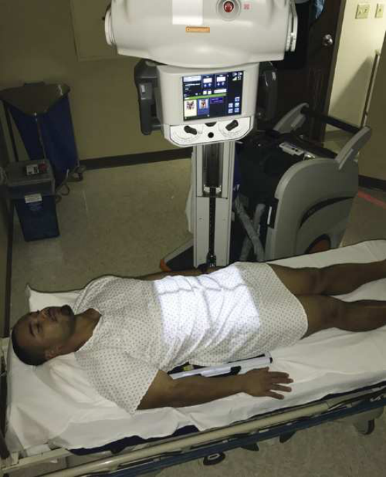
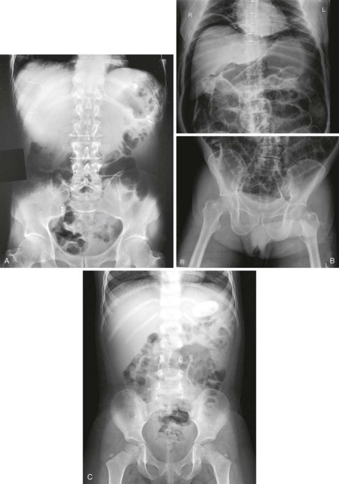
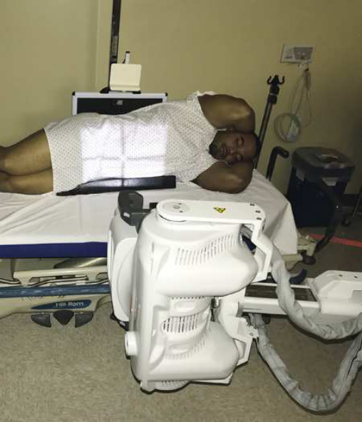

# Rx Abdomen — Incidență Antero-Posterioară (AP) d (Merrill)

  📷 Radiografie Convențională (Rx)
  <strong>Actualizat:</strong> 2026-09-16
  <strong>Autor:</strong> Referință Merrill

---

-   __1. Rezumat Clinic & Indicații__

    ---

    === "Indicații Clinice"

        - Conform reperelor anatomice standard din tratat

    === "Ghid Național IRIS"

        !!! info "Referință Primară: Ghidul Național IRIS (Ordinul MS 1342/2012)"
            - **Capitol Ghid IRIS:** *Ghidul Național IRIS*
            - **Grad de Recomandare:** **De verificat pe indicație; fără grad atribuit automat**
            - **Nivel de Iradiere Estimată:** `De verificat pentru examinarea și populația selectate`

            [:octicons-search-16: Deschide Ghidul IRIS](../../iris.md){ .md-button .md-button--primary } [:material-open-in-new: Aplicația Oficială PWA](https://radiologie-pediatrica.ro/iris/){ .md-button target="_blank" rel="noopener" }
-   __2. Poziționare & Centrare Fascicul__

    ---

    - **Poziție Pacient:** If necessary, se ajustează pacient’s bed la achieve orizontal bed poziție. se așază pacientul în Decubit dorsal poziție.; poziție grila under pacientul la show abdominal anatomy de la simfiză pubiană la upper abdominal region. Keep grila de la tipping side la side prin placing it în center de bed și, if necessary, stabilize it cu blankets sau towels. Use pacientul’s draw sheet la roll pacientul; this makes it easier la shift pacientul de la side la side during positioning de receptorul de imagine și provides barrier între pacient’s skin și grila. Se centrează planul mediosagital al pacientului pe linia mediană grilei antidifuzoare. se centrează grilă la level de crestele iliace. If emphasis este pe etajul abdominal superior, se centrează grilă 2 inches (5 cm) above crestele iliace sau high enough pentru include cupole diafragmatice. Umerii și bazinul pacientului se aliniază în același plan coronal, fără rotație (Fig. 20.14). Move pacientul’s brațe out de region de abdomenul.
    - **Punct de Centrare Fascicul:** perpendicular pe center de grila along planul mediosagital și la nivelul crestele iliace sau 10th rib laterally.
    - **Distanță Focar-Film (DFF / SID):** Nespecificat în fragmentul extras; de verificat în sursă
    - **Comandă Respiratorie:** Expiration.

-   __3. Parametri Tehnici Expunere__

    ---

    | Parametru Tehnic | Valoare Configurare Generator / Tub |
    |:-----------------|:-------------------------------------|
    | **Tensiune Tub (kV)** | DE CONFIGURAT PE APARAT |
    | **Sarcină / Produs Curent-Timp (mAs)** | DE CONFIGURAT PE APARAT |
    | **Distanță Focar-Film (DFF / SID)** | Nespecificat în fragmentul extras; de verificat în sursă |
    | **Grilă Antidifuzoare (Bucky)** | DE CONFIGURAT PE APARAT |
    | **Dimensiune Focar** | DE CONFIGURAT PE APARAT |
    | **Camere de Ionizare AEC** | DE CONFIGURAT PE APARAT |
    | **Colimare Fascicul** | Adjust la 14 × 17 inches (35 × 43 cm) pe collimator. |
    | **Filtrare Tub** | DE CONFIGURAT PE APARAT |

-   __4. Criterii de Calitate & Reușită Imagine__

    ---

    - following trebuie să fie clearly vizualizat:
    - Evidence de corect collimation
    - fără mișcare
    - Outlines de abdominal viscera
    - Abdominal region, including simfiză pubiană sau cupole diafragmatice (ambele poate fie seen pe some pacienți)
    - coloană vertebrală în center de imagine
    - Psoas muscles, lower margin de ficat, și rinichi margins
    - Absența rotației anatomice (simetrie bilaterală perfectă)
    - simetric appearance de coloană vertebrală și iliac wings
    - Radiographic markeri (ca appropriate)

-   __5. Protecție Radiologică (ALARA)__

    ---

    - Nespecificat în fragmentul extras; de verificat în sursă

!!! note "Observații Clinice & Tehnice"
    Hypersthenic pacienți poate require two separate incidențe using transversal grilă. One grilă este poziționat pentru etajul abdominal superior și other pentru etajul abdominal inferior.

### 🖼️ Imagini

<figure class="protocol-image-card" markdown>

<figcaption><strong>Merrill — pagina PDF 1488, imaginea 1</strong> — Imagine din fragmentul sursă; asocierea necesită revizie.</figcaption>

</figure>

<figure class="protocol-image-card" markdown>

<figcaption><strong>Merrill — pagina PDF 1489, imaginea 2</strong> — Imagine din fragmentul sursă; asocierea necesită revizie.</figcaption>

</figure>

<figure class="protocol-image-card" markdown>

<figcaption><strong>Merrill — pagina PDF 1490, imaginea 3</strong> — Imagine din fragmentul sursă; asocierea necesită revizie.</figcaption>

</figure>

=== "Ghid Rapid de Execuție"

    1. **Identificarea și verificarea pacientului:** verificare identitate, zonă de examinat, consimțământ conform procedurii și evaluarea posibilității unei sarcini, când este relevantă.
    2. **Pregătire:** îndepărtarea oricăror obiecte radiopace (bijuterii, agrafe, fermoare, proteze, pansamente dense).
    3. **Poziționare precisă:** alinierea receptorului de imagine și a tubului la distanța prescrisă (Nespecificat în fragmentul extras; de verificat în sursă).
    4. **Colimare strictă:** adaptarea fasciculului strict la regiunea de diagnostic pentru scăderea iradierii și reducerea radiației difuze.
    5. **Radioprotecție:** verificarea [politicii RX](../radioprotectie.md), cu măsuri distincte pentru pacient, personal și însoțitor.

## Surse de documentare

- [Merrill’s Atlas, 20. Mobile Radiography, pagini PDF 1487–1490](../../assets/protocols/sources/a56d45c16829_Merrills_Atlas_of_Radiographic_Positioning__Procedures_3Vol_Set.pdf#page=1487)

## Fragmente sursă traduse (referință tehnică)

### anatomy

This incidență shows inferior margin de ficat, splină, rinichi, și psoas muscles, calcifications, și evidence de tumor masses. If imagine includes etajul abdominal superior și cupole diafragmatice, size și shape de ficat poate fie seen (Fig. 20.15).

### collimation

• Adjust la 14 × 17 inches (35 × 43 cm) pe collimator.

### cr

• perpendicular pe center de grila along planul mediosagital și la nivelul crestele iliace sau 10th rib laterally.

### criteria

following trebuie să fie clearly vizualizat:
• Evidence de corect collimation
• fără mișcare
• Outlines de abdominal viscera
• Abdominal region, including simfiză pubiană sau cupole diafragmatice (ambele poate fie seen pe some pacienți)
• coloană vertebrală în center de imagine
• Psoas muscles, lower margin de ficat, și rinichi margins
• Absența rotației anatomice (simetrie bilaterală perfectă)
• simetric appearance de coloană vertebrală și iliac wings
• Radiographic markeri (ca appropriate)

### notes

Hypersthenic pacienți poate require two separate incidențe using transversal grilă. One grilă este poziționat pentru etajul abdominal superior și
other pentru etajul abdominal inferior.

### part_pos

• poziție grila under pacientul la show abdominal anatomy de la simfiză pubiană la upper abdominal region.
• Keep grila de la tipping side la side prin placing it în center de bed și, if necessary, stabilize it cu blankets sau towels.
• Use pacientul’s draw sheet la roll pacientul; this makes it easier la shift pacientul de la side la side during positioning de receptorul de imagine
și provides barrier între pacient’s skin și grila.
• Se centrează planul mediosagital al pacientului pe linia mediană grilei antidifuzoare.
• se centrează grilă la level de crestele iliace. If emphasis este pe etajul abdominal superior, se centrează grilă 2 inches (5 cm) above iliac
creste sau high enough pentru include cupole diafragmatice.
• Umerii și bazinul pacientului se aliniază în același plan coronal, fără rotație (Fig. 20.14).
• Move pacientul’s brațe out de region de abdomenul.

### patient_pos

• If necessary, se ajustează pacient’s bed la achieve orizontal bed poziție.
• se așază pacientul în decubit dorsal.

### respiration

Expiration.

### tech

receptorul de imagine trebuie să fie 14 × 17 inches (35 × 43 cm) cu longitudinal grilă.

