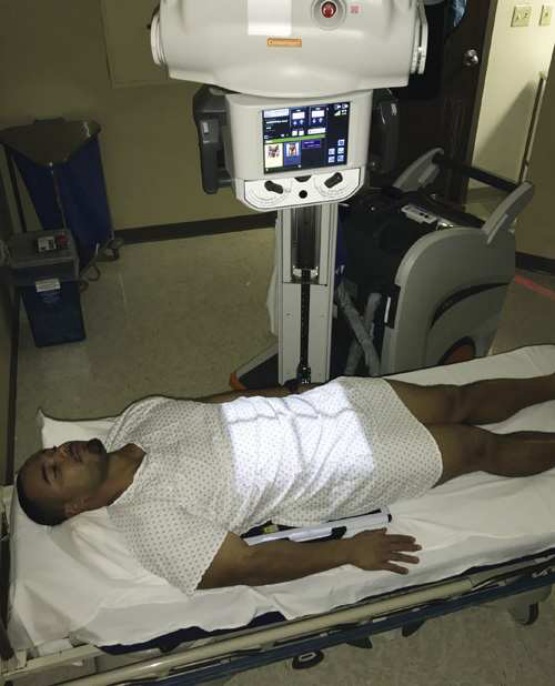
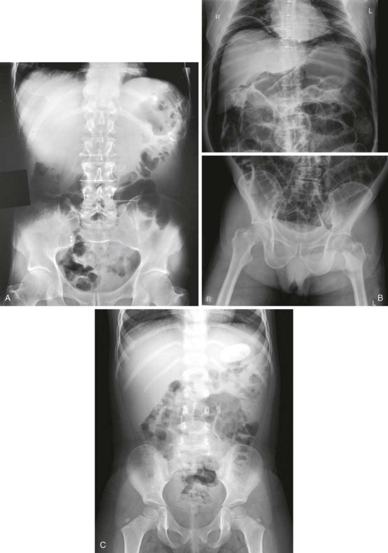
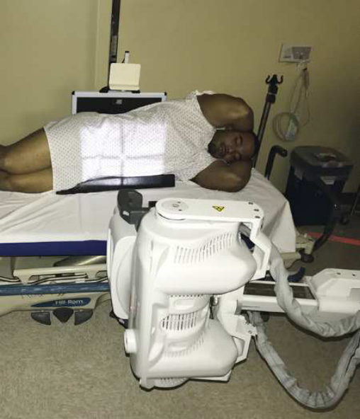

# Rx Abdomen — Incidență Antero-Posterioară (AP) d (Merrill)

  📷 Radiografie Convențională (Rx)
  <strong>Actualizat:</strong> 2026-09-16
  <strong>Autor:</strong> Referință Merrill

---

-   __1. Rezumat Clinic & Indicații__

    ---

    === "Indicații Clinice"

        - Conform reperelor anatomice standard din tratat

    === "Ghid Național IRIS"

        !!! info "Referință Primară: Ghidul Național IRIS (Ordinul MS 1342/2012)"
            - **Capitol Ghid IRIS:** *Aparat digestiv & Abdomen*
            - **Grad de Recomandare:** **Grad B**
            - **Nivel de Iradiere Estimată:** `Clasa 2 (Foarte mică ~ 0.7 - 1.2 mSv)`

            [:octicons-search-16: Deschide Ghidul IRIS](../../iris.md){ .md-button .md-button--primary } [:material-open-in-new: Aplicația Oficială PWA](https://radiologie-pediatrica.ro/iris/){ .md-button target="_blank" rel="noopener" }

-   __2. Poziționare & Centrare Fascicul__

    ---

    - **Poziție Pacient:** Dacă este necesar, se reglează patul pacientului pentru a-l aduce în poziție orizontală. Se așază pacientul în decubit dorsal. Se poziționează grila sub pacient pentru a vizualiza anatomia abdominală de la simfiza pubiană până la regiunea abdominală superioară. Se previne înclinarea laterală a grilei prin plasarea acesteia în centrul patului și, dacă este necesar, se stabilizează cu pături sau prosoape. Se folosește cearșaful de mobilizare al pacientului pentru a-l întoarce; acesta facilitează deplasarea pacientului dintr-o parte în alta în timpul poziționării receptorului de imagine și asigură o barieră între pielea pacientului și grilă. Se centrează planul mediosagital al pacientului pe linia mediană a grilei antidifuzoare. Se centrează grila la nivelul crestelor iliace. Dacă se urmărește în special etajul abdominal superior, se centrează grila la 2 inchi (5 cm) deasupra crestelor iliace sau suficient de sus pentru a include cupolele diafragmatice. Umerii și bazinul pacientului se aliniază în același plan coronal, fără rotație (Fig. 20.14). Se deplasează brațele pacientului în afara regiunii abdominale.
    - **Punct de Centrare Fascicul:** Perpendicular pe centrul grilei, în planul mediosagital și la nivelul crestelor iliace sau al coastei a 10-a, lateral.
    - **Distanță Focar-Film (DFF / SID):** Nespecificat în fragmentul extras; de verificat în sursă
    - **Comandă Respiratorie:** Expir.

-   __3. Parametri Tehnici Expunere__

    ---

    | Parametru Tehnic | Valoare Configurare Generator / Tub |
    |:-----------------|:-------------------------------------|
    | **Tensiune Tub (kV)** | DE CONFIGURAT PE APARAT |
    | **Sarcină / Produs Curent-Timp (mAs)** | DE CONFIGURAT PE APARAT |
    | **Distanță Focar-Film (DFF / SID)** | Nespecificat în fragmentul extras; de verificat în sursă |
    | **Grilă Antidifuzoare (Bucky)** | DE CONFIGURAT PE APARAT |
    | **Dimensiune Focar** | DE CONFIGURAT PE APARAT |
    | **Camere de Ionizare AEC** | DE CONFIGURAT PE APARAT |
    | **Colimare Fascicul** | Se reglează colimatorul la 14 × 17 inchi (35 × 43 cm). |
    | **Filtrare Tub** | DE CONFIGURAT PE APARAT |

-   __4. Criterii de Calitate & Reușită Imagine__

    ---

    - Următoarele trebuie să fie clar vizualizate:
    - Dovada unei colimări corecte
    - fără mișcare
    - Contururile viscerelor abdominale
    - Regiunea abdominală, inclusiv simfiza pubiană sau cupolele diafragmatice (ambele pot fi vizualizate la unii pacienți)
    - Coloana vertebrală în centrul imaginii
    - Mușchii psoas, marginea inferioară a ficatului și contururile rinichilor
    - Absența rotației anatomice (simetrie bilaterală perfectă)
    - Aspect simetric al coloanei vertebrale și al aripilor iliace
    - Markeri radiografici (după caz)

-   __5. Protecție Radiologică (ALARA)__

    ---

    - Nespecificat în fragmentul extras; de verificat în sursă

!!! note "Observații Clinice & Tehnice"
    La pacienții hiperstenici pot fi necesare două incidențe separate, utilizând grila orientată transversal. O grilă este poziționată pentru etajul abdominal superior, iar cealaltă pentru etajul abdominal inferior.

### 🖼️ Imagini

<figure class="protocol-image-card" markdown>

<figcaption><strong>Merrill — pagina 1488, imaginea 1</strong> — Imagine din fragmentul sursă; asocierea necesită revizie.</figcaption>

</figure>

<figure class="protocol-image-card" markdown>

<figcaption><strong>Merrill — pagina 1489, imaginea 2</strong> — Imagine din fragmentul sursă; asocierea necesită revizie.</figcaption>

</figure>

<figure class="protocol-image-card" markdown>

<figcaption><strong>Merrill — pagina 1490, imaginea 3</strong> — Imagine din fragmentul sursă; asocierea necesită revizie.</figcaption>

</figure>

=== "Ghid Rapid de Execuție"

    1. **Identificarea și verificarea pacientului:** verificare identitate, zonă de examinat, consimțământ conform procedurii și evaluarea posibilității unei sarcini, când este relevantă.
    2. **Pregătire:** îndepărtarea oricăror obiecte radiopace (bijuterii, agrafe, fermoare, proteze, pansamente dense).
    3. **Poziționare precisă:** alinierea receptorului de imagine și a tubului la distanța prescrisă (Nespecificat în fragmentul extras; de verificat în sursă).
    4. **Colimare strictă:** adaptarea fasciculului strict la regiunea de diagnostic pentru scăderea iradierii și reducerea radiației difuze.
    5. **Radioprotecție:** verificarea [politicii RX](../radioprotectie.md), cu măsuri distincte pentru pacient, personal și însoțitor.

## Surse de documentare

- [Merrill’s Atlas, 20. Mobile Radiography, pagini 1487–1490](https://books.google.com/books/about/Merrill_s_Atlas_of_Radiographic_Position.html?id=BM0lEQAAQBAJ)
