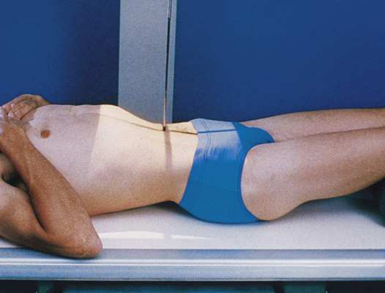
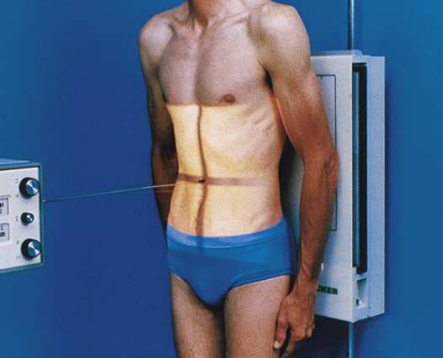
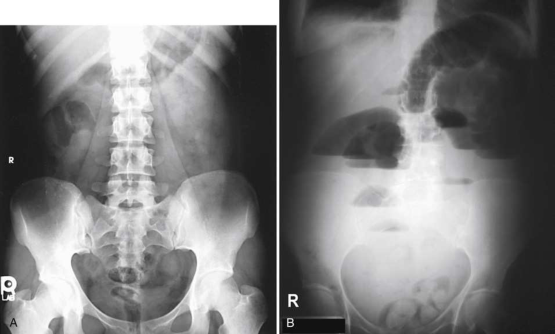

# Rx Abdomen — Incidență Antero-Posterioară (AP) — Decubit Dorsal; Ortostatism (Merrill)

  📷 Radiografie Convențională (Rx)
  <strong>Actualizat:</strong> 2026-09-16
  <strong>Autor:</strong> Referință Merrill

---

-   __1. Rezumat Clinic & Indicații__

    ---

    === "Indicații Clinice"

        - Conform reperelor anatomice standard din tratat

    === "Ghid Național IRIS"

        !!! info "Referință Primară: Ghidul Național IRIS (Ordinul MS 1342/2012)"
            - **Capitol Ghid IRIS:** *Ghidul Național IRIS*
            - **Grad de Recomandare:** **De verificat pe indicație; fără grad atribuit automat**
            - **Nivel de Iradiere Estimată:** `De verificat pentru examinarea și populația selectate`

            [:octicons-search-16: Deschide Ghidul IRIS](../../iris.md){ .md-button .md-button--primary } [:material-open-in-new: Aplicația Oficială PWA](https://radiologie-pediatrica.ro/iris/){ .md-button target="_blank" rel="noopener" }
-   __2. Poziționare & Centrare Fascicul__

    ---

    - **Poziție Pacient:** Pentru radiografia abdominală simplă (AP / KUB), pacientul este așezat în decubit dorsal sau în ortostatism. Poziția de decubit dorsal este preferată pentru majoritatea examinărilor inițiale ale abdomenului.; Se centrează planul mediosagital al corpului pe linia mediană dispozitivului Bucky/grilei. În ortostatism, greutatea corporală este distribuită în mod egal pe ambele picioare. Brațele pacientului se poziționează în afara ariei de expunere, pentru nu proiecta umbre pe imagine. În decubit dorsal, se plasează o pernă/suport sub genunchi pentru relaxarea peretelui abdominal și confortul pacientului. În decubit dorsal, receptorul de imagine și câmpul colimat se centrează la nivelul crestelor iliace (L4-L5), asigurând includerea simfizei pubiene (Fig. 4.11). În ortostatism, receptorul și câmpul colimat se centrează la 5 cm (2 inchi) deasupra crestelor iliace, suficient de sus pentru include cupolele diafragmatice (Fig. 4.12). Dacă vezica urinară trebuie inclusă pe imaginea în ortostatism, centrarea se face la nivelul crestelor iliace. Dacă pacientul este înalt și aria pelviană nu este cuprinsă integral, se realizează o doua expunere centrată pe vezica urinară. A 10 × 12 inches (24 × 30 cm) receptorul de imagine sau câmp colimat este oriented transversal și este centrat 2 la 3 inches (5 la 7.6 cm) above upper margine de simfiză pubiană.
    - **Punct de Centrare Fascicul:** perpendicular pe receptorul de imagine la nivelul crestelor iliace (L4-L5) pentru poziția în decubit dorsal. Fascicul orizontal centrat la 5 cm (2 inchi) deasupra crestelor iliace, pentru include cupolele diafragmatice în ortostatism.
    - **Distanță Focar-Film (DFF / SID):** Nespecificat în fragmentul extras; de verificat în sursă
    - **Comandă Respiratorie:** Apnee la sfârșitul expirului complet, pentru preveni compresia organelor abdominale și ridica diafragmul.

-   __3. Parametri Tehnici Expunere__

    ---

    | Parametru Tehnic | Valoare Configurare Generator / Tub |
    |:-----------------|:-------------------------------------|
    | **Tensiune Tub (kV)** | DE CONFIGURAT PE APARAT |
    | **Sarcină / Produs Curent-Timp (mAs)** | DE CONFIGURAT PE APARAT |
    | **Distanță Focar-Film (DFF / SID)** | Nespecificat în fragmentul extras; de verificat în sursă |
    | **Grilă Antidifuzoare (Bucky)** | DE CONFIGURAT PE APARAT |
    | **Dimensiune Focar** | DE CONFIGURAT PE APARAT |
    | **Camere de Ionizare AEC** | DE CONFIGURAT PE APARAT |
    | **Colimare Fascicul** | Câmpul de colimare se reglează pe formatul receptorului (35 × 43 cm). La pacienții supli, se colimează strict la 2.5 cm de conturul flancurilor abdominale. Se include markerul de lateralitate (D/S) în fascicul. |
    | **Filtrare Tub** | DE CONFIGURAT PE APARAT |

-   __4. Criterii de Calitate & Reușită Imagine__

    ---

    - Criterii radiologice de calitate imaginii:
    - Colimare corectă vizibilă și prezența markerului de lateralitate (D/S) și de ortostatism, poziționate în afara ariei anatomice de interes
    - Cuprinderea ariei anatomice de la simfiza pubiană până la cupolele diafragmatice (pot fi necesare două expuneri dacă pacientul este înalt/corpolent)
    - Aliniere anatomică corectă pacientului față de receptorul de imagine
    - Coloana vertebrală centrată pe linia mediană imaginii
    - Simetrie bilaterală perfectă: grilajul costal, bazinul și șoldurile la distanțe egale de marginile imaginii
    - Absența rotației anatomice (simetrie bilaterală perfectă)
    - Procesele spinoase centrate pe mijlocul corpurilor vertebrale lombare
    - Spinele ischiatice ale bazinului sunt perfect simetrice bilateral
    - Aripile oaselor iliace sunt perfect simetrice bilateral (absența rotației bazinului)
    - parametri de expunere suficient la evidențiază following:
    - Peretele abdominal lateral și banda grăsoasă properitoneală (linia flancului) vizibile clar
    - Contururile mușchilor psoas, marginea inferioară hepatică și polii renali bine diferențiați
    - Arcurile costale inferioare vizibile net
    - Procesele transverse ale vertebrelor lombare vizibile clar
    - Cupole diafragmatice nete, fără estompare cinetică de mișcare respiratorie în ortostatism

-   __5. Protecție Radiologică (ALARA)__

    ---

    - Nespecificat în fragmentul extras; de verificat în sursă

!!! note "Observații Clinice & Tehnice"
    Conform reperelor anatomice standard din tratat

### 🖼️ Imagini

<figure class="protocol-image-card" markdown>

<figcaption><strong>Merrill — pagina PDF 216, imaginea 1</strong> — Imagine din fragmentul sursă; asocierea necesită revizie.</figcaption>

</figure>

<figure class="protocol-image-card" markdown>

<figcaption><strong>Merrill — pagina PDF 216, imaginea 2</strong> — Imagine din fragmentul sursă; asocierea necesită revizie.</figcaption>

</figure>

<figure class="protocol-image-card" markdown>

<figcaption><strong>Merrill — pagina PDF 217, imaginea 3</strong> — Imagine din fragmentul sursă; asocierea necesită revizie.</figcaption>

</figure>

=== "Ghid Rapid de Execuție"

    1. **Identificarea și verificarea pacientului:** verificare identitate, zonă de examinat, consimțământ conform procedurii și evaluarea posibilității unei sarcini, când este relevantă.
    2. **Pregătire:** îndepărtarea oricăror obiecte radiopace (bijuterii, agrafe, fermoare, proteze, pansamente dense).
    3. **Poziționare precisă:** alinierea receptorului de imagine și a tubului la distanța prescrisă (Nespecificat în fragmentul extras; de verificat în sursă).
    4. **Colimare strictă:** adaptarea fasciculului strict la regiunea de diagnostic pentru scăderea iradierii și reducerea radiației difuze.
    5. **Radioprotecție:** verificarea [politicii RX](../radioprotectie.md), cu măsuri distincte pentru pacient, personal și însoțitor.

## Surse de documentare

- [Merrill’s Atlas, 4. Abdomen, pagini PDF 215–217](../../assets/protocols/sources/a56d45c16829_Merrills_Atlas_of_Radiographic_Positioning__Procedures_3Vol_Set.pdf#page=215)

## Fragmente sursă traduse (referință tehnică)

### anatomy

AP incidență de abdomenul shows size și shape de ficat, splină, și rinichi și intra-abdominal calcifications sau evidence de
tumor masses (Fig. 4.13). Additional examples de în decubit dorsal și în ortostatism abdomen incidențe sunt vizualizat în Figs. 4.9 și 4.10.

### collimation

• Se ajustează câmpul de iradiere la formatul 35 × 43 cm pe colimator. Pentru pacienți de talie redusă, se colimează la 2.5 cm de conturul tegumentar
de abdomenul flanks. Se plasează markerul de lateralitate în câmpul colimat.

### cr

• perpendicular pe receptorul de imagine la nivelul crestelor iliace (L4-L5) pentru poziția în decubit dorsal.
• Fascicul orizontal centrat la 5 cm (2 inchi) deasupra crestelor iliace, pentru include cupolele diafragmatice în ortostatism.

### criteria

Criterii radiologice de calitate imaginii:
• Colimare corectă vizibilă și prezența markerului de lateralitate (D/S) și de ortostatism, poziționate în afara ariei anatomice de interes
• Cuprinderea ariei anatomice de la simfiza pubiană până la cupolele diafragmatice (pot fi necesare două expuneri dacă pacientul este înalt/corpolent)
• Aliniere anatomică corectă pacientului față de receptorul de imagine
• Coloana vertebrală centrată pe linia mediană imaginii
• Simetrie bilaterală perfectă: coastele, oasele iliace și articulațiile coxofemurale la distanțe egale față de marginile colimate
• Absența rotației anatomice (simetrie bilaterală perfectă)
• Procesele spinoase centrate pe mijlocul corpurilor vertebrale lombare
• Spinele ischiatice ale bazinului sunt perfect simetrice bilateral
• Aripile oaselor iliace sunt perfect simetrice bilateral (absența rotației bazinului)
• parametri de expunere suficient la evidențiază following:
• Peretele abdominal lateral și banda grăsoasă properitoneală (linia flancului) vizibile clar
• Contururile mușchilor psoas, marginea inferioară hepatică și polii renali bine diferențiați
• Arcurile costale inferioare vizibile net
• Procesele transverse ale vertebrelor lombare vizibile clar
• Cupole diafragmatice nete, fără estompare cinetică de mișcare respiratorie în ortostatism

### part_pos

• Se centrează planul mediosagital al corpului pe linia mediană dispozitivului Bucky/grilei.
• În ortostatism, greutatea corporală este distribuită în mod egal pe ambele picioare.
• Brațele pacientului se poziționează în afara ariei de expunere, pentru nu proiecta umbre pe imagine.
• În decubit dorsal, se plasează o pernă/suport sub genunchi pentru relaxarea peretelui abdominal și confortul pacientului.
• În decubit dorsal, receptorul de imagine și câmpul colimat se centrează la nivelul crestelor iliace (L4-L5), asigurând includerea simfizei pubiene (Fig.
4.11).
• pentru ortostatism, se centrează receptorul de imagine/câmp colimat 2 inches (5 cm) deasupra nivelului crestele iliace sau high enough pentru include
cupole diafragmatice (Fig. 4.12).
• Dacă vezica urinară trebuie inclusă pe imaginea în ortostatism, centrarea se face la nivelul crestelor iliace.
• Dacă pacientul este înalt și aria pelviană nu este cuprinsă integral, se realizează o doua expunere centrată pe vezica urinară. A 10 × 12 inches (24 ×
30 cm) receptorul de imagine sau câmp colimat este oriented transversal și este centrat 2 la 3 inches (5 la 7.6 cm) above upper margine de pubic
simfiză.

### patient_pos

• Pentru radiografia abdominală simplă (AP / KUB), pacientul este așezat în decubit dorsal sau în ortostatism. decubit dorsal este
preferred pentru most initial examinations de abdomenul.

### respiration

Apnee la sfârșitul expirului complet, pentru preveni compresia organelor abdominale și ridica diafragmul.

### tech

poziționat prin manufacturer sau department protocol pentru corect anatomy display orientation; raza centrală plate: 14 × 17 inches (35 × 43 cm) longitudinal.

