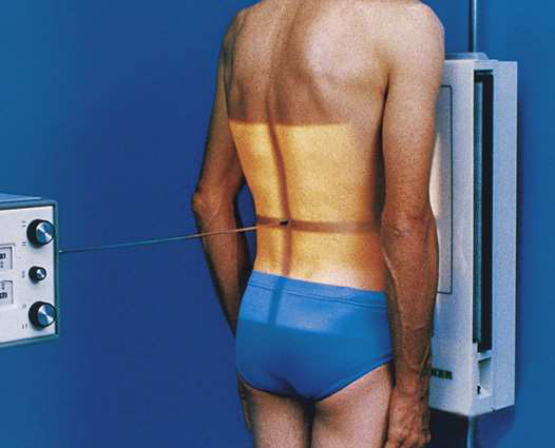
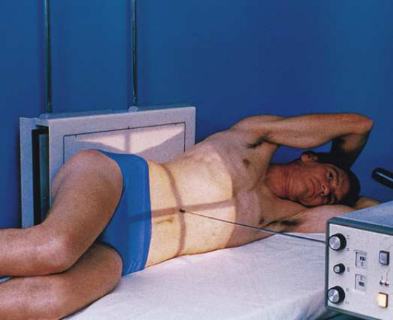
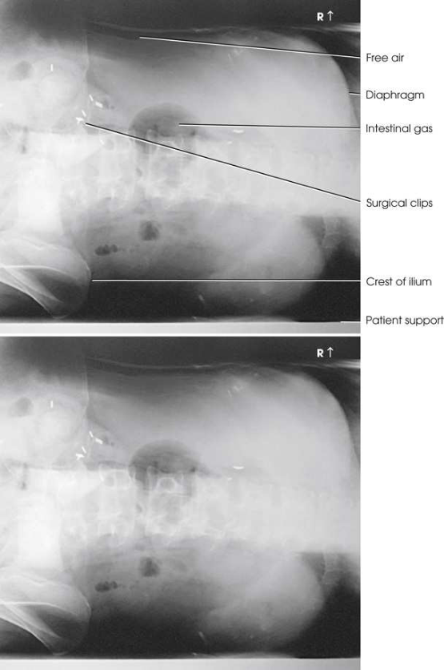

# Rx Abdomen — Incidență Antero-Posterioară (AP) — Left Incidență Decubit Lateral (Merrill)

  📷 Radiografie Convențională (Rx)
  <strong>Actualizat:</strong> 2026-09-16
  <strong>Autor:</strong> Referință Merrill

---

-   __1. Rezumat Clinic & Indicații__

    ---

    === "Indicații Clinice"

        - Conform reperelor anatomice standard din tratat

    === "Ghid Național IRIS"

        !!! info "Referință Primară: Ghidul Național IRIS (Ordinul MS 1342/2012)"
            - **Capitol Ghid IRIS:** *Ghidul Național IRIS*
            - **Grad de Recomandare:** **De verificat pe indicație; fără grad atribuit automat**
            - **Nivel de Iradiere Estimată:** `De verificat pentru examinarea și populația selectate`

            [:octicons-search-16: Deschide Ghidul IRIS](../../iris.md){ .md-button .md-button--primary } [:material-open-in-new: Aplicația Oficială PWA](https://radiologie-pediatrica.ro/iris/){ .md-button target="_blank" rel="noopener" }
-   __2. Poziționare & Centrare Fascicul__

    ---

    - **Poziție Pacient:** If pacientul este too ill la stand, place him sau her în lateral Decubit poziție culcat pe radiolucent pad pe transportation cart. Use stâng Incidență Decubit lateral în most situations. radiolucent pad este particularly important la ensure inclusion de entire dependent side when lichid demonstration este de primary concern. When liber intraperitoneal air este suspected, Se instruiește pacientul să lie pe side pentru 5 minutes before expunere la allow air la rise la its highest level within abdomenul. se poziționează pacientul’s brațe deasupra nivelului cupole diafragmatice so that they sunt nu projected over orice abdominal contents. se flectează pacient’s genunchi slightly la provide stabilization. Exercise care la ensure that pacientul does nu fall de cart; if cart este used, lock toate wheels securely în poziție.; se ajustează height de stativ vertical Bucky astfel încât axa longitudinală de receptorul de imagine este centrat pe planul mediosagital. If abdomenul este too wide la include ambele flanks pe one imagine, adjust pacient și receptorul de imagine height la include side down when intraperitoneal lichid este suspected și la include side up when pneumoperitoneum este suspected. se poziționează pacientul astfel încât level de crestele iliace este centrat pe receptorul de imagine. slightly higher centering point, 2 inches (5 cm) above crestele iliace, poate fie necessary la ensure that cupole diafragmatice este included în imagine (Fig. 4.15). se ajustează pacient la ensure that true Incidență de Profil (lateral) este attained.
    - **Punct de Centrare Fascicul:** orientat horizon̍ al și perpendicular pe midpoint de receptorul de imagine.
    - **Distanță Focar-Film (DFF / SID):** Nespecificat în fragmentul extras; de verificat în sursă
    - **Comandă Respiratorie:** Apnee la sfârșitul expirului complet. Compensating Filter pentru pacienți cu large Abdomen, compensating filter improves imagine quality prin preventing overexposure de upper-side abdominal area.

-   __3. Parametri Tehnici Expunere__

    ---

    | Parametru Tehnic | Valoare Configurare Generator / Tub |
    |:-----------------|:-------------------------------------|
    | **Tensiune Tub (kV)** | DE CONFIGURAT PE APARAT |
    | **Sarcină / Produs Curent-Timp (mAs)** | DE CONFIGURAT PE APARAT |
    | **Distanță Focar-Film (DFF / SID)** | Nespecificat în fragmentul extras; de verificat în sursă |
    | **Grilă Antidifuzoare (Bucky)** | DE CONFIGURAT PE APARAT |
    | **Dimensiune Focar** | DE CONFIGURAT PE APARAT |
    | **Camere de Ionizare AEC** | DE CONFIGURAT PE APARAT |
    | **Colimare Fascicul** | Se ajustează câmpul de iradiere la formatul 35 × 43 cm pe colimator. Pentru pacienți de talie redusă, se colimează la 2.5 cm de conturul tegumentar de abdomenul flanks. Place marker de lateralitate (D/S) și decubit marker în collimated expunere field. |
    | **Filtrare Tub** | DE CONFIGURAT PE APARAT |

-   __4. Criterii de Calitate & Reușită Imagine__

    ---

    - Criterii radiologice de calitate imaginii:
    - Colimare adecvată vizibilă și prezența markerului de lateralitate (D/S) și decubit marker plasat clear de anatomy de interest
    - cupole diafragmatice fără estompare cinetică de mișcare
    - ambele părți (bilateral) de abdomenul. If Abdomen este too wide:
    - Side down when lichid este suspected (ensure entire dependent side este included în câmp colimat)
    - Side up when aer liber este suspected
    - Abdominal perete, flank structures, și cupole diafragmatice
    - Absența rotației anatomice (simetrie bilaterală perfectă)
    - Procesele spinoase centrate pe mijlocul corpurilor vertebrale lombare
    - Spinele ischiatice ale bazinului sunt perfect simetrice bilateral
    - Aripile oaselor iliace sunt perfect simetrice bilateral (absența rotației bazinului)
    - Abdominal contents vizibil fără contrast media

-   __5. Protecție Radiologică (ALARA)__

    ---

    - Nespecificat în fragmentul extras; de verificat în sursă

!!! note "Observații Clinice & Tehnice"
    drept Incidență Decubit lateral este often requested sau poate fie required when pacientul cannot lie pe stâng side.

### 🖼️ Imagini

<figure class="protocol-image-card" markdown>

<figcaption><strong>Merrill — pagina PDF 219, imaginea 1</strong> — Imagine din fragmentul sursă; asocierea necesită revizie.</figcaption>

</figure>

<figure class="protocol-image-card" markdown>

<figcaption><strong>Merrill — pagina PDF 219, imaginea 2</strong> — Imagine din fragmentul sursă; asocierea necesită revizie.</figcaption>

</figure>

<figure class="protocol-image-card" markdown>

<figcaption><strong>Merrill — pagina PDF 220, imaginea 3</strong> — Imagine din fragmentul sursă; asocierea necesită revizie.</figcaption>

</figure>

=== "Ghid Rapid de Execuție"

    1. **Identificarea și verificarea pacientului:** verificare identitate, zonă de examinat, consimțământ conform procedurii și evaluarea posibilității unei sarcini, când este relevantă.
    2. **Pregătire:** îndepărtarea oricăror obiecte radiopace (bijuterii, agrafe, fermoare, proteze, pansamente dense).
    3. **Poziționare precisă:** alinierea receptorului de imagine și a tubului la distanța prescrisă (Nespecificat în fragmentul extras; de verificat în sursă).
    4. **Colimare strictă:** adaptarea fasciculului strict la regiunea de diagnostic pentru scăderea iradierii și reducerea radiației difuze.
    5. **Radioprotecție:** verificarea [politicii RX](../radioprotectie.md), cu măsuri distincte pentru pacient, personal și însoțitor.

## Surse de documentare

- [Merrill’s Atlas, 4. Abdomen, pagini PDF 217–220](../../assets/protocols/sources/a56d45c16829_Merrills_Atlas_of_Radiographic_Positioning__Procedures_3Vol_Set.pdf#page=217)

## Fragmente sursă traduse (referință tehnică)

### anatomy

în addition la evidențiind size și shape de ficat, splină, și rinichi, AP abdomen cu pacientul în stâng decubit poziție este most
valuable pentru evidențiind aer liber și air-nivele hidroaerice when în ortostatism abdomen incidență cannot fie obtained (Fig. 4.16).

### collimation

• Se ajustează câmpul de iradiere la formatul 35 × 43 cm pe colimator. Pentru pacienți de talie redusă, se colimează la 2.5 cm de conturul tegumentar
de abdomenul flanks. Place marker de lateralitate (D/S) și decubit marker în collimated expunere field.

### cr

• orientat horizon̍ al și perpendicular pe midpoint de receptorul de imagine.

### criteria

Criterii radiologice de calitate imaginii:
• Colimare adecvată vizibilă și prezența markerului de lateralitate (D/S) și decubit marker plasat clear de anatomy de interest
• cupole diafragmatice fără estompare cinetică de mișcare
• ambele părți (bilateral) de abdomenul. If abdomen este too wide:
• Side down when lichid este suspected (ensure entire dependent side este included în câmp colimat)
• Side up when aer liber este suspected
• Abdominal perete, flank structures, și cupole diafragmatice
• Absența rotației anatomice (simetrie bilaterală perfectă)
• Procesele spinoase centrate pe mijlocul corpurilor vertebrale lombare
• Spinele ischiatice ale bazinului sunt perfect simetrice bilateral
• Aripile oaselor iliace sunt perfect simetrice bilateral (absența rotației bazinului)
• Abdominal contents vizibil fără contrast media

### notes

drept lateral decubit poziție este often requested sau poate fie required when pacientul cannot lie pe stâng side.

### part_pos

• se ajustează height de stativ vertical Bucky astfel încât axa longitudinală de receptorul de imagine este centrat pe planul mediosagital.
• If abdomenul este too wide la include ambele flanks pe one imagine, adjust pacient și receptorul de imagine height la include side down when
intraperitoneal lichid este suspected și la include side up when pneumoperitoneum este suspected.
• se poziționează pacientul astfel încât level de crestele iliace este centrat pe receptorul de imagine. slightly higher centering point, 2 inches (5 cm) above creste iliace, poate fie necessary la ensure that cupole diafragmatice este included în imagine (Fig. 4.15).
• se ajustează pacient la ensure that true poziție de profil (lateral) este attained.

### patient_pos

• If pacientul este too ill la stand, place him sau her în lateral recumbent poziție culcat pe radiolucent pad pe transportation cart.
Use stâng lateral decubit poziție în most situations.
• radiolucent pad este particularly important la ensure inclusion de entire dependent side when lichid demonstration este de primary
concern.
• When liber intraperitoneal air este suspected, Se instruiește pacientul să lie pe side pentru 5 minutes before expunere la allow air la rise la its
highest level within abdomenul.
• se poziționează pacientul’s brațe deasupra nivelului cupole diafragmatice so that they sunt nu projected over orice abdominal contents.
• se flectează pacient’s genunchi slightly la provide stabilization.
• Exercise care la ensure that pacientul does nu fall de cart; if cart este used, lock toate wheels securely în poziție.

### respiration

Apnee la sfârșitul expirului complet.
Compensating Filter
pentru pacienți cu large abdomen, compensating filter improves imagine quality prin preventing overexposure de upper-side abdominal area.

### tech

poziționat prin manufacturer sau department protocol pentru corect anatomy display orientation; raza centrală plate: 14 × 17 inches (35 × 43 cm) longitudinal.

