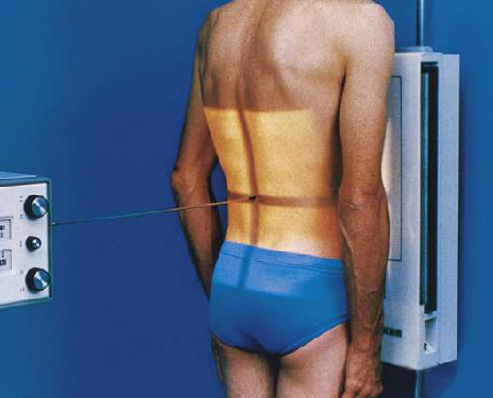
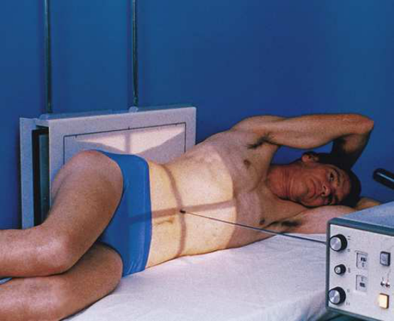
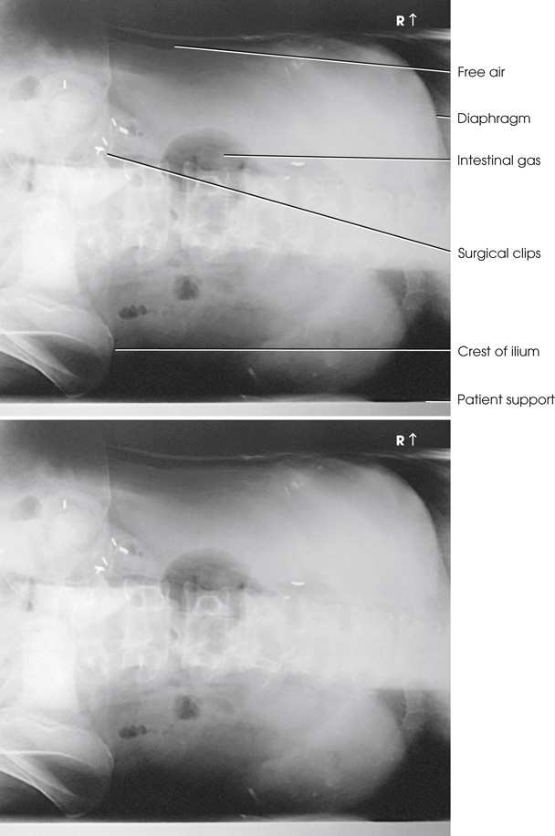

# Rx Abdomen — Incidență Antero-Posterioară (AP) — Incidență în Decubit Lateral Stâng (Merrill)

  📷 Radiografie Convențională (Rx)
  <strong>Actualizat:</strong> 2026-09-16
  <strong>Autor:</strong> Referință Merrill

---

-   __1. Rezumat Clinic & Indicații__

    ---

    === "Indicații Clinice"

        - Conform reperelor anatomice standard din tratat

    === "Ghid Național IRIS"

        !!! info "Referință Primară: Ghidul Național IRIS (Ordinul MS 1342/2012)"
            - **Capitol Ghid IRIS:** *Ghidul Național IRIS*
            - **Grad de Recomandare:** **De verificat pe indicație; fără grad atribuit automat**
            - **Nivel de Iradiere Estimată:** `De verificat pentru examinarea și populația selectate`

            [:octicons-search-16: Deschide Ghidul IRIS](../../iris.md){ .md-button .md-button--primary } [:material-open-in-new: Aplicația Oficială PWA](https://radiologie-pediatrica.ro/iris/){ .md-button target="_blank" rel="noopener" }
-   __2. Poziționare & Centrare Fascicul__

    ---

    - **Poziție Pacient:** Dacă pacientul este prea bolnav pentru a sta în picioare, se așază în decubit lateral pe un suport radiotransparent, pe căruciorul de transport. Se utilizează incidența în decubit lateral stâng în majoritatea situațiilor. Suportul radiotransparent este deosebit de important pentru a asigura includerea întregii părți declive când evidențierea lichidului este obiectivul principal. Când se suspectează aer intraperitoneal liber, se instruiește pacientul să stea culcat pe o parte timp de 5 minute înainte de expunere, pentru a permite aerului să se ridice la nivelul cel mai înalt din abdomen. Se poziționează brațele pacientului deasupra nivelului cupolelor diafragmatice, astfel încât să nu se proiecteze peste conținutul abdominal. Se flectează ușor genunchii pacientului pentru stabilizare. Se acordă atenție pentru a preveni căderea pacientului de pe cărucior; dacă se utilizează un cărucior, se blochează ferm toate roțile în poziție. Se ajustează înălțimea stativului vertical Bucky astfel încât axa longitudinală a receptorului de imagine să fie centrată pe planul mediosagital. Dacă abdomenul este prea lat pentru a include ambele flancuri pe o singură imagine, se ajustează înălțimea pacientului și a receptorului de imagine pentru a include partea situată dedesubt când se suspectează lichid intraperitoneal și partea situată deasupra când se suspectează pneumoperitoneu. Se poziționează pacientul astfel încât nivelul crestelor iliace să fie centrat pe receptorul de imagine. Poate fi necesar un punct de centrare puțin mai sus, la 2 țoli (5 cm) deasupra crestelor iliace, pentru a asigura includerea cupolelor diafragmatice în imagine (Fig. 4.15). Se ajustează poziția pacientului pentru a obține o incidență de profil strict.
    - **Punct de Centrare Fascicul:** orientat orizontal și perpendicular pe centrul receptorului de imagine.
    - **Distanță Focar-Film (DFF / SID):** Nespecificat în fragmentul extras; de verificat în sursă
    - **Comandă Respiratorie:** Apnee la sfârșitul expirului complet. Filtru de compensare: pentru pacienții cu abdomen voluminos, filtrul de compensare îmbunătățește calitatea imaginii prin prevenirea supraexpunerii regiunii abdominale situate deasupra.

-   __3. Parametri Tehnici Expunere__

    ---

    | Parametru Tehnic | Valoare Configurare Generator / Tub |
    |:-----------------|:-------------------------------------|
    | **Tensiune Tub (kV)** | DE CONFIGURAT PE APARAT |
    | **Sarcină / Produs Curent-Timp (mAs)** | DE CONFIGURAT PE APARAT |
    | **Distanță Focar-Film (DFF / SID)** | Nespecificat în fragmentul extras; de verificat în sursă |
    | **Grilă Antidifuzoare (Bucky)** | DE CONFIGURAT PE APARAT |
    | **Dimensiune Focar** | DE CONFIGURAT PE APARAT |
    | **Camere de Ionizare AEC** | DE CONFIGURAT PE APARAT |
    | **Colimare Fascicul** | Se ajustează câmpul de iradiere la formatul 35 × 43 cm pe colimator. Pentru pacienți de talie redusă, se colimează la 2.5 cm de conturul tegumentar al flancurilor abdominale. Se plasează markerul de lateralitate (D/S) și markerul de decubit în câmpul de expunere colimat. |
    | **Filtrare Tub** | DE CONFIGURAT PE APARAT |

-   __4. Criterii de Calitate & Reușită Imagine__

    ---

    - Criterii radiologice de calitate a imaginii:
    - Colimare adecvată vizibilă și prezența markerului de lateralitate (D/S) și a markerului de decubit, plasate în afara structurilor anatomice de interes
    - cupole diafragmatice fără estompare cinetică
    - ambele părți ale abdomenului (bilateral). Dacă abdomenul este prea lat:
    - Partea situată dedesubt când se suspectează lichid (se asigură includerea întregii părți declive în câmpul colimat)
    - Partea situată deasupra când se suspectează aer liber
    - Peretele abdominal, structurile flancurilor și cupolele diafragmatice
    - Absența rotației anatomice (simetrie bilaterală perfectă)
    - Procesele spinoase centrate pe mijlocul corpurilor vertebrale lombare
    - Spinele ischiatice ale bazinului sunt perfect simetrice bilateral
    - Aripile oaselor iliace sunt perfect simetrice bilateral (absența rotației bazinului)
    - Conținutul abdominal vizibil fără substanță de contrast

-   __5. Protecție Radiologică (ALARA)__

    ---

    - Nespecificat în fragmentul extras; de verificat în sursă

!!! note "Observații Clinice & Tehnice"
    Incidența în decubit lateral drept este frecvent solicitată sau poate fi necesară când pacientul nu poate sta culcat pe partea stângă.

### 🖼️ Imagini

<figure class="protocol-image-card" markdown>

<figcaption><strong>Merrill — pagina 219, imaginea 1</strong> — Imagine din fragmentul sursă; asocierea necesită revizie.</figcaption>

</figure>

<figure class="protocol-image-card" markdown>

<figcaption><strong>Merrill — pagina 219, imaginea 2</strong> — Imagine din fragmentul sursă; asocierea necesită revizie.</figcaption>

</figure>

<figure class="protocol-image-card" markdown>

<figcaption><strong>Merrill — pagina 220, imaginea 3</strong> — Imagine din fragmentul sursă; asocierea necesită revizie.</figcaption>

</figure>

=== "Ghid Rapid de Execuție"

    1. **Identificarea și verificarea pacientului:** verificare identitate, zonă de examinat, consimțământ conform procedurii și evaluarea posibilității unei sarcini, când este relevantă.
    2. **Pregătire:** îndepărtarea oricăror obiecte radiopace (bijuterii, agrafe, fermoare, proteze, pansamente dense).
    3. **Poziționare precisă:** alinierea receptorului de imagine și a tubului la distanța prescrisă (Nespecificat în fragmentul extras; de verificat în sursă).
    4. **Colimare strictă:** adaptarea fasciculului strict la regiunea de diagnostic pentru scăderea iradierii și reducerea radiației difuze.
    5. **Radioprotecție:** verificarea [politicii RX](../radioprotectie.md), cu măsuri distincte pentru pacient, personal și însoțitor.

## Surse de documentare

- [Merrill’s Atlas, 4. Abdomen, pagini 217–220](https://books.google.com/books/about/Merrill_s_Atlas_of_Radiographic_Position.html?id=BM0lEQAAQBAJ)

## Fragmente sursă traduse (referință tehnică)

### anatomie

Pe lângă evidențierea dimensiunilor și formei ficatului, splinei și rinichilor, radiografia AP a abdomenului cu pacientul în decubit lateral stâng este deosebit de
utilă pentru evidențierea aerului liber și a nivelurilor hidroaerice când nu se poate obține o radiografie a abdomenului în ortostatism (Fig. 4.16).

### colimare

• Se ajustează câmpul de iradiere la formatul 35 × 43 cm pe colimator. Pentru pacienți de talie redusă, se colimează la 2.5 cm de conturul tegumentar
al flancurilor abdominale. Se plasează markerul de lateralitate (D/S) și markerul de decubit în câmpul de expunere colimat.

### raza centrală

• orientat orizontal și perpendicular pe centrul receptorului de imagine.

### criterii

Criterii radiologice de calitate a imaginii:
• Colimare adecvată vizibilă și prezența markerului de lateralitate (D/S) și a markerului de decubit, plasate în afara structurilor anatomice de interes
• cupole diafragmatice fără estompare cinetică
• ambele părți ale abdomenului (bilateral). Dacă abdomenul este prea lat:
• Partea situată dedesubt când se suspectează lichid (se asigură includerea întregii părți declive în câmpul colimat)
• Partea situată deasupra când se suspectează aer liber
• Peretele abdominal, structurile flancurilor și cupolele diafragmatice
• Absența rotației anatomice (simetrie bilaterală perfectă)
• Procesele spinoase centrate pe mijlocul corpurilor vertebrale lombare
• Spinele ischiatice ale bazinului sunt perfect simetrice bilateral
• Aripile oaselor iliace sunt perfect simetrice bilateral (absența rotației bazinului)
• Conținutul abdominal vizibil fără substanță de contrast

### note

Poziția în decubit lateral drept este frecvent solicitată sau poate fi necesară când pacientul nu poate sta culcat pe partea stângă.

### part_pos

• Se ajustează înălțimea stativului vertical Bucky astfel încât axa longitudinală a receptorului de imagine să fie centrată pe planul mediosagital.
• Dacă abdomenul este prea lat pentru a include ambele flancuri pe o singură imagine, se ajustează înălțimea pacientului și a receptorului de imagine pentru a include partea situată dedesubt când
se suspectează lichid intraperitoneal și partea situată deasupra când se suspectează pneumoperitoneu.
• Se poziționează pacientul astfel încât nivelul crestelor iliace să fie centrat pe receptorul de imagine. Poate fi necesar un punct de centrare puțin mai sus, la 2 țoli (5 cm) deasupra crestelor iliace, pentru a asigura includerea cupolelor diafragmatice în imagine (Fig. 4.15).
• Se ajustează poziția pacientului pentru a obține o poziție de profil strict.

### patient_pos

• Dacă pacientul este prea bolnav pentru a sta în picioare, se așază în decubit lateral pe un suport radiotransparent, pe căruciorul de transport.
Se utilizează poziția în decubit lateral stâng în majoritatea situațiilor.
• Suportul radiotransparent este deosebit de important pentru a asigura includerea întregii părți declive când evidențierea lichidului este obiectivul
principal.
• Când se suspectează aer intraperitoneal liber, se instruiește pacientul să stea culcat pe o parte timp de 5 minute înainte de expunere, pentru a permite aerului să se ridice la
nivelul cel mai înalt din abdomen.
• Se poziționează brațele pacientului deasupra nivelului cupolelor diafragmatice, astfel încât să nu se proiecteze peste conținutul abdominal.
• Se flectează ușor genunchii pacientului pentru stabilizare.
• Se acordă atenție pentru a preveni căderea pacientului de pe cărucior; dacă se utilizează un cărucior, se blochează ferm toate roțile în poziție.

### respirație

Apnee la sfârșitul expirului complet.
Filtru de compensare
Pentru pacienții cu abdomen voluminos, filtrul de compensare îmbunătățește calitatea imaginii prin prevenirea supraexpunerii regiunii abdominale situate deasupra.

### tehnică

poziționat conform indicațiilor producătorului sau protocolului departamentului pentru orientarea corectă a afișării anatomiei; raza centrală; placă: 14 × 17 țoli (35 × 43 cm), longitudinal.

