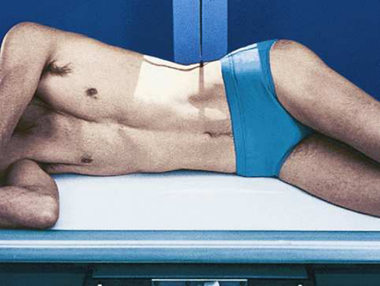
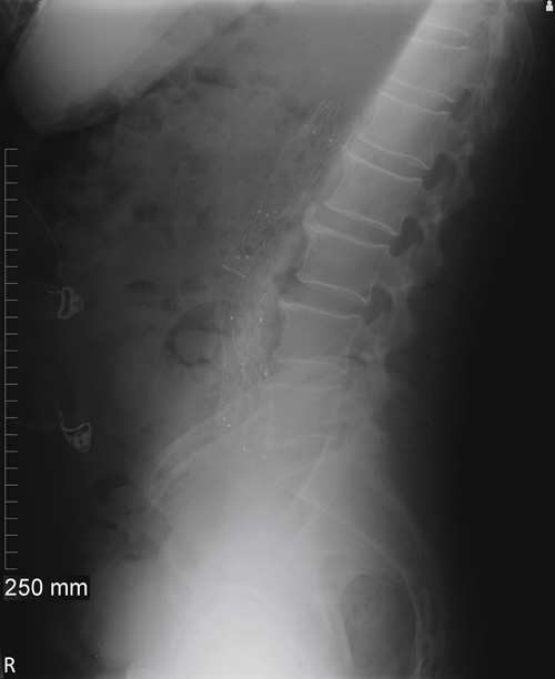

# Rx Abdomen — Incidență de Profil (Lateral) — Profil Drept sau Stâng (Merrill)

  📷 Radiografie Convențională (Rx)
  <strong>Actualizat:</strong> 2026-09-16
  <strong>Autor:</strong> Referință Merrill

---

-   __1. Rezumat Clinic & Indicații__

    ---

    === "Indicații Clinice"

        - Conform reperelor anatomice standard din tratat

    === "Ghid Național IRIS"

        !!! info "Referință Primară: Ghidul Național IRIS (Ordinul MS 1342/2012)"
            - **Capitol Ghid IRIS:** *Aparat digestiv & Abdomen*
            - **Grad de Recomandare:** **Grad B**
            - **Nivel de Iradiere Estimată:** `Clasa 2 (Foarte mică ~ 0.7 - 1.2 mSv)`

            [:octicons-search-16: Deschide Ghidul IRIS](../../iris.md){ .md-button .md-button--primary } [:material-open-in-new: Aplicația Oficială PWA](https://radiologie-pediatrica.ro/iris/){ .md-button target="_blank" rel="noopener" }

-   __2. Poziționare & Centrare Fascicul__

    ---

    - **Poziție Pacient:** Se întoarce pacientul în decubit lateral pe partea dreaptă sau stângă.; Se flectează genunchii pacientului într-o poziție confortabilă și se ajustează poziția corpului astfel încât planul mediocoronal să fie centrat pe linia mediană a grilei. Se plasează suporturi între genunchi și între glezne. Se flectează coatele și se plasează mâinile sub capul pacientului (Fig. 4.17). Se centrează receptorul de imagine la nivelul crestelor iliace sau la 2 țoli (5 cm) deasupra crestelor pentru a include cupolele diafragmatice.
    - **Punct de Centrare Fascicul:** perpendicular pe receptorul de imagine (RI), pătrunzând în planul mediocoronal la nivelul crestelor iliace sau la 2 țoli (5 cm) deasupra crestelor iliace dacă se includ cupolele diafragmatice.
    - **Distanță Focar-Film (DFF / SID):** Nespecificat în fragmentul extras; de verificat în sursă
    - **Comandă Respiratorie:** Apnee la sfârșitul expirului complet.

-   __3. Parametri Tehnici Expunere__

    ---

    | Parametru Tehnic | Valoare Configurare Generator / Tub |
    |:-----------------|:-------------------------------------|
    | **Tensiune Tub (kV)** | DE CONFIGURAT PE APARAT |
    | **Sarcină / Produs Curent-Timp (mAs)** | DE CONFIGURAT PE APARAT |
    | **Distanță Focar-Film (DFF / SID)** | Nespecificat în fragmentul extras; de verificat în sursă |
    | **Grilă Antidifuzoare (Bucky)** | DE CONFIGURAT PE APARAT |
    | **Dimensiune Focar** | DE CONFIGURAT PE APARAT |
    | **Camere de Ionizare AEC** | DE CONFIGURAT PE APARAT |
    | **Colimare Fascicul** | Se ajustează câmpul de iradiere la formatul 35 × 43 cm pe colimator. Pentru pacienții de talie mai mică, se colimează la cel mult 1 țol (2.5 cm) de contururile anterior și posterior ale abdomenului. Se plasează markerul de lateralitate în câmpul colimat. |
    | **Filtrare Tub** | DE CONFIGURAT PE APARAT |

-   __4. Criterii de Calitate & Reușită Imagine__

    ---

    - Criterii radiologice de calitate a imaginii:
    - Colimare adecvată vizibilă și prezența markerului de lateralitate (D/S) plasat în afara structurilor anatomice de interes
    - Absența rotației anatomice (simetrie bilaterală perfectă)
    - Oasele iliace suprapuse
    - Pediculii vertebrelor lombare suprapuși și foramenele intervertebrale deschise
    - o porțiune cât mai mare din restul abdomenului când se includ cupolele diafragmatice
    - Conținutul abdominal vizibil fără substanță de contrast

-   __5. Protecție Radiologică (ALARA)__

    ---

    - Nespecificat în fragmentul extras; de verificat în sursă

!!! note "Observații Clinice & Tehnice"
    Conform reperelor anatomice standard din tratat

### 🖼️ Imagini

<figure class="protocol-image-card" markdown>

<figcaption><strong>Merrill — pagina 222, imaginea 1</strong> — Imagine din fragmentul sursă; asocierea necesită revizie.</figcaption>

</figure>

<figure class="protocol-image-card" markdown>

<figcaption><strong>Merrill — pagina 223, imaginea 2</strong> — Imagine din fragmentul sursă; asocierea necesită revizie.</figcaption>

</figure>

=== "Ghid Rapid de Execuție"

    1. **Identificarea și verificarea pacientului:** verificare identitate, zonă de examinat, consimțământ conform procedurii și evaluarea posibilității unei sarcini, când este relevantă.
    2. **Pregătire:** îndepărtarea oricăror obiecte radiopace (bijuterii, agrafe, fermoare, proteze, pansamente dense).
    3. **Poziționare precisă:** alinierea receptorului de imagine și a tubului la distanța prescrisă (Nespecificat în fragmentul extras; de verificat în sursă).
    4. **Colimare strictă:** adaptarea fasciculului strict la regiunea de diagnostic pentru scăderea iradierii și reducerea radiației difuze.
    5. **Radioprotecție:** verificarea [politicii RX](../radioprotectie.md), cu măsuri distincte pentru pacient, personal și însoțitor.

## Surse de documentare

- [Merrill’s Atlas, 4. Abdomen, pagini 221–223](https://books.google.com/books/about/Merrill_s_Atlas_of_Radiographic_Position.html?id=BM0lEQAAQBAJ)
