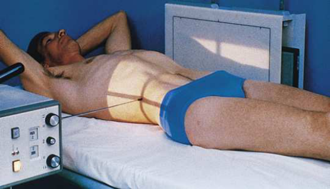
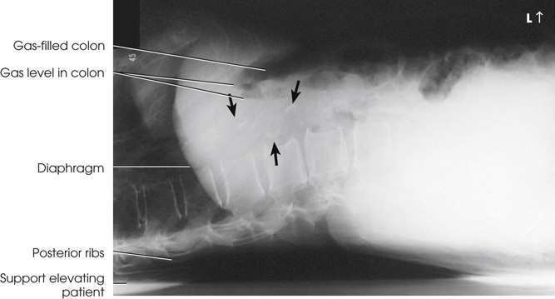

# Rx Abdomen — Incidență de Profil (Lateral) — Right or left Incidență Decubit Dorsal (Merrill)

  📷 Radiografie Convențională (Rx)
  <strong>Actualizat:</strong> 2026-09-16
  <strong>Autor:</strong> Referință Merrill

---

-   __1. Rezumat Clinic & Indicații__

    ---

    === "Indicații Clinice"

        - Conform reperelor anatomice standard din tratat

    === "Ghid Național IRIS"

        !!! info "Referință Primară: Ghidul Național IRIS (Ordinul MS 1342/2012)"
            - **Capitol Ghid IRIS:** *Ghidul Național IRIS*
            - **Grad de Recomandare:** **De verificat pe indicație; fără grad atribuit automat**
            - **Nivel de Iradiere Estimată:** `De verificat pentru examinarea și populația selectate`

            [:octicons-search-16: Deschide Ghidul IRIS](../../iris.md){ .md-button .md-button--primary } [:material-open-in-new: Aplicația Oficială PWA](https://radiologie-pediatrica.ro/iris/){ .md-button target="_blank" rel="noopener" }
-   __2. Poziționare & Centrare Fascicul__

    ---

    - **Poziție Pacient:** When pacientul cannot stand sau lie pe side, se așază pacientul în Decubit dorsal poziție pe transportation cart sau other suitable support cu drept sau stâng side în contact cu stativ vertical Bucky. se poziționează pacientul’s brațe across upper Torace la ensure that they sunt nu projected over orice abdominal contents sau place them behind pacientul’s cap. se flectează pacient’s genunchi slightly la relieve strain pe back. Exercise care la ensure that pacientul does nu fall de la cart sau table; if cart este used, lock toate wheels securely în poziție.; se ajustează height de stativ vertical Bucky astfel încât axa longitudinală de receptorul de imagine este centrat pe planul mediocoronal. se poziționează pacientul so that point approximately 2 inches (5 cm) deasupra nivelului crestele iliace este centrat pe receptorul de imagine (Fig. 4.19). se ajustează pacient la ensure that Absența rotației anatomice (simetrie bilaterală perfectă) de la Decubit dorsal poziție occurs.
    - **Punct de Centrare Fascicul:** orientat horizon̍ al și perpendicular pe centrul receptorului de imagine, entering planul mediocoronal 2 inches (5 cm) deasupra nivelului crestele iliace.
    - **Distanță Focar-Film (DFF / SID):** Nespecificat în fragmentul extras; de verificat în sursă
    - **Comandă Respiratorie:** Apnee la sfârșitul expirului complet.

-   __3. Parametri Tehnici Expunere__

    ---

    | Parametru Tehnic | Valoare Configurare Generator / Tub |
    |:-----------------|:-------------------------------------|
    | **Tensiune Tub (kV)** | DE CONFIGURAT PE APARAT |
    | **Sarcină / Produs Curent-Timp (mAs)** | DE CONFIGURAT PE APARAT |
    | **Distanță Focar-Film (DFF / SID)** | Nespecificat în fragmentul extras; de verificat în sursă |
    | **Grilă Antidifuzoare (Bucky)** | DE CONFIGURAT PE APARAT |
    | **Dimensiune Focar** | DE CONFIGURAT PE APARAT |
    | **Camere de Ionizare AEC** | DE CONFIGURAT PE APARAT |
    | **Colimare Fascicul** | Se ajustează câmpul de iradiere la formatul 35 × 43 cm pe colimator. pentru smaller pacienți, collimate la within 1 inch (2.5 cm) de anterior și posterior shadows de abdomenul. Se plasează markerul de lateralitate în câmpul colimat. |
    | **Filtrare Tub** | DE CONFIGURAT PE APARAT |

-   __4. Criterii de Calitate & Reușită Imagine__

    ---

    - Criterii radiologice de calitate imaginii:
    - Colimare adecvată vizibilă și prezența markerului de lateralitate (D/S) și decubit marker plasat clear de anatomy de interest
    - Absența rotației anatomice (simetrie bilaterală perfectă)
    - Superimposed ilia
    - Superimposed coloană lombară pedicles și open intervertebral foramina
    - Open intervertebral foramina
    - ca much de remaining Abdomen ca possible when cupole diafragmatice este included
    - Abdominal contents vizibil fără contrast media

-   __5. Protecție Radiologică (ALARA)__

    ---

    - Nespecificat în fragmentul extras; de verificat în sursă

!!! note "Observații Clinice & Tehnice"
    Conform reperelor anatomice standard din tratat

### 🖼️ Imagini

<figure class="protocol-image-card" markdown>

<figcaption><strong>Merrill — pagina PDF 224, imaginea 1</strong> — Imagine din fragmentul sursă; asocierea necesită revizie.</figcaption>

</figure>

<figure class="protocol-image-card" markdown>

<figcaption><strong>Merrill — pagina PDF 225, imaginea 2</strong> — Imagine din fragmentul sursă; asocierea necesită revizie.</figcaption>

</figure>

=== "Ghid Rapid de Execuție"

    1. **Identificarea și verificarea pacientului:** verificare identitate, zonă de examinat, consimțământ conform procedurii și evaluarea posibilității unei sarcini, când este relevantă.
    2. **Pregătire:** îndepărtarea oricăror obiecte radiopace (bijuterii, agrafe, fermoare, proteze, pansamente dense).
    3. **Poziționare precisă:** alinierea receptorului de imagine și a tubului la distanța prescrisă (Nespecificat în fragmentul extras; de verificat în sursă).
    4. **Colimare strictă:** adaptarea fasciculului strict la regiunea de diagnostic pentru scăderea iradierii și reducerea radiației difuze.
    5. **Radioprotecție:** verificarea [politicii RX](../radioprotectie.md), cu măsuri distincte pentru pacient, personal și însoțitor.

## Surse de documentare

- [Merrill’s Atlas, 4. Abdomen, pagini PDF 223–225](../../assets/protocols/sources/a56d45c16829_Merrills_Atlas_of_Radiographic_Positioning__Procedures_3Vol_Set.pdf#page=223)

## Fragmente sursă traduse (referință tehnică)

### anatomy

lateral incidență de abdomenul este valuable în evidențiind prevertebral space și este useful în determining air-nivele hidroaerice în abdomenul
(Fig. 4.20).

### collimation

• Se ajustează câmpul de iradiere la formatul 35 × 43 cm pe colimator. pentru smaller pacienți, collimate la within 1 inch (2.5 cm) de anterior și posterior shadows de abdomenul. Se plasează markerul de lateralitate în câmpul colimat.

### cr

• orientat horizon̍ al și perpendicular pe centrul receptorului de imagine, entering planul mediocoronal 2 inches (5 cm) deasupra nivelului iliac
creste.

### criteria

Criterii radiologice de calitate imaginii:
• Colimare adecvată vizibilă și prezența markerului de lateralitate (D/S) și decubit marker plasat clear de anatomy de interest
• Absența rotației anatomice (simetrie bilaterală perfectă)
• Superimposed ilia
• Superimposed coloană lombară pedicles și open intervertebral foramina
• Open intervertebral foramina
• ca much de remaining abdomen ca possible when cupole diafragmatice este included
• Abdominal contents vizibil fără contrast media

### part_pos

• se ajustează height de stativ vertical Bucky astfel încât axa longitudinală de receptorul de imagine este centrat pe planul mediocoronal.
• se poziționează pacientul so that point approximately 2 inches (5 cm) deasupra nivelului crestele iliace este centrat pe receptorul de imagine (Fig. 4.19).
• se ajustează pacient la ensure that Absența rotației anatomice (simetrie bilaterală perfectă) de la decubit dorsal occurs.

### patient_pos

• When pacientul cannot stand sau lie pe side, se așază pacientul în decubit dorsal pe transportation cart sau other suitable
support cu drept sau stâng side în contact cu stativ vertical Bucky.
• se poziționează pacientul’s brațe across upper chest la ensure that they sunt nu projected over orice abdominal contents sau place them behind
pacientul’s cap.
• se flectează pacient’s genunchi slightly la relieve strain pe back.
• Exercise care la ensure that pacientul does nu fall de la cart sau table; if cart este used, lock toate wheels securely în poziție.

### respiration

Apnee la sfârșitul expirului complet.

### tech

poziționat prin manufacturer sau department protocol pentru corect anatomy display orientation; raza centrală plate: 14 × 17 inches (35 × 43 cm) longitudinal.

