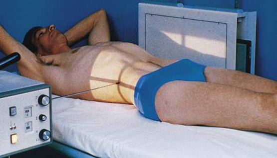
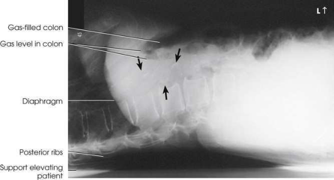

# Rx Abdomen — Incidență de Profil (Lateral) — Profil Drept sau Stâng în Decubit Dorsal (Merrill)

  📷 Radiografie Convențională (Rx)
  <strong>Actualizat:</strong> 2026-09-16
  <strong>Autor:</strong> Referință Merrill

---

-   __1. Rezumat Clinic & Indicații__

    ---

    === "Indicații Clinice"

        - Conform reperelor anatomice standard din tratat

    === "Ghid Național IRIS"

        !!! info "Referință Primară: Ghidul Național IRIS (Ordinul MS 1342/2012)"
            - **Capitol Ghid IRIS:** *Ghidul Național IRIS*
            - **Grad de Recomandare:** **De verificat pe indicație; fără grad atribuit automat**
            - **Nivel de Iradiere Estimată:** `De verificat pentru examinarea și populația selectate`

            [:octicons-search-16: Deschide Ghidul IRIS](../../iris.md){ .md-button .md-button--primary } [:material-open-in-new: Aplicația Oficială PWA](https://radiologie-pediatrica.ro/iris/){ .md-button target="_blank" rel="noopener" }
-   __2. Poziționare & Centrare Fascicul__

    ---

    - **Poziție Pacient:** Când pacientul nu poate sta în picioare sau culcat pe o parte, se așază în decubit dorsal pe căruciorul de transport sau pe un alt suport adecvat, cu partea dreaptă sau stângă în contact cu stativul vertical Bucky. Se poziționează brațele pacientului peste partea superioară a toracelui, astfel încât să nu se proiecteze peste conținutul abdominal, sau se așază în spatele capului pacientului. Se flectează ușor genunchii pacientului pentru a reduce solicitarea spatelui. Se acordă atenție pentru a preveni căderea pacientului de pe cărucior sau de pe masă; dacă se utilizează un cărucior, se blochează ferm toate roțile în poziție. Se ajustează înălțimea stativului vertical Bucky astfel încât axa longitudinală a receptorului de imagine să fie centrată pe planul mediocoronal. Se poziționează pacientul astfel încât un punct situat la aproximativ 2 țoli (5 cm) deasupra nivelului crestelor iliace să fie centrat pe receptorul de imagine (Fig. 4.19). Se ajustează poziția pacientului pentru a asigura absența rotației anatomice (simetrie bilaterală perfectă) față de poziția de decubit dorsal.
    - **Punct de Centrare Fascicul:** orientat orizontal și perpendicular pe centrul receptorului de imagine, pătrunzând în planul mediocoronal la 2 țoli (5 cm) deasupra nivelului crestelor iliace.
    - **Distanță Focar-Film (DFF / SID):** Nespecificat în fragmentul extras; de verificat în sursă
    - **Comandă Respiratorie:** Apnee la sfârșitul expirului complet.

-   __3. Parametri Tehnici Expunere__

    ---

    | Parametru Tehnic | Valoare Configurare Generator / Tub |
    |:-----------------|:-------------------------------------|
    | **Tensiune Tub (kV)** | DE CONFIGURAT PE APARAT |
    | **Sarcină / Produs Curent-Timp (mAs)** | DE CONFIGURAT PE APARAT |
    | **Distanță Focar-Film (DFF / SID)** | Nespecificat în fragmentul extras; de verificat în sursă |
    | **Grilă Antidifuzoare (Bucky)** | DE CONFIGURAT PE APARAT |
    | **Dimensiune Focar** | DE CONFIGURAT PE APARAT |
    | **Camere de Ionizare AEC** | DE CONFIGURAT PE APARAT |
    | **Colimare Fascicul** | Se ajustează câmpul de iradiere la formatul 35 × 43 cm pe colimator. Pentru pacienții de talie mai mică, se colimează la cel mult 1 țol (2.5 cm) de contururile anterior și posterior ale abdomenului. Se plasează markerul de lateralitate în câmpul colimat. |
    | **Filtrare Tub** | DE CONFIGURAT PE APARAT |

-   __4. Criterii de Calitate & Reușită Imagine__

    ---

    - Criterii radiologice de calitate a imaginii:
    - Colimare adecvată vizibilă și prezența markerului de lateralitate (D/S) și a markerului de decubit, plasate în afara structurilor anatomice de interes
    - Absența rotației anatomice (simetrie bilaterală perfectă)
    - Oasele iliace suprapuse
    - Pediculii vertebrelor lombare suprapuși și foramenele intervertebrale deschise
    - Foramene intervertebrale deschise
    - o porțiune cât mai mare din restul abdomenului când se includ cupolele diafragmatice
    - Conținutul abdominal vizibil fără substanță de contrast

-   __5. Protecție Radiologică (ALARA)__

    ---

    - Nespecificat în fragmentul extras; de verificat în sursă

!!! note "Observații Clinice & Tehnice"
    Conform reperelor anatomice standard din tratat

### 🖼️ Imagini

<figure class="protocol-image-card" markdown>

<figcaption><strong>Merrill — pagina 224, imaginea 1</strong> — Imagine din fragmentul sursă; asocierea necesită revizie.</figcaption>

</figure>

<figure class="protocol-image-card" markdown>

<figcaption><strong>Merrill — pagina 225, imaginea 2</strong> — Imagine din fragmentul sursă; asocierea necesită revizie.</figcaption>

</figure>

=== "Ghid Rapid de Execuție"

    1. **Identificarea și verificarea pacientului:** verificare identitate, zonă de examinat, consimțământ conform procedurii și evaluarea posibilității unei sarcini, când este relevantă.
    2. **Pregătire:** îndepărtarea oricăror obiecte radiopace (bijuterii, agrafe, fermoare, proteze, pansamente dense).
    3. **Poziționare precisă:** alinierea receptorului de imagine și a tubului la distanța prescrisă (Nespecificat în fragmentul extras; de verificat în sursă).
    4. **Colimare strictă:** adaptarea fasciculului strict la regiunea de diagnostic pentru scăderea iradierii și reducerea radiației difuze.
    5. **Radioprotecție:** verificarea [politicii RX](../radioprotectie.md), cu măsuri distincte pentru pacient, personal și însoțitor.

## Surse de documentare

- [Merrill’s Atlas, 4. Abdomen, pagini 223–225](https://books.google.com/books/about/Merrill_s_Atlas_of_Radiographic_Position.html?id=BM0lEQAAQBAJ)

## Fragmente sursă traduse (referință tehnică)

### anatomie

Incidența de profil a abdomenului este valoroasă pentru evidențierea spațiului prevertebral și este utilă pentru identificarea nivelurilor hidroaerice din abdomen
(Fig. 4.20).

### colimare

• Se ajustează câmpul de iradiere la formatul 35 × 43 cm pe colimator. Pentru pacienții de talie mai mică, se colimează la cel mult 1 țol (2.5 cm) de contururile anterior și posterior ale abdomenului. Se plasează markerul de lateralitate în câmpul colimat.

### raza centrală

• orientat orizontal și perpendicular pe centrul receptorului de imagine, pătrunzând în planul mediocoronal la 2 țoli (5 cm) deasupra nivelului crestelor
iliace.

### criterii

Criterii radiologice de calitate a imaginii:
• Colimare adecvată vizibilă și prezența markerului de lateralitate (D/S) și a markerului de decubit, plasate în afara structurilor anatomice de interes
• Absența rotației anatomice (simetrie bilaterală perfectă)
• Oasele iliace suprapuse
• Pediculii vertebrelor lombare suprapuși și foramenele intervertebrale deschise
• Foramene intervertebrale deschise
• o porțiune cât mai mare din restul abdomenului când se includ cupolele diafragmatice
• Conținutul abdominal vizibil fără substanță de contrast

### part_pos

• Se ajustează înălțimea stativului vertical Bucky astfel încât axa longitudinală a receptorului de imagine să fie centrată pe planul mediocoronal.
• Se poziționează pacientul astfel încât un punct situat la aproximativ 2 țoli (5 cm) deasupra nivelului crestelor iliace să fie centrat pe receptorul de imagine (Fig. 4.19).
• Se ajustează poziția pacientului pentru a asigura absența rotației anatomice (simetrie bilaterală perfectă) față de poziția de decubit dorsal.

### patient_pos

• Când pacientul nu poate sta în picioare sau culcat pe o parte, se așază în decubit dorsal pe căruciorul de transport sau pe un alt
suport adecvat, cu partea dreaptă sau stângă în contact cu stativul vertical Bucky.
• Se poziționează brațele pacientului peste partea superioară a toracelui, astfel încât să nu se proiecteze peste conținutul abdominal, sau se așază în spatele
capului pacientului.
• Se flectează ușor genunchii pacientului pentru a reduce solicitarea spatelui.
• Se acordă atenție pentru a preveni căderea pacientului de pe cărucior sau de pe masă; dacă se utilizează un cărucior, se blochează ferm toate roțile în poziție.

### respirație

Apnee la sfârșitul expirului complet.

### tehnică

poziționat conform indicațiilor producătorului sau protocolului departamentului pentru orientarea corectă a afișării anatomiei; raza centrală; placă: 14 × 17 țoli (35 × 43 cm), longitudinal.

