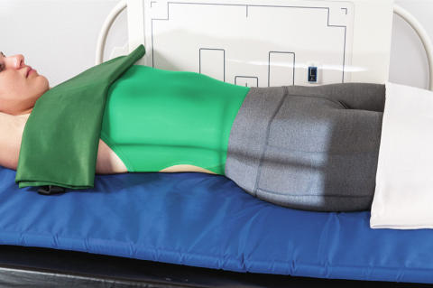
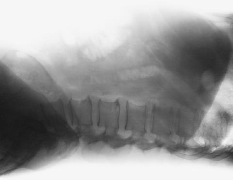

# Rx Abdomen Incidență Decubit Dorsal (RIGHT OR LEFT LATERAL)

  📷 Radiografie Convențională (Rx)
  <strong>Actualizat:</strong> 2026-09-15
  <strong>Autor:</strong> Departamentul de Radiologie / Referință Bontrager

---

-   __1. Rezumat Clinic & Indicații__

    ---

    === "Indicații Clinice"

        - Formațiuni tumorale, acumulări anormale de gaze, nivele hidroaerice, anevrisme vasculare (dilatarea calibrului vascular)
        - Calcificări patologice ale aortei abdominale sau ale altor vase mari
        - Hernie ombilicală

    === "Ghid Național IRIS"

        !!! info "Referință Primară: Ghidul Național IRIS (Ordinul MS 1342/2012)"
            - **Capitol Ghid IRIS:** *Ghidul Național IRIS*
            - **Grad de Recomandare:** **De verificat pe indicație; fără grad atribuit automat**
            - **Nivel de Iradiere Estimată:** `De verificat pentru examinarea și populația selectate`

            [:octicons-search-16: Deschide Ghidul IRIS](../../iris.md){ .md-button .md-button--primary } [:material-open-in-new: Aplicația Oficială PWA](https://radiologie-pediatrica.ro/iris/){ .md-button target="_blank" rel="noopener" }
-   __2. Poziționare & Centrare Fascicul__

    ---

    - **Poziție Pacient:** Pacient: Decubit dorsal pe radiolucent pad, side against table sau stativ vertical Bucky; secure cart so that it does nu move away de la table sau grilă device. Ensure that neither pacientul nor cart este tilted în relation la receptorul de imagine. Pillow under cap, brațe up beside cap; support under partially flectat genunchi poate fie more comfortable pentru pacientul (Fig. 3.42).; Regiune anatomică: Adjust pacient și cart so that center de receptorul de imagine și raza centrală este la level de creasta iliacă (corespunzător L4-L5) sau 2 inches (5 cm) above creasta iliacă (corespunzător L4-L5) la include cupole diafragmatice. Se verifică absența rotației: claviculele sunt riguros echidistante față de linia proceselor spinoase Bazin (bazin (pelvis)) sau umeri exists (ambele spină iliacă antero-superioară (SIAS) trebuie să fie same distance de la tabletop). Adjust height de receptorul de imagine la align plan mediocoronal cu centerline de receptorul de imagine.
    - **Punct de Centrare Fascicul:** orizontal la center de receptorul de imagine la creasta iliacă (corespunzător L4-L5) și/sau 2 inches (5 cm) above creasta iliacă (corespunzător L4-L5) la include cupole diafragmatice
    - **Distanță Focar-Film (DFF / SID):** 100 cm
    - **Comandă Respiratorie:** Expunerea se efectuează în apnee la sfârșitul expirului complet.

-   __3. Parametri Tehnici Expunere__

    ---

    | Parametru Tehnic | Valoare Configurare Generator / Tub |
    |:-----------------|:-------------------------------------|
    | **Tensiune Tub (kV)** | 70 kV |
    | **Sarcină / Produs Curent-Timp (mAs)** | DE CONFIGURAT PE APARAT |
    | **Distanță Focar-Film (DFF / SID)** | 100 cm |
    | **Grilă Antidifuzoare (Bucky)** | Cu grilă antidifuzoare Bucky |
    | **Dimensiune Focar** | Focar Mic (0.6 mm) |
    | **Camere de Ionizare AEC** | Camerele laterale (sau camera centrală funcție de regiune) |
    | **Colimare Fascicul** | este essential because de increased scatter produced prin expunere de tissue outside aria de interes diagnostic. |
    | **Filtrare Tub** | Totală ≥ 2.5 mm Al echivalent |

-   __4. Criterii de Calitate & Reușită Imagine__

    ---

    - cupole diafragmatice și ca much de etajul abdominal inferior ca possible trebuie să fie included.
    - Airfilled loops de bowel în abdomenul cu părți moi detail trebuie să fie vizibil în anterior Abdomen și prevertebral regions (Figs. 3.43 și 3.44). poziție
    - Absența rotației anatomice: clavicule echidistante față de linia apofizelor spinoase ca evident prin superimposition de posterior Coaste (Grilaj Costal) și posterior margini de iliac wings și bilateral spină iliacă antero-superioară (SIAS).
    - fără tilt ca evident prin simetric appearance de intervertebral foramen.
    - Collimation la aria de interes diagnostic. expunere
    - fără mișcare; rib și gas bubble margins appear net.
    - coloană lombară poate appear underexposed cu părți moi detail vizibil în anterior Abdomen și în prevertebral region de lower lumbar vertebra.

-   __5. Protecție Radiologică (ALARA)__

    ---

    - Ecranare gonadică și a organelor radiosensibile conform procedurilor locale de radioprotecție ALARA.
    - Colimare strictă la aria de interes pentru limitarea radiației difuze.
    - Verificarea posibilității unei sarcini la pacientele de vârstă fertilă înainte de expunere.

!!! note "Observații Clinice & Tehnice"
    This poate fie taken ca drept sau stâng lateral; appropriate R sau L lateral marker trebuie să fie used, indicating side closest la receptorul de imagine. Abdomen SPECIAL PA Decubit ventral lateral decubit (AP) AP Ortostatism dorsal decubit (lateral) lateral Fig. 3.42 dorsal decubit—drept Incidență de Profil (lateral). Fig. 3.43 dorsal decubit—drept Incidență de Profil (lateral). Prevertebral region Iliac wings Gas în intestines Fig. 3.44 dorsal decubit—drept Incidență de Profil (lateral).

### 🖼️ Imagini

<figure class="protocol-image-card" markdown>

<figcaption><strong>Fig. 3.42 dorsal decubit—drept Incidență de Profil (lateral).</strong> — Poziționare pacient conform Ghidului Bontrager (Fig. 3.42 dorsal decubit—drept poziție de profil (lateral).)</figcaption>

</figure>

<figure class="protocol-image-card" markdown>

<figcaption><strong>Fig. 3.43 dorsal decubit—drept Incidență de Profil (lateral).</strong> — Aspect radiografic de referință conform Ghidului Bontrager (Fig. 3.43 dorsal decubit—drept poziție de profil (lateral).)</figcaption>

</figure>

<figure class="protocol-image-card" markdown>

<figcaption><strong>Fig. 3.44 dorsal decubit—drept Incidență de Profil (lateral).</strong> — Aspect radiografic de referință conform Ghidului Bontrager (Fig. 3.44 dorsal decubit—drept poziție de profil (lateral).)</figcaption>

</figure>

=== "Ghid Rapid de Execuție"

    1. **Identificarea și verificarea pacientului:** verificare identitate, zonă de examinat, consimțământ conform procedurii și evaluarea posibilității unei sarcini, când este relevantă.
    2. **Pregătire:** îndepărtarea oricăror obiecte radiopace (bijuterii, agrafe, fermoare, proteze, pansamente dense).
    3. **Poziționare precisă:** alinierea receptorului de imagine și a tubului la distanța prescrisă (100 cm).
    4. **Colimare strictă:** adaptarea fasciculului strict la regiunea de diagnostic pentru scăderea iradierii și reducerea radiației difuze.
    5. **Radioprotecție:** verificarea [politicii RX](../radioprotectie.md), cu măsuri distincte pentru pacient, personal și însoțitor.

## Surse de documentare

- [Bontrager's Textbook of Radiographic Positioning (Ed. 9/10), Pagina 133](https://www.elsevier.com/books/textbook-of-radiographic-positioning-and-related-anatomy/lampignano/978-0-323-65367-1)
