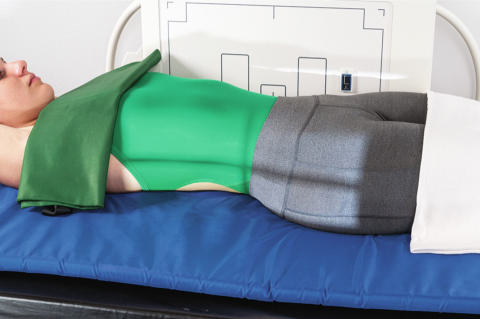
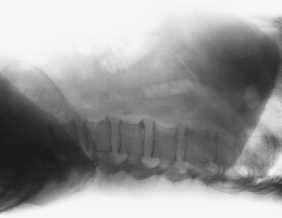

# Rx Abdomen Incidență în Decubit Dorsal (PROFIL DREPT SAU STÂNG)

  📷 Radiografie Convențională (Rx)
  <strong>Actualizat:</strong> 2026-09-15
  <strong>Autor:</strong> Departamentul de Radiologie / Referință Bontrager

---

-   __1. Rezumat Clinic & Indicații__

    ---

    === "Indicații Clinice"

        - Formațiuni tumorale, acumulări anormale de gaze, nivele hidroaerice, anevrisme vasculare (dilatarea calibrului vascular)
        - Calcificări patologice ale aortei abdominale sau ale altor vase mari
        - Hernie ombilicală

    === "Ghid Național IRIS"

        !!! info "Referință Primară: Ghidul Național IRIS (Ordinul MS 1342/2012)"
            - **Capitol Ghid IRIS:** *Ghidul Național IRIS*
            - **Grad de Recomandare:** **De verificat pe indicație; fără grad atribuit automat**
            - **Nivel de Iradiere Estimată:** `De verificat pentru examinarea și populația selectate`

            [:octicons-search-16: Deschide Ghidul IRIS](../../iris.md){ .md-button .md-button--primary } [:material-open-in-new: Aplicația Oficială PWA](https://radiologie-pediatrica.ro/iris/){ .md-button target="_blank" rel="noopener" }
-   __2. Poziționare & Centrare Fascicul__

    ---

    - **Poziție Pacient:** Pacient: Decubit dorsal pe un suport radiotransparent, cu partea laterală lipită de masă sau de stativul vertical Bucky; se fixează căruciorul astfel încât să nu se îndepărteze de masă sau de dispozitivul cu grilă. Se verifică dacă pacientul și căruciorul sunt poziționați fără înclinare în raport cu receptorul de imagine. Pernă sub cap, brațele ridicate lângă cap; un suport sub genunchii parțial flectați poate fi mai confortabil pentru pacient (Fig. 3.42). Regiune anatomică: Se ajustează poziția pacientului și a căruciorului astfel încât centrul receptorului de imagine și raza centrală să fie la nivelul crestei iliace (corespunzător L4-L5) sau la 2 țoli (5 cm) deasupra crestei iliace (corespunzător L4-L5), pentru a include cupolele diafragmatice. Se verifică absența rotației bazinului sau a umerilor: claviculele sunt riguros echidistante față de linia proceselor spinoase (ambele spine iliace antero-superioare (SIAS) trebuie să fie la aceeași distanță de suprafața mesei). Se ajustează înălțimea receptorului de imagine pentru a alinia planul mediocoronal cu linia mediană a receptorului de imagine.
    - **Punct de Centrare Fascicul:** orizontal, orientat spre centrul receptorului de imagine la nivelul crestei iliace (corespunzător L4-L5) și/sau la 2 țoli (5 cm) deasupra crestei iliace (corespunzător L4-L5), pentru a include cupolele diafragmatice
    - **Distanță Focar-Film (DFF / SID):** 100 cm
    - **Comandă Respiratorie:** Expunerea se efectuează în apnee la sfârșitul expirului complet.

-   __3. Parametri Tehnici Expunere__

    ---

    | Parametru Tehnic | Valoare Configurare Generator / Tub |
    |:-----------------|:-------------------------------------|
    | **Tensiune Tub (kV)** | 70 kV |
    | **Sarcină / Produs Curent-Timp (mAs)** | DE CONFIGURAT PE APARAT |
    | **Distanță Focar-Film (DFF / SID)** | 100 cm |
    | **Grilă Antidifuzoare (Bucky)** | Cu grilă antidifuzoare Bucky |
    | **Dimensiune Focar** | Focar Mic (0.6 mm) |
    | **Camere de Ionizare AEC** | Camerele laterale (sau camera centrală, în funcție de regiune) |
    | **Colimare Fascicul** | este esențială din cauza radiației împrăștiate crescute, produse prin expunerea țesuturilor din afara ariei de interes diagnostic. |
    | **Filtrare Tub** | Totală ≥ 2.5 mm Al echivalent |

-   __4. Criterii de Calitate & Reușită Imagine__

    ---

    - Trebuie incluse cupolele diafragmatice și o porțiune cât mai mare din etajul abdominal inferior.
    - Ansele intestinale destinse cu aer din abdomen și detaliile părților moi trebuie să fie vizibile în partea anterioară a abdomenului și în regiunile prevertebrale (Fig. 3.43 și 3.44). Poziție
    - Absența rotației anatomice: clavicule echidistante față de linia apofizelor spinoase, evidențiată prin suprapunerea porțiunilor posterioare ale coastelor (grilajului costal), a marginilor posterioare ale aripilor iliace și a spinelor iliace antero-superioare (SIAS) de ambele părți.
    - fără înclinare, evidențiată prin aspectul simetric al foramenelor intervertebrale.
    - Colimare la aria de interes diagnostic. Expunere
    - fără mișcare; contururile coastelor și ale bulelor de gaz apar nete.
    - Coloana lombară poate apărea subexpusă, cu detaliile părților moi vizibile în partea anterioară a abdomenului și în regiunea prevertebrală a vertebrei lombare inferioare.

-   __5. Protecție Radiologică (ALARA)__

    ---

    - Ecranare gonadică și a organelor radiosensibile conform procedurilor locale de radioprotecție ALARA.
    - Colimare strictă la aria de interes pentru limitarea radiației difuze.
    - Verificarea posibilității unei sarcini la pacientele de vârstă fertilă înainte de expunere.

!!! note "Observații Clinice & Tehnice"
    Aceasta poate fi efectuată în incidență de profil drept sau stâng; trebuie utilizat markerul de lateralitate R sau L corespunzător, indicând partea cea mai apropiată de receptorul de imagine. Abdomen SPECIAL PA Decubit ventral decubit lateral (AP) AP Ortostatism decubit dorsal (profil) profil Fig. 3.42 decubit dorsal—incidență de profil drept. Fig. 3.43 decubit dorsal—incidență de profil drept. Regiunea prevertebrală Aripile iliace Gaze în intestine Fig. 3.44 decubit dorsal—incidență de profil drept.

### 🖼️ Imagini

<figure class="protocol-image-card" markdown>

<figcaption><strong>Fig. 3.42 decubit dorsal—incidență de profil drept.</strong> — Poziționare pacient conform Ghidului Bontrager (Fig. 3.42 decubit dorsal—poziție de profil drept.)</figcaption>

</figure>

<figure class="protocol-image-card" markdown>

<figcaption><strong>Fig. 3.43 decubit dorsal—incidență de profil drept.</strong> — Aspect radiografic de referință conform Ghidului Bontrager (Fig. 3.43 decubit dorsal—poziție de profil drept.)</figcaption>

</figure>

<figure class="protocol-image-card" markdown>

<figcaption><strong>Fig. 3.44 decubit dorsal—incidență de profil drept.</strong> — Aspect radiografic de referință conform Ghidului Bontrager (Fig. 3.44 decubit dorsal—poziție de profil drept.)</figcaption>

</figure>

=== "Ghid Rapid de Execuție"

    1. **Identificarea și verificarea pacientului:** verificare identitate, zonă de examinat, consimțământ conform procedurii și evaluarea posibilității unei sarcini, când este relevantă.
    2. **Pregătire:** îndepărtarea oricăror obiecte radiopace (bijuterii, agrafe, fermoare, proteze, pansamente dense).
    3. **Poziționare precisă:** alinierea receptorului de imagine și a tubului la distanța prescrisă (100 cm).
    4. **Colimare strictă:** adaptarea fasciculului strict la regiunea de diagnostic pentru scăderea iradierii și reducerea radiației difuze.
    5. **Radioprotecție:** verificarea [politicii RX](../radioprotectie.md), cu măsuri distincte pentru pacient, personal și însoțitor.

## Surse de documentare

- [Bontrager's Textbook of Radiographic Positioning (Ed. 9/10), Pagina 133](https://www.elsevier.com/books/textbook-of-radiographic-positioning-and-related-anatomy/lampignano/978-0-323-65367-1)
